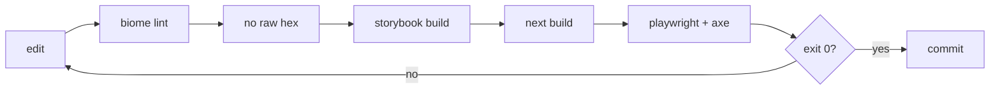

The blog you're reading used to run on Material UI. I rebuilt it in a few hours
onto a dark-default "Terminal" design system on Tailwind v4, and I wrote almost
none of it by hand. I had Claude do the migration.

The design isn't the interesting part. The experiment was figuring out where I
still needed to sit in the loop. I gave Claude the architecture up front, a
design system, a single source of truth for tokens, and a verification gate,
then let it drive the implementation. The gate is what decided which calls
stayed mine, so I'll get to it fast.

# What was actually wrong

The old setup had three styling systems and used one of them. Material UI 5 with
Emotion did the real work. Tailwind v3 was installed but inert: its content
globs pointed at a `./src` directory that doesn't exist, so it scanned nothing
and emitted nothing. styled-components was in the dependency tree doing nothing
at all.

So the site worked, but the foundation was a museum of half-finished decisions.
I wanted one system, dark by default, that an agent could maintain without me
re-explaining the design every time.

# The idea: a gate the agent checks itself against

Here's the problem with handing a frontend refactor to an agent. It will tell
you it's done. It is often wrong, and the only way you find out is by opening a
browser. That feedback loop is slow and it puts you back in the chair for every
change.

So before any redesign work, I had Claude write one thing: a verification gate.
A single script that exits 0 only when the change is actually sound.

```bash
# apps/blog/bin/verify-design-system.sh
set -euo pipefail

npx @biomejs/biome lint components lib .storybook   # [1/5] style/lint
node scripts/check-no-raw-hex.mjs                    # [2/5] token discipline
npm run build-storybook                              # [3/5] components compile
npm run build                                        # [4/5] static export
npx playwright test --retries=1                      # [5/5] render + a11y
```



The gate changes the deal. Claude makes a change, runs the gate, reads the
failure, fixes it, runs it again. It only comes back to me when the gate is
green. I went from reviewing every diff to reviewing the ones that passed a
build, a component compile, 23 Playwright tests, and an accessibility scan.

A task is "done" when this exits 0. That sentence is the whole methodology.

# Tokens are the only source of truth

The design lives in one file, `tokens.css`. Everything else reads from it.

Tailwind v4 lets you define your palette in CSS with `@theme`, then alias those
primitives to semantic names. Dark and light are the same variables pointing at
different values:

```css
/* primitives — the raw ramp */
@theme {
  --color-ink-950: #0b0e14;
  --color-ink-900: #11151f;
  --color-cyan-400: #36e2c4;
}

/* semantic aliases — components only ever use these */
@theme inline {
  --color-canvas: var(--ds-canvas);
  --color-surface: var(--ds-surface);
  --color-accent: var(--ds-accent);
}

/* dark is the default */
:root {
  --ds-canvas: var(--color-ink-950);
  --ds-surface: var(--color-ink-900);
  --ds-accent: var(--color-cyan-400);
}

/* light is a variable swap, nothing else */
[data-theme="light"] {
  --ds-canvas: #ffffff;
  --ds-surface: #f4f6fa;
  --ds-accent: #0f766e;
}
```

A component writes `bg-surface` or `text-accent` and never names a color.
Switching themes flips one attribute on `<html>` and the whole site follows. No
per-component dark-mode branches, no second stylesheet.

# Stopping raw hex from creeping back in

Tokens only work if everyone uses them. An agent under deadline will happily
write `#11151f` inline and move on, and then your "single source of truth" has
exceptions. So the gate's second step is a script that greps the components for
raw hex and fails the build if it finds any.

```js
// check-no-raw-hex.mjs — fail if a component hardcodes a color
const HEX = /#[0-9a-fA-F]{3,8}\b/;
if (HEX.test(source)) {
  console.error(`raw hex in ${file}: use a token`);
  process.exit(1);
}
```

It runs on the `.tsx` components, skips the stories and `tokens.css` itself.
This caught me more than once. The rule isn't "don't use hex," it's "the build
won't let you."

# Storybook runs on webpack, not Vite

The design doc said to use `@storybook/nextjs-vite`. That was wrong, and the gate
found out at step 3.

This project's `next.config.js` has a custom webpack config. The Vite-based
Storybook builder explicitly doesn't support custom webpack, so it can't see the
project's setup. I had Claude switch to `@storybook/nextjs`, which uses Webpack
5 and reads the existing Next config directly. Storybook built clean after that.

Note: if your Next app has any custom webpack, reach for `@storybook/nextjs`,
not the Vite builder. The Vite one is faster when it fits, and it didn't fit.

# Letting axe find the contrast bugs

The last step of the gate runs Playwright, and part of that is an accessibility
pass with `@axe-core/playwright` over the home, post, wiki, and about pages. It
asserts zero serious or critical violations.

This is better than eyeballing because I'm bad at eyeballing contrast. axe
flagged several text colors that looked fine to me and failed WCAG AA. The
subtle gray I used for timestamps was too dim on the dark canvas. The teal
accent was too light to read on white in light mode. Claude darkened the light
accent and lightened the dark gray until the scan passed, then I confirmed the
numbers hit 4.5:1.

I would have shipped all of those. The machine that reads contrast ratios
shouldn't be me.

# The last mile is still a person in a browser

A green gate proves the site builds, the components compile, the pages render,
and the contrast is legal. It cannot tell you a thumbnail looks bad.

The day after the migration passed, I sat down and actually looked at the
homepage. The post thumbnails were transparent PNGs, so the dark card showed
through the logos and they looked broken. The cards were flat and a little
lifeless. And the RSS link 404'd, because the feed only got generated in the
full production build, never in the dev server I was previewing against.

None of that fails a gate. All of it matters. I had Claude put a white
background behind the thumbnails, add a slight top-down gradient to the cards
for depth, and emit the RSS feed into `public/` so dev serves it too. The gate
stayed green through every one of those. The changes came from looking, not from
the build.

That's the answer to where the human still belongs. The gate buys you autonomy
on everything objective: does it build, does it render, is it accessible, does
it use the tokens. Taste is still yours. Define the architecture and the gate
first, let the agent own that objective layer, and spend your attention on the
part a script can't check.
