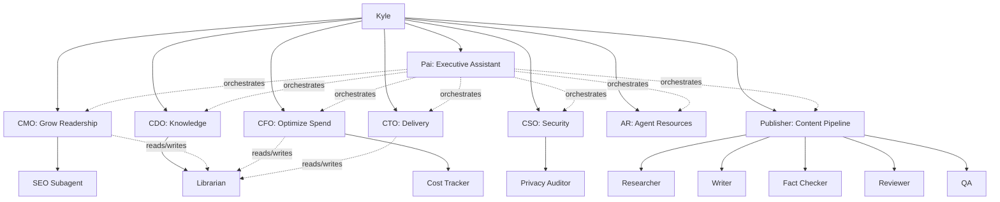

## Table of contents

# A warning: This didn't work well

I found the process of building and testing this really fun. Trying to actually use it
afterwards was less fun.

- `2026-03-11`: this is a "Hey this is neat" thing, not a  "this works really well!" one.
- `2026-03-15`: I've deleted basically all these agents and am down to 7.
- I haven't given up on this idea but this approach was too ambitious and didn't have
the other infra in place it'd need to succeed.


# Why an org chart for AI agents

Because it's cool, mostly. Also I'd hoped it would work really well.
But mostly, it's cool.

In this experiment I defined a team of Claude Code agents that each had a named role,
themed around being a virtual agent company. I figured I could run them manually or in
K8s using the Claude CLI:

```bash
claude --agent cmo -p "What are my top 5 posts by pageviews?"
```

In theory I could manage agent context with this approach effectively and get each one
to stay in its own lane without bloating Claude's global context. CMO started with CMO
prompt, CDO with CDO prompt, so on.

The hope was to have these things each coordinate on their own, with my Pai agent acting
as a top-level orchestrator. They should have been able to use the wiki to exchange context.

I repurposed my OpenClaw agent
[Pai](/openclaw-linear-skill.html)'s name when defining my orchestrator. I hoped to be
able to ask for things in Telegram and Pai would decompose the request into a
multi-agent flow and orchestrate from there.

The C-suite agents (CMO, CFO, CTO, CDO, CSO) each were envisioned as sub-orchestrators
that ran their own adversarial loops to keep standards high and sub-route requests.


# The agents

| Agent | Role | Model | Key Tools |
|-------|------|-------|-----------|
| Pai | Orchestration | Sonnet | Bash, Linear MCP |
| CMO | Traffic and growth | Sonnet | GA4 Analytics MCP |
| CFO | AI spend | Sonnet | [OpenRouter MCP](/openrouter-ai-tools.html) |
| CTO | Delivery, blockers | Sonnet | Linear MCP, Bash |
| CDO | Knowledge management | Sonnet | Wiki read/write, Bash |
| CSO | Security and privacy | Sonnet | File tools, Bash |
| AR | Agent onboarding, mediation | Sonnet | File tools, Bash |
| Publisher | Blog content pipeline | Sonnet | Bash, file tools |
| SEO | Search audits | Sonnet | GA4, WebSearch |
| Cost Tracker | Spend reports | Haiku | OpenRouter MCP |
| Librarian | Wiki read/write | Haiku | Wiki file tools |
| Privacy Auditor | Flag confidential data | Haiku | File tools |
| Researcher | Gather sourced facts | Sonnet | WebSearch, Read |
| Writer | Draft posts from briefs | Sonnet | Read, Write |
| Fact Checker | Verify claims | Haiku | WebSearch, Read |
| Reviewer | Style and structure | Haiku | Read, Grep |
| QA | Production readiness | Sonnet | Bash, Playwright |

My only real use case at the time was writing blog posts, so the Publisher was special,
getting its own sub-org with a four-stage content
pipeline: researcher, writer, fact-checker, and reviewer.

QA ran after the pipeline to verify the post actually
built, rendered, and linked correctly before it went live.
QA used [Playwright MCP](/playwright-mcp.html) to take screenshots
and inspect the rendered page.

Every agent connected to real
[MCP](https://modelcontextprotocol.io/) servers to do cool stuff. The
CMO queried real GA4 data. The CFO pulled real OpenRouter
bills.

# The org chart

This was accurate as of 2026-03-12. The
[bot-wiki org chart](/wiki/projects/agent-team/org-chart.html)
stayed up to date as agents were added or reorganized.



Every agent was directly
invocable by me, but ideally I didn't need to do that often.

Solid lines meant "reports to." Dashed lines from Pai meant
"orchestrates." Dashed lines to the Librarian meant "can
read/write wiki through."

The Privacy Auditor was the gatekeeper. Any agent writing
content that would end up in git or on the internet should
have checked with the Privacy Auditor first. It scanned for
leaked analytics data, spend numbers, secrets, and anything
else that shouldn't be public. This came from a scare where one of my agents with access
to mildly confidential data referenced it in content that
would have been public. I feel strongly that all agent flows
need a privacy step at minimum, and ideally agents should
have purposefully curtailed access to sensitive data.

The Librarian was an experiment in context management and
shared state. Any agent could talk to it directly to persist
notes, plans, or evidence to the wiki. I had already built a
[RAG system](/wiki-rag.html) over the wiki. Once the wiki
got big enough that agents couldn't skim it all, I'd have
them query the RAG index instead. At that point, the agents
just used git and local file storage for wiki access. The CDO
owned the wiki strategy, but the Librarian did the actual
reading and writing.

# Pai: the executive assistant

Agent definitions lived in `.claude/agents/`. Here was Pai's
frontmatter:

```yaml
# .claude/agents/pai.md
name: pai
description: >-
  Pai — Executive assistant that orchestrates
  multi-agent workflows
model: sonnet
tools:
  - Bash
  - Read
  - Glob
  - Grep
  - Write
  - mcp__linear-server__list_issues
  - mcp__linear-server__list_projects
```

## Agent invocation via Bash

Pai invoked other agents with `claude --agent <name> -p "prompt"` through the Bash tool.
In theory I could have made an MCP for Pai that ran that in k8s pods for OpenClaw.
Each call was a fresh session. Agents didn't share memory or context with each other.


```text
*Update*: The alternative I didn't try was just to use Claude Subagents for local work.
That's much easier and works better.
```


The alternatives I considered:

- **Shared memory / message bus.** Tools like LangGraph or
  CrewAI give agents shared state. More powerful, but more
  moving parts. I wanted something I could debug by reading
  a bash script.
- **Single mega-agent.** One agent definition with all the
  tools. Simpler, but the context window filled up fast and
  the agent lost focus. Splitting by role kept each
  session lean.
- **MCP-based orchestration.** Route through an MCP server
  that managed agent sessions. Interesting, but overkill
  for a blog. I'd rather have built on `claude --agent`
  which already worked.
- **[Beads](https://github.com/steveyegge/beads).** A
  structured task memory for AI agents, backed by Dolt
  (version-controlled SQL). I looked into it, but it was
  more of an alternative to Linear than to the wiki. It
  solved task tracking and agent handoff, not knowledge
  management. I liked Linear for tasks and markdown files
  for knowledge.

I went with the dumb approach: Bash calls and text passing.
It was easy to understand, easy to debug, and the wiki
handled long-term memory. If I outgrew it, I'd upgrade.


# The wiki layer

Each agent had a page in the
[Bot-Wiki](/bot-wiki.html) that documented its goal, tools,
subagents, and example prompts.

```text
agent-team/
├── index.md          # org chart and coordination model
├── pai.md            # orchestration agent
├── cmo.md            # traffic and growth
├── cfo.md            # AI spend
├── cto.md            # delivery and blockers
├── cdo.md            # knowledge management
├── cso.md            # security and privacy
├── publisher.md      # blog pipeline
└── phase-2.md        # future async architecture
```

Every agent session was stateless. The CMO didn't remember
what the CTO said last week. But if the CTO wrote its
findings to the wiki through the Librarian, the CMO could
read them next time it ran. The wiki was how agents shared
context across sessions.

The Librarian (a Haiku subagent under the CDO) handled
all wiki read/write operations. Any agent could invoke it
directly with `claude --agent librarian -p "..."` to
persist notes, plans, evidence, or whatever else needed to
survive between sessions.

The CDO owned the strategy: what got documented, how pages
were structured, when content was stale. This was cheaper
than giving every agent write access to the full file
system. The Librarian ran on Haiku, knew the wiki format,
and wouldn't accidentally clobber unrelated files.

In time I would have had the CFO tweak the models the
agents used to manage costs, too.

# Pai in action

## The quarterly health check

I asked Pai for a quarterly health check. It invoked three
agents and synthesized everything into one report.

**Traffic** (from CMO): GA4 only had a week of data. The
site was new enough that there was no meaningful baseline yet.
Almost entirely direct traffic, organic search barely
registering. CMO recommended connecting Search Console and
revisiting in 30 days.

**AI spend** (from CFO): well under budget with no pressure.
OpenRouter's API only surfaced account-level totals, no
per-model breakdown. CFO noted the biggest future lever was
routing non-reasoning tasks to flash-tier models.

**Delivery** (from CTO): most issues done or in backlog,
one in progress (this blog post). No hard blockers, but
three dependency chains worth watching:

1. RSS feed was high priority but hadn't started. Four
   distribution issues were gated on it.
2. CMO and CFO baseline runs hadn't started. They gated
   two future blog posts.
3. This post had an open PR to close.

Pai wrote a log entry automatically:

```markdown
## 21:30 — Quarterly health check

| Agent | Prompt Summary | Result |
|-------|---------------|--------|
| cmo | 90-day traffic trend | success |
| cfo | 90-day AI spend | success |
| cto | Blocked/stalled issues | success: 3 clusters |

**Synthesis:** Early launch phase, minimal spend,
no hard blockers but three dependency chains.
```


