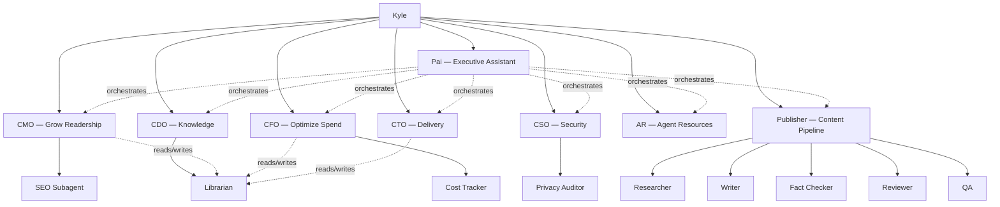

## Table of contents

# A warning

As of 2026-03-11, this is a "Hey this is neat" post and not a "this works really well!"
one. I found the process of building and testing this really fun, but I've also been
using this approach for basically no time at all and I'm sure a bunch of the things I'm
trying here are just going to straight up not work the way I want in the long run. I'll
be iterating on it a lot. The bot-wiki is meant to be kept up to date and that + the
code are probably the right places to check (or just ask me) how things are working
later on in time.

# Why an org chart for AI agents

Because it's cool, mostly. Also I hope it will work really well. But mostly, it's cool.

I've defined a team of Claude Code agents that each have a named
role, themed around being a virtual agent company. Any of them
work fine on their own:

```bash
claude --agent cmo -p "What are my top 5 posts by pageviews?"
```

The benefit is persistent context. Each agent definition carries
its goal, tools, rules, and domain knowledge. I don't re-explain
what the CMO does every time I invoke it. The definition is the
context.

The challenge is coordination. When a request spans multiple
agents, someone has to decide which agents to call, in what
order, and how to stitch the results together. That's robot
work, not a good use of human time. I also don't want to be
the medium for shared context, copying output from one agent
into another's prompt.

I repurposed my OpenClaw agent
[Pai](/openclaw-linear-skill.html) into an orchestrator. Pai
decomposes multi-agent requests and invokes the right agents
in sequence. The C-suite agents (CMO, CFO, CTO, CDO, CSO) each
own a domain and can sub-orchestrate their own subagents. The
CMO delegates to SEO, the CFO delegates to Cost Tracker, and
so on. The top-level/C-Suite agents also work as antagonistic loop orchestrators of
their own, I like to think of it as them enforcing high standards.


# The agents

| Agent | Role | Model | Key Tools |
|-------|------|-------|-----------|
| Pai | Orchestration | Sonnet | Bash, Linear MCP |
| CMO | Traffic and growth | Sonnet | GA4 Analytics MCP |
| CFO | AI spend | Sonnet | OpenRouter MCP |
| CTO | Delivery, blockers | Sonnet | Linear MCP, Bash |
| CDO | Knowledge management | Sonnet | Wiki read/write, Bash |
| CSO | Security and privacy | Sonnet | File tools, Bash |
| AR | Agent onboarding, mediation | Sonnet | File tools, Bash |
| Publisher | Blog content pipeline | Sonnet | Bash, file tools |
| SEO | Search audits | Sonnet | GA4, WebSearch |
| Cost Tracker | Spend reports | Haiku | OpenRouter MCP |
| Librarian | Wiki read/write | Haiku | Wiki file tools |
| Privacy Auditor | Flag confidential data | Haiku | File tools |
| Researcher | Gather sourced facts | Sonnet | WebSearch, Read |
| Writer | Draft posts from briefs | Sonnet | Read, Write |
| Fact Checker | Verify claims | Haiku | WebSearch, Read |
| Reviewer | Style and structure | Haiku | Read, Grep |
| QA | Production readiness | Sonnet | Bash, Playwright |

Each C-suite agent owns a domain and has subagents for
specialized work. SEO reports to the CMO. Cost Tracker
reports to the CFO. The Librarian reports to the CDO. The
Privacy Auditor reports to the CSO. AR (Agent Resources,
the HR department) handles agent onboarding and role boundary
mediation.

The Publisher is its own sub-org with a four-stage content
pipeline: researcher, writer, fact-checker, and reviewer.
QA runs after the pipeline to verify the post actually
builds, renders, and links correctly before it goes live.

Every agent connects to real
[MCP](https://modelcontextprotocol.io/) servers. No mocks. The
CMO queries real GA4 data. The CFO pulls real OpenRouter bills.

# The org chart

This is accurate as of 2026-03-12. The
[bot-wiki org chart](/wiki/projects/agent-team/org-chart.html)
stays up to date as agents are added or reorganized.



It being my blog and virtual team, I get to sit at the top. Every agent is directly
invocable by me, but ideally I don't need to do that often.

Solid lines mean "reports to." Dashed lines from Pai mean
"orchestrates." Dashed lines to the Librarian mean "can
read/write wiki through."

The Privacy Auditor is the gatekeeper. Any agent writing
content that will end up in git or on the internet should
check with the Privacy Auditor first. It scans for leaked
analytics data, spend numbers, secrets, and anything else
that shouldn't be public. This came from a scare where one of my agents with access
to mildly confidential data referenced it in content that
would have been public. I feel strongly that all agent flows
need a privacy step at minimum, and ideally agents should
have purposefully curtailed access to sensitive data.

Pai is structured as a peer to the other top-level agents, and orchestrator. I can
still run `claude --agent cmo` whenever I want. Pai is for when a request spans
multiple agents and I don't want to do the routing myself.

The Librarian is an experiment in context management and
shared state. Any agent can talk to it directly to persist
notes, plans, or evidence to the wiki. I already built a
[RAG system](/wiki-rag.html) over the wiki. Once the wiki
gets big enough that agents can't skim it all, I'll have
them query the RAG index instead. For now, the agents just
use git and local file storage for wiki access. The CDO
owns the wiki strategy, but the Librarian does the actual
reading and writing.

# Pai: the executive assistant

Agent definitions live in `.claude/agents/`. Here's Pai's
frontmatter:

```yaml
# .claude/agents/pai.md
name: pai
description: >-
  Pai — Executive assistant that orchestrates
  multi-agent workflows
model: sonnet
tools:
  - Bash
  - Read
  - Glob
  - Grep
  - Write
  - mcp__linear-server__list_issues
  - mcp__linear-server__list_projects
```

The body of the definition has four key sections.

## Agent invocation via Bash

Pai invokes other agents with
`claude --agent <name> -p "prompt"` through the Bash tool.
Each call is a fresh session. Agents don't share memory or
context with each other.

This is the main tradeoff. Fresh sessions mean no shared
state, but Pai bridges the gap by reading output from one
agent and passing relevant parts into the next agent's prompt.

The alternatives I considered:

- **Shared memory / message bus.** Tools like LangGraph or
  CrewAI give agents shared state. More powerful, but more
  moving parts. I wanted something I could debug by reading
  a bash script.
- **Single mega-agent.** One agent definition with all the
  tools. Simpler, but the context window fills up fast and
  the agent loses focus. Splitting by role keeps each
  session lean.
- **MCP-based orchestration.** Route through an MCP server
  that manages agent sessions. Interesting, but overkill
  for a blog. I'd rather build on `claude --agent` which
  already works.
- **[Beads](https://github.com/steveyegge/beads).** A
  structured task memory for AI agents, backed by Dolt
  (version-controlled SQL). I looked into it, but it's
  more of an alternative to Linear than to the wiki. It
  solves task tracking and agent handoff, not knowledge
  management. I like Linear for tasks and markdown files
  for knowledge.

I went with the dumb approach: Bash calls and text passing.
It's easy to understand, easy to debug, and the wiki handles
long-term memory. If I outgrow it, I'll upgrade.

## Dry-run mode

Add `--dry-run` to your message and Pai outputs the
orchestration plan without executing anything. Which agents,
what prompts, what order, how it would synthesize.

Useful for checking that Pai will do what you want before it
burns tokens on three agent calls.

## Adversarial loops

For requests that need critique or review between agents:

1. Agent A produces output
2. Agent B critiques it
3. Agent A revises based on feedback
4. Up to 3 rounds or until the reviewer approves

CMO proposes blog topics, CTO reviews technical feasibility,
CMO revises. The back-and-forth produces better output than
either agent alone.

## Logging

Every orchestration run appends a timestamped entry to
`pai-log-YYYY-MM-DD.md`. Agent name, prompt summary, result
status, and a one-line synthesis.

# The wiki layer

Each agent has a page in the
[Bot-Wiki](/bot-wiki.html) that documents its goal, tools,
subagents, and example prompts.

```text
agent-team/
├── index.md          # org chart and coordination model
├── pai.md            # orchestration agent
├── cmo.md            # traffic and growth
├── cfo.md            # AI spend
├── cto.md            # delivery and blockers
├── cdo.md            # knowledge management
├── cso.md            # security and privacy
├── publisher.md      # blog pipeline
└── phase-2.md        # future async architecture
```

The wiki is the shared memory layer.

Every agent session is stateless. The CMO doesn't remember
what the CTO said last week. But if the CTO writes its
findings to the wiki through the Librarian, the CMO can
read them next time it runs. The wiki is how agents share
context across sessions.

The Librarian (a Haiku subagent under the CDO) handles
all wiki read/write operations. Any agent can invoke it
directly with `claude --agent librarian -p "..."` to
persist notes, plans, evidence, or whatever else needs to
survive between sessions. The CDO owns the strategy:
what gets documented, how pages are structured, when
content is stale.

This is cheaper than giving every agent write access to
the full file system. The Librarian runs on Haiku, knows
the wiki format, and won't accidentally clobber unrelated
files.

In time I may have the CFO tweak the models the agents use to manage costs, too.

# Pai in action

## The dry-run

I asked Pai for a quarterly health check with `--dry-run`:

```bash
claude --agent pai -p "Give me a quarterly health check. \
  How's traffic trending, what am I spending on AI, and \
  are there any blocked issues? --dry-run"
```

Pai planned three parallel agent calls:

> **Agent 1, CMO:** Pull a quarterly traffic report for
> kyle.pericak.com. Total sessions and users for the quarter
> vs prior quarter, top 5 posts by pageviews, traffic channel
> breakdown.
>
> **Agent 2, CFO:** Pull OpenRouter AI spend for Q1 2026.
> Break it down by model and by month. Flag any month-over-month
> spikes > 20%.
>
> **Agent 3, CTO:** Review all open Linear issues and flag any
> that are blocked, stalled (no update in 14+ days), or missing
> an assignee.

It also laid out the synthesis plan: group results by theme
(traffic, spend, delivery), cross-reference findings, and
call out any cross-domain issues.

No agents ran. No tokens burned. I could review the plan and
adjust before committing.

## The real run

Same request without `--dry-run`. Pai invoked three agents
and synthesized everything into one report.

**Traffic** (from CMO): GA4 only had a week of data. The
site is new enough that there's no meaningful baseline yet.
Almost entirely direct traffic, organic search barely
registering. CMO recommended connecting Search Console and
revisiting in 30 days.

**AI spend** (from CFO): well under budget with no pressure.
OpenRouter's API only surfaced account-level totals, no
per-model breakdown. CFO noted the biggest future lever is
routing non-reasoning tasks to flash-tier models.

**Delivery** (from CTO): most issues done or in backlog,
one in progress (this blog post). No hard blockers, but
three dependency chains worth watching:

1. RSS feed is high priority but hasn't started. Four
   distribution issues are gated on it.
2. CMO and CFO baseline runs haven't started. They gate
   two future blog posts.
3. This post has an open PR to close.

Pai wrote a log entry automatically:

```markdown
## 21:30 — Quarterly health check

| Agent | Prompt Summary | Result |
|-------|---------------|--------|
| cmo | 90-day traffic trend | success |
| cfo | 90-day AI spend | success |
| cto | Blocked/stalled issues | success: 3 clusters |

**Synthesis:** Early launch phase, minimal spend,
no hard blockers but three dependency chains.
```

## The adversarial demo

I asked Pai to have the CMO propose blog topics and the CTO
review feasibility:

```bash
claude --agent pai -p "The CMO wants to propose 3 new \
  blog topics. Have CTO review feasibility."
```

CMO proposed three posts:

1. **Give Your Agents a Memory** - wire agents to read/write
   wiki context on startup
2. **Agents That Run Themselves** - scheduled execution with
   cron and cost guardrails
3. **Teach Your CTO Agent to Review PRs** - GitHub Actions
   workflow that fires the CTO agent on every PR

CTO reviewed each one:

- Post 6 (wiki memory): needs groundwork. Wiki is read-only
  from agents today. A write protocol means git commits from
  within agent sessions.
- Post 7 (scheduling): blocked. Phase 2 prerequisites from
  the wiki aren't met. PER-37 and PER-38 haven't started.
- Post 8 (PR review): needs groundwork. Most self-contained,
  but `.github/workflows/` doesn't exist yet.

CTO's recommended ship order: complete PER-37 and PER-38
first, then post 6, then post 8, then post 7 last (after
the others prove stability).

The interesting thing here is the cross-referencing. The CTO
pulled the same PER-37/PER-38 dependency from the health
check. It flagged the same blocker from two different angles
without being told about the first run.


# Watching them work
I got bored waiting for the agents to finish doing their thing so I made them all
post status updates to a local file. I `tail -f` the file and watch them work. It's
neat. Eventually I think I might plug them into some chat app or something instead so
it looks more like people talking to each other. I think
that'd be fun.
