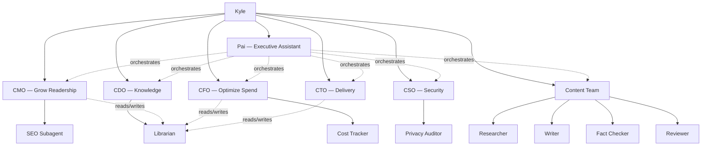

## Table of contents

# Why an org chart for AI agents

I have a handful of
[Claude Code](https://docs.anthropic.com/en/docs/claude-code/overview)
agents that each do one thing:

- The CMO pulls GA4 traffic data
- The CFO tracks OpenRouter spend
- The CTO checks Linear for blocked issues

They work fine on their own.

The problem is coordination. If I want to ask about traffic
and spend and blockers in the same conversation, I have to
run three agents manually and stitch the results together
myself. If I want the CMO to propose blog topics and the
CTO to review feasibility, I'm copy-pasting between
sessions.

So I built [Pai](/openclaw-linear-skill.html) into a proper
executive assistant agent that decomposes multi-agent
requests, invokes the right agents in order, and synthesizes
the results. The full setup is an org chart: named
roles, a shared wiki for context, and an orchestration layer.

# The agents

| Agent | Role | Model | Key Tools |
|-------|------|-------|-----------|
| Agent | Role | Model | Key Tools |
|-------|------|-------|-----------|
| Pai | Orchestration | Sonnet | Bash, Linear MCP |
| CMO | Traffic and growth | Sonnet | GA4 Analytics MCP |
| CFO | AI spend | Sonnet | OpenRouter MCP |
| CTO | Delivery, blockers | Sonnet | Linear MCP, Bash |
| CDO | Knowledge management | Sonnet | Wiki read/write, Bash |
| CSO | Security and privacy | Sonnet | File tools, Bash |
| SEO | Search audits | Sonnet | GA4, WebSearch |
| Cost Tracker | Spend reports | Haiku | OpenRouter MCP |
| Librarian | Wiki read/write | Haiku | Wiki file tools |
| Privacy Auditor | Flag confidential data | Haiku | File tools |
| Content Team | Blog pipeline | Mixed | Playwright, file tools |

Each C-suite agent owns a domain and has subagents for
specialized work. SEO reports to the CMO. Cost Tracker
reports to the CFO. The Librarian reports to the CDO. The
Privacy Auditor reports to the CSO. The Content Team is its
own pipeline with a researcher, writer, fact-checker, and
reviewer.

Every agent connects to real
[MCP](https://modelcontextprotocol.io/) servers. No mocks. The
CMO queries real GA4 data. The CFO pulls real OpenRouter bills.

# The org chart



Kyle sits at the top. Every agent is directly invocable.
Solid lines mean "reports to." Dashed lines from Pai mean
"orchestrates." Dashed lines to the Librarian mean "can
read/write wiki through."

The Privacy Auditor is the gatekeeper. Any agent writing
content that will end up in git or on the internet should
check with the Privacy Auditor first. It scans for leaked
analytics data, spend numbers, secrets, and anything else
that shouldn't be public.

Pai is a peer, not a boss. I can still run
`claude --agent cmo` whenever I want. Pai is for when a
request spans multiple domains and I don't want to do the
routing myself.

The Librarian is the interesting one. Any agent can talk to
it directly to persist notes, plans, or evidence to the wiki.
That's how agents share context between stateless sessions.
The CDO owns the wiki strategy, but the Librarian does the
actual reading and writing.

# Pai: the executive assistant

Here's the agent definition frontmatter:

```yaml
# .claude/agents/pai.md
name: pai
description: >-
  Pai — Executive assistant that orchestrates
  multi-agent workflows
model: sonnet
tools:
  - Bash
  - Read
  - Glob
  - Grep
  - Write
  - mcp__linear-server__list_issues
  - mcp__linear-server__list_projects
```

The body of the definition has four key sections.

## Agent invocation via Bash

Pai invokes other agents with
`claude --agent <name> -p "prompt"` through the Bash tool.
Each call is a fresh session. Agents don't share memory or
context with each other.

This is the main tradeoff. Fresh sessions mean no shared
state, but Pai bridges the gap by reading output from one
agent and passing relevant parts into the next agent's prompt.

## Dry-run mode

Add `--dry-run` to your message and Pai outputs the
orchestration plan without executing anything. Which agents,
what prompts, what order, how it would synthesize.

Useful for checking that Pai will do what you want before it
burns tokens on three agent calls.

## Adversarial loops

For requests that need critique or review between agents:

1. Agent A produces output
2. Agent B critiques it
3. Agent A revises based on feedback
4. Up to 3 rounds or until the reviewer approves

CMO proposes blog topics, CTO reviews technical feasibility,
CMO revises. The back-and-forth produces better output than
either agent alone.

## Logging

Every orchestration run appends a timestamped entry to
`pai-log-YYYY-MM-DD.md`. Agent name, prompt summary, result
status, and a one-line synthesis.

# The wiki layer

Each agent has a page in the
[Bot-Wiki](/bot-wiki.html) that documents its goal, tools,
subagents, and example prompts.

```
agent-team/
├── index.md          # org chart and coordination model
├── pai.md            # orchestration agent
├── cmo.md            # traffic and growth
├── cfo.md            # AI spend
├── cto.md            # delivery and blockers
├── cdo.md            # knowledge management
├── cso.md            # security and privacy
├── content-team.md   # blog pipeline
└── phase-2.md        # future async architecture
```

The wiki isn't just documentation. It's the shared memory
layer.

Every agent session is stateless. The CMO doesn't remember
what the CTO said last week. But if the CTO writes its
findings to the wiki through the Librarian, the CMO can
read them next time it runs. The wiki is how agents share
context across sessions.

The Librarian (a Haiku subagent under the CDO) handles
all wiki read/write operations. Any agent can invoke it
directly with `claude --agent librarian -p "..."` to
persist notes, plans, evidence, or whatever else needs to
survive between sessions. The CDO owns the strategy:
what gets documented, how pages are structured, when
content is stale.

This is cheaper than giving every agent write access to
the full file system. The Librarian runs on Haiku, knows
the wiki format, and won't accidentally clobber unrelated
files.

# Pai in action

## The dry-run

I asked Pai for a quarterly health check with `--dry-run`:

```bash
claude --agent pai -p "Give me a quarterly health check. \
  How's traffic trending, what am I spending on AI, and \
  are there any blocked issues? --dry-run"
```

Pai planned three parallel agent calls:

> **Agent 1, CMO:** Pull a quarterly traffic report for
> kyle.pericak.com. Total sessions and users for the quarter
> vs prior quarter, top 5 posts by pageviews, traffic channel
> breakdown.
>
> **Agent 2, CFO:** Pull OpenRouter AI spend for Q1 2026.
> Break it down by model and by month. Flag any month-over-month
> spikes > 20%.
>
> **Agent 3, CTO:** Review all open Linear issues and flag any
> that are blocked, stalled (no update in 14+ days), or missing
> an assignee.

It also laid out the synthesis plan: group results by theme
(traffic, spend, delivery), cross-reference findings, and
call out any cross-domain issues.

No agents ran. No tokens burned. I could review the plan and
adjust before committing.

## The real run

Same request without `--dry-run`. Pai invoked three agents
and synthesized everything into one report.

**Traffic** (from CMO): GA4 only had a week of data. The
site is new enough that there's no meaningful baseline yet.
Almost entirely direct traffic, organic search barely
registering. CMO recommended connecting Search Console and
revisiting in 30 days.

**AI spend** (from CFO): well under budget with no pressure.
OpenRouter's API only surfaced account-level totals, no
per-model breakdown. CFO noted the biggest future lever is
routing non-reasoning tasks to flash-tier models.

**Delivery** (from CTO): most issues done or in backlog,
one in progress (this blog post). No hard blockers, but
three dependency chains worth watching:

1. RSS feed is high priority but hasn't started. Four
   distribution issues are gated on it.
2. CMO and CFO baseline runs haven't started. They gate
   two future blog posts.
3. This post has an open PR to close.

Pai wrote a log entry automatically:

```markdown
## 21:30 — Quarterly health check

| Agent | Prompt Summary | Result |
|-------|---------------|--------|
| cmo | 90-day traffic trend | success |
| cfo | 90-day AI spend | success |
| cto | Blocked/stalled issues | success: 3 clusters |

**Synthesis:** Early launch phase, minimal spend,
no hard blockers but three dependency chains.
```

## The adversarial demo

I asked Pai to have the CMO propose blog topics and the CTO
review feasibility:

```bash
claude --agent pai -p "The CMO wants to propose 3 new \
  blog topics. Have CTO review feasibility."
```

CMO proposed three posts:

1. **Give Your Agents a Memory** - wire agents to read/write
   wiki context on startup
2. **Agents That Run Themselves** - scheduled execution with
   cron and cost guardrails
3. **Teach Your CTO Agent to Review PRs** - GitHub Actions
   workflow that fires the CTO agent on every PR

CTO reviewed each one:

- Post 6 (wiki memory): needs groundwork. Wiki is read-only
  from agents today. A write protocol means git commits from
  within agent sessions.
- Post 7 (scheduling): blocked. Phase 2 prerequisites from
  the wiki aren't met. PER-37 and PER-38 haven't started.
- Post 8 (PR review): needs groundwork. Most self-contained,
  but `.github/workflows/` doesn't exist yet.

CTO's recommended ship order: complete PER-37 and PER-38
first, then post 6, then post 8, then post 7 last (after
the others prove stability).

The interesting thing here is the cross-referencing. The CTO
pulled the same PER-37/PER-38 dependency from the health
check. It flagged the same blocker from two different angles
without being told about the first run.

Next up: the SEO agent that audits the blog.
