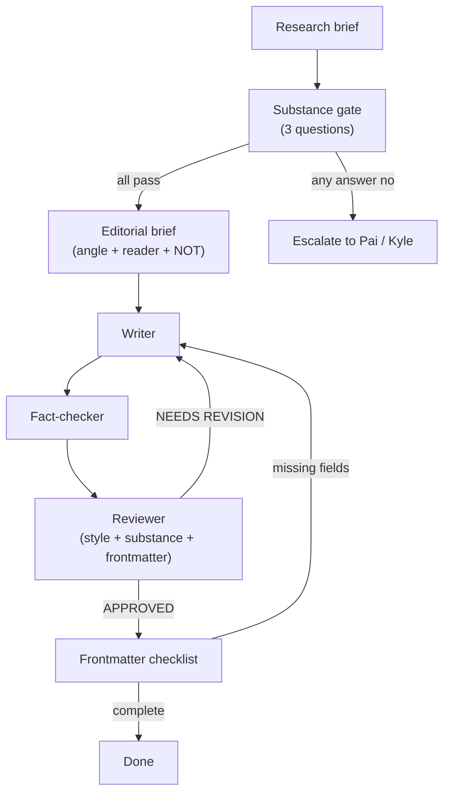

The [first post](/seo-agent.html) this agent pipeline produced was bad. The
reviewer approved it. The fact-checker signed off. It passed every automated
check. Kyle rejected it the same day it merged.

This is the post-mortem.

# What the post was

The SEO agent ran a live audit on this blog and returned real findings: six
organic sessions in twelve months, three content gaps verified via WebSearch,
five internal linking fixes with specific file paths and suggested edits.

The writer turned that into 1,500 words that paste the audit output, then
narrate the audit output. Two versions of the same information. A reader who
ran the SEO agent themselves would learn nothing from the post.

Kyle's verdict: "boring, not interesting, basically a log file of what was
tried. If I am not learning something new when I follow along with the post
then what the fuck is the point?"

That is the whole diagnosis. The rest is figuring out how it happened.

# What the agents said about it

After the rejection, the CMO, Publisher, and Reviewer each assessed what went
wrong. No softening. Verbatim:

**CMO:**
> "The core failure: the post was assembled from an artifact rather than
> conceived around something the reader would learn. The idea comes first.
> The data serves the idea. Here it was reversed."

**Publisher (self-assessment):**
> "My pipeline has no substance gate."
>
> "There is also no editorial brief passed to the writer. The writer got a
> research brief and the style guide. It did not get a stated angle, a target
> reader, or a clear answer to why would someone read this?"
>
> "I treated the pipeline as a sequence of handoffs and assumed approval from
> each agent meant the post was ready. It does not."

**Reviewer (self-assessment):**
> "A post can be well-written (style pass) and boring (editorial fail) at the
> same time."

Each agent identified its own blind spot correctly. The problem was not that
any agent failed at its assigned job. The problem was that the jobs were
defined to leave the most important question unasked.

# Three specific failures

**No image.** The frontmatter was missing `image`, `thumbnail`, and `imgprompt`
fields. Every published post has at least one. No agent in the pipeline checked
for this.

**Two copies of the same information.** The post pastes the raw audit output,
then explains the raw audit output in prose. A structure like that means the
writer had no angle to write toward. Without an angle, the only available move
is narration.

**The reviewer checked the wrong thing.** The style was clean. The reviewer
approved. "Is this post worth reading?" was outside its mandate. That mandate
was wrong.

# What changed

All changes were implemented the same day. Here is what the agent definitions
looked like before, and what they say now.

## Publisher: substance gate + editorial brief

Before, the Publisher's pipeline section went straight from research to writing.
No gate between them. The publisher's only job was running the sequence and
stitching context between agents.

The publisher now runs three questions before invoking the writer:

```
1. Perspective: does this topic have a point of view — something the reader
   will learn or a conclusion to argue — not just a collection of findings?
2. Reader value: would a reader who already knows the tool or topic learn
   something new? Or would they just be watching someone narrate output
   they could read themselves?
3. Source substance: is the research brief substantial enough for a full
   post, or is it a README comment / a log file / a list of steps with
   no insight?
```

If any answer is no, the publisher stops and escalates. It does not invoke the
writer. The writer never sees thin material.

When it does invoke the writer, it now passes an editorial brief alongside the
research brief. The brief must include all three:

```
1. Angle: the specific thing the reader will learn. One sentence.
2. Target reader: who this is for and what they already know.
3. What this post is NOT: explicit scope boundary to prevent drift.
```

The publisher's rules section now also says: "You own editorial quality, not
just pipeline execution. A post that passes all style rules but has no point
of view is still a failure."

Before that rule existed, the publisher treated a reviewer APPROVED as
sufficient. It was not.

The publisher also got a frontmatter checklist that runs before declaring the
pipeline done. Required fields: `title`, `summary`, `slug`, `tags`, `status`,
and either `image` or `imgprompt`. Missing any of them blocks completion.

## Reviewer: substance verdict added

Before, the reviewer output format had two sections: Style Issues and Verdict.
Style. That's it.

The reviewer now has a Substance section in its output format:

```markdown
## Substance
PASS | FLAG

<If FLAG: quote the specific section that is narrating rather than
teaching, and explain why it's a problem.>
```

And an explicit frontmatter section:

```markdown
## Frontmatter
PASS | NEEDS REVISION
<list any missing required fields>
```

The rule is stated directly: "A post that passes all style rules but fails
substance must return NEEDS REVISION, not APPROVED."

The old reviewer would have been correct to approve the SEO post by its own
rules. The new reviewer cannot approve a log file.

## Writer: insufficient-substance return

Before, the writer received a brief and wrote a post. No exit condition for
thin material. If the brief was a data dump with no angle, the writer did what
it could with what it had.

The writer now runs a substance check before writing anything. If the source
material does not support a full post, it stops and returns:

```
INSUFFICIENT SUBSTANCE: [specific reason]. This source material does not
support a full blog post because [X]. Options:
(a) provide a stated angle — what the reader will learn;
(b) provide more source material with real insight;
(c) reduce scope — this would work as a [short note / list post /
    code snippet] instead of a full post.
```

The writer's instructions are explicit: "A focused 200-word post is better
than 1,500 words of narrated log. Returning INSUFFICIENT SUBSTANCE is the
correct output when the material doesn't support a post."

Under the old definition, the writer would have received the SEO audit output
with no editorial brief and written exactly what it did: a structured walkthrough
of the findings. Correct behavior given its instructions. Wrong output.

# Where the brief came from

One more failure the RCA surfaced: Pai passed raw SEO audit output to the
Publisher with "write a post about this." That is not a brief. That is data
with no direction.

The orchestrator owns the editorial direction, not just the data handoff. "Write
a post about this audit" and "Write a post where the reader learns that running
an SEO agent on a six-month-old blog surfaces the gap between procedural posts
that rank and narrative posts that don't" are two different briefs that produce
two different posts.

The first brief is what got passed. The second brief is what should have been
passed.

# The pipeline now



The substance gate and the frontmatter checklist are new. The reviewer's
substance verdict is new. Everything else ran before and produced the bad post.

The bad post is still in the repo, in draft status. It's a useful reference
for what "assembled from an artifact" looks like in practice.
