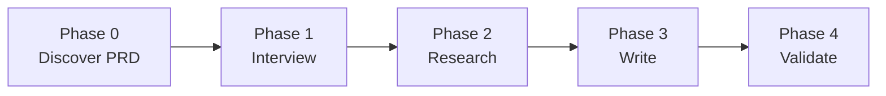
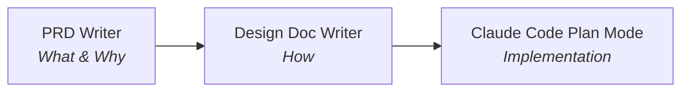

I want to go from "vague idea of something neat to build" to
"well-scoped project with definite value, acceptance criteria, and
no remaining uncertainty." The first step is a PRD agent that
interviews me before it writes anything.


# Why a PRD agent

I ran three Deep Research reports on AI-augmented PRDs and
AI-native SDLCs
([notes](/wiki/research/ai-augmented-prds.html)). One finding
kept showing up across all three: AI agents don't ask clarifying
questions. They assume. Hand a coding agent a vague idea and
it'll produce something plausible, polished, and wrong in ways
you won't notice until later.

The traditional PRD solves a different version of this problem.
A human engineer reads a vague spec and asks "what happens
when the user does X?" or "does this need to work offline?" An
AI agent fills those gaps with assumptions. All three research
reports converged on this: the biggest risk isn't bad output,
it's convincingly mediocre output that looks complete enough to
skip the hard thinking.

So the fix is an agent that does the asking. One that
interviews me first, pushes back on vague answers, and refuses
to write until it has real clarity.


# The PRD Writer

The [PRD Writer](/wiki/agent-team/prd-writer.html) is a Claude
Code agent that turns vague ideas into scoped PRDs. It runs on
Opus because it needs to recognize when an answer is too vague,
when goals contradict constraints, and when I'm hand-waving
instead of thinking.


## Phase 1: Interview

The agent reads the project's
CLAUDE.md, the wiki, existing PRDs, and all agent definitions
for context. Then it asks me questions one at a time, covering
five categories: problem clarity, solution validation, success
criteria, constraints, and strategic fit.

One at a time matters. When questions come in batches, the
first two get real answers and the rest get skimmed. One
question, one answer,
then the agent decides what to ask next based on what I said.
It pushes back on contradictions, flags gaps, and won't accept
"make it better" as a success criterion.

The gate is explicit. When it has enough, it says "I have enough
to write a PRD. Proceeding to research." No ambiguity about
when the interview ends.


## Phase 2: Research

The agent delegates to a researcher subagent to gather facts on
the problem space. It also reads the wiki, codebase, and prior
PRDs to find existing patterns or infrastructure that could be
reused. The point is to ground the PRD in what actually exists,
not what the agent imagines.


## Phase 3: Write

It writes the PRD to the wiki using a standard template. The
template has the sections that all three research reports agreed
on: problem, goal, success metrics, non-goals, user stories with
acceptance criteria, scope, open questions, and risks.

- **Non-goals come before scope.** Kevin Yien's
  ["perimeter of the solution space"][yien] pattern. Draw
  the boundary first, then fill it in. This
  matters more for a solo dev than a team because there's no
  one else to say "that's out of scope."
- **Acceptance criteria live on each user story, not in a
  separate section.** Keeps them co-located with the context
  that makes them meaningful. 3-5 per story, not 20. Addy
  Osmani's [guide on specs for AI agents](https://addyosmani.com/blog/good-spec/)
  describes the failure mode: pile on too many criteria and
  agents start ignoring or contradicting them.

No implementation details in the PRD. That's the design doc's
job.


# Using it

Start the agent directly:

```bash
claude --agent prd-writer
```

Or describe a product idea to vanilla Claude and it'll
auto-delegate based on the agent's description field.

The output is a draft PRD at
`apps/blog/blog/markdown/wiki/prds/<slug>.md`. Review it,
approve it, then hand it off to the Design Doc Writer.


# The Design Doc Writer

The PRD answers "what and why." The next piece is a Design Doc
Writer agent that answers "how," and produces output a coding
agent can pick up without interpretation.

```bash
claude --agent design-doc-writer
```


## The gap between PRDs and code

A PRD says "the publisher pipeline should run autonomously in
K8s." A coding agent needs to know which files to create, what
interfaces to define, what depends on what, and in what order
to build it all.

Handing a PRD directly to a coding agent doesn't work. Agents
fill gaps with assumptions. The PRD says "use Claude Max
tokens" but doesn't say whether that means OAuth tokens, API
keys, or something else. A coding agent will pick one and keep
going. Three files later you realize it picked wrong.

The design doc takes the PRD's acceptance criteria and
translates them into architecture decisions, file change lists,
and ordered tasks through an interview, research, and
structured writing process.


## Five phases

The Design Doc Writer runs five gated phases:



**Phase 0: Discover PRD.** The agent finds and loads the target
PRD. If you don't specify one, it lists available PRDs from the
wiki and asks which one. It warns if the PRD's status is still
`draft` instead of `approved`.

**Phase 1: Interview.** Same pattern as the PRD Writer, one
question at a time, but focused on architecture instead of
product clarity. Five categories: architecture constraints,
component boundaries, data model and flow, integration points,
and operational concerns. Cap is 12 questions. Gaps go into
the Open Questions section.

**Phase 2: Research.** Delegates to a researcher subagent for
external context. Also reads the codebase, wiki, and prior
design docs for existing patterns to reuse.

**Phase 3: Write.** Writes the design doc to the wiki using a
structured template.

**Phase 4: Validate.** A separate subagent reads both the
design doc and the source PRD, checking that every acceptance
criterion maps to a task, no circular dependencies exist, and
no implementation code leaked in. Fixes issues before
finishing.


## The template

The template has the sections all three Deep Research reports
agreed on as the minimum viable structure: context,
goals/non-goals, proposed design, alternatives considered, and
open questions. Two sections are specific to agent consumption.

**File Change List.** An explicit table of every file to
create, modify, or delete:

```markdown
| Action | File | Rationale |
|--------|------|-----------|
| CREATE | `path/to/new-file.ts` | Reason |
| MODIFY | `path/to/existing.ts` | Reason |
| DELETE | `path/to/old-file.ts` | Reason |
```

Two of the three research reports I ran
([notes](/wiki/research/design-docs-for-agents.html)) found
that file-level change lists improve agent implementation
quality. Both
[Copilot Workspace](https://githubnext.com/projects/copilot-workspace)
and
[Cursor's Plan Mode](https://cursor.com/blog/plan-mode)
implement this pattern. The third report (Gemini) noted a
dissenting view: some practitioners argue file-level lists
make docs brittle when frameworks change. The template
includes them because for a solo dev with a known codebase,
brittleness matters less than precision.

**Task Breakdown.** Tasks are dependency-ordered, each with a
consistent structure:

```markdown
### TASK-001: Create OAuth token manager

- **Requirement:** PRD Story 2, AC 1 (authenticate against
  Max subscription)
- **Files:** `src/auth/token-manager.ts`,
  `src/auth/token-manager.test.ts`
- **Dependencies:** None
- **Acceptance criteria:**
  - [ ] Token manager reads CLAUDE_CODE_OAUTH_TOKEN from env
  - [ ] Validates token format before use
  - [ ] Returns clear error on invalid/expired token

### TASK-002: Add network policy for publisher pod [P]

- **Requirement:** PRD Story 4, AC 2 (restrict network egress)
- **Files:** `k8s/publisher-netpol.yaml`
- **Dependencies:** TASK-001
- **Acceptance criteria:**
  - [ ] Allows egress only to api.anthropic.com,
        github.com, registry.npmjs.org
  - [ ] Denies all other egress
  - [ ] Policy applies only to publisher pods
```

Each task traces back to a PRD requirement. Files are listed
explicitly. Dependencies are declared so tasks can be executed
in order. The `[P]` marker means a task can run in parallel
with others at the same dependency level.

The acceptance criteria are checkboxes, not prose. A coding
agent (or a human) can verify each one independently.


## Why this structure matters

Three findings from the
[research synthesis](/wiki/research/design-docs-for-agents.html)
informed the template design.

**Agents re-propose rejected approaches.**
[Mahdi Yusuf](https://www.mahdiyusuf.com/why-your-coding-agent-keeps-undoing-your-architecture/)
calls this the "amnesiac agent" problem: an agent consolidated
three microservices into one because the separation "added
unnecessary complexity," but the separation existed because
the services scaled differently under load. The Alternatives
Considered section addresses this directly.

**Self-orchestrating agents fail on larger codebases.**
[McKinsey's QuantumBlack team](https://medium.com/quantumblack/agentic-workflows-for-software-development-dc8e64f4a79d)
published a two-layer architecture separating deterministic
orchestration from agent execution. Letting agents decide
their own sequencing led to "skipped steps, circular
dependencies, or analysis loops." The Task Breakdown's
explicit dependency ordering is the design doc's version of
that deterministic layer.

**Task granularity has a sweet spot.**
[SWE-bench Pro](https://arxiv.org/pdf/2509.16941) measures
this: models scoring 70%+ on SWE-bench Verified dropped to
roughly 23% on Pro's more complex multi-file edits. The
template targets tasks that are each a single coherent
change, testable in isolation.
[Boris Tane](https://boristane.com/blog/how-i-use-claude-code/)
puts it well: "I want implementation to be boring. The
creative work happened in the annotation cycles."


# PRD to design doc to code

The PRD Writer and Design Doc Writer form two stages of a
three-stage pipeline:



1. **PRD Writer** interviews you, researches the problem
   space, and writes a scoped PRD with acceptance criteria.
2. **Design Doc Writer** takes that PRD, interviews you on
   architecture, researches technical approaches, and writes
   a design doc with ordered tasks.
3. **Claude Code** reads the design doc's Task Breakdown and
   executes each task in order, checking off acceptance
   criteria as it goes.

The third stage isn't automated yet. Today you'd copy the
Task Breakdown into a Claude Code session or reference the
design doc file in your prompt.

Invoking either agent:

```bash
claude --agent prd-writer
claude --agent design-doc-writer
```

Or describe what you want and Claude will auto-delegate based
on the agent's description field.


# What's unproven

The Design Doc Writer was built today. It hasn't produced a
real design doc for a real project yet. The template and
workflow are informed by three Deep Research reports
([synthesis](/wiki/research/design-docs-for-agents.html)) and
practitioner accounts, but whether the Task Breakdown format
actually improves Claude Code's implementation quality
compared to a less structured prompt is an untested
hypothesis.

Specific unknowns:

- **Interview quality.** The PRD Writer's interview works
  well because product questions have clear answers.
  Architecture questions are fuzzier. I don't know yet
  whether 12 questions is enough or whether the agent asks
  the right ones.
- **Task granularity.** The template says "single coherent
  change, testable in isolation." In practice, the boundary
  between too granular and too broad is something you learn
  by watching an agent try to execute the tasks. That
  learning hasn't happened yet.
- **Validation coverage.** The Phase 4 validator checks
  structural properties (every AC has a task, no circular
  deps). It can't check whether the architecture is actually
  good. That's still a human review step.

[yien]: https://docs.google.com/document/d/1mEMDcHmtQ6twzNlpvF-9maNlAcezpWDtCnyIqWkODZs/edit
