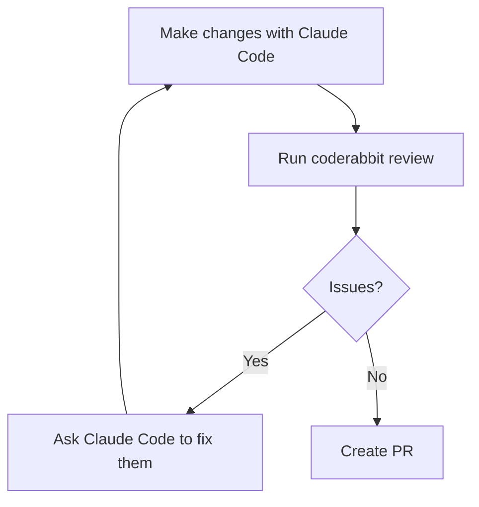

CodeRabbit reviews your PRs on GitHub after you push. That's useful, but the
feedback loop is annoying: open PR, wait for review, push fixes, wait again.
There's a better flow. The CodeRabbit CLI plus a Claude Code plugin let you run
the same review locally before the PR exists.

This post is about setting that up.


# What CodeRabbit Does

CodeRabbit is an AI code reviewer that installs as a GitHub App. Once connected,
it automatically reviews every PR: flags bugs, security issues, style violations,
missing tests. It runs 40+ linters and SAST tools with zero configuration.

The PR review is free. The CLI (for local reviews) is also free for the basics.


# Install the CLI

```bash
curl -fsSL https://cli.coderabbit.ai/install.sh | sh
```

Then authenticate:

```bash
coderabbit auth login
```

This opens a browser. Log in with GitHub, copy the token, paste it in the
terminal. The token lasts 90 days.

Verify it worked:

```bash
coderabbit --version
```


# Install the Claude Code Plugin

From any terminal:

```bash
claude plugin install coderabbit
```

Or from inside a Claude Code session:

```text
/plugin install coderabbit
```

The plugin wraps the CLI and exposes review commands you can run directly in
your Claude Code session. It also lets you trigger a review with plain English,
which Claude Code routes to the plugin automatically.


# The Workflow

With both the CLI and plugin installed, the loop before any PR looks like this:



Inside a Claude Code session, after you've made changes:

```text
/coderabbit:review uncommitted
```

This reviews everything not yet committed. You can also review committed-but-
not-pushed changes:

```text
/coderabbit:review committed
```

Or compare against a specific branch:

```text
/coderabbit:review --base main
```

The review comes back as inline comments. You can ask Claude Code to fix specific
issues, re-run the review, and iterate until it's clean. Then push and open the
PR knowing CodeRabbit's automated review will be quiet.


# CLAUDE.md Is the Bridge

Here's the part worth knowing: CodeRabbit reads your `CLAUDE.md` files
automatically. It treats them as code guidelines and applies them during review.

That means if your `CLAUDE.md` says "no em-dashes" or "never commit directly to
main" or "all functions need docstrings," CodeRabbit enforces those same rules
when it reviews your PR.

You don't need to configure anything extra. Drop a `CLAUDE.md` at the repo root
(or in any subdirectory), and both tools pick it up. Claude Code follows the
rules when writing code; CodeRabbit flags violations when reviewing it.

This is the real win. One file, consistent rules across both tools.


# `.coderabbit.yaml` for More Control

The CLAUDE.md integration handles standards. For repo-level review behavior,
`.coderabbit.yaml` at the root gives you more control over what gets reviewed,
how aggressively, and with what focus per directory.

The two most useful fields:

- `path_filters`: glob patterns for files to skip entirely (lock files, build
  artifacts, node_modules — CodeRabbit reviewing a `pnpm-lock.yaml` is noise)
- `path_instructions`: per-path AI instructions so review focus matches what
  actually matters in each area

Note: don't put `CLAUDE.md` in `path_instructions`. That makes CodeRabbit try
to review the file rather than use it as guidelines. The auto-detection handles
it correctly without any config.


# My Setup

Here's [the `.coderabbit.yaml` for this repo](https://github.com/kylep/multi/blob/main/.coderabbit.yaml).
The repo is a monorepo with a Next.js blog, a TypeScript game engine, a Flask
API with a real Postgres database, Terraform infrastructure, and some tutorial
sample code. Each of those needs different treatment.

**`profile: chill`** is the most impactful setting. CodeRabbit's default
profile generates a lot of comments. Chill mode cuts the noise significantly
and focuses on things that actually matter. Combined with targeted
`path_instructions`, it stops the review from feeling like a style guide
argument.

**`poem: false`** turns off CodeRabbit's habit of writing a short poem at the
end of each PR summary. It's charming once. Less so on the fifteenth PR.

**Path filters** drop lock files, build artifacts, and generated directories.
There's no value in reviewing a `package-lock.json` diff.

**`infra/` and `apps/kytrade/`** get security-focused instructions with
everything else deprioritized. Terraform style is not worth a comment.
A misconfigured IAM policy is.

**`apps/blog/blog/markdown/posts/`** gets a specific instruction to ignore
grammar, phrasing, and tone entirely. The blog has a deliberate writing style
defined in its own `CLAUDE.md`. CodeRabbit shouldn't fight it. It's only asked
to flag broken frontmatter or broken mermaid syntax.

**`samples/`** is tutorial code where error handling and timeouts are
intentionally absent. Without an explicit instruction, CodeRabbit flags every
missing timeout as a production concern. With it, the reviews are quiet unless
something would actively break for a learner copying the code.

**`**/tests/**`** is told to focus on whether tests actually assert something,
not on style. A test that always passes is a real problem. Variable naming is
not.
