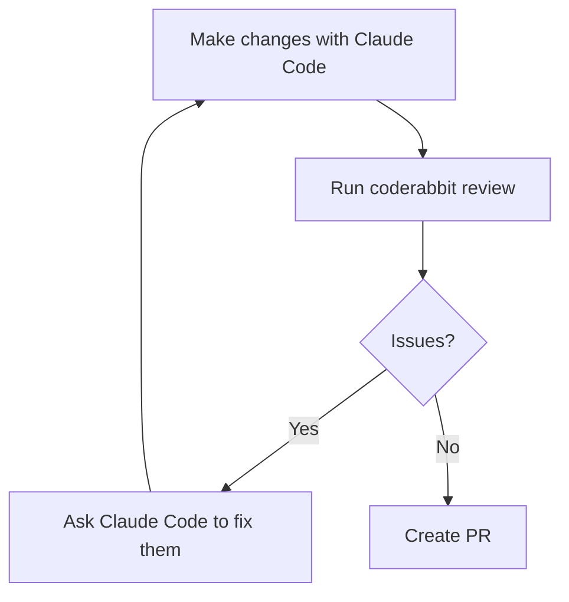

CodeRabbit reviews your PRs on GitHub after you push. That's useful, but the
feedback loop is annoying: open PR, wait for review, push fixes, wait again.
There's a better flow. The CodeRabbit CLI plus a Claude Code plugin let you run
the same review locally before the PR exists.

This post is about setting that up.


# What CodeRabbit Does

CodeRabbit is an AI code reviewer that installs as a GitHub App. Once connected,
it automatically reviews every PR: flags bugs, security issues, style violations,
missing tests. It runs 40+ linters and SAST tools with zero configuration.

The PR review is free. The CLI (for local reviews) is also free for the basics.


# Install the CLI

```bash
curl -fsSL https://cli.coderabbit.ai/install.sh | sh
```

Then authenticate:

```bash
coderabbit auth login
```

This opens a browser. Log in with GitHub, copy the token, paste it in the
terminal. The token lasts 90 days.

Verify it worked:

```bash
coderabbit --version
```


# Install the Claude Code Plugin

From any terminal:

```bash
claude plugin install coderabbit
```

Or from inside a Claude Code session:

```
/plugin install coderabbit
```

The plugin wraps the CLI and exposes review commands you can run directly in
your Claude Code session. It also lets you trigger a review with plain English,
which Claude Code routes to the plugin automatically.


# The Workflow

With both the CLI and plugin installed, the loop before any PR looks like this:



Inside a Claude Code session, after you've made changes:

```
/coderabbit:review uncommitted
```

This reviews everything not yet committed. You can also review committed-but-
not-pushed changes:

```
/coderabbit:review committed
```

Or compare against a specific branch:

```
/coderabbit:review --base main
```

The review comes back as inline comments. You can ask Claude Code to fix specific
issues, re-run the review, and iterate until it's clean. Then push and open the
PR knowing CodeRabbit's automated review will be quiet.


# CLAUDE.md Is the Bridge

Here's the part worth knowing: CodeRabbit reads your `CLAUDE.md` files
automatically. It treats them as code guidelines and applies them during review.

That means if your `CLAUDE.md` says "no em-dashes" or "never commit directly to
main" or "all functions need docstrings," CodeRabbit enforces those same rules
when it reviews your PR.

You don't need to configure anything extra. Drop a `CLAUDE.md` at the repo root
(or in any subdirectory), and both tools pick it up. Claude Code follows the
rules when writing code; CodeRabbit flags violations when reviewing it.

This is the real win. One file, consistent rules across both tools.


# `.coderabbit.yaml` for More Control

The CLAUDE.md integration handles standards. For repo-level review behavior,
`.coderabbit.yaml` at the root gives you more control:

```yaml
reviews:
  auto_review: true
  target_branches:
    - main
  path_filters:
    - "**/*.{js,ts,tsx,md}"
    - "!**/node_modules/**"
    - "!**/dist/**"
  path_instructions:
    - path: "apps/**/tests/**"
      instructions: >
        Focus on test coverage and assertion quality.
        Flag missing edge cases.
    - path: "apps/**/src/**"
      instructions: >
        Check for security issues and code complexity.
        Flag anything that should be split into smaller functions.
```

The `path_instructions` field lets you give CodeRabbit different instructions
depending on what it's looking at. Tests get different scrutiny than production
code.

Note: don't put `CLAUDE.md` in `path_instructions`. That makes CodeRabbit try
to review the file rather than use it as guidelines. The auto-detection handles
it correctly without any config.


# GitHub App Setup

The local CLI works without this, but to get PR reviews on GitHub you need the
app installed:

1. Go to [github.com/apps/coderabbit](https://github.com/apps/coderabbit)
2. Install for your repo
3. Grant the requested permissions (read for most things, read-write for PR
   comments)

After installation, any PR against `main` gets an automatic review posted as
comments within a few minutes.


# That's It

The setup is: CLI install, auth, Claude Code plugin, optionally a
`.coderabbit.yaml`. Your CLAUDE.md already does double duty. The local review
command cuts the push-wait-fix cycle down to something you control before anyone
else sees the PR.
