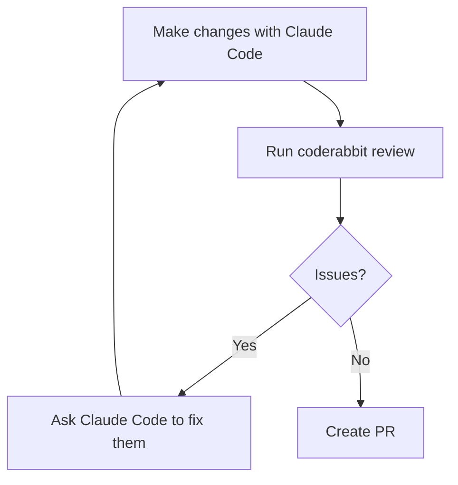

CodeRabbit is an AI code review tool. It can review your PRs on GitHub / MRs on GitLab
after you push. You can also hook it into Claude Code to get the review and fix up the
nits with your agent prior to opening the PR.


# Install the CLI

```bash
curl -fsSL https://cli.coderabbit.ai/install.sh | sh
```

Then authenticate:

```bash
coderabbit auth login
```

This opens a browser. Log in with GitHub, copy the token, paste it in the
terminal. The token lasts 90 days.

Verify it worked:

```bash
coderabbit --version
```


# Install the Claude Code Plugin

From any terminal:

```bash
claude plugin install coderabbit
```

Or from inside a Claude Code session:

```text
/plugin install coderabbit
```

The plugin wraps the CLI and exposes review commands you can run directly in
your Claude Code session. It also lets you trigger a review with plain English,
which Claude Code routes to the plugin automatically.


# The Workflow

With both the CLI and plugin installed, the loop before any PR looks like this:



Inside a Claude Code session, after you've made changes:

```text
/coderabbit:review uncommitted
```

This reviews everything not yet committed. You can also review committed-but-
not-pushed changes:

```text
/coderabbit:review committed
```

Or compare against a specific branch:

```text
/coderabbit:review --base main
```

The review comes back as inline comments. You can ask Claude Code to fix specific
issues, re-run the review, and iterate until it's clean. Then push and open the
PR knowing CodeRabbit's automated review will be quiet.

It's kind of slow, but so is the PR review.


# CLAUDE.md integration

CodeRabbit reads your `CLAUDE.md` files automatically. It treats them as code
guidelines and applies them during review.

That means that because my `CLAUDE.md` says "no em-dashes" and "never commit directly to
main",  CodeRabbit enforces those same rules when it reviews your PR. You don't need to
configure anything extra.


# Config with `.coderabbit.yaml`

`.coderabbit.yaml` at the root gives control over what gets reviewed, how aggressively,
and with what focus per directory.

Notably:

- `path_filters`: glob patterns for files to skip entirely (lock files, build
  artifacts, node_modules, etc)
- `path_instructions`: per-path AI instructions

Don't put `CLAUDE.md` in `path_instructions`. That makes CodeRabbit try
to review the file rather than use it as guidelines. The auto-detection handles
it correctly without any config.


## Setup for this repo

Here's [the `.coderabbit.yaml` for this repo](https://github.com/kylep/multi/blob/main/.coderabbit.yaml).

**`profile: chill`** is the most significant setting. CodeRabbit's default
profile generates a lot of comments. I'm actually on the fence still about this though,
once I can get the AI agents to run the code review and fix up in a ralf-style-loop I
may go back to aggressive.

**`poem: false`** turns off CodeRabbit's cute poems, I'm not reading them like this.

**Path filters** drop lock files, build artifacts, and generated directories.
There's no value in reviewing a `package-lock.json` diff.

**`infra/` and `apps/kytrade/`** get security-focused instructions with
everything else deprioritized. Terraform style is not worth a comment.
A misconfigured IAM policy is.

**`apps/blog/blog/markdown/posts/`** gets a specific instruction to ignore
grammar, phrasing, and tone entirely. I'm specifically spending effort to not write
like a robot, I can't stand the writing style. CodeRabbit shouldn't fight it.

**`samples/`** is tutorial code I used to save examples of projects along the way.

**`**/tests/**`** is told to focus on whether tests actually assert something,
not on style. A test that always passes is a real problem. Variable naming is
not.


## Update: teaching it about false positives (2026-03-11)

CodeRabbit kept flagging my blog frontmatter tags as needing YAML
list format. The blog parser handles comma-separated tags on one
line, so this was a false positive on every post.

The fix is `path_instructions` in `.coderabbit.yaml`. I added a
note to the blog posts path telling it not to suggest converting
frontmatter tags to list format. CodeRabbit applies these
instructions on every review, so the false positive should stop
recurring.

You can also reply `@coderabbitai` on a PR comment to teach it
inline. It stores those as "learnings" and applies them to future
reviews. The `.coderabbit.yaml` approach is more durable since
it's checked into the repo.
