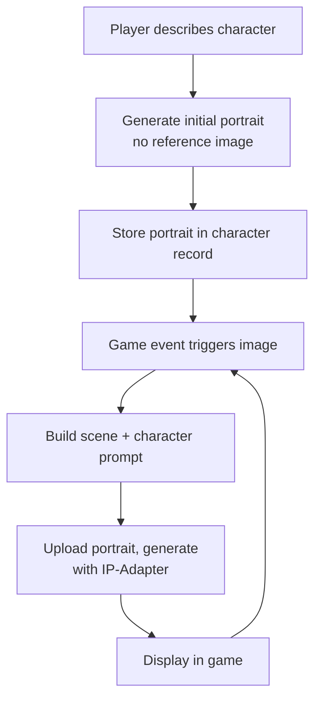

I'm building a tabletop RPG game that generates images on the fly: character portraits,
enemy illustrations, scene art. Cloud APIs work but get expensive when every combat
encounter wants several images. More importantly, I need character consistency. If I
generate a portrait of "Aria the rogue" in session one, future images of her should
look like the same character, not a random new person.

ComfyUI solves both. It runs locally on Apple Silicon, exposes a REST API, and
supports IP-Adapter for using an existing portrait as a visual reference for new
generations.


# Hardware Reality

MacBook Air M2, 16GB unified memory. The Air throttles under sustained load since
it has no active cooling. Fine for a game that generates at natural breaks (between
scenes, at combat start) rather than continuously.

16GB comfortably fits:
- **SDXL** (fp16, ~6.5GB): mature IP-Adapter ecosystem, good portrait quality
- **FLUX.1-schnell** (fp8 quantized, ~6.5GB): faster, 4-step generation, IP-Adapter
  support exists but is less tested
- **FLUX.1-dev** (fp8, ~8GB): better quality than schnell, 20-50 steps

For this post I'm using SDXL. Its IP-Adapter tools are battle-tested for exactly
this use case, and 6.5GB leaves plenty of headroom for additional models.


# Install ComfyUI

ComfyUI has a [Desktop app](https://github.com/Comfy-Org/desktop) that handles
everything automatically. Use that if you just want the UI. For API access and
full control, manual install is cleaner.

```bash
# Python 3.11+ required
python3 --version

git clone https://github.com/comfyanonymous/ComfyUI
cd ComfyUI
pip install -r requirements.txt
```

On Apple Silicon, the requirements file pulls a PyTorch build with MPS support
automatically. No CUDA, no special flags.

Start it:

```bash
python main.py --listen 0.0.0.0 --port 8188
```

`--listen 0.0.0.0` binds to all interfaces instead of localhost only. Needed for
the API to be reachable from other processes or devices on your network.

Open `http://localhost:8188`. You should see the node graph UI with a default
workflow loaded.


# Models

Download into `ComfyUI/models/checkpoints/`:

```bash
# SDXL base (6.5GB)
huggingface-cli download stabilityai/stable-diffusion-xl-base-1.0 \
  sd_xl_base_1.0.safetensors \
  --local-dir ComfyUI/models/checkpoints/
```

For IP-Adapter, first install the custom node:

```bash
cd ComfyUI/custom_nodes
git clone https://github.com/cubiq/ComfyUI_IPAdapter_plus
pip install -r ComfyUI_IPAdapter_plus/requirements.txt
```

Then download the IP-Adapter weights:

```bash
# IP-Adapter for SDXL
huggingface-cli download h94/IP-Adapter \
  sdxl_models/ip-adapter_sdxl.bin \
  --local-dir ComfyUI/models/ipadapter/

# CLIP vision encoder (required by IP-Adapter)
huggingface-cli download openai/clip-vit-large-patch14 \
  --local-dir ComfyUI/models/clip_vision/clip-vit-large-patch14/
```

Restart ComfyUI after installing custom nodes. It rescans the nodes directory on
startup.


# Quick Test

Before touching the API, confirm generation works at all.

1. In the UI, find the "Load Checkpoint" node and select
   `sd_xl_base_1.0.safetensors`
2. Set a positive prompt: `a fantasy rogue in a dark alley, RPG portrait, detailed`
3. Hit Queue Prompt

First generation is slower while the model loads into memory. On M2 Air at 20
steps, SDXL takes roughly 25-45 seconds. Subsequent generations are faster.


# The API

ComfyUI's API accepts a workflow as JSON and queues the generation. The workflow
you build in the UI can be exported in API format: go to Settings, enable Dev
Mode Options, then use the "Save (API Format)" button on the workflow.

The API format represents each node as a dict entry keyed by node ID. Here's a
minimal SDXL workflow:

```json
{
  "4": {
    "class_type": "CheckpointLoaderSimple",
    "inputs": { "ckpt_name": "sd_xl_base_1.0.safetensors" }
  },
  "5": {
    "class_type": "EmptyLatentImage",
    "inputs": { "batch_size": 1, "height": 1024, "width": 768 }
  },
  "6": {
    "class_type": "CLIPTextEncode",
    "inputs": {
      "clip": ["4", 1],
      "text": "a fantasy rogue in a dark alley, RPG portrait, detailed"
    }
  },
  "7": {
    "class_type": "CLIPTextEncode",
    "inputs": {
      "clip": ["4", 1],
      "text": "ugly, blurry, watermark, text, bad anatomy"
    }
  },
  "3": {
    "class_type": "KSampler",
    "inputs": {
      "model": ["4", 0],
      "positive": ["6", 0],
      "negative": ["7", 0],
      "latent_image": ["5", 0],
      "seed": 42,
      "steps": 20,
      "cfg": 7,
      "sampler_name": "dpmpp_2m",
      "scheduler": "karras",
      "denoise": 1
    }
  },
  "8": {
    "class_type": "VAEDecode",
    "inputs": { "samples": ["3", 0], "vae": ["4", 2] }
  },
  "9": {
    "class_type": "SaveImage",
    "inputs": { "filename_prefix": "rpg", "images": ["8", 0] }
  }
}
```

Submit it:

```bash
curl -X POST http://localhost:8188/prompt \
  -H "Content-Type: application/json" \
  -d '{"prompt": <workflow_json>}'
# Returns: {"prompt_id": "abc123...", "number": 1, "node_errors": {}}
```

Poll for completion:

```bash
curl http://localhost:8188/history/abc123
# When done: history[prompt_id]["status"]["completed"] == true
```

Fetch the image:

```bash
curl "http://localhost:8188/view?filename=rpg_00001_.png" \
  --output character.png
```

Images also land in `ComfyUI/output/` on disk if you'd rather read them
directly.


# Image Consistency with IP-Adapter

IP-Adapter encodes a reference image using CLIP vision and injects that embedding
alongside the text prompt during generation. The result is a new image that
respects the prompt but is visually pulled toward the reference: same hair, same
armor, similar face structure.

It's not a perfect clone. Think of it as a strong nudge. Consistent text prompts
help too. If every prompt for Aria includes "tall elf rogue, purple hair, leather
armor," you're conditioning from both directions.

Add these nodes to the workflow above:

```json
"10": {
  "class_type": "IPAdapterModelLoader",
  "inputs": { "ipadapter_file": "ip-adapter_sdxl.bin" }
},
"11": {
  "class_type": "CLIPVisionLoader",
  "inputs": { "clip_name": "clip-vit-large-patch14" }
},
"12": {
  "class_type": "LoadImage",
  "inputs": { "image": "aria_portrait.png" }
},
"13": {
  "class_type": "IPAdapterAdvanced",
  "inputs": {
    "model": ["4", 0],
    "ipadapter": ["10", 0],
    "image": ["12", 0],
    "clip_vision": ["11", 0],
    "weight": 0.6,
    "weight_type": "original",
    "combine_embeds": "concat",
    "start_at": 0.0,
    "end_at": 1.0,
    "embeds_scaling": "V only"
  }
}
```

Then change node `"3"`'s `model` input from `["4", 0]` to `["13", 0]`.

`weight` is the main knob. At 0.5 you get style and general appearance influence.
At 0.8 it starts fighting the text prompt. For character identity, 0.6-0.7 is
the range to start with.

The `image` input in node `"12"` is a filename relative to `ComfyUI/input/`.
Copy your reference images there, or upload them via the API:

```bash
curl -X POST http://localhost:8188/upload/image \
  -F "image=@aria_portrait.png"
# Returns: {"name": "aria_portrait.png", "subfolder": "", "type": "input"}
```


## Face Consistency

Standard IP-Adapter works well for overall style and body type. Faces drift more
than you'd like, especially across very different scenes. IP-Adapter FaceID handles
this by extracting face embeddings specifically rather than encoding the whole image.

Download:

```bash
huggingface-cli download h94/IP-Adapter-FaceID \
  ip-adapter-faceid-plusv2_sdxl.bin \
  --local-dir ComfyUI/models/ipadapter/
```

FaceID also requires InsightFace, which isn't on HuggingFace. You need to download
the `antelopev2` model package from the
[InsightFace model zoo](https://github.com/deepinsight/insightface/tree/master/model_zoo)
and place it at `ComfyUI/models/insightface/models/antelopev2/`.

Install the Python package:

```bash
pip install insightface onnxruntime
```

With FaceID installed, use `IPAdapterFaceIDAdvanced` instead of `IPAdapterAdvanced`.
It takes the same inputs but runs the face embedding extraction automatically.
Faces stay recognizable across very different scenes much more reliably than with
the standard adapter.

You can combine both: use `IPAdapterAdvanced` for overall character appearance
and `IPAdapterFaceIDAdvanced` for face locking, chaining them in sequence.


# Game Integration

The pattern for a TTRPG character system:



Python client that wraps the API:

```python
import json
import time
import requests
from pathlib import Path

COMFYUI = "http://localhost:8188"

def generate(
    prompt: str,
    negative: str = "ugly, blurry, watermark, bad anatomy",
    reference_image: str | None = None,  # filename in ComfyUI/input/
    seed: int = -1,
) -> bytes:
    workflow = json.loads(Path("workflow_sdxl.json").read_text())
    workflow["6"]["inputs"]["text"] = prompt
    workflow["7"]["inputs"]["text"] = negative
    workflow["3"]["inputs"]["seed"] = seed

    if reference_image:
        workflow["12"]["inputs"]["image"] = reference_image
        workflow["3"]["inputs"]["model"] = ["13", 0]  # route through IPAdapter
    else:
        workflow["3"]["inputs"]["model"] = ["4", 0]   # bypass IPAdapter

    resp = requests.post(f"{COMFYUI}/prompt", json={"prompt": workflow})
    resp.raise_for_status()
    prompt_id = resp.json()["prompt_id"]

    # Note: add a timeout in production to avoid waiting forever if ComfyUI hangs
    while True:
        history = requests.get(f"{COMFYUI}/history/{prompt_id}").json()
        if prompt_id in history and history[prompt_id]["status"]["completed"]:
            break
        time.sleep(1)

    outputs = history[prompt_id]["outputs"]
    filename = next(
        (img["filename"]
        for node_output in outputs.values()
        for img in node_output.get("images", [])),
        None
    )
    if not filename:
        raise RuntimeError("No images in generation output")

    return requests.get(f"{COMFYUI}/view", params={"filename": filename}).content


def upload_reference(path: str) -> str:
    with open(path, "rb") as f:
        resp = requests.post(f"{COMFYUI}/upload/image", files={"image": f})
    return resp.json()["name"]
```

Character class for the game:

```python
from dataclasses import dataclass

@dataclass
class Character:
    name: str
    traits: str          # "tall elf rogue, purple hair, leather armor"
    portrait_ref: str | None = None  # filename in ComfyUI/input/ after first gen

    def prompt(self, scene: str) -> str:
        return f"{self.traits}, {scene}, fantasy RPG portrait, detailed"

    def is_known(self) -> bool:
        return self.portrait_ref is not None


def get_character_image(character: Character, scene: str) -> bytes:
    image_bytes = generate(
        prompt=character.prompt(scene),
        reference_image=character.portrait_ref,
    )

    # Store portrait on first generation
    if not character.is_known():
        tmp_path = f"/tmp/{character.name}_portrait.png"
        Path(tmp_path).write_bytes(image_bytes)
        character.portrait_ref = upload_reference(tmp_path)

    return image_bytes
```

First call for any character generates without a reference and stores the result.
Every subsequent call for that character passes the stored portrait to IP-Adapter.


# Running as a Background Service

For a game that's actually running, keep ComfyUI up automatically.

```bash
# ~/scripts/comfyui.sh
#!/bin/bash
cd /path/to/ComfyUI
python main.py --listen 0.0.0.0 --port 8188
```

As a LaunchAgent (auto-start on login):

```xml
<!-- ~/Library/LaunchAgents/local.comfyui.plist -->
<?xml version="1.0" encoding="UTF-8"?>
<!DOCTYPE plist PUBLIC "-//Apple//DTD PLIST 1.0//EN"
  "http://www.apple.com/DTDs/PropertyList-1.0.dtd">
<plist version="1.0">
<dict>
  <key>Label</key>
  <string>local.comfyui</string>
  <key>ProgramArguments</key>
  <array>
    <string>/usr/bin/python3</string>
    <string>/path/to/ComfyUI/main.py</string>
    <string>--listen</string>
    <string>0.0.0.0</string>
    <string>--port</string>
    <string>8188</string>
  </array>
  <key>RunAtLoad</key>
  <true/>
  <key>StandardOutPath</key>
  <string>/tmp/comfyui.log</string>
  <key>StandardErrorPath</key>
  <string>/tmp/comfyui-error.log</string>
</dict>
</plist>
```

```bash
launchctl load ~/Library/LaunchAgents/local.comfyui.plist

# Verify it started:
curl http://localhost:8188/system_stats
```

Note on the Air: sustained image generation will cause throttling after a few
minutes. The machine slows down noticeably rather than stops entirely. For a game
that generates at scene boundaries rather than in a tight loop, this is fine in
practice.
