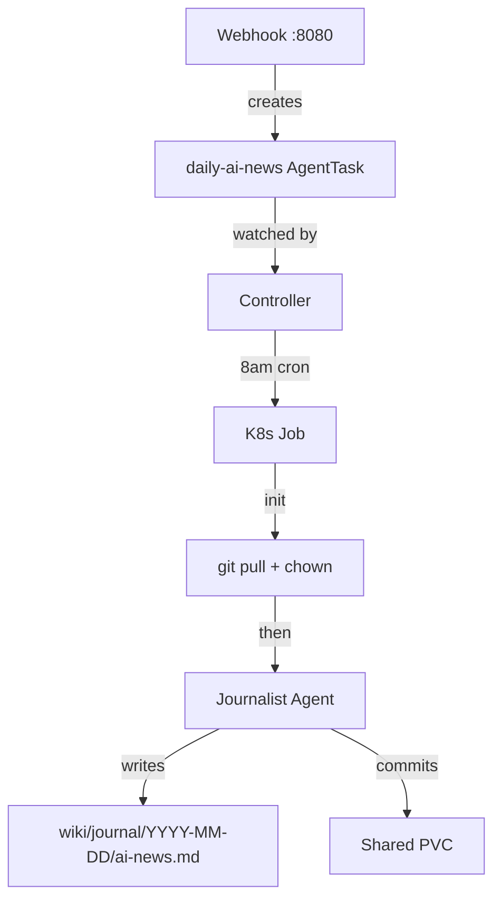

## Table of contents

- [The goal](#the-goal)
- [The journalist agent](#the-journalist-agent)
- [Architecture](#architecture)
- [The runtime image](#the-runtime-image)
- [AgentTask CRD](#agenttask-crd)
- [The Go controller](#the-go-controller)
- [OpenRouter for API auth](#openrouter-for-api-auth)
- [Permissions with allowedTools](#permissions-with-allowedtools)
- [Webhook: trigger on demand](#webhook-trigger-on-demand)
- [Helm chart and deployment](#helm-chart-and-deployment)


## The goal

I want AI agents that run autonomously on a cron schedule or in
response to events, managed by Kubernetes.

The demo task is a daily AI news digest. Every morning at 8am,
an agent searches the web for yesterday's AI news, writes a
digest to the wiki, and commits. It's also triggerable on demand
via webhook.

K8s handles the scheduling. A custom controller watches a CRD
and creates Jobs. The agent runs in a container, writes to a
shared volume, and the controller tracks the result. Agents
commit locally but don't push. I review and push manually.


## The journalist agent

I wrote a new Claude Code agent for this:
[journalist](https://github.com/kylep/multi/blob/main/.claude/agents/journalist.md).
Sonnet, not Opus. This runs daily, and the task is search and
summarize. Sonnet is cheaper and good enough.

The agent searches for yesterday's AI news, writes a digest to
`wiki/journal/YYYY-MM-DD/ai-news.md` with source URLs for every
item, and commits. It determines the date itself via `date`.

Early versions used `WebSearch`, which burned through context
with HTML scraping. I built a small
[GNews MCP server](/wiki/custom-tools/google-news-mcp.html)
that wraps the GNews API. Structured JSON responses, fewer
tokens. The agent runs six parallel queries (`OpenAI`,
`Anthropic`, `Google AI`, `NVIDIA AI`, `AI startup`, plus
tech headlines) and deduplicates the results.

I also wrote a
[Discord MCP server](/wiki/custom-tools/discord-mcp.html)
so the agent posts its digest to the `#news` channel in my
Discord bot server.


## Architecture



The controller is a Go binary running as a Deployment. It watches
`AgentTask` custom resources in the `ai-agents` namespace.

Each Job has two containers:

1. **Init container** (`alpine/git`): fetches the repo, checks
   out the configured branch, pulls latest, then `chown`s the
   workspace to uid 1000 (the agent user).
2. **Main container** (`ai-agent-runtime`): runs
   `claude --agent journalist -p "..." --allowedTools ...`


## The runtime image

Alpine container with Claude Code (npm) and OpenCode (binary).
The entrypoint is `sh` so the controller injects the actual
command as Job args.

```dockerfile
FROM node:22-alpine
RUN apk upgrade --no-cache && apk add --no-cache \
    git python3 bash curl openssh-client
RUN npm install -g @anthropic-ai/claude-code
ARG OPENCODE_VERSION=0.0.55
RUN curl -fsSL \
    "https://github.com/opencode-ai/opencode/releases/download/\
v${OPENCODE_VERSION}/opencode-linux-x86_64.tar.gz" \
    | tar -xz -C /usr/local/bin opencode
```

Runs as the `node` user (uid 1000) from the base image.

Source: `infra/ai-agent-runtime/Dockerfile`


## AgentTask CRD

The custom resource definition gives `kubectl get agenttasks`
for free. Here's the daily news task:

```yaml
apiVersion: agents.kyle.pericak.com/v1alpha1
kind: AgentTask
metadata:
  name: daily-ai-news
spec:
  agent: journalist
  runtime: claude
  prompt: >-
    Search for yesterday's most notable AI news...
  schedule: "0 8 * * *"
  trigger: scheduled
  readOnly: false
  allowedTools: >-
    WebSearch,WebFetch,Read,Glob,Grep,Write,
    Bash(mkdir *),Bash(git add *),
    Bash(git commit *),Bash(date *)
```

The `allowedTools` field is new. The controller splits it on
commas and passes each one as a separate `--allowedTools` flag
to Claude Code. This is how you run Claude Code autonomously
without `--dangerously-skip-permissions`.

| Field | Purpose |
|-------|---------|
| `agent` | Name from `.claude/agents/` |
| `runtime` | `claude` or `opencode` |
| `prompt` | The `-p` argument |
| `schedule` | Cron expression (empty = one-shot) |
| `trigger` | `manual`, `scheduled`, or `webhook` |
| `readOnly` | Whether this agent modifies the repo |
| `allowedTools` | Comma-separated tool permissions |


## The Go controller

The
[controller](https://github.com/kylep/multi/tree/main/infra/agent-controller/pkg/controller)
is a reconcile loop that lists all AgentTasks every 30 seconds.
For scheduled tasks, it compares `lastRunTime` against the cron
expression and creates a Job when due. For manual and webhook
tasks, it creates a Job immediately when phase is `Pending`.

Write agents (publisher, qa, journalist) are serialized so two
don't commit at the same time. Read-only agents run concurrently.

The controller builds the Claude Code command with each
allowedTools entry as a separate flag:

```go
tools := strings.Split(task.Spec.AllowedTools, ",")
for _, tool := range tools {
    cmd += fmt.Sprintf(
        ` --allowedTools '%s'`, strings.TrimSpace(tool))
}
```

Single quotes around each tool pattern prevent the shell from
expanding parentheses and globs in patterns like
`Bash(mkdir *)`.


## OpenRouter for API auth

Claude Code normally uses `ANTHROPIC_API_KEY` to talk to
Anthropic's API directly. In a container, I route it through
[OpenRouter](/openrouter-ai-tools.html) instead. One API key
for all model providers, unified billing.

The Helm chart's Secret injects these env vars into every
agent container:

```yaml
ANTHROPIC_BASE_URL: https://openrouter.ai/api
ANTHROPIC_AUTH_TOKEN: <openrouter-key>
ANTHROPIC_API_KEY: ""
CLAUDE_CODE_DISABLE_NONESSENTIAL_TRAFFIC: "1"
```

`ANTHROPIC_API_KEY` must be empty or Claude Code tries to use
it and the auth conflicts.


## Permissions with allowedTools

Claude Code prompts for permission before using tools. In a
container with no TTY, it just hangs. The fix is
`--allowedTools`, which auto-approves specific tools.

Each tool needs its own flag. Comma-separated doesn't work:

```bash
# wrong
claude -p "..." --allowedTools "WebSearch,Write,Read"

# right
claude -p "..." \
  --allowedTools "WebSearch" \
  --allowedTools "Write" \
  --allowedTools "Read"
```

Tools with specifiers use parentheses for scoping:

```bash
--allowedTools 'Bash(mkdir *)'    # only mkdir
--allowedTools 'Bash(git add *)'  # only git add
--allowedTools 'Write'            # any file
```

I tried scoping Write to a specific path with
`Write(apps/blog/blog/markdown/wiki/journal/**)` but it didn't
match inside the container. The pattern works locally but fails
when the working directory is `/workspace/repo`. Unrestricted
`Write` works. The agent definition and Bash scoping still
constrain what gets written.


## Webhook: trigger on demand

The controller exposes `:8080/webhook` for on-demand runs:

```bash
curl -X POST http://localhost:8080/webhook \
  -H "Content-Type: application/json" \
  -d '{
    "agent": "journalist",
    "prompt": "Search for today AI news...",
    "allowedTools": "WebSearch,WebFetch,Read,Write,..."
  }'
```

The handler creates an AgentTask CR with the allowedTools, and
the reconcile loop picks it up. No authentication for MVP.


## Helm chart and deployment

The
[Helm chart](https://github.com/kylep/multi/tree/main/infra/agent-controller/helm)
packages everything: CRD, controller Deployment, ServiceAccount,
RBAC, Secrets, and PVC. hostPath volume, single node.

```bash
helm install agent-controller ./helm \
  -n ai-agents --create-namespace \
  -f values-override.yaml
```

The OpenRouter key has special characters that `--set` mangles.
Use a values file instead:

```yaml
secrets:
  openrouterApiKey: "sk-or-v1-..."
repo:
  branch: kyle/blog-k8s-autonomous-agents-mvp
```
