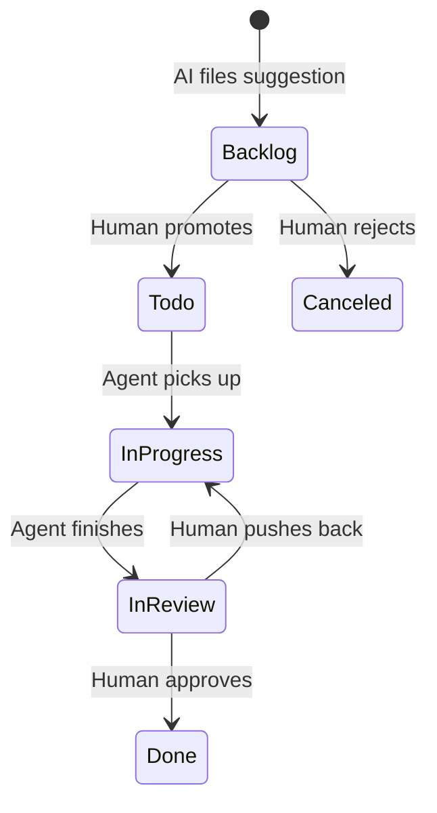

Linear's official MCP server launched in May 2025. It lets the robots lean in on the
project management work. I want to get some ideation-bots going.

## Supported Commands

| Category | Commands |
|----------|----------|
| Issues | list, get, create/update, status, statuses |
| Projects | list, get, create/update, labels |
| Documents | list, get, create, update, search |
| Comments | list, create/update, delete |
| Attachments | get, create, delete, extract images |
| Milestones | list, get, create/update |
| Cycles | list |
| Teams | list, get |
| Users | list, get |
| Labels | list issue labels, create issue label |

## Setup

Linear hosts the MCP server at `https://mcp.linear.app/mcp`. Use that endpoint, not the
old SSE one which is deprecated.


### Claude Code

```bash
claude mcp add --transport http linear-server https://mcp.linear.app/mcp
```

Restart and authenticate via OAuth.


---

# Idea: Nightly Ideation Engine

Instead of using Linear as a human-operated task tracker, an AI agent can read youri
codebase, compare it against goals, and file suggestions directly.

What I'm hoping to build is a system where a scheduled agent runs nightly. It reads
blog posts, checks page speed, reviews SEO metadata, and compares everything against a
set of high-level goals:

- 100% accurate content
- Fast loading
- Low cost
- Looks good
- Good SEO
- Interesting tutorials about emerging tooling

It should create Linear issues for anything worth improving, labeled "Suggestion" and
drop them into the Backlog.

### The pipeline

Linear's built-in statuses act as gates between human and agent
work.



Each step has a clear owner:

| Status | Owner | What happens |
|--------|-------|-------------|
| Backlog | AI | Nightly agent creates suggestion issues |
| Todo | Human | You move the good ones forward |
| In Progress | Agent | A working agent picks it up |
| In Review | Agent | Agent finishes, leaves a comment |
| Done | Human | You verify and close |
| Canceled | Human | Bad idea, toss it |

### Agent notes via comments

When agents work on an issue, they leave comments. This beats
internal context files because comments are visible, searchable,
and survive across sessions. If one agent starts a task and another
finishes it, the full history is right there on the issue.

I might also run multiple planning agents that each comment on a
ticket before I review it. A fact-checker, a SEO reviewer, and a
style auditor could all weigh in on the same Backlog issue. By the
time I look at it, there's already a thread of perspectives.

```bash
# An agent checking for work:
# list_issues with label="Suggestion", state="Todo"

# An agent leaving notes:
# save_comment with issueId and markdown body
```

### Filtering

The nightly agent queries existing Backlog suggestions before
creating new ones, avoiding duplicates. Working agents filter
by label and status to find their next task:

```
list_issues → label: "Suggestion", state: "Todo"
```

## Defining State as Prompts

Linear's community Terraform provider exists but only covers teams,
labels, workflow states, and templates. No custom views. The GraphQL
API has a `customViewCreate` mutation, but nobody's wrapped it in
IaC tooling yet.

So instead of declaring views in HCL, I described mine as a prompt
and had Claude set it up via Playwright MCP:

> Create a custom view called "Suggestion Backlog" on the Pericak
> team. Filter to issues where label includes "Suggestion" and
> status is "Backlog". Description: "AI-generated improvement
> suggestions awaiting human review".

Claude navigated to Linear in Chromium, clicked "Add new view",
filled in the name, added both filters, and hit Save. The view
now lives as a tab on the team page.

This is nondeterministic state management. There's no lock file,
no plan/apply, no drift detection. But it works, and the prompt
is the documentation. If the view ever gets deleted, re-run the
prompt.

### A Linear-Admin agent

A "Linear-Admin" agent could own all workspace
configuration: views, labels, workflow states, notification
settings. You'd feed it a doc describing your desired workspace
setup, and it would use Playwright to converge Linear's UI to
match. Like Terraform, but with a browser instead of an API.

The tradeoffs are real. Playwright clicks are slow, brittle if
Linear redesigns their UI, and hard to make idempotent. But for
a personal workspace where the alternative is "click around in
the UI manually," the prompt-as-IaC approach is surprisingly
practical.

Still faster than a person.

