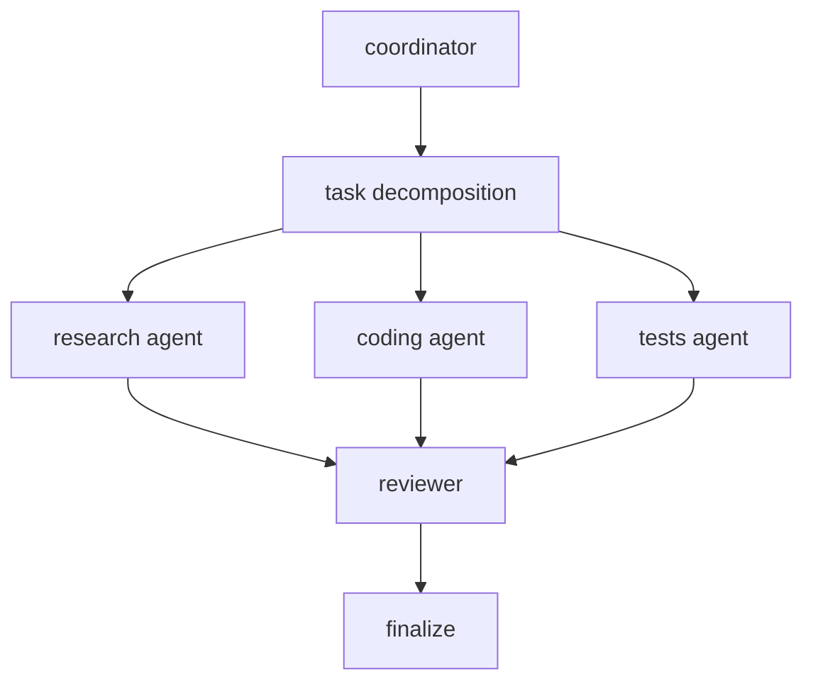
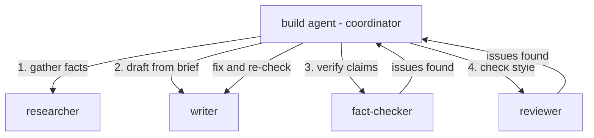

# OpenCode vs Cursor vs Claude

| Aspect                    | OpenCode      | Claude Code          | Cursor     |
| ------------------------- | ------------- | -------------------- | ---------- |
| Category                  | agent runtime | coding CLI assistant | AI IDE     |
| Open source               | yes           | no                   | no         |
| Model support             | many          | Anthropic only       | many       |
| Primary interface         | CLI / TUI     | CLI                  | GUI editor |
| Agent autonomy            | high          | medium               | low        |
| Multi-agent orchestration | native        | limited              | minimal    |
| IDE features              | none          | none                 | full       |
| Tool execution            | built-in      | built-in             | limited    |


# Agents vs Skills vs Subagents

| Capability            | OpenCode | Claude Code | Cursor  |
| --------------------- | -------- | ----------- | ------- |
| persistent agents     | yes      | limited     | no      |
| multi-agent workflows | yes      | partial     | no      |
| tool orchestration    | strong   | moderate    | limited |
| autonomous loops      | yes      | partial     | no      |
| IDE integration       | none     | none        | full    |


Terminology is inconsistent across these tools.

**OpenCode agents** are markdown files. You drop a `.md` file in
`.opencode/agent/`, give it a frontmatter `description`, and the body
becomes the agent's system prompt. You can optionally set a `model` in
the frontmatter to pin the agent to a specific model. Permissions work
through a per-agent allowlist/denylist of tools. Agents don't pick
their tools, they inherit all tools and you restrict from there. The
runtime exposes these as named agent types that can be spawned via the
`Task` tool.

**Claude Code skills** are also markdown files, but they inject context
into the current session rather than spawning a new one. Claude Code
does have a `Task` tool for spawning subagents. It works similarly to
OpenCode's, but you don't define custom subagent types the same way.
You get whatever named agent types the system provides.

**Cursor subagents** don't really exist as a user-facing concept. Cursor
has Agent mode where it takes more autonomous steps, and Background
Agents for longer-running tasks. Neither lets you define a named agent
type with its own model or permission set. You get one agent, driven by
whatever model you picked, working in your IDE.

The practical difference: in OpenCode you can define a `reviewer` agent
pinned to one model and a `coding` agent on another, then have a primary
agent spawn both in parallel via the Task tool and coordinate the
output. In Claude Code you can spawn subagents but you can't define
custom named agent types with their own models. In Cursor you press a
button and hope for the best.


# OpenCode as a Coding Assistant

The simplest way to use OpenCode is as a drop-in replacement for Claude
Code. Install it, point it at a provider, and start prompting.

## Install

```bash
# pick one
curl -fsSL https://opencode.ai/install | bash
npm i -g opencode-ai@latest
brew install anomalyco/tap/opencode
```

## Connect a provider

Run `opencode` in your project directory. Then run `/connect` in the TUI
to add an API key. It walks you through picking a provider and stores
the key in `~/.local/share/opencode/auth.json`.

OpenCode supports 75+ providers through the AI SDK: Anthropic,
OpenAI, Google, Bedrock, Groq, local models via Ollama, and
others. They also offer "Zen", their own curated model list
if you just want something that works without picking a
provider.

## Set a model

In `opencode.json` at your project root (or
`~/.config/opencode/opencode.json` globally):

```json
{
  "$schema": "https://opencode.ai/config.json",
  "model": "anthropic/claude-sonnet-4-6"
}
```

Here are the main model options and what they cost through their
respective APIs. Prices are per million tokens, as of March 2026.

| Provider | Model | Input $/MTok | Output $/MTok | Notes |
| -------- | ----- | ------------ | ------------- | ----- |
| Zen | Big Pickle | free | free | `/connect` → OpenCode Zen |
| Zen | GPT 5 Nano | free | free | `/connect` → OpenCode Zen |
| Anthropic | Claude Opus 4.6 | $5 | $25 | console.anthropic.com |
| Anthropic | Claude Sonnet 4.6 | $3 | $15 | console.anthropic.com |
| Anthropic | Claude Haiku 4.5 | $1 | $5 | console.anthropic.com |
| OpenAI | GPT-5.4 | $2.50 | $15 | Best all-rounder, includes coding |
| OpenAI | GPT-5.3 Codex | $1.75 | $14 | Coding-specialized |
| Google | Gemini 3.1 Pro | $2 | $12 | Flagship, replaces 3 Pro |
| Google | Gemini 3 Flash | $0.50 | $3 | Fast and cheap |
| Google | Gemini 2.5 Flash | free | free | Free tier at lower rate limit |
| xAI | Grok 4 | $3 | $15 | 2M context window |
| xAI | Grok 4.1 Fast | $0.20 | $0.50 | Budget, very fast |
| Groq | Llama 4 Maverick | $0.20 | $0.60 | Fast inference platform |
| Groq | Llama 3.3 70B | $0.59 | $0.79 | Solid open-source option |

Big Pickle is OpenCode's "stealth model". They won't say what it
actually is. The community thinks it's GLM-4.6 under a different
name. It launched as a free weekend stress test and stuck around.
200K context window, free through Zen, and it's the default model
you get when you `/connect` without paying anything.

Note: Your $20/mo Claude Pro subscription does NOT give you API
access. OpenCode has an unofficial "Claude Pro/Max" auth option in
`/connect` that piggybacks on your subscription, but Anthropic says
it's unsupported. For reliable use, get a separate API key or use
OpenCode Zen.

Google's free tier is worth knowing about. Gemini 2.5 Flash is free
at the lower rate limit, which is fine for trying things out.

**What about local models?** If you're on a 16GB laptop (M2 Mac,
etc), the free cloud tiers beat anything you can run locally. You're
limited to ~8B parameter models on 16GB RAM, maybe a quantized 14B
if you squeeze. A local Llama 8B or Qwen3 8B via Ollama will be
noticeably worse at coding tasks than Big Pickle or Gemini Flash,
and slower too. Run local if you need privacy or offline access,
not for quality.

## Init and go

```bash
cd /path/to/project
opencode
```

Run `/init` to generate an `AGENTS.md` file that maps out your project
structure. This gives the agent context about the codebase, similar to
a `CLAUDE.md` file. Commit it to the repo.

From there, it's the same workflow you'd use in Claude Code. Ask
questions, request changes, reference files with `@`. Hit `Tab` to
switch between `build` mode (full tool access, makes changes) and
`plan` mode (read-only, just analyzes). `/undo` and `/redo` work as
expected.

The TUI is where OpenCode diverges from Claude Code. It's a terminal
app with a real UI, not a pure CLI. Built by neovim users and the
[terminal.shop](https://terminal.shop) team, so the keybindings and
layout feel like a terminal-native tool rather than a chat window.


# OpenCode Multi-Agent Architecture

Note: I'm entirely new to this and going on early research
and testing, not some deep pool of experience. This is just,
like, my opinion, man.

The general idea: a planning agent decomposes jobs, dishes
them out to named agents, and each does their thing. A
validator or reviewer takes a look and either declares victory
or loops back to try again.



## Shared State Between Agents

Each agent runs in its own session with its own context window. Sessions
are persisted in a local SQLite database. Messages, tool call results,
todos, and diffs are all stored there. That's the actual shared substrate,
not some in-memory object store.

What agents share in practice is the filesystem. When a coding agent writes
a file and a test agent runs tests against it, that works because they're
both operating in the same working directory. The spawning agent passes
task descriptions and file paths in the prompt; it doesn't share memory
references.

Subagent sessions have a `parent_id` linking them to the session that
spawned them. The `Task` tool supports a `task_id` parameter so a
spawning agent can resume the same subagent session later rather than
starting fresh each time.

Context doesn't flow automatically between agents. If a research agent
finds something important, the spawning agent has to explicitly include
it in the next task prompt. A coordinator that passes rich context works
well. One that just says "go code the thing" leaves subagents flying
partially blind.

Note: I've seen claims that OpenCode has "Shared Memory Objects",
"Message Queues", and a "Graph Execution Engine". I checked the source
and none of those exist. Don't believe everything ChatGPT tells you
about a codebase.

## Ruler Support for OpenCode

If you use [Ruler](/ruler-cross-tool-ai-rules) to manage rules across
multiple coding agents, it does support OpenCode. Here's what it
handles and what it doesn't.

**What ruler does:**

1. **Instructions**, writes your `.ruler/` markdown rules to
   `AGENTS.md`, which OpenCode reads for project context.
2. **MCP servers**, merges MCP server definitions into
   `opencode.json` alongside your existing config.
3. **Skills**, copies `.ruler/skills/` to `.opencode/skills/`.
   This is experimental in ruler, but it works. Skills are
   `SKILL.md` files that inject context into the agent session.

**What ruler does not do:**

Agent definitions. The `.opencode/agents/*.md` files that define
named agents with their own model, mode, temperature, and tool
permissions are OpenCode-specific. Ruler's interface has no concept
of these because no other tool has an equivalent. You manage agent
definitions directly.

In practice this means ruler handles the shared stuff (rules, MCP,
skills) and you maintain your agent configs by hand in
`.opencode/agents/`.

## MVP

Custom agents are markdown files. The filename is the agent name.
Drop them in `.opencode/agents/` in your project root (or
`~/.config/opencode/agents/` for global agents). Subdirectories
work too. OpenCode globs `agents/**/*.md`, so in a monorepo you
can scope agents by project: `.opencode/agents/blog/`,
`.opencode/agents/api/`, etc.

The agents below live in
[`.opencode/agents/blog/`](https://github.com/kylep/multi/tree/main/.opencode/agents/blog/)
in the monorepo.

### Why not just use one agent?

For most tasks, a single Claude or Opus session is faster and
simpler. The swarm adds complexity. Here's when it earns that
complexity back.

**Independent verification.** A single agent that researches,
writes, then fact-checks its own work has confirmation bias.
It wrote the claim, so it finds evidence supporting it. A
separate fact-checker starts with a blank context and verifies
independently. That's genuinely better.

**Context isolation.** A single agent doing all four jobs
accumulates a huge context full of research notes, draft
revisions, and tool call noise. By step 4 the early research
is getting pushed out or diluted. Each subagent gets a focused
context with just its task.

**Model matching.** Web search tasks on free Gemini, prose on
Big Pickle. A single agent is stuck on one model for
everything. Mixing models saves money and plays to each
model's strengths.

**Tool restriction.** The researcher can't write files. The
reviewer can't edit the draft. A single agent has all tools
and you're trusting the prompt to prevent misuse.

**When it's not worth it:** speed (it's slower sequentially),
simplicity (more moving parts), or straightforward tasks where
you already know the facts. For a post about something you
just did, a single session is faster and probably just as good.

### Blog Agent Swarm Example Design

The goal: write a blog post that's factually correct without
manual fact-checking. Four agents, each with a specific job.



**How they invoke each other:** they don't, directly. The built-in
`build` agent acts as coordinator. It uses the `Task` tool to spawn
each subagent sequentially, passing the output of one as context to
the next. The subagents never talk to each other. They return
results to `build`, which decides what to do next.

The flow:

1. You tell `build` what post to write
2. `build` spawns **researcher** with the topic. Researcher gathers
   facts from docs, repos, and the web. Returns a structured brief
   with sources and confidence levels.
3. `build` passes the brief to **writer**. Writer produces a
   markdown draft. Every claim must trace back to the brief. Gaps
   are marked `TODO: need source for X`.
4. `build` passes the draft to **fact-checker**. Fact-checker
   independently verifies every claim against primary sources.
   Returns a report: VERIFIED, INCORRECT, OUTDATED, or
   UNVERIFIABLE per claim.
5. `build` passes the draft + fact-check report to **reviewer**.
   Reviewer checks style, structure, and readability only.
6. If fact-checker or reviewer found issues, `build` passes the
   feedback back to `writer` for a revision, then re-runs
   fact-checker. Loop until clean.

**Why this split matters:** the researcher and fact-checker both
search for sources, but at different stages. The researcher works
from a blank slate. The fact-checker works from a finished draft
and catches things the researcher missed or the writer added. Two
independent passes catch more errors than one.

### First-Draft Agent Specs

`.opencode/agents/blog/researcher.md`, read-only. Pinned to
Gemini 2.5 Flash (free tier) because it has built-in web
search (grounding), useful for research tasks:

```markdown
---
description: Gathers facts from docs, repos, and the web. Read-only.
mode: subagent
model: google/gemini-2.5-flash
tools:
  write: false
  edit: false
  bash: false
---
You are a research agent for blog post writing. Your job is to
gather accurate, sourced information on a given topic.

For each claim or fact you return:
- State the fact clearly
- Cite the source (URL, repo path, or doc reference)
- Note your confidence level (verified, likely, uncertain)

Use web search and file reading tools to find primary sources.
Prefer official docs and source code over blog posts and forums.
Do not speculate. If you can't verify something, say so.

Return a structured research brief the calling agent can hand
to a writer. Group findings by subtopic.
```

`.opencode/agents/blog/writer.md`, can write files. Using Big
Pickle here since it's free and handles prose fine:

```markdown
---
description: Drafts blog posts from research briefs. Can write files.
mode: subagent
model: opencode/big-pickle
tools:
  bash: false
---
You are a blog post writer. You receive a research brief and
produce a markdown draft.

Style rules:
- Casual, first-person, working engineer voice
- No em-dashes. Use commas or periods instead.
- Sentences: 8-15 words typical. Fragments fine for emphasis.
- Paragraphs: 1-5 sentences. No walls of text.
- No AI writing tells: no filler affirmations, no hedging
  qualifiers, no summarizing paragraphs, no conclusion sections
- Code blocks should be copy-paste ready

Every factual claim in the draft must come from the research
brief. Do not add facts the researcher did not provide. If the
brief has gaps, note them with "TODO: need source for X" inline.

Write the draft to the file path specified in your task prompt.
```

`.opencode/agents/blog/fact-checker.md`, read-only. Also on
Gemini 2.5 Flash so it can independently verify claims via
web search:

```markdown
---
description: Verifies claims in a draft against primary sources.
mode: subagent
model: google/gemini-2.5-flash
tools:
  write: false
  edit: false
  bash: false
---
You are a fact-checking agent. You receive a blog post draft and
verify every factual claim in it.

For each claim:
1. Identify the specific assertion
2. Search for the primary source (official docs, source code, API)
3. Mark it as: VERIFIED, INCORRECT, OUTDATED, or UNVERIFIABLE
4. If incorrect or outdated, provide the correct information with
   a source link

Pay special attention to:
- Version numbers and release dates
- API pricing (changes frequently)
- CLI commands and flags
- Feature comparisons between tools
- Config file formats and field names

Return a structured report. List verified claims briefly. Expand
on anything incorrect, outdated, or unverifiable.
```

`.opencode/agents/blog/reviewer.md`, read-only, low temperature.
Also Big Pickle, style review doesn't need web search:

```markdown
---
description: Reviews draft for style, structure, and readability.
mode: subagent
model: opencode/big-pickle
temperature: 0.1
tools:
  write: false
  edit: false
  bash: false
---
You are a blog post reviewer. You check drafts for style and
structure, not factual accuracy (that's the fact-checker's job).

Check for:
- AI writing tells: filler affirmations, hollow transitions,
  motivational sign-offs, restating conclusions
- Em-dashes (should be commas or periods instead)
- Walls of text (paragraphs over 5 sentences)
- Generic section headers
- Sentences that are too long or too uniform in length
- Missing code blocks where a command should be copy-pasteable

Return specific, actionable feedback. Quote the problematic text
and suggest a fix. Don't rewrite the whole post.
```

### Locking down the swarm

The `build` agent can spawn any agent by default. Restrict
it to only these four in `opencode.json`:

```json
{
  "agent": {
    "build": {
      "permission": {
        "task": {
          "*": "deny",
          "researcher": "allow",
          "writer": "allow",
          "fact-checker": "allow",
          "reviewer": "allow"
        }
      }
    }
  }
}
```

### Kicking it off

From your project root:

```bash
opencode
```

Run `/connect` in the TUI to set up your providers. You need
Zen (free, gives you Big Pickle for writer/reviewer) and
Google (free tier Gemini 2.5 Flash for researcher/fact-checker).
Make sure you're in `build` mode, not `plan`. Hit `Tab` to
toggle.

Then paste a prompt like:

```
Write a blog post about [topic]. Follow this pipeline:
1. Spawn researcher to gather facts. Wait for the brief.
2. Spawn writer with the brief. Tell it to write the draft
   to apps/blog/blog/markdown/posts/[slug].md
3. Spawn fact-checker with the draft file path.
4. Spawn reviewer with the draft file path.
5. If either found issues, spawn writer again with the
   feedback. Re-run fact-checker until clean.
```

The build agent handles the orchestration from there. It's not
magic, you're giving it an explicit workflow to follow. The
agents just make each step focused and repeatable.

### Try it: Linear MCP blog post

A good first test for the swarm: have it write a blog post
about Linear's MCP server. Add the Linear MCP connector to
`opencode.json`:

```json
{
  "mcp": {
    "linear": {
      "type": "remote",
      "url": "https://mcp.linear.app/mcp"
    }
  }
}
```

Then kick off the swarm with a prompt like:

```
Write a blog post about using Linear's MCP server for
AI-assisted project management. Follow this pipeline:
1. Spawn researcher to look up Linear's MCP docs and
   changelog for current capabilities.
2. Spawn writer with the brief. Write the draft to
   apps/blog/blog/markdown/posts/linear-mcp.md
3. Spawn fact-checker with the draft path.
4. Spawn reviewer with the draft path.
5. Fix and re-check until clean.
```

The researcher gets web search via Gemini and can pull the
Linear MCP tool list, recent changelog entries, and setup
docs. The fact-checker independently verifies whatever the
writer produces. You get a post you didn't write, about a
tool the agents researched themselves.
