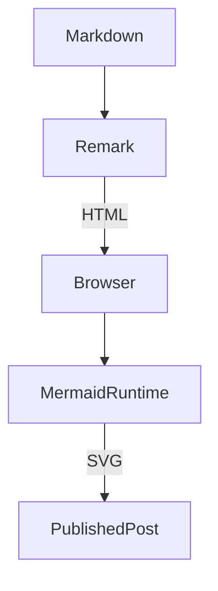
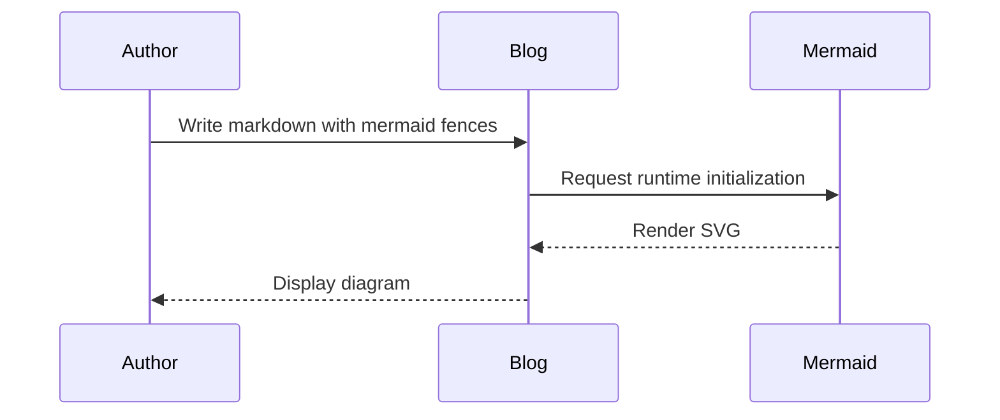
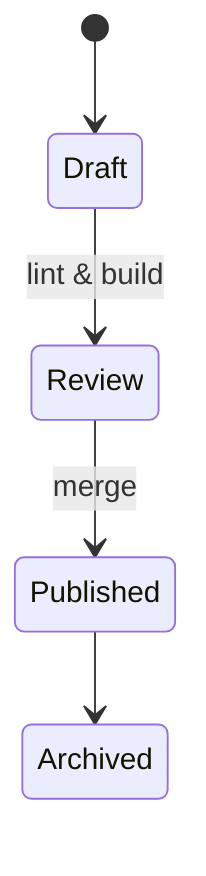
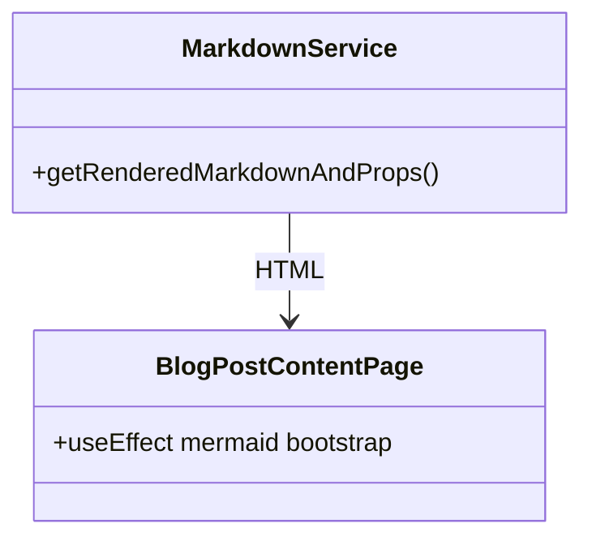

Co-authored with OpenAI Codex.

When I first built the blog, code fences and GitHub-flavored markdown were enough. Now that more of my architecture notes live here, I want inline diagrams that stay in sync with text. This post describes the small change I made to the rendering pipeline to support Mermaid diagrams without giving up the existing grey matter parsing.

## How the rendering works

The markdown loader still starts by parsing front matter with `gray-matter`, but the Remark pipeline now detects any fenced code block labeled `mermaid` and rewrites it into HTML with the `mermaid` class. When the blog post component hydrates on the client, it lazily imports the Mermaid runtime, initializes it, and asks it to render every `pre.mermaid` block. This keeps the static export simple while letting the browser convert diagrams to SVG after load.

The rest of the stack—table-of-contents generation, GFM extras, and the existing Prism syntax highlighting—continues unchanged. Posts that do not include a Mermaid fence keep working exactly as before.

# Mermaid feature walkthrough

Below are a few common diagram types I plan to use. Paste these snippets into any post and the blog will render them automatically.

## Flowchart

## Sequence diagram

## State diagram

## Class diagram

With this in place, I can embed quick sketches directly in the content without exporting PNGs or checking in binaries. The diagrams stay editable, versioned with the markdown, and render consistently alongside the rest of the post styling.
