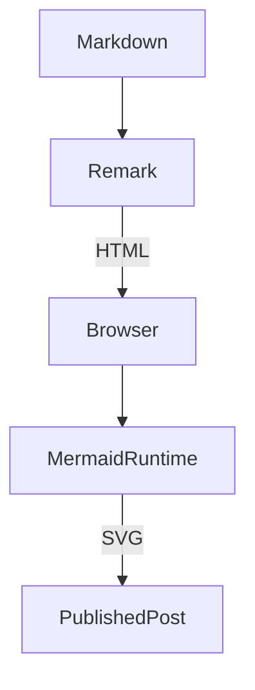
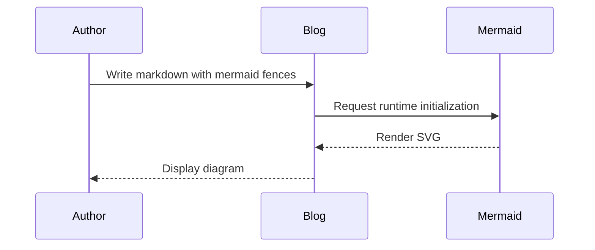
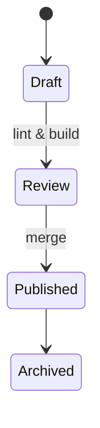
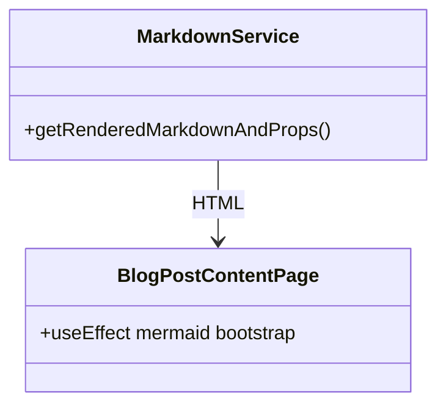

# (Aside) Leveraging AI for Blog Content
Most of this change was written by Codex, and finished up by Cursor. Cursor did a much better job actually running and fixing the errors in the build. When I joined Super.com, my current employer, I rewrote this entire blog in React to help me learn it. I'd been writing production code in Angular for years so at least it wasn't a big jump. I've picked at this blog over the years, but purely as an engine to keep my skills sharp since I'm a senior leader now and spend most of my days in meetings or planning technical and organizational strategy. This is the first blog post in a long time.

AI wrote the first draft. For the code, that was ok, took some iterating but it does that well now. The mermaid chart example is all AI. The actual writing style of AI makes my eyes glaze over though and I don't want to subject other people to it, so I rewrote basically all of the actual text here. I still use it for things like "prompt: add some reference links to the code here". I think that's the pattern I'll use moving forward too, no sense contributing too much towards a dead internet, right?

Have feeling about the idea of AI being used for this sort of thing? I'd love to hear your thoughts. You can find my socials on the about page. 

---

# How the rendering works

Take a look at the [official GitHUb page for Mermaid-JS](https://github.com/mermaid-js/mermaid) for more details about mermaid in general. It's really neat and I'm convinced will be considered the standard for flow charts for the next while.

The markdown loader still starts by parsing front matter with [`gray-matter`](https://github.com/jonschlinkert/gray-matter), but the Remark pipeline now detects any fenced code block labeled `mermaid` and rewrites it into HTML with the `mermaid` class (see the [remark pipeline in the repo](https://github.com/kylep/multi/tree/main/apps/blog/blog/lib/markdownToHtml.js)). When the blog post component hydrates on the client, it lazily imports the Mermaid runtime, initializes it, and asks it to render every `pre.mermaid` block ([hydration and Mermaid initialization code](https://github.com/kpericak/blog/blob/main/apps/blog/blog/components/BlogPostContentPage.js)). This keeps the static export simple while letting the browser convert diagrams to SVG after load. 

The rest of the stack—table-of-contents generation, GFM extras, and the existing Prism syntax highlighting—continues unchanged. Posts that do not include a Mermaid fence keep working exactly as before.

---

# Mermaid feature walkthrough

Here's a reference of how to use Mermaid in this platform and how it looks. I plan to use this reference myself for future content.

## Flowchart

## Sequence diagram

## State diagram

## Class diagram

With this in place, I can embed quick sketches directly in the content without exporting PNGs or checking in binaries. The diagrams stay editable, versioned with the markdown, and render consistently alongside the rest of the post styling.
