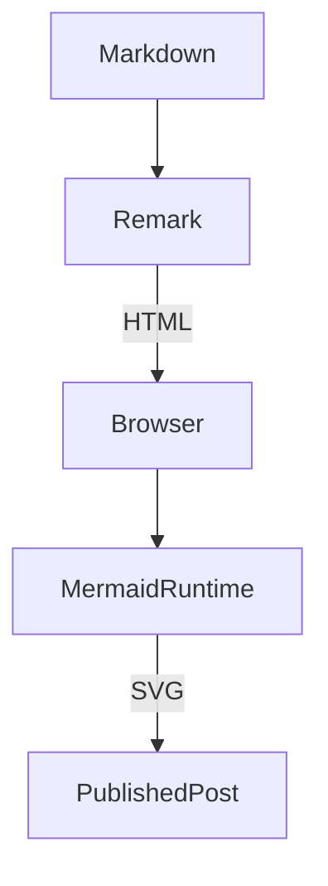
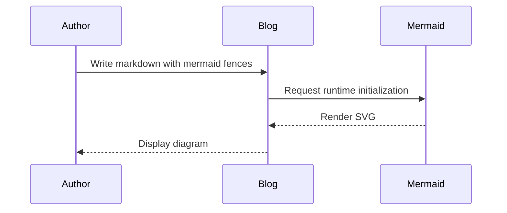
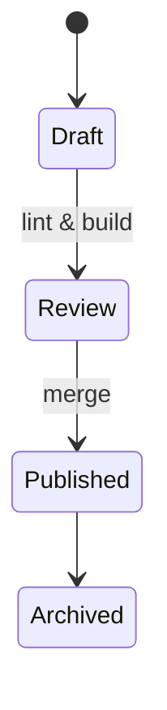
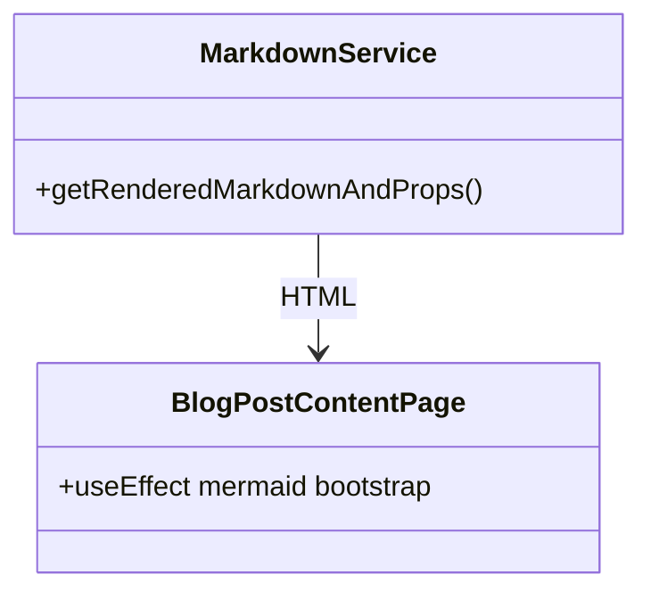

# (Aside) Leveraging AI for Blog Content
Most of this change was written by Codex, and finished up by Cursor. Cursor did a much better job actually running and fixing the errors in the build. When I joined Super.com, my current employer, I rewrote this entire SSG blog engine from Pelican into React + Next as a learning exercise. I'd been writing production code in Angular for years so it wasn't a big jump. I've picked at this blog over the years, but purely as an engine to keep my skills sharp since I'm a senior leader now and spend most of my days in meetings or planning technical and organizational strategy. This is the first blog post in a long time.

AI wrote the first draft. It was bad. For the code, that was ok. It took some iterating but AI codes well enough now if you hold its hand. 

The mermaid chart syntax example in this post is all AI. The actual writing style of AI makes my eyes glaze over and I don't want to subject other people to it, so I rewrote basically all of the actual text. No sense contributing too much towards a dead internet, right?

Have feeling about the idea of AI being used for this sort of thing? I'd love to hear your thoughts. You can find my socials on the about page. 


---

# How the rendering works

Take a look at the [official GitHUb page for Mermaid-JS](https://github.com/mermaid-js/mermaid) for more details about mermaid in general. It's really neat and I'm convinced it'll be considered the standard for flow charts for the next while.

The markdown loader still starts by parsing front matter with [`gray-matter`](https://github.com/jonschlinkert/gray-matter), but the Remark pipeline now detects any fenced code block labeled `mermaid` and rewrites it into HTML with the `mermaid` class. 

It's all pretty simple from there. You can see `remarkMermaidToHtml` (from [remarkMermaidToHtml in remarkMermaid.js](https://github.com/kylep/multi/blob/main/apps/blog/blog/utils/remarkMermaid.js)) is new here:

```javascript
	static async getRenderedMarkdownAndProps(rawMarkdown){
		// contentHtml is the rendered markdown, metaData is the front matter as a flat object
		const { data: metaData, content: markdown } = matter(rawMarkdown);
		MarkdownService.#serializeDates(metaData); 
                const result = await remark()
                        .use(remarkGfm)
                        .use(remarkToc, {heading: 'Table of contents'})
                        .use(remarkMermaidToHtml)
                        .use(remarkHtml, { sanitize: false })
                        .process(markdown);
		const contentHtml = result.toString();
		const props = {props: {contentHtml, metaData},};
		return props;
	 };
```

---


# Mermaid Syntax Reference


Here's a trivial reference of how to use Mermaid syntax. 


I plan to use this reference myself for future content, and may update it with more useful examples in time.


## Flowchart

```text
graph TD;
  Source[Markdown] --> Remark;
  Remark --> |HTML| Browser;
  Browser --> MermaidRuntime;
  MermaidRuntime --> |SVG| PublishedPost;
```



## Sequence diagram

```text
sequenceDiagram
  participant Author
  participant Blog
  participant Mermaid
  Author->>Blog: Write markdown with mermaid fences
  Blog->>Mermaid: Request runtime initialization
  Mermaid-->>Blog: Render SVG
  Blog-->>Author: Display diagram
```




## State diagram

```text
stateDiagram-v2
  [*] --> Draft
  Draft --> Review: lint & build
  Review --> Published: merge
  Published --> Archived
```



## Class diagram

```text
classDiagram
  class MarkdownService {
    +getRenderedMarkdownAndProps()
  }
  class BlogPostContentPage {
    +useEffect mermaid bootstrap
  }
  MarkdownService --> BlogPostContentPage : HTML
```



