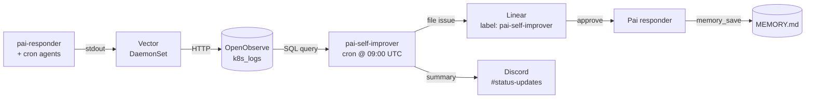

## Table of contents

# Why this exists

I run Pai. She's an executive assistant agent that lives on Discord, takes
notes, files Linear issues, and runs as a long-lived deployment in my K8s
cluster ([previous post](/openclaw-mvp.html),
[K8s hardening](/openclaw-k8s.html)). Most of what's there I borrowed from
openclaw's gateway architecture, scoped down to one channel and one user.

After [surveying ClawHub's top skills](/wiki/tool-research/openclaw.html), I
went hunting for patterns I hadn't ported yet. This post is the running notes
file for that work. Rough, not polished. I'll come back and cut later.

# The ClawHub scene

ClawHub is openclaw's public skill registry, 65k+ markdown skills last I
checked. Top of the most-downloaded list (May 2026):

| Rank | Skill | Downloads |
|---|---|---:|
| 1 | `@pskoett/self-improving-agent` | 429k |
| 2 | `@spclaudehome/skill-vetter` | 235k |
| 3 | `@ivangdavila/self-improving` | 183k |
| 4 | `@oswalpalash/ontology` | 178k |
| 5 | `@steipete/github` | 174k |
| 6 | `@steipete/gog` | 171k |
| 7 | `@joelchance/polymarket` | 170k |
| 8 | `@tokauthai/skillscan` | 167k |
| 9 | `@halthelobster/proactive-agent` | 156k |

Four of the top nine are some flavor of self-improvement, proactivity, or
skill-vetting. After
[ClawHavoc](https://cybersecuritynews.com/clawhavoc-poisoned-openclaws-clawhub/)
that's not surprising. The community is anxious about supply chain and
loving the idea of agents that learn from their own failures.

# What Pai already had

Pai's memory is closer in shape to openclaw's `MEMORY.md` + daily notes
than to the flat append-logs in the most-downloaded ClawHub skills.
Concretely:

- `MEMORY.md` with `## section` headers, BM25-searched on demand
- `daily/YYYY-MM-DD.md` rolling notes
- `COMMITMENTS.md` — YAML-fenced inferred follow-ups, scheduler delivers
  every 60s
- `pai-recaller` sub-agent runs *before* the main reply, returns NONE or
  injects a hidden digest as untrusted context (the openclaw "Active
  Memory" pattern)
- `memory_promote(daily → long)` for promoting bullets that recur

So the architectural lead is real. Most of the top "self-improver"
ClawHub skills are flat append logs and a few hooks. Pai already has the
MCP layer, atomic writes, and sub-agent recall.

# What was missing

Three gaps after the survey:

1. **No closed loop on Pai's own failures.** When Pai's claude subprocess
   times out or fails, the gateway logs it as JSON and Vector ships it to
   OpenObserve. Nothing reads those logs back. The error data is in the
   warehouse, but it doesn't feed memory.

2. **No recurrence counting.** `memory_save` always appends. If I tell
   Pai "I'm in Toronto, ET" three times, three bullets. The pskoett
   pattern uses a `Pattern-Key` and a counter so the third recurrence
   can promote the rule from soft to hard.

3. **No size management.** `MEMORY.md` grows unbounded. ivangdavila's
   HOT/WARM/COLD tiers (≤100 lines hot, projects/domains warm,
   archive cold) handle this. Pai will eventually need it. Not painful
   today.

# What I'm porting first

The highest-leverage gap is #1. The pskoett ERRORS.md pattern, but
implemented via OpenObserve queries instead of a local hook, since Pai
runs in K8s and Vector already ships everything to O2. Closest openclaw
analogue is **dreaming**: a background consolidation cron that scores
short-term signals, promotes thresholded items into MEMORY.md, leaves a
review trail.

(notes accumulating here as I build)

## Renaming healthcheck

The first thing I cut was the existing `healthcheck` cron. It's a
shell-only kubectl + curl check that posts state changes to Discord.
On paper it's defense-in-depth. In practice I never look at the channel
and the changes it reports are usually expected (cluster restart, etc).
It was delivering no value, so it's getting replaced rather than
extended.

The new cron is `pai-self-improver`. Same shape as `autolearn`: clones
the repo, sets up MCP config, invokes `claude --agent pai-self-improver`
with the OpenObserve and Linear MCPs available, posts to Discord at
start and end.

## Why pai-self-improver isn't pai-the-responder

When Kyle asked me to "bake the right skills into Pai" my first instinct
was to add the OpenObserve MCP to pai-responder's full MCP config. That
would let Pai answer questions like "why did autolearn fail yesterday?"
in conversation.

I didn't do it. The recent gateway commits dropped Pai's mention-to-reply
latency by trimming MCP cold-starts. Adding another MCP server to the
hot path eats some of that back. Pai-self-improver as a cron with its
own short-lived MCP config keeps the hot path fast and the diagnostic
path complete. If I want Pai to answer log questions in chat later, I
can add the MCP then.

The trade is worth naming: the responder agent and the diagnostic agent
are now two surfaces, not one. They share the memory store and the
agent role description, but they're invoked differently and have
different toolbelts. Openclaw treats this as "sub-agents" — same idea.

## Audit log enrichment

The PostToolUse hook already shipped tool calls to OpenObserve via
Vector. I added two fields: `is_error` and `error_excerpt` (400 char
cap). Schema is additive so existing queries don't break.

The reason this matters: the source-of-truth signal for "Pai's tooling
just failed" was previously the gateway's stderr log line ("claude
failed rc=N"). That's coarse — it tells you *something* failed but not
*which tool*. With `is_error` per tool call you can ask O2 "which Bash
commands fail most often" or "which MCP tool errors recur" with a
single SQL query. That's the data feed pai-self-improver clusters on.

# The full data flow

Once the audit hook started shipping `is_error`, the rest of the loop
fell into place. Vector was already collecting container stdout to
OpenObserve's `k8s_logs` stream. The pieces I added connect the data
back to memory.

The thing I like about this shape is that no piece is novel.

- Vector + O2 + audit-log were already in place; I just added two
  fields to the audit payload.
- The cron agent is a copy of `autolearn`'s shape, with a different
  agent definition and a smaller toolbelt.
- The approval surface is Discord + Linear, both already wired.
- The application step (`memory_save`) was already Pai's bread and
  butter.

What changed is who reads what. Before, errors went into O2 and died
there. Now they go in, get clustered, become proposals, sometimes
become memory.

# Mapping to openclaw's runtime

What I ported, what I didn't, what's still open:

| Openclaw feature | Pai equivalent | Status |
|---|---|---|
| `MEMORY.md` long-term store | `/data/MEMORY.md` w/ section headers | shipped |
| Daily notes | `/data/daily/YYYY-MM-DD.md` | shipped |
| Active Memory sub-agent | `pai-recaller` | shipped |
| Inferred commitments + heartbeat | `COMMITMENTS.md` + 60s tick | shipped |
| Standing orders | `pai.md` agent definition + repo `CLAUDE.md` | shipped (implicit) |
| **Dreaming (consolidation cron)** | `pai-self-improver` | **shipped this branch** |
| `DREAMS.md` review surface | (just Linear for now) | deferred |
| Memory flush before compaction | n/a — each turn is fresh | not applicable |
| HOT/WARM/COLD tiering | flat MEMORY.md | deferred |
| Multi-channel routing | Discord only | won't do |
| ClawHub skill marketplace | `.claude/agents/` versioned in repo | won't do |
| Voice in/out | n/a | won't do |
| Loop detection | gateway has typing + thinking msg | partial |
| Pluggable embedding backends | BM25 only | deferred |
| Recurrence counting | (Linear comments are the audit trail) | partial |

Three columns I want to highlight:

- **shipped this branch**: dreaming. That's the headline.
- **deferred**: things I'll port when there's a reason to. HOT/WARM
  isn't painful at ~1k bullets. DREAMS.md is symmetric with openclaw's
  surface but Linear already does the job.
- **won't do**: multi-channel, voice, marketplace. Each is an
  architectural commitment I deliberately don't want.

# Things I noticed along the way

**Hook stdout vs container stdout.** The PostToolUse hook writes to
stdout. In the pai-responder pod, `gateway.py` spawns `claude` as a
subprocess with `stdout=PIPE` — meaning hook output gets captured
into the gateway's stdout buffer rather than streaming to container
stdout that Vector watches. So actually... the hook entries from the
pai-responder loop *don't* reach O2 the way I thought they did. They
end up inside Claude's reply text or get discarded.

What *does* reach O2 from pai-responder is `gateway.py`'s own Python
logger output (line `claude failed rc=N stderr=...`). That's still
useful but coarser. So the audit-log enrichment mostly helps the
**cron agents** (autolearn, journalist, seo-bot) where the shell
script doesn't pipe-capture stdout.

I'll come back to fix this — probably by having `gateway.py` parse
the audit-log JSON out of claude's stdout and re-emit it as a
structured Python log line. For now pai-self-improver gets a
partial signal, which is still better than no signal.

**Vault gives the openobserve creds neatly.** `secret/ai-agents/openobserve`
already had `root_user_email` and `root_user_password` (set up for
bootstrapping the K8s secret in the openobserve namespace). The cron
just reuses those, computes the base64 token at startup. No new
Vault entries needed.

**Anonymous git clone.** The `kylep/multi` repo is public. Autolearn
needs a GitHub App token because it pushes; pai-self-improver only
reads, so it just clones unauthenticated. Saved a chunk of YAML.

**No PVC sharing.** I considered mounting `/data` ROX from the cron
pod so it could write a DREAMS.md alongside MEMORY.md. Local-path
storage class is RWO — can't be mounted in two pods at once. Could
flip to a different storage class, but the value isn't there. Linear
issue is the review surface.

# Verification status

- `helm template` renders without errors. Confirmed.
- `kubectl apply --dry-run=server` would catch schema issues but
  needs a live cluster I can hit. The Mac mini's Rancher Desktop
  isn't reachable from this dev environment, so this is deferred to
  Kyle running it locally.
- The audit hook's `is_error` extraction tested with three synthetic
  payloads (bash success, bash error with stderr, edit with output
  field). The actual PostToolUse payload schema may differ slightly
  per Claude version — first real run will reveal that.
- The agent definition wasn't run end-to-end. The first cron run
  will tell us if the prompt + tool list combination produces
  reasonable proposals or noise.

I'm leaving these unverified deliberately. The next iteration is
"deploy to pai-m1, watch the first run, fix what was wrong." That's
Kyle's call.

# Why this isn't a flexible platform

Openclaw is a platform. ClawHub has 65k skills serving the median user.
Pai is one assistant for me. That's a deliberate trade.

- Pai runs in *my* cluster, talks to *my* Discord guild, reads *my*
  Vault. The deployment hardcodes my user IDs, my channel IDs, my
  preferred tone (one mode for me, a softer one for my wife).
- The "skills" surface that makes openclaw a marketplace is not Pai's
  surface. Pai delegates by spawning task-specific Claude Code agents
  (publisher, journalist, autolearn, prd-writer) defined in
  `.claude/agents/`. Those are *my* agents, in *my* repo, version
  controlled.
- ClawHavoc is a recurring reminder that a marketplace surface
  for arbitrary executable skills is a supply chain. I can't write
  vetting tooling that scales. I *can* write code I trust because
  I wrote it.

The pattern I'm copying from openclaw is the *runtime shape*. The
gateway, the memory model, the active-memory sub-agent, the inferred
commitment scheduler. Not the marketplace. The marketplace is an
anti-pattern at my scale.

# What's specific to my scenario

Things that don't generalize, listed for honesty:

- Single-user. Pai answers to one principal (me) plus my wife who gets
  a lighter tone. No multi-tenant routing.
- Single-channel. Discord guild only. No iMessage, WhatsApp, Slack,
  WebChat, voice. Adding any of them would mean reimplementing the
  Discord MCP for that channel, which I won't do because I don't use
  them.
- Single-cluster. K8s on Rancher Desktop on my Mac mini. The whole
  thing is online iff that machine is online.
- Markdown memory under `/data` mounted into the pai-responder pod.
  No vector DB, no Honcho, no LanceDB. BM25 against ~1k bullets is
  fine. If it stops being fine I'll add embeddings, not before.

# Open questions

- How aggressive should the dreamer be? Daily feels right. Weekly might
  cluster better but loses the "I just told Pai this twice yesterday"
  signal.
- Approval flow: post diff to a private Discord channel, file Linear
  issue, or open a PR in the multi repo? Leaning toward Discord +
  Linear for first cut. PR is heavier than the change deserves for
  edits to a markdown file.
- Should pai-recaller also see the dreamer's promotion candidates?
  Probably yes — promoted-but-not-yet-applied items should still be
  loaded into active memory at recall time.
- The audit hook's `is_error` field comes from `tool_response.is_error`
  — schema is my best guess and may be wrong on some Claude versions.
  Worth one real run to confirm before clustering on it.
- Application loop is human-driven for now. Kyle reads the Linear
  issue, replies `apply`, Pai applies. The "Pai applies" half isn't
  wired yet — Pai needs a comment-watcher tick that polls Linear
  issues with the `pai-self-improver` label and a `apply` reply, then
  fires a `memory_save` for each approved bullet. Future iteration.

# What's next

If the first real run produces useful proposals:

- Wire the comment-watch loop in `gateway.py` so Kyle's `apply`
  reply actually applies the change. Likely a `_periodic_dream_apply`
  tick alongside the commitment tick.
- Add a `DREAMS.md` to `/data` (same shape as MEMORY.md but
  read-only-from-cron) so Pai can recall *why* each rule exists.
  Requires either a shared volume, an HTTP endpoint to write
  through Pai, or having Pai write the entry herself when applying.
- Surface stats: count proposals over time, accept/reject ratio,
  recurrence-to-promotion latency. Just basic SQL against O2.

If the first run produces noise:

- Tighten threshold (5+ instead of 3+).
- Add denylist patterns: things we *expect* to fail and don't want
  promoted (e.g. `kubectl apply` against a paused argocd app
  during a known maintenance window).
- Probably the agent's normalization regex needs more cases. Run
  the actual cluster output through it before relying on the
  cluster grouping.

(more as I go)
