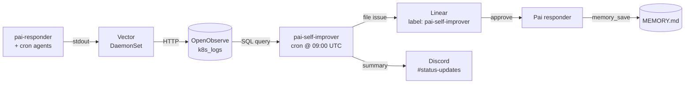

## Table of contents

# Why this exists

I run Pai. She's a personal Discord assistant for me and my wife, a
long-lived bot in K8s. She remembers things, files Linear issues,
delivers reminders, and reads pages I share with her.

Most of what makes Pai work I've borrowed from
[openclaw](/wiki/tool-research/openclaw.html). Openclaw is a
self-hosted multi-channel agent gateway with its own runtime,
memory model, scheduling, and skill registry. I'm not running it.
What I'm doing is reading its source and porting the parts that fit
my one-user, one-channel, K8s, no-API-billing setup.

This post is a tour of what got ported, why, and which good ideas I
intentionally skipped.

# Why not just run openclaw

Two reasons.

Openclaw supports OAuth subscription auth for OpenAI Codex but **not**
for Anthropic. To run Claude through openclaw I'd need an
`ANTHROPIC_API_KEY`, which means metered billing on top of the Max
plan I'm already paying for. The whole point of running my own
assistant is that I'm not buying API tokens twice.

Beyond that: openclaw is a platform. ClawHub is a 65k-skill
marketplace. The architecture is multi-tenant, multi-channel,
multi-provider, multi-everything. I have one user (and my wife on a
softer tone), one channel (Discord), one model (Sonnet via Claude
Code), one cluster (Rancher Desktop on a Mac mini in my office). The
flexibility costs me complexity I'd never use.

So I'm running [pai-responder](/wiki/agent-team/pai.html), a long-
lived `claude --agent pai` Deployment that talks to one Discord guild
and reuses the openclaw *patterns* without the openclaw *runtime*.

# The Pai before this branch

Pai existed before any of this. She had:

- A Python `gateway.py` listening on the Discord WS
- A flat-JSON memory MCP keyed by category
- Periodic review of unmentioned messages every 15 minutes
- Basic mention detection
- The `.claude/agents/pai.md` definition

What she didn't have:

- Active recall before each reply
- Markdown memory with daily notes or commitments
- A commitment scheduler
- Browser automation
- Reliable thread tracking
- Reconnect-time recovery for missed mentions

Pretty much every gap in that second list is something openclaw
already solves cleanly. So this branch is a port pass.

# What ported, by concept

- **Memory storage model**
    - OpenClaw has: plain markdown files in the agent workspace —
      `MEMORY.md` (durable, sectioned), `memory/YYYY-MM-DD.md` (daily
      notes auto-loaded for today + yesterday), `DREAMS.md` (optional
      promotion review surface).
    - Pai has: same shape under `/data/` on the pai-responder PVC —
      `MEMORY.md` with `##` section headers, `daily/YYYY-MM-DD.md`,
      and a `COMMITMENTS.md` for structured follow-ups (lives in
      `infra/ai-agents/pai-responder/helm/files/memory_mcp.py`). No
      `DREAMS.md` yet — Linear plays that role for now.

- **Memory search backend**
    - OpenClaw has: pluggable backends — Builtin SQLite, QMD (local
      reranking + query expansion), Honcho (cross-session user
      modeling), LanceDB (Ollama or OpenAI embeddings), memory-wiki
      (provenance-rich vault). Auto-detects OpenAI / Voyage / Mistral /
      Gemini for embeddings.
    - Pai has: builtin BM25 over the markdown files, with section
      headers folded into the searchable doc so subject tokens hit.
      No embeddings, no API keys, no second database. Sufficient for
      ~1k bullets; revisit if it stops being.

- **Active recall before each reply**
    - OpenClaw has: optional Active Memory plugin — a blocking
      sub-agent that runs *before* the main reply, queries memory, and
      returns either `NONE` or a hidden digest injected as untrusted
      system context. Tunable query mode and prompt style.
    - Pai has: `pai-recaller` sub-agent
      (`.claude/agents/pai-recaller.md`) spawned by `gateway.py`. Same
      contract: returns `NONE` or a 2-3 line digest prepended as an
      `<active_memory>` block on the main Pai prompt.

- **Heartbeat / commitment scheduler**
    - OpenClaw has: periodic main-session turn (default 30 min) that
      batches inbox / calendar / notification checks, plus *inferred
      commitments* — short-lived follow-ups scoped per agent and
      channel, delivered via the heartbeat.
    - Pai has: `_commitment_tick` in `gateway.py` running every 60s.
      Polls `COMMITMENTS.md` for entries with `status: pending AND
      due <= now` and spawns Pai to deliver each. No general 30-min
      heartbeat — Pai is event-driven on Discord mentions.

- **Browser automation**
    - OpenClaw has: real Chromium via the browser plugin — navigate,
      fill forms, login flows, content extraction, `web-readability`
      mode, plus a long list of search providers (Brave, Tavily, Exa,
      Firecrawl, Perplexity, etc.).
    - Pai has: Playwright MCP in `gateway.py`'s full MCP config, with
      a curated tool list: `browser_navigate`, `browser_snapshot`,
      `browser_take_screenshot`, `browser_click`, `browser_evaluate`,
      `browser_close`. No file_upload, no network_request, no
      drag/drop. Single search provider (Tavily, ad-hoc).

- **MCP cold-start strategy**
    - OpenClaw has: in-process plugins — extensions register at gateway
      boot and stay resident, so per-message latency doesn't pay
      registration cost.
    - Pai has: per-purpose MCP configs in `gateway.py` —
      `mcp-recall.json` (memory only), `mcp-deliver.json` (memory +
      Discord), `mcp-full.json` (all four). Each `claude --agent`
      invocation passes the smallest config it needs, with
      `--strict-mcp-config` so the CLI doesn't union with auto-
      discovered sources. Plus `CLAUDE_CODE_DISABLE_NONESSENTIAL_TRAFFIC=1`
      and `--disable-slash-commands` on every invocation.

- **Channel routing / thread tracking**
    - OpenClaw has: bindings map `(channel, accountId, peer)` tuples
      to one agent. Multi-account per channel, group access policies,
      mention-based activation, allowlists. Most-specific wins.
    - Pai has: one channel (Discord guild), one binding model.
      `gateway.py` auto-binds any thread where Pai herself posts (so
      she can create a thread in reply to a mention and follow-ups in
      that thread still register without a re-mention). Mention
      detection covers user mentions, the literal `<@id>` substring,
      and role mentions matching any role the bot itself holds.

- **Session resume on reconnect**
    - OpenClaw has: persistent session store, gateway-level resume,
      message catchup as a first-class feature.
    - Pai has: `_catchup` runs once per `on_ready`. Seals the most
      recent 20 messages older than 60s as already-processed, replays
      anything *newer* through `on_message`. So a mention sent during
      a pod rollout lands in `channel.history()`, gets picked up on
      connect, and gets a reply. Idempotent `processed_ids` set
      protects against the live gateway also redelivering.

- **Standing orders / persona**
    - OpenClaw has: per-agent `AGENTS.md` (operating rules), `SOUL.md`
      (voice and stance), `USER.md` (operator profile) — auto-loaded
      into the system prompt by the runtime.
    - Pai has: `.claude/agents/pai.md` (everything inline) plus the
      repo-level `CLAUDE.md`. Per-user factual content (Kyle, Kara,
      family, projects) lives in `MEMORY.md` and surfaces via recall
      rather than as a static persona file.

- **Slash command surface**
    - OpenClaw has: `/new`, `/reset`, `/stop`, `/exit`, `/verbose`,
      `/trace`, `/active-memory`, `/exec`, plus plugin-contributed
      slash commands.
    - Pai has: nothing. Every claude invocation passes
      `--disable-slash-commands` so even the descriptions don't
      enter context. Pai's surface is conversational only.

- **Dreaming / consolidation**
    - OpenClaw has: opt-in background cron that scores short-term
      memory signals, promotes thresholded items into `MEMORY.md`,
      writes a review surface in `DREAMS.md`. Includes a "grounded
      backfill" mode that replays historical daily notes through the
      same pipeline.
    - Pai has: `pai-self-improver` daily CronJob at 09:00 UTC
      (`infra/ai-agents/cronjobs/helm/templates/pai-self-improver.yaml`).
      Mines OpenObserve for tool failures and gateway errors over the
      last 24 hours, clusters by normalized signature, posts proposals
      to a Linear issue with the `pai-self-improver` label and a
      Discord summary. Read-only against `MEMORY.md` — nothing applies
      automatically.

- **Per-tool audit / observability**
    - OpenClaw has: per-run trajectory logs, command audit hook,
      session transcripts on disk, opt-in OpenTelemetry and Prometheus
      exporters.
    - Pai has: PostToolUse hook (`.claude/hooks/audit-log.sh`) emits
      structured JSON per tool call — `timestamp`, `tool`, `input`,
      `is_error`, `error_excerpt` — to container stdout. Vector
      DaemonSet ships container stdout to OpenObserve's `k8s_logs`
      stream. `pai-self-improver` queries it with SQL.

## What I intentionally skipped

- **ClawHub skill marketplace**
    - OpenClaw has: 65k+ markdown skills published with `SKILL.md` +
      YAML frontmatter, vector search, semver tracking, optional
      `clawhub` CLI for publishing.
    - Why I skipped: ClawHavoc in February 2026 distributed Atomic
      macOS Stealer through 1,184+ malicious skills. Publishing
      requires only a one-week-old GitHub account; no signing,
      sandboxing, or human review. I write my own agents in
      `.claude/agents/`, version-controlled, in a repo I read.

- **SOUL.md / AGENTS.md / USER.md persona split**
    - OpenClaw has: three separate persona files auto-injected into
      every session by the runtime.
    - Why I skipped: Claude Code doesn't auto-inject sub-files; Pai
      would `Read` them every turn at token cost. Slow-changing
      curated content fits inline in `pai.md`, and per-user factual
      content already lives in `MEMORY.md`.

- **Multi-channel (iMessage, Slack, WhatsApp, voice, etc.)**
    - OpenClaw has: 22+ messaging surfaces — Discord, Telegram,
      Signal, iMessage, WhatsApp, Slack, Google Chat, IRC, WebChat
      built-in; Matrix, Nostr, Teams, Twitch, etc. as bundled
      plugins.
    - Why I skipped: I only use Discord. Adding any other channel
      means reimplementing the per-channel MCP for that surface.

- **Pluggable embedding backends (Honcho, LanceDB, QMD, memory-wiki)**
    - OpenClaw has: pluggable memory layer with optional reranking,
      cross-session user modeling, and provenance-rich vault
      compilation.
    - Why I skipped: every option needs API keys → metered billing,
      which violates the no-API-billing constraint of running on
      Claude Max OAuth. BM25 is enough for hundreds of bullets.

- **Lobster typed-workflow runtime**
    - OpenClaw has: typed in-process workflow shell — pipelines as
      JSON data with explicit approval checkpoints, resume tokens,
      determinism, baked-in safety policy.
    - Why I skipped: Pai doesn't have a multi-step pipeline that's
      earned an abstraction. Each interaction is a single Claude turn
      plus tool calls. Revisit if I get a workflow that's actually
      multi-step and side-effecting.

- **Image / video / music generation**
    - OpenClaw has: outbound generation via FAL, ComfyUI, Runway,
      multi-provider TTS (ElevenLabs, Azure, Inworld, sherpa-onnx,
      MLX local), nano-banana-pro, plus inbound transcription via
      Whisper.
    - Why I skipped: not a use case for an executive assistant.
      Generation lives in other tools (image gen for the blog has
      its own workflow).

- **Sandboxing per-agent Docker containers**
    - OpenClaw has: optional Docker-per-agent isolation modes,
      configurable scopes, exec-approval modes (`ask`, `allowlist`,
      `full`), wrapper-command unwrapping for allowlist matching.
    - Why I skipped: Pai is one process for one user. Sandboxing
      Pai's tools from Pai herself doesn't add a meaningful
      protection boundary. K8s pod isolation + Vault-issued tokens
      are the security layer.

## Deferred, not skipped

- **Sub-agent orchestration**. Letting Pai dispatch other agents
  (publisher, prd-writer, etc.) the way openclaw does multi-agent
  routing. Tier 2.
- **Memory-wiki layer**. Openclaw can compile durable memory into a
  provenance-rich vault with claims and freshness. Worth it once
  `MEMORY.md` outgrows manual curation.
- **HOT/WARM/COLD tiered memory**. Not painful at ~1k bullets.

# Markdown memory MCP

Pai's memory used to be flat JSON keyed by category, searched with
substring matching. Worked OK for "what's Kyle's GitHub username" but
fell over on anything fuzzier. The replacement is three markdown
files exposed via a typed MCP:

```
/data/MEMORY.md             ## Sectioned long-term facts
/data/daily/YYYY-MM-DD.md   Rolling daily notes
/data/COMMITMENTS.md        YAML-fenced follow-ups
```

A `COMMITMENTS.md` block looks like this:

```markdown
---
id: c-2026-05-08-001
status: pending
precision: precise
due: 2026-05-08T19:00:00Z
scope: channel:1482815120000000000
created: 2026-05-08T14:00:00Z
source: turn-2026-05-08T13:55Z
---
Remind Kyle about the dentist appointment at 3 PM.
```

The MCP exposes `memory_save / memory_search / memory_recall /
memory_get / memory_list / memory_commitment_due /
memory_commitment_done / memory_promote`. Implementation is one
~550-line Python file with atomic writes and a tiny YAML reader for
commitment blocks.

## Why wrap markdown in an MCP rather than have Pai use Read/Glob/Grep

Two reasons.

The typed contract reduces prompt fragility. Pai writes
`memory_save(scope='commitment', content='...', due='...')` instead
of having to remember the YAML format and the file path. Less
malformed entries, less reasoning load.

And the commitment lifecycle needs `memory_commitment_due` /
`memory_commitment_done` semantics anyway. Encoding those as MCP
calls keeps the file format an implementation detail. The user-
visible files stay plain markdown, auditable and inspectable without
the MCP running.

## Section-aware indexing

A bullet under `## Kyle` saying *"prefers TypeScript over
JavaScript"* is invisible to a query like *"what language does Kyle
prefer?"* because no token in the bullet overlaps the query. So the
indexer folds the section header into the searchable doc. The
indexed text becomes `"Kyle: prefers TypeScript over JavaScript"`,
which both BM25-hits the query and reads as a self-contained fact
when the recaller surfaces it.

Caught this during the M1 production smoke test on 2026-05-09.
Without section folding, half of Pai's recalls came back NONE on
queries that any human reading `MEMORY.md` would have answered
correctly.

# Active Memory → pai-recaller

Openclaw's "Active Memory" plugin is a blocking sub-agent that runs
*before* the main reply, queries memory, and returns either `NONE` or
a focused digest injected as untrusted context. The pattern translates
cleanly to Claude Code as a separate `claude --agent` invocation.

```
Discord mention
   ↓
gateway.py spawns: claude --agent pai-recaller
   ↓
recaller calls memory_recall, returns "NONE" or 2-3 line digest
   ↓
gateway.py spawns: claude --agent pai
  with <active_memory>...</active_memory> prepended to the prompt
   ↓
Pai replies in Discord
```

The recaller's tool list is intentionally tight: only
`mcp__pai-memory__memory_recall`, `memory_search`, `memory_get`. No
Discord, no Linear, no web. Its job is to decide if memory is
relevant and write a 2-3 line digest if so.

## Why a separate `claude` invocation rather than Pai's `Agent` tool

Adding the `Agent` tool to Pai gives it general agent-spawning. That
opens the door to multi-agent orchestration (the
[org-chart vision](/agent-org-chart.html)) which is its own scope and
deliberately deferred.

A separate `claude` invocation orchestrated by `gateway.py` keeps
Pai's tool surface tight. It also makes recall reusable in other
contexts (cron jobs, periodic reviews) without having to funnel them
through Pai.

## Why Sonnet, not Haiku, for the recaller

Haiku is cheaper, but the recaller's job (decide if memory is
relevant, write a 2-3 line digest) needs decent judgment. Sonnet is
fast enough (~5-10s in steady state), and Max plan doesn't bill per
token. If the recaller becomes rate-limit pressure later I'll
revisit.

## The cold-start fight

Every `claude --agent` subprocess on the lima VM was eating 5-30s of
cold-start before producing tokens. For the recaller specifically,
this was painful: a memory query that should be a few seconds was
spending most of its time loading Playwright + Linear + Discord MCPs
just to ignore them.

Three changes landed:

1. **Per-purpose MCP configs.** `gateway.py` writes three files at
   startup:
   - `mcp-recall.json` — memory only
   - `mcp-deliver.json` — memory + Discord (commitment delivery)
   - `mcp-full.json` — all four (main Pai)
   Each invocation passes the smallest config it needs, with
   `--strict-mcp-config` so the CLI doesn't union it with whatever
   it auto-discovers from `~/.claude.json`.
2. **`CLAUDE_CODE_DISABLE_NONESSENTIAL_TRAFFIC=1`.** Single official
   knob that disables autoupdate checks, telemetry, error reporting,
   and feedback surveys.
3. **`--disable-slash-commands`** on every claude invocation. The
   project has skills the bot will never use; skipping the
   description-load is a freebie.

Recaller cold-start dropped the most. Adding `mcp__playwright` and
`mcp__linear` to the recaller config when the recaller never calls
either is the kind of thing that's invisible until you measure.

## Token economics under Max

Per Discord turn:

- Recaller: ~2k input + ~50 output ≈ 2.05k tokens
- Main Pai: ~3-5k input + 200-2000 output ≈ ~5k tokens average
- **Total**: ~7k tokens/turn

Compare to a hypothetical "read all memory at the top of every
prompt" approach: 6-9k tokens/turn at small memory sizes, growing
linearly as `MEMORY.md` grows. The recaller is break-even today and
gets cheaper as memory grows.

# Commitment scheduler

A new asyncio task in `gateway.py`: `_commitment_tick`. Every 60
seconds, read `COMMITMENTS.md`, find entries where `status: pending
AND due <= now`, spawn Pai to deliver each.

```python
async def _commitment_tick(self):
    while not self.is_closed():
        await asyncio.sleep(60)
        for cmt in store.commitments_due():
            await self._deliver_commitment(cmt)
```

For each due commitment, Pai gets spawned with a tight tool list
(`send_message`, `create_thread`, `memory_commitment_done`) and
posts the reminder, then marks the commitment delivered.

## Why 1-minute resolution

A min-heap is more efficient asymptotically. Pai will never have
more than a few dozen pending commitments. A 60-second loop is
trivially correct, zero-cost when the queue is empty, and adds zero
new failure modes. The heap would add bug surface for no real win.

## Why this lives in pai-responder, not a CronJob

A K8s CronJob with a 1-minute schedule is a pod startup tax every
minute (image pull, vault inject, Claude OAuth handshake). The
existing pai-responder pod is already running and authenticated;
adding an asyncio task to it costs nothing per tick when no
commitments are due.

For zero-or-one-times-per-day work (morning greeting, weekly
review), CronJobs are still the right shape. They're separate
patterns serving different cadences.

## Precise vs. soft commitments

Each commitment has a `precision` field: `precise` or `soft`.
*Precise* is for explicit "remind me at..." requests. *Soft* is for
inferred follow-ups ("you have an interview tomorrow at 2 → check in
after").

Same delivery loop handles both. The field is metadata for Pai —
she uses it to format the message ("20-minute reminder:" vs. "How
did the interview go?"). Branching on precision in `gateway.py`
would mean two delivery paths to maintain.

# The reliability work

Half the gateway commits in this branch are bug fixes I caught
during the M1 production rollout. Boring but worth flagging because
they're the kind of thing openclaw already solves and that you only
discover in production.

## Catchup on reconnect

`_catchup` runs once per `on_ready`. Two jobs:

1. **Seal old messages.** For each text channel, the most recent 20
   messages older than 60 seconds get marked as already-processed.
   Without this, Discord gateway resume events could replay and Pai
   would double-reply.
2. **Replay recent missed messages.** Anything *newer* than the
   cutoff is left unmarked and dispatched through `on_message` in
   chronological order. So a mention sent during a pod rollout
   lands in `channel.history()`, gets picked up on connect, and
   gets a reply.

Discovered this the hard way during the 2026-05-09 deploy. The old
"mark last 20, period" logic silently dropped mentions during the
rollout window. The idempotent `processed_ids` check protects
against the live gateway also redelivering the same message.

## Auto-bind threads where Pai posts

Threads previously got bound only when Pai was @-mentioned *inside*
the thread. But Pai often *creates* a thread itself (via the Discord
MCP) to reply to a mention in the parent channel. That fresh thread
never sees a mention and never gets bound, leaving follow-ups in it
silently ignored.

`on_message` now also binds any thread where Pai herself posts
(detected via `msg.author.id == self.bot_user_id` and
`isinstance(msg.channel, discord.Thread)`). Caught when a follow-up
question in a Pai-created thread sat unanswered for an hour.

## Mention detection: user *and* role

Discord supports two distinct mention forms: user mentions (`<@id>`)
and role mentions (`<@&id>`). When a server has *both* a user named
X and a role named X (Pai's case — the bot user "Pai" plus a "Pai"
role granted to the bot), Discord's `@Pai` autocomplete picks the
**role**. discord.py exposes user mentions in `msg.mentions` but
role mentions in `msg.role_mentions` — separate lists.

`_is_mention` returns true if any of:

1. The bot user is in `msg.mentions` (direct user mention)
2. The literal `<@bot_user_id>` substring is in `msg.content`
3. Any role in `msg.role_mentions` is one the bot itself holds in
   that guild

Without rule 3, `@Pai`-via-role-autocomplete fell through to
periodic-review buffering — no ack, no reply. Caught during the M1
deploy when @-completing "Pai" stopped triggering the bot.

## Typing indicator covers the full pipeline

`async with channel.typing():` lives in `_process_session`,
wrapping both `recall_for` and `invoke_claude`. Earlier the typing
context was only inside `invoke_claude`, which meant users saw
nothing for the duration of the recaller call (default 60s
timeout). On a small VM the recaller cold-start is slow enough that
this looked like the bot wasn't seeing the message.

Outer-pipeline typing gives users a visible "..." within ~1s of
mentioning, regardless of recaller speed.

# Dreaming → pai-self-improver

The most recent piece. Openclaw's "dreaming" feature is a background
consolidation cron that scores short-term signals, promotes
thresholded items into `MEMORY.md`, leaves a review trail in
`DREAMS.md`. Same idea, K8s flavor.

The data was already in OpenObserve. Vector ships every container's
stdout to the `k8s_logs` stream. Pai's gateway logs JSON; cron
agents (autolearn, journalist, seo-bot) emit structured tool-call
records via the audit hook. So the missing piece was something that
reads those logs back, clusters, proposes.



`pai-self-improver` is a daily CronJob modeled on `autolearn`.
Anonymous git clone, an MCP config with OpenObserve + Discord +
Linear servers, runs `claude --agent pai-self-improver`, posts to
Discord at start and end. Cap is five proposals per run. Threshold
is three or more recurrences in 24 hours. Anything under is noise.

It's read-only against `MEMORY.md` — proposals go to Linear with
the `pai-self-improver` label. Kyle approves a proposal by replying
`apply` (or `apply 1,3` for a subset), and Pai's responder applies
the bullet via `memory_save`.

The application-side comment-watcher in pai-responder is **not yet
wired** in this branch. Today the loop is: cron files Linear issue
→ Kyle reads → Kyle either applies manually or asks Pai in chat.
That's deliberate first-cut scope.

## Audit hook enrichment

For pai-self-improver to cluster on per-tool failures, the audit log
needs to actually carry that signal. The PostToolUse hook already
shipped tool calls to OpenObserve via Vector. I added two fields:

- `is_error` (bool, from `tool_response.is_error`)
- `error_excerpt` (up to 400 chars of `stderr` / `output` / `error`)

Schema is additive so existing queries don't break.

## The honest hook-stdout finding

`gateway.py` spawns claude with `stdout=PIPE`. The PostToolUse hook
writes JSON to stdout. So in the pai-responder pod, hook output
gets captured into the gateway's stdout buffer rather than streaming
to container stdout that Vector watches.

Translation: the per-tool audit data from *pai-responder* doesn't
reach OpenObserve the way I'd assumed. What does reach O2 from
pai-responder is `gateway.py`'s own Python logger output — useful,
but coarser-grained.

The audit-log enrichment still helps the **cron agents**
(autolearn, journalist, seo-bot) where the shell entry-point
doesn't pipe-capture stdout, and the hook does stream through. The
fix for pai-responder is to have `gateway.py` extract audit-log JSON
out of claude's captured stdout and re-emit as a Python log line.
Future iteration.

## Why pai-self-improver isn't pai-the-responder

When I started I wanted to add the OpenObserve MCP to
pai-responder's full MCP config. That would let Pai answer "why did
autolearn fail yesterday?" in chat.

I didn't do it. The cold-start fight just trimmed Pai's mention-to-
reply latency. Adding another MCP server to the hot path eats some
of that back. The cron has its own short-lived MCP config that goes
away after the run.

If a conversational diagnostic surface ever feels needed, a slim
`pai-diagnostics` sub-agent (modeled on pai-recaller) is the right
shape — load O2 MCP only when invoked, exit fast. Tier 2.

# What's still open

A few unverifieds that need a real run on pai-m1:

- The `is_error` field comes from `tool_response.is_error` —
  schema is my best guess and may differ slightly per Claude
  version. First real cron run will tell us.
- The application loop is half-wired: cron files proposals; Pai
  doesn't yet auto-apply on `apply` reply. Next iteration.
- Section-aware indexing was caught in production, but the BM25
  scorer hasn't been measured against a realistic memory corpus.
  At ~1k bullets it's cheap; at 10k it might want tuning.

A few open design questions:

- Should `pai-recaller` see pending self-improver proposals so
  promoted-but-not-yet-applied items still influence active memory?
  Probably yes.
- Should pai-self-improver write a `DREAMS.md` to `/data` so Pai
  can recall *why* a rule exists? Requires either PVC sharing or
  having Pai write the entry herself when applying. Symmetric with
  openclaw, but Linear is doing the job today.
- How aggressive should the dreamer be? Daily fits the rhythm I
  notice things ("I just told Pai this twice yesterday"). Weekly
  might cluster better.

# What's not changing

Two things I keep getting tempted to add and keep deciding against.

**No `SOUL.md` / `AGENTS.md` / `USER.md` persona split.** Openclaw
auto-injects these because its agent runtime owns the prompt. Claude
Code doesn't, so reading them every turn costs tokens. Slow-changing
curated content fits in `pai.md`; per-user factual content lives in
`MEMORY.md` and surfaces via recall. That's actually closer to what
`USER.md` is supposed to do.

**No skill marketplace.** [ClawHavoc](https://cybersecuritynews.com/clawhavoc-poisoned-openclaws-clawhub/)
in February 2026 distributed [Atomic macOS Stealer](https://www.trendmicro.com/en_us/research/26/b/openclaw-skills-used-to-distribute-atomic-macos-stealer.html)
through 1,184+ malicious skills published with no signing, sandboxing,
or human review. ClawHub publishing requires a one-week-old GitHub
account, which is the supply chain. I can't write vetting tooling that
scales. I *can* write code I trust because I wrote it. Pai delegates
to task-specific Claude Code agents (publisher, journalist,
prd-writer, autolearn) that live in `.claude/agents/`, version-
controlled, reviewed by me.

# Where the code lives

For anyone reading along:

- Agent definitions: `.claude/agents/{pai,pai-recaller,pai-self-improver}.md`
- Memory MCP: `infra/ai-agents/pai-responder/helm/files/memory_mcp.py`
- Migration script (flat-JSON → markdown): `infra/ai-agents/pai-responder/helm/files/migrate.py`
- Memory tests: `infra/ai-agents/pai-responder/tests/`
- Gateway: `infra/ai-agents/pai-responder/helm/files/gateway.py`
- Audit hook: `.claude/hooks/audit-log.sh`
- Self-improver cron: `infra/ai-agents/cronjobs/helm/templates/pai-self-improver.yaml`
- Design doc with full rationale: [wiki/design-docs/pai-improvements](/wiki/design-docs/pai-improvements.html)
- Openclaw inventory I cribbed from: [wiki/tool-research/openclaw](/wiki/tool-research/openclaw.html)
- Pai readme: [apps/pai/README.md](https://github.com/kylep/multi/blob/main/apps/pai/README.md)
