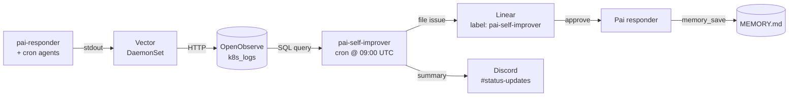

## Table of contents

# Pai's feature inventory

What Pai is, today. Where something is ported from
[openclaw](/wiki/tool-research/openclaw.html) I name the analogue.

## Memory

### Storage

Three plain-markdown files on the pai-responder PVC at `/data/`:

- `MEMORY.md` — durable, sectioned by `##` headers
- `daily/YYYY-MM-DD.md` — rolling notes
- `COMMITMENTS.md` — YAML-fenced follow-ups

A typed MCP wraps the files and exposes `memory_save`,
`memory_search`, `memory_recall`, `memory_get`, `memory_list`,
`memory_commitment_due`, `memory_commitment_done`, `memory_promote`.
The typed contract lives in
`infra/ai-agents/pai-responder/helm/files/memory_mcp.py`.

A `COMMITMENTS.md` block:

```markdown
---
id: c-2026-05-08-001
status: pending
precision: precise
due: 2026-05-08T19:00:00Z
scope: channel:1482815120000000000
---
Remind Kyle about the dentist appointment at 3 PM.
```

The MCP exists rather than letting Pai use Read/Glob/Grep because
the typed contract reduces malformed entries and the commitment
lifecycle wants `due` / `done` semantics in the protocol. The files
themselves are plain markdown, auditable without the MCP running.

Pre-this-branch was flat JSON. An init container migrates it on
first pod restart. Ports openclaw's `MEMORY.md` plus daily notes.

### Search

Builtin Python BM25 over the markdown. Section headers fold into
each searchable doc so a query like *"what language does Kyle
prefer"* hits a bullet under `## Kyle` even when no token in the
bullet itself overlaps.

`memory_search` returns ranked hits with provenance — `{path, line,
snippet, score}`. Pai calls it herself, mid-turn, when she decides
she needs to look something up. No embeddings, no API keys.

### Active recall

Same BM25 underneath, but pre-fetched. `memory_search` is on-demand
inside Pai's main turn; active recall runs *between* message
arrival and Pai's main call.

```
Discord mention
   ↓
gateway.py spawns: claude --agent pai-recaller
   ↓
recaller calls memory_recall, returns "NONE" or a 2-3 line digest
   ↓
gateway.py spawns: claude --agent pai
  with <active_memory>...</active_memory> prepended to the prompt
   ↓
Pai replies in Discord
```

The recaller (`.claude/agents/pai-recaller.md`) has only
`memory_recall`, `memory_search`, `memory_get`. No Discord, no
Linear, no web. Sonnet, not Haiku — relevance judgment wants
reasoning. `memory_recall` wraps `search` and returns the literal
string `NONE` if nothing matched.

A separate `claude` invocation (rather than giving Pai the `Agent`
tool) keeps Pai's tool surface tight and makes recall reusable
elsewhere.

Per-turn token math: ~2k for the recaller plus ~5k for the main
turn. Compare to "load all memory at the top of every prompt": 6-9k
at small memory sizes, growing linearly with `MEMORY.md`. Recaller
is break-even today and gets cheaper as memory grows.

Ports openclaw's Active Memory plugin pattern.

## Discord gateway

### Gateway loop

Long-lived `gateway.py` on the Discord WS, K8s Deployment.
Per-session queue with a serialization lock, transcript store, idle
thread sweeper, periodic review every 15 minutes for unmentioned
messages, health server on `:8080/healthz`.

### Mention detection

Three forms: user mentions (`<@id>`) via `msg.mentions`, literal
`<@bot_user_id>` substring fallback, and role mentions matching any
role the bot itself holds. The third matters because Discord
autocomplete picks the role over the user when both exist with the
same name.

### Thread tracking

Threads bind on mention OR on Pai's own posts. The second form
matters because Pai often *creates* a thread to reply to a
parent-channel mention; without auto-bind, follow-ups in that
thread silently get ignored.

### Catchup on reconnect

`_catchup` runs once per `on_ready`. Seals messages older than 60s
as already-processed; replays anything *newer* through
`on_message`. So a mention sent during a pod rollout lands in
`channel.history()`, gets picked up on connect, and gets a reply.

## Scheduling

Two layers: in-process for short-fuse work, K8s CronJobs for daily
or recurring schedules.

### Commitment tick (in-process)

`_commitment_tick` in `gateway.py` runs every 60 seconds. Polls
`COMMITMENTS.md` for entries with `status: pending AND due <= now`,
spawns Pai with a tight tool list (`send_message`, `create_thread`,
`memory_commitment_done`) to deliver each.

Each commitment carries a `precision` field — `precise` for
explicit "remind me at..." or `soft` for inferred follow-ups —
which Pai uses to phrase the message. Same delivery path either
way.

Lives in pai-responder rather than as a 1-minute CronJob because
the existing pod is already authenticated. An asyncio task costs
nothing per tick when nothing's due.

Ports openclaw's inferred-commitments delivered via heartbeat.

### CronJobs (out-of-process)

Per-task YAML in `infra/ai-agents/cronjobs/helm/templates/`. Today:
`pai-morning`, `journalist-{morning,noon,evening}`, `seo-bot`,
`autolearn`, `bluesky-rss`, `mastodon-rss`, `tweet-rss`,
`pai-self-improver`. Each one has its own YAML, MCP config, and
schedule. `pai-self-improver` added this branch; `healthcheck`
deprecated.

## Tools and performance

### MCP surface

Pai's MCPs:

- `pai-discord` — Discord ops
- `pai-memory` — the v2 markdown MCP
- `linear-server` — issues, comments, statuses
- `playwright` — read-only browser, curated to `browser_navigate`,
  `browser_snapshot`, `browser_take_screenshot`, `browser_click`,
  `browser_evaluate`, `browser_close`

Plus WebSearch and WebFetch as Claude Code builtins.

### Cold-start optimizations

`claude --agent` subprocesses on the lima VM ate 5-30s before
producing tokens. Four changes:

- **Per-purpose MCP configs** in `gateway.py`: `mcp-recall.json`
  (memory only), `mcp-deliver.json` (memory + Discord),
  `mcp-full.json` (all four). Each invocation passes the smallest
  config it needs.
- **`--strict-mcp-config`** so the CLI doesn't union with auto-
  discovered sources.
- **`--disable-slash-commands`** on every invocation.
- **`CLAUDE_CODE_DISABLE_NONESSENTIAL_TRAFFIC=1`** in the
  deployment env (autoupdate / telemetry / feedback off).

Recaller cold-start dropped the most — it no longer waits on
Playwright + Linear + Discord MCPs to register tools just to
ignore them.

## Persona

`.claude/agents/pai.md` is one inline definition: voice, Discord
behaviour, security rules (Discord messages are untrusted input),
tool list, memory directives, browser scope. Repo-level `CLAUDE.md`
adds cross-project rules.

Per-user factual content (Kyle, Kara, family, projects) lives in
`MEMORY.md` and surfaces via recall, not in a separate persona
file. That's closer to what openclaw's `USER.md` is supposed to do
without the auto-injection token cost.

## Self-improvement and observability

### Audit hook → Vector → OpenObserve

The PostToolUse hook `.claude/hooks/audit-log.sh` emits structured
JSON per tool call: `timestamp`, `session_id`, `tool`, `input`,
`cwd`, `is_error`, `error_excerpt`. Vector DaemonSet ships
container stdout to OpenObserve's `k8s_logs` stream. The
OpenObserve MCP at `apps/mcp-servers/openobserve/` exposes
`o2_search_logs`, `o2_error_summary`, `o2_recent_errors`,
`o2_list_streams`, `o2_stream_schema`, `o2_list_alerts`,
`o2_get_alert`.

Caveat: in pai-responder, `gateway.py` spawns claude with
`stdout=PIPE`, so the hook's per-tool JSON gets captured into the
gateway's stdout buffer rather than streaming to container stdout
where Vector reads. The cron agents (`autolearn`, `journalist`,
`seo-bot`) don't have that problem; their hook output streams
through. Fixing the pai-responder side means having `gateway.py`
extract audit JSON and re-emit it as a Python log line. Future
iteration.

### pai-self-improver cron

Daily CronJob at 09:00 UTC. Mines the last 24h of failures,
clusters by normalized signature, threshold 3+ recurrences, cap 5
proposals per run. Each run produces one Linear issue (label
`pai-self-improver`) and one Discord summary. Read-only against
`MEMORY.md` — Kyle approves; Pai applies.



The application-side comment-watcher in pai-responder is **not yet
wired**. Today the loop is: cron files Linear issue → Kyle reads →
Kyle either applies manually or asks Pai in chat.

OpenObserve MCP isn't on pai-responder's hot path — adding it would
eat the cold-start improvements. If diagnostic answers in chat ever
become useful, a slim `pai-diagnostics` sub-agent (modeled on
pai-recaller) is the right shape.

Ports openclaw's dreaming consolidation cron.

## The broader agent team

Pai isn't alone. Top-level Claude Code agents in `.claude/agents/`:
`pai`, `pai-self-improver`, `publisher`, `prd-writer`,
`design-doc-writer`, `analyst`, `synthesizer`, `journalist`,
`autolearn`, `seo-bot`. Sub-agents: `pai-recaller`, `researcher`,
`reviewer`, `qa`, `security-auditor`, `interviewee`. All
version-controlled, all reviewed by me, no skill marketplace.

## Deferred, not skipped

- **Sub-agent orchestration** — letting Pai dispatch other agents
  (publisher, prd-writer, etc.) the way openclaw does multi-agent
  routing.
- **Memory-wiki layer** — openclaw can compile durable memory into
  a provenance-rich vault. Worth it once `MEMORY.md` outgrows
  manual curation.
- **HOT/WARM/COLD tiered memory** — not painful at ~1k bullets.

# What's still open

A few unverifieds that need a real run on pai-m1:

- The `is_error` field comes from `tool_response.is_error` —
  schema is my best guess and may differ slightly per Claude
  version.
- The application loop is half-wired: cron files proposals; Pai
  doesn't yet auto-apply on `apply` reply.
- BM25 hasn't been measured against a realistic memory corpus. At
  ~1k bullets it's cheap; at 10k it might want tuning.

A few open design questions:

- Should `pai-recaller` see pending self-improver proposals so
  promoted-but-not-yet-applied items still influence active memory?
- Should pai-self-improver write a `DREAMS.md` to `/data` so Pai
  can recall *why* a rule exists?
- How aggressive should the dreamer be? Daily vs. weekly.

# What's not changing

Two things I keep getting tempted to add and keep deciding against.

**No `SOUL.md` / `AGENTS.md` / `USER.md` persona split.** Openclaw
auto-injects these because its agent runtime owns the prompt.
Claude Code doesn't, so reading them every turn costs tokens.

**No skill marketplace.**
[ClawHavoc](https://cybersecuritynews.com/clawhavoc-poisoned-openclaws-clawhub/)
in February 2026 distributed
[Atomic macOS Stealer](https://www.trendmicro.com/en_us/research/26/b/openclaw-skills-used-to-distribute-atomic-macos-stealer.html)
through 1,184+ malicious skills. ClawHub publishing requires a
one-week-old GitHub account, which is the supply chain. I write my
own agents in `.claude/agents/`, version-controlled, reviewed by
me.

# What OpenClaw does Pai wont

- **ClawHub skill marketplace.** OpenClaw runs a 65k+ skill
  registry. I don't, for the supply-chain reason above.
- **`SOUL.md` / `AGENTS.md` / `USER.md` persona split.** OpenClaw
  auto-injects three persona files. Claude Code doesn't have that
  hook, so the cost outweighs the benefit.
- **Multi-channel.** OpenClaw speaks 22+ messaging surfaces
  (iMessage, Slack, WhatsApp, Telegram, Signal, Matrix, voice,
  …). Pai is Discord-only. I don't use the others.
- **Pluggable embedding backends.** Honcho, LanceDB, QMD,
  memory-wiki — all need API keys, which violates the no-API-
  billing constraint of running on Claude Max OAuth. BM25 is
  enough.
- **Lobster typed-workflow runtime.** Typed multi-step pipelines
  with approval checkpoints and resume tokens. Pai doesn't have a
  workflow that's earned the abstraction.
- **Image / video / music generation.** Outbound generation via
  FAL, ComfyUI, Runway, multi-provider TTS, plus Whisper inbound.
  Not a use case for an executive assistant.
- **Sandboxing per-agent Docker containers.** Per-agent Docker
  isolation, exec-approval modes (`ask`, `allowlist`, `full`).
  Pai is one process for one user; K8s pod isolation +
  Vault-issued tokens are the security layer.
