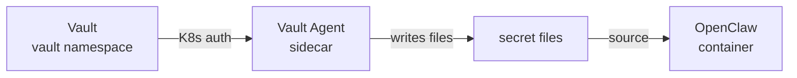

## Table of contents

# The problem with running AI agents flat

In the [MVP post](/openclaw-mvp.html) I got OpenClaw running
on macOS. It worked, but it was running as my user with
full LAN access and API keys sitting in a JSON file. An AI
agent with network access and credentials deserves more
scrutiny than a typical web app.

I moved it into Kubernetes and applied six kinds of
hardening. Claude wrote most of the manifests while I
focused on what should be locked down and why.


# The six pieces

| What | Why |
|------|-----|
| NetworkPolicy | Blocks LAN, allows only HTTPS out |
| HashiCorp Vault | Secrets never touch the K8s API |
| Pod Security Standards | Enforces restricted profile |
| Read-only root filesystem | Containers can't write to disk |
| Seccomp + capabilities | Limits available syscalls |
| Image pinning + ResourceQuota | Prevents supply chain drift and resource abuse |

The rest of this post is the actual setup, piece by
piece, on a single-node K3s cluster running on Rancher
Desktop.


# Prerequisites

- Rancher Desktop with Kubernetes enabled (K3s v1.34.5)
- `kubectl` and `helm` CLI tools
- Docker (comes with Rancher Desktop)
- A Gemini API key (free tier works) and a Telegram bot
  token


# Network isolation

This is the one I care about most. OpenClaw needs to reach
the internet (Gemini API, Telegram) but it should never
touch my LAN.

```yaml
# network-policy.yaml
apiVersion: networking.k8s.io/v1
kind: NetworkPolicy
metadata:
  name: openclaw
  namespace: openclaw
spec:
  podSelector:
    matchLabels:
      app.kubernetes.io/name: openclaw
  policyTypes:
    - Ingress
    - Egress
  # Deny all ingress
  ingress: []
  egress:
    # Allow DNS
    - to:
        - namespaceSelector:
            matchLabels:
              kubernetes.io/metadata.name: kube-system
      ports:
        - protocol: UDP
          port: 53
        - protocol: TCP
          port: 53
    # Allow HTTPS, block RFC1918
    - to:
        - ipBlock:
            cidr: 0.0.0.0/0
            except:
              - 10.0.0.0/8
              - 172.16.0.0/12
              - 192.168.0.0/16
      ports:
        - protocol: TCP
          port: 443
    # Allow Vault
    - to:
        - namespaceSelector:
            matchLabels:
              kubernetes.io/metadata.name: vault
      ports:
        - protocol: TCP
          port: 8200
```

The key trick is the `except` block. HTTPS egress is
allowed to `0.0.0.0/0` except all RFC1918 private ranges.
So `generativelanguage.googleapis.com` works but
`192.168.1.1` doesn't. No inbound connections at all.
Telegram uses long-polling so the bot is outbound-only.

K3s supports NetworkPolicy out of the box via kube-router,
no Istio or Calico needed.

## Verifying the rules

```bash
# Internet works
kubectl exec -n openclaw openclaw-0 -c openclaw -- \
  node -e "fetch('https://generativelanguage.googleapis.com') \
    .then(r=>console.log('OK:', r.status))"
# OK: 404

# LAN blocked
kubectl exec -n openclaw openclaw-0 -c openclaw -- \
  node -e "const c=new AbortController(); \
    setTimeout(()=>c.abort(),3000); \
    fetch('http://192.168.1.1',{signal:c.signal}) \
    .then(r=>console.log('LAN:',r.status)) \
    .catch(()=>console.log('LAN BLOCKED'))"
# LAN BLOCKED
```

I also tested `10.x` and `172.16.x` ranges. All blocked.

## Protecting Vault itself

I locked down the openclaw namespace but forgot about
vault. Any pod in any namespace could connect to Vault
on port 8200. That's a lateral movement path.

```yaml
# vault/network-policy.yaml
apiVersion: networking.k8s.io/v1
kind: NetworkPolicy
metadata:
  name: vault
  namespace: vault
spec:
  podSelector: {}
  policyTypes: [Ingress, Egress]
  ingress:
    # Only openclaw namespace can reach Vault
    - from:
        - namespaceSelector:
            matchLabels:
              kubernetes.io/metadata.name: openclaw
      ports:
        - protocol: TCP
          port: 8200
    # Vault pods talk to each other (injector → server)
    - from:
        - podSelector: {}
      ports:
        - protocol: TCP
          port: 8200
  egress:
    # DNS
    - to:
        - namespaceSelector:
            matchLabels:
              kubernetes.io/metadata.name: kube-system
      ports:
        - protocol: UDP
          port: 53
        - protocol: TCP
          port: 53
    # Vault internal
    - to:
        - podSelector: {}
      ports:
        - protocol: TCP
          port: 8200
    # K8s API for TokenReview (Vault K8s auth)
    - to:
        - ipBlock:
            cidr: 0.0.0.0/0
      ports:
        - protocol: TCP
          port: 443
        - protocol: TCP
          port: 6443
```

Egress allows DNS, intra-namespace traffic, and the K8s
API. Vault needs that last one for TokenReview when it
validates service account JWTs. Everything else is
blocked.


# Vault for secrets

I went with HashiCorp Vault instead of K8s Secrets. K8s
Secrets are base64-encoded, not encrypted at rest by
default, and anyone with namespace access can read them.
Vault gives me proper access control, audit logging, and
the secrets never touch the K8s API as plain text.

## Install via Helm

```bash
helm repo add hashicorp https://helm.releases.hashicorp.com
helm repo update

helm install vault hashicorp/vault \
  --namespace vault --create-namespace \
  -f vault-values.yaml
```

The values file runs Vault in standalone mode with file
storage. No HA, no UI, small resource footprint.

```yaml
# vault-values.yaml
server:
  standalone:
    enabled: true
    config: |
      ui = false
      listener "tcp" {
        address = "0.0.0.0:8200"
        tls_disable = 1
      }
      storage "file" {
        path = "/vault/data"
      }
  dataStorage:
    enabled: true
    size: 1Gi
    storageClass: local-path
  resources:
    requests:
      memory: 128Mi
      cpu: 100m
    limits:
      memory: 256Mi
      cpu: 250m

injector:
  enabled: true
  resources:
    requests:
      memory: 64Mi
      cpu: 50m
    limits:
      memory: 128Mi
      cpu: 250m
```

## Initialize and unseal

```bash
kubectl wait --for=jsonpath='{.status.phase}'=Running \
  pod/vault-0 -n vault --timeout=120s

kubectl exec -n vault vault-0 -- \
  vault operator init -key-shares=1 -key-threshold=1 \
  -format=json > /tmp/vault-init.json

UNSEAL_KEY=$(jq -r '.unseal_keys_b64[0]' /tmp/vault-init.json)
ROOT_TOKEN=$(jq -r '.root_token' /tmp/vault-init.json)

cat > ~/.vault-init <<EOF
VAULT_UNSEAL_KEY=$UNSEAL_KEY
VAULT_ROOT_TOKEN=$ROOT_TOKEN
EOF
chmod 600 ~/.vault-init

kubectl exec -n vault vault-0 -- \
  vault operator unseal "$UNSEAL_KEY"
```

Note: single key share is fine for a dev cluster. In
production you'd use 3-of-5 or similar.

## Secrets engine, policy, and K8s auth

Three things happen here. First, KV v2, Vault's versioned
key-value store. v2 keeps a history of secret values so
you can roll back if you fat-finger something. The path
`secret/` is a mount point name.

Second, the policy. Vault denies everything by default.
The `openclaw-read` policy grants read-only access to
exactly one path: `secret/data/openclaw`. The `data/`
prefix is a KV v2 thing, it's where the actual values
live (metadata lives under `secret/metadata/`). Without
this policy, even an authenticated client gets nothing.

Third, the Kubernetes auth method. Pods authenticate to
Vault using their K8s service account token. We tell
Vault where the K8s API lives, then create a role that
maps the `openclaw` service account in the `openclaw`
namespace to the `openclaw-read` policy. When the Vault
Agent sidecar starts, it presents the pod's service
account JWT. Vault validates it against the K8s API,
checks the role binding, and issues a short-lived token
with the policy attached.

```bash
# Enable KV v2
kubectl exec -n vault vault-0 -- sh -c \
  "VAULT_TOKEN=$ROOT_TOKEN vault secrets enable \
  -path=secret kv-v2"

# Write policy
kubectl exec -n vault vault-0 -- sh -c \
  "VAULT_TOKEN=$ROOT_TOKEN vault policy write \
  openclaw-read - <<EOF
path \"secret/data/openclaw\" {
  capabilities = [\"read\"]
}
EOF"

# Enable Kubernetes auth
kubectl exec -n vault vault-0 -- sh -c \
  "VAULT_TOKEN=$ROOT_TOKEN vault auth enable kubernetes"

kubectl exec -n vault vault-0 -- sh -c \
  "VAULT_TOKEN=$ROOT_TOKEN vault write \
  auth/kubernetes/config \
  kubernetes_host=https://\$KUBERNETES_SERVICE_HOST:\$KUBERNETES_SERVICE_PORT"

# Bind to openclaw service account
kubectl exec -n vault vault-0 -- sh -c \
  "VAULT_TOKEN=$ROOT_TOKEN vault write \
  auth/kubernetes/role/openclaw \
  bound_service_account_names=openclaw \
  bound_service_account_namespaces=openclaw \
  policies=openclaw-read \
  ttl=1h"
```

## Audit logging

Without audit logging, you have no idea who read what
secret or when. Vault's file audit backend fixes that
with one command. Logging to stdout means `kubectl logs`
picks it up:

```bash
kubectl exec -n vault vault-0 -- sh -c \
  "VAULT_TOKEN=$ROOT_TOKEN vault audit enable file \
  file_path=stdout"
```

Now `kubectl logs -n vault vault-0` shows every secret
access, every auth attempt, and whether it succeeded.

## Secrets injection flow

The Vault Agent Injector is a mutating webhook. When it
sees the `vault.hashicorp.com/agent-inject` annotation,
it adds an init container and a sidecar to the pod. Init
fetches secrets before the app starts. Sidecar keeps
them refreshed.



Secrets are written as a shell-sourceable file:

```bash
export GEMINI_API_KEY="AIza..."
export TELEGRAM_BOT_TOKEN="123456:ABC..."
```

The OpenClaw container sources this file before starting
the gateway. No secrets in the K8s API, no secrets in
environment variable definitions.


# Pod Security Standards

K8s has a built-in admission controller that enforces
security profiles at the namespace level. The `restricted`
profile is the strictest: non-root users, read-only root
filesystems, dropped capabilities, seccomp profiles.

```yaml
# namespace.yaml
apiVersion: v1
kind: Namespace
metadata:
  name: openclaw
  labels:
    kubernetes.io/metadata.name: openclaw
    app.kubernetes.io/name: openclaw
    pod-security.kubernetes.io/enforce: restricted
    pod-security.kubernetes.io/warn: restricted
```

Two labels. `enforce` rejects pods that don't meet the
profile. `warn` prints a warning for anything marginal. I
tested with `warn` first to make sure the Vault Agent
Injector's auto-injected containers passed, then flipped
to `enforce`.

The Vault Agent Injector does pass. It sets
`readOnlyRootFilesystem`, drops all capabilities, runs
as non-root, and sets its own resource limits.


# Read-only root filesystem

Every container in the pod has `readOnlyRootFilesystem:
true`. The container image is immutable at runtime. If
something gets compromised, it can't write a backdoor to
the filesystem.

Anything that needs to write uses an `emptyDir` volume:

```yaml
containers:
  - name: openclaw
    securityContext:
      allowPrivilegeEscalation: false
      readOnlyRootFilesystem: true
      capabilities:
        drop:
          - ALL
    volumeMounts:
      - name: data
        mountPath: /home/node/.openclaw
      - name: tmp
        mountPath: /tmp
  - name: chromium
    securityContext:
      allowPrivilegeEscalation: false
      readOnlyRootFilesystem: true
      capabilities:
        drop:
          - ALL
    volumeMounts:
      - name: dshm
        mountPath: /dev/shm
      - name: chromium-tmp
        mountPath: /tmp
volumes:
  - name: tmp
    emptyDir:
      sizeLimit: 512Mi
  - name: chromium-tmp
    emptyDir:
      sizeLimit: 256Mi
  - name: dshm
    emptyDir:
      medium: Memory
      sizeLimit: 256Mi
```

The `emptyDir` volumes have size limits. If something
tries to fill `/tmp`, it gets evicted instead of filling
the node's disk. The `/dev/shm` volume uses `medium:
Memory` because Chromium needs shared memory for rendering.


# Seccomp and capabilities

Seccomp (secure computing mode) is a Linux kernel feature
that restricts which syscalls a process can make. If a
container doesn't need `mount`, `reboot`, or `ptrace`,
why let it call them?

The pod-level security context sets a seccomp profile and
drops all Linux capabilities:

```yaml
spec:
  securityContext:
    runAsUser: 1000
    runAsGroup: 1000
    fsGroup: 1000
    runAsNonRoot: true
    seccompProfile:
      type: RuntimeDefault
```

`RuntimeDefault` is the container runtime's default
seccomp profile. It blocks dangerous syscalls like
`mount`, `reboot`, `ptrace`, and others. Combined with
`capabilities: drop: [ALL]` on each container, the
attack surface shrinks considerably.

Every container also sets `allowPrivilegeEscalation:
false`. Even if an attacker gets code execution, they
can't escalate to root.

Note: I left `automountServiceAccountToken` enabled.
The Vault Agent Injector needs the SA token to
authenticate to Vault via K8s auth. Disabling it breaks
secrets injection. Tradeoff, not an oversight.


# Image pinning and ResourceQuota

## Image pinning by digest

Tags are mutable. Someone could push a compromised image
to `latest` or even `v2.42.0`. Pinning by SHA256 digest
means the exact bytes are verified:

```yaml
# Instead of: image: ghcr.io/openclaw/openclaw:latest
image: ghcr.io/openclaw/openclaw@sha256:70c567...
image: ghcr.io/browserless/chromium@sha256:71ae7f...
image: busybox@sha256:bf9536...
```

Every image is pinned, including the busybox init container
that seeds the config file. I originally had `busybox:1.37`
as a mutable tag while the other two images were pinned by
digest. Easy thing to miss.

The tradeoff is manual updates. You have to look up the
new digest when upgrading. Worth it for an agent with
network access and API credentials.

## ResourceQuota

A namespace-level cap so nothing goes runaway:

```yaml
# resource-quota.yaml
apiVersion: v1
kind: ResourceQuota
metadata:
  name: openclaw-quota
  namespace: openclaw
spec:
  hard:
    requests.cpu: "2"
    requests.memory: 4Gi
    limits.cpu: "4"
    limits.memory: 8Gi
    pods: "4"
```

This matters because the Vault Agent Injector adds
containers to the pod automatically. Without a quota,
a misconfigured injector could claim unbounded resources.
Every container, including the init container and the
Vault-injected ones, must have resource specs or the quota
controller rejects the pod.


# The full StatefulSet

With all six pieces applied, here's the StatefulSet. I used
a StatefulSet instead of a Deployment for stable network
identity and PVC binding:

```yaml
apiVersion: apps/v1
kind: StatefulSet
metadata:
  name: openclaw
  namespace: openclaw
spec:
  serviceName: openclaw
  replicas: 1
  template:
    metadata:
      annotations:
        vault.hashicorp.com/agent-inject: "true"
        vault.hashicorp.com/role: "openclaw"
        vault.hashicorp.com/agent-inject-secret-config: >-
          secret/openclaw
        vault.hashicorp.com/agent-inject-template-config: |
          {{- with secret "secret/openclaw" -}}
          export GEMINI_API_KEY="{{ .Data.data.gemini_api_key }}"
          export TELEGRAM_BOT_TOKEN="{{ .Data.data.telegram_bot_token }}"
          {{- end }}
    spec:
      serviceAccountName: openclaw
      securityContext:
        runAsUser: 1000
        runAsGroup: 1000
        fsGroup: 1000
        runAsNonRoot: true
        seccompProfile:
          type: RuntimeDefault
      initContainers:
        - name: config-seed
          image: busybox@sha256:bf9536...
          command: ["sh", "-c"]
          args:
            - |
              if [ ! -f /data/openclaw.json ]; then
                cp /config/openclaw.json /data/openclaw.json
              fi
              # Fix PVC perms (local-path defaults to 777)
              chmod 600 /data/openclaw.json 2>/dev/null || true
              mkdir -p /data/credentials
              chmod 700 /data/credentials 2>/dev/null || true
          volumeMounts:
            - name: data
              mountPath: /data
            - name: config
              mountPath: /config
              readOnly: true
          resources:
            requests: { cpu: 10m, memory: 16Mi }
            limits: { cpu: 100m, memory: 64Mi }
          securityContext:
            allowPrivilegeEscalation: false
            readOnlyRootFilesystem: true
            capabilities:
              drop: ["ALL"]
      containers:
        - name: openclaw
          image: >-
            ghcr.io/openclaw/openclaw@sha256:70c567...
          command: ["sh", "-c"]
          args:
            - |
              if [ -f /vault/secrets/config ]; then
                . /vault/secrets/config
              fi
              exec node openclaw.mjs gateway \
                --allow-unconfigured
          resources:
            requests: { cpu: 250m, memory: 512Mi }
            limits: { cpu: "1", memory: 2Gi }
          securityContext:
            allowPrivilegeEscalation: false
            readOnlyRootFilesystem: true
            capabilities:
              drop: ["ALL"]
        - name: chromium
          image: >-
            ghcr.io/browserless/chromium@sha256:71ae7f...
          env:
            - name: PORT
              value: "9222"
          resources:
            requests: { cpu: 250m, memory: 256Mi }
            limits: { cpu: 500m, memory: 1Gi }
          securityContext:
            allowPrivilegeEscalation: false
            readOnlyRootFilesystem: true
            capabilities:
              drop: ["ALL"]
```

Three containers run in the pod: OpenClaw, Chromium, and
the Vault Agent sidecar (auto-injected). All with the
same security posture.


# Deploy and verify

```bash
kubectl apply -f namespace.yaml
kubectl apply -f network-policy.yaml
kubectl apply -f serviceaccount.yaml
kubectl apply -f pvc.yaml
kubectl apply -f configmap.yaml
kubectl apply -f service.yaml
kubectl apply -f resource-quota.yaml
kubectl apply -f statefulset.yaml
```

Wait for all three containers:

```bash
kubectl get pods -n openclaw -w
# NAME         READY   STATUS    RESTARTS   AGE
# openclaw-0   3/3     Running   0          95s
```

## Verify secrets injection

```bash
kubectl exec -n openclaw openclaw-0 -c openclaw \
  -- cat /vault/secrets/config
# export GEMINI_API_KEY="AIza..."
# export TELEGRAM_BOT_TOKEN="123456:ABC..."
```

## Resource usage

The whole thing is light:

| Component | CPU | Memory |
|-----------|-----|--------|
| OpenClaw gateway | 18m | 433Mi |
| Chromium sidecar | 0m | 78Mi |
| Vault Agent sidecar | 1m | 23Mi |
| Vault server | 15m | 47Mi |
| Vault Agent Injector | 2m | 11Mi |
| **Total new** | **36m** | **592Mi** |

Well under the 16GB budget on my M2 MacBook.


# Storing real secrets

The repo includes an interactive script that prompts for
each key and writes them to Vault:

```bash
bin/store-secrets.sh
```

It reads your root token from `~/.vault-init`, prompts
for each key (leave blank to skip), writes them to Vault,
then restarts the openclaw pod so it picks up the new
values.


# Test drive

With real secrets in place, the bot is live on Telegram.
Open your bot chat (the link BotFather gave you).

## Approve your Telegram account

The first message you send bounces back with an access
error and a pairing code:

```text
OpenClaw: access not configured.
Your Telegram user id: 123456789
Pairing code: ABCDE
Ask the bot owner to approve with:
  openclaw pairing approve telegram 123456789
```

Since OpenClaw is in a pod, you run the approval via
`kubectl exec`:

```bash
kubectl exec -n openclaw openclaw-0 -c openclaw -- \
  openclaw pairing approve telegram 123456789
```

Replace the ID with the one your bot sent you. This
pattern works for any `openclaw` CLI command:

```bash
kubectl exec -n openclaw openclaw-0 -c openclaw -- \
  openclaw <command>
```

The approval persists in the config file on the PVC,
so it survives pod restarts.

## Basic conversation

```text
You: what model are you?
Bot: I am currently running on the google/gemini-2.5-flash
     model.
```

If you get a response, the full chain is working: Telegram
to OpenClaw gateway to Gemini API, back to Telegram. All
from inside K8s with Vault-injected credentials.

## Check the logs

If something isn't working, watch the gateway logs:

```bash
kubectl logs -n openclaw openclaw-0 -c openclaw -f
```

This shows startup info, polling status, and errors.
The gateway doesn't log individual messages to stdout.
Full conversation history lives in session files on the
PVC:

```bash
kubectl exec -n openclaw openclaw-0 -c openclaw -- \
  ls /home/node/.openclaw/agents/main/sessions/
```

Each session is a JSONL file with messages, responses,
model used, token counts, and cost. These persist across
pod restarts.

## Browser automation

The Chromium sidecar runs on `localhost:9222` inside the
pod. Ask the bot to look something up and it'll spin up
a browser tab, navigate, read the content, and summarize
it back in chat.

```bash
# Verify Chromium is working
kubectl logs -n openclaw openclaw-0 -c chromium
```


# Developing against OpenClaw with Claude Code

I had Claude Code (Opus 4.6) verify the deployment by
talking to the OpenClaw agent (Gemini 2.5 Flash) running
in the cluster. OpenClaw has a CLI that sends a message
to the gateway and returns JSON. Claude Code can run
`kubectl exec`, so it can call that CLI directly.

## Talking to OpenClaw from Claude

The command is `openclaw agent --agent main --message
"..." --json`, wrapped in `kubectl exec`. The reply text
lives at `.result.payloads[0].text`.

Here's the actual conversation Claude had with OpenClaw
while testing this deployment:

```text
Claude: What model are you running on?
OpenClaw: I am currently running on the
  google/gemini-2.5-flash model.

Claude: What skills do you have?
OpenClaw: I have the following skills:
  - healthcheck: For host security hardening,
    risk configuration, and status checks.
  - skill-creator: To create or update AgentSkills.
  - weather: To get current weather and forecasts.

Claude: Run a healthcheck and tell me what you find.
OpenClaw: May I proceed with read-only checks?

Claude: Yes, go ahead.
OpenClaw: Critical: State directory
  (/home/node/.openclaw) is world-writable (mode=777).
  Config file (openclaw.json) is writable by others
  (mode=660). Credentials directory is writable by
  others (mode=770).
```

Those are real findings. The PVC mount permissions come
from K3s's local-path-provisioner, which creates
directories as root with mode 777.

I had Claude add `chmod 600` and `chmod 700` calls to
the init container for the config file and credentials
directory, redeploy, and check back with OpenClaw:

```text
Claude: I fixed the config file and credentials
  directory permissions with an init container. The
  state directory is still 777 because it's owned by
  root and my container runs as uid 1000. Can you
  re-check?
OpenClaw: Config file: resolved. Credentials directory:
  resolved. State directory: persists. The container
  cannot chmod a root-owned directory.
```

Two out of three fixed. The state directory stays 777
because local-path-provisioner owns it as root and the
restricted PSS namespace won't let me run an init
container as root. That's a real limitation of
local-path-provisioner on K3s. In production you'd use a
CSI driver that respects `fsGroup` properly.

## Quick health checks

For liveness, hit the gateway directly:

```bash
kubectl exec -n openclaw openclaw-0 -c openclaw -- \
  node -e "fetch('http://127.0.0.1:18789/healthz') \
    .then(r=>r.text()).then(console.log)"
# {"ok":true,"status":"live"}
```

`openclaw status --json` gives a full diagnostic dump:
gateway reachability, agent config, session counts,
memory backend, and a security audit. It's the one
command I'd run first after any change.

## The feedback loop

Before this, verifying the bot meant deploying,
switching to Telegram, typing a test message, reading
the response, and switching back. Now Claude deploys a
change and verifies it in the same terminal session.


# Things I got wrong

A few gotchas that cost me time:

**The Chromium image tag `v2.0.0` doesn't exist.** The
[K8s operator](https://github.com/openclaw-rocks/k8s-operator)'s
sample manifest referenced it, but the browserless GHCR
registry starts around `v2.22.0`.

**OpenClaw runs as user `node`, not `openclaw`.** Home
is `/home/node/.openclaw/`. I figured this out with
`docker inspect`.

**The gateway binds to loopback.** It listens on
`127.0.0.1:18789`, not `0.0.0.0`. Kubelet HTTP probes
can't reach it. I switched to exec probes that run
`node -e "fetch(...)"` inside the container.

**OpenClaw wants to write to its config file.** It
generates a gateway auth token on first start and writes
it back to `openclaw.json`. A read-only ConfigMap mount
won't work. I used an init container to copy the config
onto the PVC so it's writable.

**Memory limit of 1Gi is too low.** The Node.js gateway
OOM'd during startup. 2Gi limit works, actual usage sits
around 433Mi steady state.

**ResourceQuota rejects pods without resource specs.**
The Vault Agent Injector sets its own resource limits,
but my init container didn't have any. The quota
controller rejected the whole pod until I added resources
to every container.


# What's next

Right now the bot can chat and browse the web. I want
it to talk to Linear (issue tracker) too, but OpenClaw's
public skill marketplace is a supply chain risk I'm not
comfortable with. Third-party skills run inside the
agent with full access to its credentials. Same reason I
build my own MCP servers and K8s operators: I'd rather
have Claude write me a purpose-built Linear skill that I
own and can audit than install someone else's code into
a system that holds API keys.

[That's next](/openclaw-linear-skill.html). Along with Vault auto-unseal,
TLS on Vault, network policy audit logging (Cilium), and image scanning in CI.
