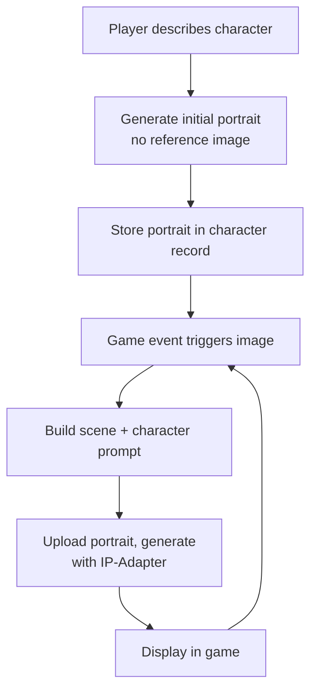

I'm building a tabletop RPG game that generates images on the fly: character portraits,
enemy illustrations, scene art. Cloud APIs work but get expensive when every combat
encounter wants several images. More importantly, I need character consistency. If I
generate a portrait of "Aria the rogue" in session one, future images of her should
look like the same character, not a random new person.

ComfyUI solves both. It runs locally on Apple Silicon, exposes a REST API, and
supports IP-Adapter for using an existing portrait as a visual reference for new
generations.


# Hardware Reality

MacBook Air M2, 16GB unified memory. The Air throttles under sustained load since
it has no active cooling. Fine for a game that generates at natural breaks (between
scenes, at combat start) rather than continuously.

16GB comfortably fits:
- **SDXL** (fp16, ~6.5GB): mature IP-Adapter ecosystem, good portrait quality
- **FLUX.2-klein-4B** (fp8, ~8-9GB): Apache 2.0, released November 2025, 4-step
  distilled generation, supersedes FLUX.1-schnell. IP-Adapter support less
  mature than SDXL.
- **FLUX.1-dev** (fp8, ~8GB): previous generation but still the best quality
  option that fits 16GB. FLUX.2-dev exists but won't fit.

For this post I'm using SDXL. Its IP-Adapter tools are battle-tested for exactly
this use case, and 6.5GB leaves plenty of headroom for additional models.


# Install ComfyUI

ComfyUI has a [Desktop app](https://github.com/Comfy-Org/desktop) that handles
everything automatically. Use that if you just want the UI. For API access and
full control, manual install is cleaner.

```bash
git clone https://github.com/comfyanonymous/ComfyUI
cd ComfyUI
python3.13 -m venv venv
source venv/bin/activate
python --version  # must say 3.13 — if it says 3.9 you have an old venv, rm -rf venv and redo
pip install -r requirements.txt
```

On Apple Silicon, the requirements file pulls a PyTorch build with MPS support
automatically. No CUDA, no special flags.

Start it:

```bash
source venv/bin/activate
python main.py --listen 0.0.0.0 --port 8188
```

`--listen 0.0.0.0` binds to all interfaces instead of localhost only. Needed for
the API to be reachable from other processes or devices on your network.

I keep a `start-comfyui.sh` in `~/models/` next to the model README so there's
one place for everything model-related:

```bash
#!/bin/bash
source /path/to/ComfyUI/venv/bin/activate
cd /path/to/ComfyUI
python main.py --listen 0.0.0.0 --port 8188
```

Open `http://localhost:8188`. You should see the node graph UI with a default
workflow loaded. No models needed for the server to start — the UI comes up
regardless.


# Model Storage

Models don't need to live inside the repo. ComfyUI will look in additional
directories if you tell it to via `extra_model_paths.yaml`:

```bash
cp extra_model_paths.yaml.example extra_model_paths.yaml
```

Then add an entry pointing at wherever you keep models. For example, if you
store them under `~/models/`:

```yaml
my_models:
  base_path: ~/models/
  checkpoints: sdxl/
  ipadapter: ipadapter/
  clip_vision: clip_vision/
```

Adjust the subdirectory names to match your layout. ComfyUI merges these with
its own paths and shows everything in the UI dropdowns.


# Models

Download SDXL (~6.5GB):

```bash
hf download stabilityai/stable-diffusion-xl-base-1.0 \
  sd_xl_base_1.0.safetensors \
  --local-dir ~/models/sdxl/
```

For IP-Adapter, clone the custom node into ComfyUI's `custom_nodes/` directory:

```bash
cd /path/to/ComfyUI/custom_nodes
git clone https://github.com/cubiq/ComfyUI_IPAdapter_plus
```

No pip install needed — it has no extra dependencies beyond what ComfyUI
already installs. ComfyUI picks it up automatically on next startup.

Then download the IP-Adapter weights:

```bash
# IP-Adapter for SDXL
hf download h94/IP-Adapter \
  sdxl_models/ip-adapter_sdxl.bin \
  --local-dir ~/models/ipadapter/

# CLIP vision encoder (required by IP-Adapter — must be ViT-bigG, not ViT-L)
hf download laion/CLIP-ViT-bigG-14-laion2B-39B-b160k \
  --local-dir ~/models/clip_vision/CLIP-ViT-bigG-14-laion2B-39B-b160k/
```

Restart ComfyUI after installing custom nodes. It rescans the nodes directory on
startup.


# Quick Test

Before touching the API, confirm generation works at all.

The built-in Templates target newer models and won't work with SDXL. ComfyUI
ships a test workflow in the repo — open it with **File > Open**:

```
/path/to/ComfyUI/tests/inference/graphs/default_graph_sdxl1_0.json
```


It's a base+refiner workflow with two Load Checkpoint nodes. The top one
should already show `sd_xl_base_1.0.safetensors`. The bottom one defaults to
`sd_xl_refiner_1.0.safetensors` — change it to `sd_xl_base_1.0.safetensors`
too. We're not doing base+refiner, just running base twice.

Drop a prompt into one of the CLIP Text Encode nodes and hit **Run**:

```
a knight in plate armor holding a mace and shield, fantasy RPG portrait,
detailed face, dramatic lighting, painterly style, 4k, highly detailed
```

First run is slow while the model loads. On M2 Air, SDXL at 20 steps takes
90-120 seconds. Subsequent runs with the model cached are faster but still
in that range — the Air throttles under sustained load with no active cooling.


# Img2Img: Post-Battle

Txt2img generates from noise. Img2img starts from an existing image and
nudges it toward a new prompt. Good way to stay close to a character while
changing context or condition.

Add two nodes to the current workflow. Right-click empty canvas space (not
on a node) to get the picker:

- **image → Load Image** — then select your knight from `ComfyUI/output/`
  using the dropdown in the node, or upload it from there
- **latent → VAE Encode** — converts a pixel image into the latent space
  the sampler works in, replacing the EmptyLatentImage

Then make three connections. To draw a wire: click and drag from an output
dot (right side of a node) to an input dot (left side of another node).
The dots are color-coded by type and will only connect to compatible ports.

1. Drag from the **IMAGE** dot (blue, right side of Load Image) to the
   **pixels** dot on VAE Encode
2. Drag from either **Load Checkpoint VAE** dot → **VAE Encode vae** dot
3. Drag from **VAE Encode LATENT** dot → **KSampler latent_image** dot
   (disconnects EmptyLatentImage automatically)

The test workflow uses **KSampler Advanced**, which has no `denoise` slider.
Instead set **start_at_step** to `6`. With 20 total steps that runs the last
14, equivalent to about 70% denoise. Lower start_at_step = more faithful to
original, higher = more change.

Update the positive prompt — that's the CLIP Text Encode node wired to the
KSampler's **positive** input, as opposed to the negative one (which holds
your "ugly, blurry..." text):

```
a knight in plate armor, damaged armor, battle-worn, dented helmet,
scratches and dents, mud-stained, exhausted, fantasy RPG portrait,
detailed face, dramatic lighting, painterly style, 4k, highly detailed
```

Hit **Run**. If it's changing too much, drop start_at_step to 4. If the
damage isn't reading, push to 8.


Img2img works, but it's coarse. Fine details like face structure get lost
as you increase denoise, and at low denoise the prompt has limited
influence. Good for "same scene, different state." Not what you want for
generating the same character across completely different scenes.

That's what IP-Adapter is for. Instead of perturbing the reference image,
it encodes it through CLIP vision into an embedding that gets injected
alongside the text conditioning during generation. The sampler still starts
from pure noise, but the attention layers are nudged toward the character's
appearance at every step. Face and body survive across very different
scenes because the conditioning runs throughout, not just at the start.


# The API

ComfyUI's API accepts a workflow as JSON and queues the generation. The workflow
you build in the UI can be exported in API format: go to Settings, enable Dev
Mode Options, then use the "Save (API Format)" button on the workflow.

The API format represents each node as a dict entry keyed by node ID. Here's a
minimal SDXL workflow:

```json
{
  "4": {
    "class_type": "CheckpointLoaderSimple",
    "inputs": { "ckpt_name": "sd_xl_base_1.0.safetensors" }
  },
  "5": {
    "class_type": "EmptyLatentImage",
    "inputs": { "batch_size": 1, "height": 1024, "width": 768 }
  },
  "6": {
    "class_type": "CLIPTextEncode",
    "inputs": {
      "clip": ["4", 1],
      "text": "a fantasy rogue in a dark alley, RPG portrait, detailed"
    }
  },
  "7": {
    "class_type": "CLIPTextEncode",
    "inputs": {
      "clip": ["4", 1],
      "text": "ugly, blurry, watermark, text, bad anatomy"
    }
  },
  "3": {
    "class_type": "KSampler",
    "inputs": {
      "model": ["4", 0],
      "positive": ["6", 0],
      "negative": ["7", 0],
      "latent_image": ["5", 0],
      "seed": 42,
      "steps": 20,
      "cfg": 7,
      "sampler_name": "dpmpp_2m",
      "scheduler": "karras",
      "denoise": 1
    }
  },
  "8": {
    "class_type": "VAEDecode",
    "inputs": { "samples": ["3", 0], "vae": ["4", 2] }
  },
  "9": {
    "class_type": "SaveImage",
    "inputs": { "filename_prefix": "rpg", "images": ["8", 0] }
  }
}
```

Submit it:

```bash
curl -X POST http://localhost:8188/prompt \
  -H "Content-Type: application/json" \
  -d '{"prompt": <workflow_json>}'
# Returns: {"prompt_id": "abc123...", "number": 1, "node_errors": {}}
```

Poll for completion:

```bash
curl http://localhost:8188/history/abc123
# When done: history[prompt_id]["status"]["completed"] == true
```

Fetch the image:

```bash
curl "http://localhost:8188/view?filename=rpg_00001_.png" \
  --output character.png
```

Images also land in `ComfyUI/output/` on disk if you'd rather read them
directly.


# Image Consistency with IP-Adapter

IP-Adapter encodes a reference image using CLIP vision and injects that embedding
alongside the text prompt during generation. The result is a new image that
respects the prompt but is visually pulled toward the reference: same hair, same
armor, similar face structure.

It's not a perfect clone. Think of it as a strong nudge. Consistent text prompts
help too. If every prompt for Aria includes "tall elf rogue, purple hair, leather
armor," you're conditioning from both directions.

Add these nodes to the workflow above:

```json
"10": {
  "class_type": "IPAdapterModelLoader",
  "inputs": { "ipadapter_file": "ip-adapter_sdxl.bin" }
},
"11": {
  "class_type": "CLIPVisionLoader",
  "inputs": { "clip_name": "CLIP-ViT-bigG-14-laion2B-39B-b160k/open_clip_model.safetensors" }
},
"12": {
  "class_type": "LoadImage",
  "inputs": { "image": "aria_portrait.png" }
},
"13": {
  "class_type": "IPAdapterAdvanced",
  "inputs": {
    "model": ["4", 0],
    "ipadapter": ["10", 0],
    "image": ["12", 0],
    "clip_vision": ["11", 0],
    "weight": 0.6,
    "weight_type": "linear",
    "combine_embeds": "concat",
    "start_at": 0.0,
    "end_at": 1.0,
    "embeds_scaling": "V only"
  }
}
```

Then change node `"3"`'s `model` input from `["4", 0]` to `["13", 0]`.

The prompt here asks for the same knight in a tavern — completely different
scene, same character used as reference.


`weight` is the main knob. At 0.5 you get style and general appearance influence.
At 0.8 it starts fighting the text prompt. For character identity, 0.6-0.7 is
the range to start with.

The `image` input in node `"12"` is a filename relative to `ComfyUI/input/`.
Copy your reference images there, or upload them via the API:

```bash
curl -X POST http://localhost:8188/upload/image \
  -F "image=@aria_portrait.png"
# Returns: {"name": "aria_portrait.png", "subfolder": "", "type": "input"}
```


## Face Consistency

Standard IP-Adapter works well for overall style and body type. Faces drift more
than you'd like, especially across very different scenes. IP-Adapter FaceID handles
this by extracting face embeddings specifically rather than encoding the whole image.

Download:

```bash
hf download h94/IP-Adapter-FaceID \
  ip-adapter-faceid-plusv2_sdxl.bin \
  --local-dir ~/models/ipadapter/
```

FaceID also requires InsightFace, which isn't on HuggingFace. Download the
`antelopev2` model package from the
[InsightFace model zoo](https://github.com/deepinsight/insightface/tree/master/model_zoo)
and place it under `~/models/insightface/models/antelopev2/` (or wherever your
`extra_model_paths.yaml` maps `insightface`).

Install the Python package into the ComfyUI venv:

```bash
source /path/to/ComfyUI/venv/bin/activate
pip install insightface onnxruntime
```

With FaceID installed, use `IPAdapterFaceIDAdvanced` instead of `IPAdapterAdvanced`.
It takes the same inputs but runs the face embedding extraction automatically.
Faces stay recognizable across very different scenes much more reliably than with
the standard adapter.

You can combine both: use `IPAdapterAdvanced` for overall character appearance
and `IPAdapterFaceIDAdvanced` for face locking, chaining them in sequence.


# Game Integration

The pattern for a TTRPG character system:


