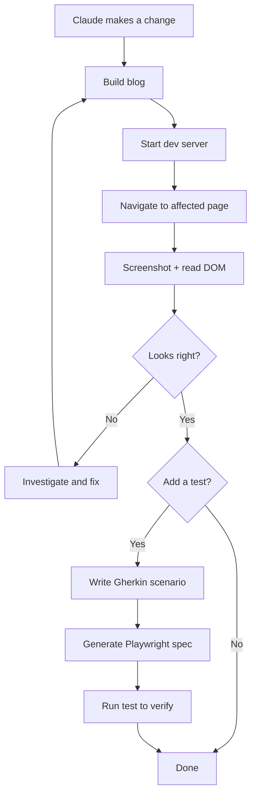
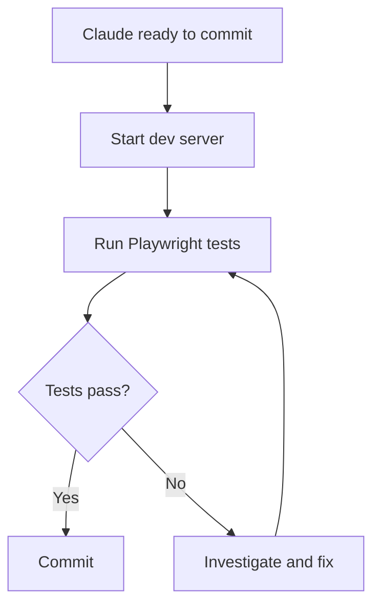

Playwright MCP gives Claude Code a real browser to drive. Coding agents are kind of
awful at doing the right thing unless they can verify their work. If you want to do any
front-end work and not be the human in the loop every step along the way, it's gotta be
able to operate Chromium and review the photos. Opus 4.6 is multi modal and any later
models will just be better, so it can consume the photos itself.


# Setup

```bash
claude mcp add playwright -- npx @playwright/mcp@latest --browser chromium
```

Or add it to `.mcp.json` at the project root to share it with the team:

```json
{
  "mcpServers": {
    "playwright": {
      "command": "npx",
      "args": ["@playwright/mcp@latest", "--browser", "chromium"]
    }
  }
}
```

Restart Claude Code. Run `/mcp` to confirm it's listed. If you've got a session
already, tell it to store its memory first and to load it back after, works well.


# What Playwright Does

At work we migrated from Selenium/WebDriver to this to address flakiness long before
the MCP was out, but at this point my interest in playwright is more about the AI
integration.

Playwright MCP exposes the browser as individual tools Claude can call. This post demos
the main ones, with examples against my dev blog server at `http://localhost:3000`.

I'm pretty sure I'll be able to post agents at this post even to tell it how I want
them to work, and ask them to write a claude.md about it.


## browser_navigate

```
browser_navigate: { url: "http://localhost:3000" }
```

Loads a URL. Returns the final URL (catches redirects) and a console
error/warning count alongside the snapshot.


## browser_snapshot

```
browser_snapshot: {}
```

Returns an accessibility tree of the current page. This is the main tool for
reading page state: what's visible, what's interactive, what the structure is.
Faster and more structured than HTML, and the `ref` values it returns are what
`browser_click` and `browser_type` use to target elements.


## browser_take_screenshot

```
browser_take_screenshot: {}
```

Returns a PNG of the current viewport. This is the tool Claude uses to judge
look and feel. It's multimodal, so it actually reads the image and can catch
layout problems, broken images, or rendering bugs that don't show up in the
accessibility tree. It can't extract `ref` values from a screenshot though, so
use `browser_snapshot` when you need to drive further actions.


## browser_click

```
browser_click: { element: "Posts", ref: "..." }
```

Clicks by visible label or element reference. Drives navigation and interactive
components.


## browser_type

```
browser_type: { element: "search input", ref: "...", text: "Playwright" }
```

Types into an input. The `ref` comes from `browser_snapshot`.


## browser_evaluate

```
browser_evaluate: { function: "() => document.title" }
```

Runs JavaScript in the page context. For reading state that isn't in the DOM.


## browser_wait_for

```
browser_wait_for: { text: "Playwright MCP" }
browser_wait_for: { textGone: "Loading..." }
browser_wait_for: { time: 2 }
```

Three modes: wait for text to appear, wait for text to disappear, or sleep for
N seconds. No explicit timeout parameter. It uses Playwright's default (30s).
Needed for anything that renders async.


## browser_console_messages

```
browser_console_messages: {}
browser_console_messages: { level: "error" }
```

Returns the full console output: message text, level, and source location.
The `level` filter works like log levels: `error` gives you errors only, `info`
gives you everything. The navigate and snapshot tools show a count
(`1 errors, 0 warnings`), but this is where you get the actual content.

Claude can read and interpret it. Errors include full stack traces and, for
things like React hydration mismatches, the actual HTML diff showing which
component diverged between server and client. Ask Claude to look at the console
and it'll summarize the errors and suggest fixes rather than dumping the raw
text at you.

First thing to check when something looks wrong but the DOM appears fine.

Also worth having in every test suite: a test that loads each key page and
asserts no console errors. It catches a lot of regressions for free.

```typescript
test('no console errors on homepage', async ({ page }) => {
  const errors: string[] = [];
  page.on('console', msg => {
    if (msg.type() === 'error') errors.push(msg.text());
  });
  await page.goto('/');
  expect(errors).toHaveLength(0);
});
```


## browser_network_requests

```
browser_network_requests: {}
browser_network_requests: { includeStatic: true }
```

The network log since the last navigation. Returns method, URL, and status code
for each request. Good for catching 404s on assets or confirming a request
fired. Excludes static resources by default. Pass `includeStatic: true` to see
everything.

No timing data. If you need to assert on response duration, use Playwright's
`page.on('response', ...)` in a test instead:

```typescript
test('API calls complete within 500ms', async ({ page }) => {
  const timings: number[] = [];
  page.on('response', async response => {
    if (response.url().includes('/api/')) {
      const timing = response.timing();
      timings.push(timing.responseEnd - timing.requestStart);
    }
  });
  await page.goto('/');
  expect(Math.max(...timings)).toBeLessThan(500);
});
```

`page.on('response', ...)` fires for every network response. Filter by URL
pattern to target whatever you care about: API calls, a specific domain,
a file type. Same pattern works for asserting no 404s:

```typescript
test('no broken asset requests', async ({ page }) => {
  const failures: string[] = [];
  page.on('response', response => {
    if (response.status() >= 400) failures.push(`${response.status()} ${response.url()}`);
  });
  await page.goto('/');
  expect(failures).toHaveLength(0);
});
```


## browser_resize

```
browser_resize: { width: 375, height: 812 }
```

Resizes the viewport. Triggers CSS media queries based on width, so layout
reflows and responsive breakpoints work as expected. Good for a quick visual
check. Pair it with `browser_take_screenshot` to see what changed.

It doesn't change the user agent, device pixel ratio, or pointer type. That
means UA-sniffing code still thinks it's a desktop browser, `srcset` serves
desktop-resolution images, and `hover: none` / `pointer: coarse` media queries
don't fire. For proper mobile regression coverage, use Playwright's device
emulation in the test config instead:

```typescript
import { devices } from '@playwright/test';

// playwright.config.ts
export default defineConfig({
  projects: [
    { name: 'desktop', use: { viewport: { width: 1280, height: 720 } } },
    { name: 'mobile',  use: { ...devices['iPhone 13'] } },
  ],
});
```

`devices['iPhone 13']` sets viewport, user agent, device scale factor, and
touch support together. Your tests run against both profiles automatically.


---

# Gherkin Specs as Source of Truth

AI-generated test code has a maintenance problem. The agent writes tests, they
drift from what the UI actually does, someone edits them directly, and now you
have no reliable source of truth.

What I'm experimenting with here is to keep specs in Gherkin, generate tests from
them, and treat the generated code as a build artifact. Claude rewrites the tests from
spec whenever they go stale. Nobody edits the generated files.

```
tests/
  spec/
    index.feature
    post.feature
    navigation.feature
  playwright/
    index.spec.ts      # generated, do not edit
    post.spec.ts       # generated, do not edit
    navigation.spec.ts # generated, do not edit
  playwright.config.ts
```

The actual specs for this blog live in
[`tests/spec/`](https://github.com/kylep/multi/tree/main/apps/blog/blog/tests/spec/).
Here's the index one:

```gherkin
# tests/spec/index.feature

Feature: Blog index page

  Scenario: Page loads with post list
    Given I navigate to the blog homepage
    Then I see a list of posts
    And each post has a title, date, and summary

  Scenario: Posts link to their detail page
    Given I navigate to the blog homepage
    When I click the first post title
    Then I am on a post detail page
    And the post has a title and content

  Scenario: Pagination controls are present
    Given I navigate to the blog homepage
    Then I see pagination controls
```

The instruction to Claude is: read the `.feature` file, generate a matching
`spec.ts`. If something breaks, fix the spec first, then regenerate. The feature
file is what documents how the UI is supposed to behave.

A `CLAUDE.md` in `tests/` gives Claude guidance when generating tests, things
like keeping the suite under a minute, no sleeps, one assertion per scenario.
If you're using [Ruler](/ruler-cross-tool-ai-rules) to share rules across tools,
put that content in `tests/.ruler/` instead and let Ruler generate the
`CLAUDE.md` alongside your `AGENTS.md`.


# Claude Verifying Its Own Changes

This is the part I wanted to try. Claude makes a change, then uses the MCP
browser to check whether it worked, before handing back.



It's nondeterministic. That's the strength and the problem. Claude
isn't following a checklist. It navigates to what it changed, reads what's
there, and decides whether it matches intent. That catches a class of dumb
mistakes a checklist wouldn't, but it also means "looks right" depends on the
agent's judgment, which isn't always reliable.

The multimodal part matters here. When Claude calls `browser_take_screenshot`,
it doesn't get back an opaque file path. It sees the rendered page. It can tell
if an image failed to load, if a layout broke, if text is overlapping. That's
more than a DOM inspection gives you. It's also not a substitute for explicit
assertions, because "looks right" is still a judgment call.



This part is deterministic as reasonably quick in headless mode.
Screenshots are for the stuff that's hard to assert: visual regressions, style
issues, anything where you'd want a human to glance at it.


## Playwright Config for the Blog

```bash
cd apps/blog
npm init playwright@latest
```

```typescript
// playwright.config.ts
import { defineConfig } from '@playwright/test';

export default defineConfig({
  testDir: './tests/playwright',
  use: {
    baseURL: 'http://localhost:3000',
  },
  webServer: {
    command: 'npm run dev',
    url: 'http://localhost:3000',
    reuseExistingServer: true,
  },
});
```

The generated specs live in
[`tests/playwright/`](https://github.com/kylep/multi/tree/main/apps/blog/blog/tests/playwright/).
Run them with:

```bash
cd apps/blog/blog
npx playwright test
```

Claude gets pass/fail output with assertion details. Unambiguous, scriptable,
no judgment required.

Note: `npx playwright test` runs headless by default. No browser window appears.
Pass `--headed` to watch it run, or set `headless: false` in the config.


# Where This Is Going: Agent Teams

Claude Code has a multi-agent feature in preview. The setup that makes sense
here is a builder agent making changes and a separate verifier agent running
tests and reporting back. They work in parallel. Failures come back as tasks.

Not wired up yet. But the spec files, generated tests, and MCP config are what
make it possible to hand verification to a different agent without losing the
context of what the tests mean.
