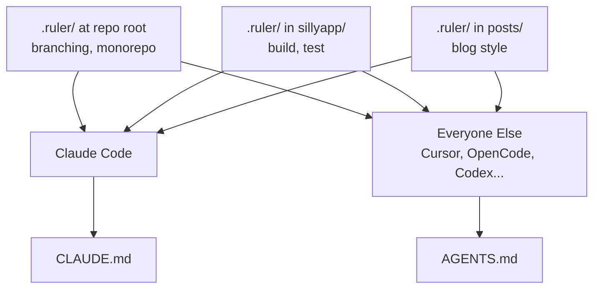

I use Cursor and Claude Code, sometimes Codex, and I'm about to try OpenCode.
Each tool has its own rules format, and I've been maintaining them separately.
[Ruler](https://github.com/intellectronica/ruler) generates each tool's native
config from a single source. Worth setting up.


# Tool agnosticism with common rules
I'm trying to keep up. There are too many tools. I don't want to migrate things around.
We're using this at work too, since different devs use different tools. Here's how I
set up Ruler to consolidate my Cursor and Claude rules together.

I had this rule in Cursor:
```markdown
# Monorepo rules

This git repo is a monorepo. It contains multiple sub-projects.
Do not look for context or cross-reference calls between sub-projects.
Each directory within apps/ and games/ is a sub-project. They shouldn't
share code.
```

Claude Code has CLAUDE.md files scattered through the tree:

| File | Contents |
|------|----------|
| `CLAUDE.md` (root) | Branching: never commit to main, always PR |
| `apps/games/sillyapp/CLAUDE.md` | iOS build and test commands, simulator lifecycle |
| `apps/blog/.../posts/CLAUDE.md` | Blog writing voice, formatting rules, structure |
| `apps/games/kid-bot-battle-sim/features/CLAUDE.md` | Interface details for that feature set |


# Ruler Setup

```bash
npm install -g @intellectronica/ruler
```

Initialize at the repo root:

```bash
ruler init
```

This creates a `.ruler/` directory and a `ruler.toml` config. Drop your
instructions as Markdown files inside `.ruler/`, then:

```bash
ruler apply
```

## What happens when you run it

Claude Code gets `CLAUDE.md`. Everything else (Cursor, OpenCode, Codex,
Copilot, 30+ others) gets `AGENTS.md`. Generated files go into `.gitignore`
automatically, so only the `.ruler/` source is committed.

Ruler supports nested directories. A `.ruler/` at the repo root applies
globally. A `.ruler/` inside a sub-project applies when an agent is working
there. That matches how Claude Code already loads CLAUDE.md files walking up
the directory tree.



You can symlink ~/.ruler to your dir too if you want global Claude rules.


# Note: Consider just using AGENTS.md

Most tools read `AGENTS.md`: Cursor, OpenCode, Codex, ~others~. If all you have is
rules, it's not a bad idea to skip all of this and just use that format. I think it
might win. That doesn't help with Skills, though.

## Skills

Rules are basically just fancy prompt context that are always loaded.
Skills are just fancy prompt context loaded on-demand, maybe with some extra files
sometimes. Different tools implement them in different ways:

- Claude Code: `.claude/skills/`
- Cursor: `.cursor/skills/`
- Other tools follow the same pattern under their own config directories

Ruler figures it out and distributes them for you. Could this all just be a bash
script? Yes. Does it do a bunch of stuff I don't understand too? Also, probably, yes.

Enabled by default. Pass `--no-skills` to skip it:

```bash
ruler apply           # distributes rules + skills
ruler apply --no-skills  # rules only
```

---

# Consolidating rules: Migration steps

The `ruler.toml` at the root lists the agents to target:

```toml
default_agents = ["claude", "cursor"]
```

Content moves from existing config files into `.ruler/` source files:

```
.ruler/
  branching.md        # from root CLAUDE.md
  monorepo.md         # from .cursor/rules/monorepo.md (Claude never saw this)
apps/games/sillyapp/
  .ruler/
    build.md          # from sillyapp/CLAUDE.md
apps/blog/blog/markdown/posts/
  .ruler/
    style.md          # from posts/CLAUDE.md
apps/games/kid-bot-battle-sim/features/
  .ruler/
    interfaces.md     # from features/CLAUDE.md
```

Root `.ruler/branching.md` (was only in Claude Code):

```markdown
# Branching

Never commit directly to `main`. Always create a branch and open a PR
against main for review.
```

Root `.ruler/monorepo.md` (was only in Cursor):

```markdown
# Monorepo

This repo contains multiple independent sub-projects under `apps/` and
`games/`. Do not cross-reference or import code between sub-projects.
Each directory in those folders is its own isolated project.
```

The project-specific files (sillyapp build commands, blog style guide)
move into `.ruler/` inside their directories unchanged. Content stays the
same, location shifts.

Note: the existing hand-written CLAUDE.md files get replaced by generated
versions after `ruler apply`. Edit the `.ruler/` source, not the output.


