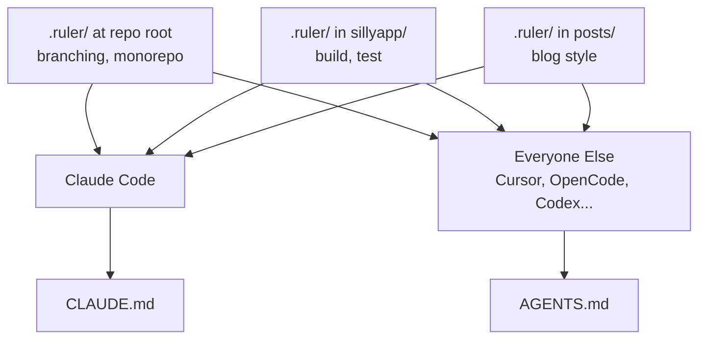

I use Cursor and Claude Code. I occasionally use Codex, and I'm planning to
try OpenCode next. Each tool has its own config format, and right now my
instructions are split across two separate places with tedious consolidation.

[Ruler](https://github.com/intellectronica/ruler) seems popular and we're testing it at
work too. Going to use it for this job.


# What I Have Today

As of 2026-03-02, I've only got the one **Cursor** rule at `.cursor/rules/monorepo.md`:

```markdown
# Monorepo rules

This git repo is a monorepo. It contains multiple sub-projects.
Do not look for context or cross-reference calls between sub-projects.
Each directory within apps/ and games/ is a sub-project. They shouldn't
share code.
```

**Claude Code** has CLAUDE.md files at multiple levels of the tree:

| File | Contents |
|------|----------|
| `CLAUDE.md` (root) | Branching: never commit to main, always PR |
| `apps/games/sillyapp/CLAUDE.md` | iOS build and test commands, simulator lifecycle |
| `apps/blog/.../posts/CLAUDE.md` | Blog writing voice, formatting rules, structure |
| `apps/games/kid-bot-battle-sim/features/CLAUDE.md` | Interface details for that feature set |

The monorepo rule lives only in Cursor. Claude Code has never seen it.
The blog style guide only Claude Code sees. The branching rule is in the root
CLAUDE.md but not in `.cursor/rules/`, so Cursor doesn't know about it either.

Two tools, two separate instruction stores, with real gaps between them.


# How Ruler Works

```bash
npm install -g @intellectronica/ruler
```

Initialize in the repo root:

```bash
ruler init
```

This creates a `.ruler/` directory and a `ruler.toml` config. You put your
instructions as Markdown files inside `.ruler/`. Then:

```bash
ruler apply
```

Each enabled agent gets its native config generated from the same source.
Claude Code gets `CLAUDE.md`. Everything else (Cursor, OpenCode, Codex,
Copilot, and 30+ others) gets `AGENTS.md`. Generated files go into
`.gitignore` automatically, so only the `.ruler/` source is committed.

Ruler supports nested directories. A `.ruler/` at the repo root applies
globally. A `.ruler/` inside a sub-project applies when an agent is working
there. This maps exactly to how Claude Code already loads CLAUDE.md files
walking up the directory tree.




# Wait, Can't I Just Use AGENTS.md?

Most tools have converged on `AGENTS.md`: Cursor, OpenCode, Codex, and
30-odd others all read it. So fair question: if everything agrees on one
format, why bother with Ruler at all?

The honest answer: Claude Code is the odd one out. It prefers `CLAUDE.md`
over `AGENTS.md`. If you just maintain `AGENTS.md` files, Claude Code will
read them, but you're not using its native format. Ruler generates `CLAUDE.md`
for Claude Code and `AGENTS.md` for everything else from the same source.

If you only used Claude Code, you'd just maintain CLAUDE.md files directly.
If you dropped Claude Code and used only AGENTS.md-native tools, you'd just
maintain AGENTS.md files. Ruler earns its keep when you have both in the mix,
which I do.


# Migrating My Setup

The `ruler.toml` at the root lists the agents to target:

```toml
default_agents = ["claude", "cursor"]
```

I'll add `"opencode"` when I get there. One line, re-run apply.

The migration is moving content out of existing configs into `.ruler/` source
files. The resulting structure:

```
.ruler/
  branching.md        # from root CLAUDE.md
  monorepo.md         # from .cursor/rules/monorepo.md (Claude never saw this)
apps/games/sillyapp/
  .ruler/
    build.md          # from sillyapp/CLAUDE.md
apps/blog/blog/markdown/posts/
  .ruler/
    style.md          # from posts/CLAUDE.md
apps/games/kid-bot-battle-sim/features/
  .ruler/
    interfaces.md     # from features/CLAUDE.md
```

**Root `.ruler/branching.md`** (currently only in Claude Code):

```markdown
# Branching

Never commit directly to `main`. Always create a branch and open a PR
against main for review.
```

**Root `.ruler/monorepo.md`** (currently only in Cursor):

```markdown
# Monorepo

This repo contains multiple independent sub-projects under `apps/` and
`games/`. Do not cross-reference or import code between sub-projects.
Each directory in those folders is its own isolated project.
```

The project-specific files (sillyapp build commands, blog style guide)
move into `.ruler/` inside their directories essentially unchanged. Content
stays the same; only the location shifts.

Note: the existing hand-written CLAUDE.md files get replaced by generated
versions after running `ruler apply`. Edit the `.ruler/` source, not the
generated output.

After running apply, Claude Code gets `CLAUDE.md` at each level and
everything else gets `AGENTS.md`. The monorepo and branching rules that were
previously split across two tools now come from one place. Adding OpenCode or
Codex to `default_agents` in `ruler.toml` and re-running apply is all it takes.
