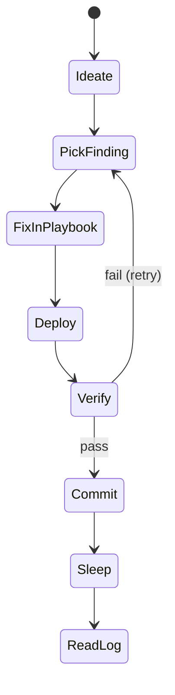

I had Claude credits left in my week and wanted to secure my agent-dediced macbook. It
ran on my Mac M1
for a few days while I was on vacation. I made it kind of fancy with Discord support and
remote management through tailscale, it was really fun getting notified every now and
then that another commit was pushed to the open PR.

It used a DIY mvp version of a [Ralph loop](https://github.com/snarktank/ralph).
I am the supply chain! ...The bots tell me they won't draw Simpsons characters for me
and I'm not about to break out an image editor, so we get this footless child instead.

Look at the commits in [this PR](https://github.com/kylep/multi/pull/52), over 80!
A common thing about AI is you get all these impressive stats that way oversell the value
that they represent. These 80 commits are cool but if I'd done it by hands it would have
been like... 4, maybe 5.

As another win, I used my PRD and DD agents from the
[prior post](/ai-native-sdlc-first-try.html) to design this out and
that worked wonderfully.

## Ralph?

Ralph is an autonomous agent pattern that runs Claude Code in a loop
until a task list is empty. The task list here was dynamic, Claude kept looking for new
ways to improve laptop security without hurting agent autonomy. Later it crunched
through security findings from compliance scanners. The agent read each
finding, fixed it through Ansible, verified the fix, and
moved to the next one. I steered it from Discord a bit.

# The setup

The machine is a Mac M1 running as an AI workstation. This is "Claude's laptop", and I
factory reset it to remove anything Claude shouldn't have. I segmented it from my
network too, just in case.

Claude Code runs in bypass-permissions mode with
unrestricted tool access. The entire machine config is managed
by an [Ansible playbook](https://github.com/kylep/multi/tree/main/infra/mac-setup),
so any change the agent makes is reproducible on a fresh
install.

Before this project, I'd done some security work setting up pre-commit hooks for
semgrep and gitleaks, a [security toolkit](/ai-security-toolkit.html) Docker image, and
hook scripts that blocked known-bad commands.

# Loop: Claude, go "do security"

This loop was *okay, I guess*. The idea of the loop is really exciting. I can't wait to
get a loop of, like "work on anything in Linear" or something similarly broad that is
able to decompose stuff properly.

Anyways, for this project, the focus was limited to laptop security.
A Python script spawns Claude Code every few minutes to keep in the 5-hour token window.
We never really went above 50%. I had a custom token use mcp counting things up too,
but the math is fuzzy, especially since Claude was offering double quota at night that
week.

Each iteration:

1. Tries to find something to do to improve security (tool or LLM decides)
2. Pick a finding that hasn't been attempted
3. Fix it through the Ansible playbook (not ad-hoc shell)
4. Run the playbook to deploy the fix
5. Verify the fix took effect
6. Commit and push

The loop had those cost/token controls, a lock file so
only one instance ran at a time, and a timeout per
phase to kill things when they get stuck. It had an adversarial subagent loop, I love those, to
make sure that the changes actually worked, helped security, and did not hurt agent autonomy.
It pushed to GitHub and pinged me on Discord after each verified commit, so I could review from my phone.

## LLM only, no tools

> "Claude, find me some ways to make my laptop secure and implement the best one through Ansible".

It found a few real, if basic, issues. Things like:
- The application firewall was off
- A `sudoers.d` file granted passwordless sudo to the agent user
- `exports.sh` and `.mcp.json` were world-readable (mode 0644)
- Screen lock wasn't configured

But 60 iterations later, most of the time had gone to things that didn't matter or couldn't work.

##  The loop gets stuck

It turns out you need to be proactive about preventing loops.

During this test, Claude spent multiple days iterating on a hook script called `protect-sensitive.sh`.
It'd move on then just keep coming back for it. The hook itself just tried to prevent the agent from reading sensitive files.
I had given some instructions to not get stuck in loops like that, but I guess it didn't take.

## Explain Yourself, Claude: Agent RCAs

After 68 commits in the week, I had Claude run an RCA.

> LLM intuition is a weak security discovery mechanism. The
> loop should execute against a scanner's scored finding list,
> not improvise the list itself.

The result Looked really good, 68 commits in 3 days is cool stat, but the actual value
delivered was pretty meh. You need to be really intentional and good about goal-setting.

The RCA asked if it could just use a scanner like I did with the SCA stuff and that
immediately resulted in way more fixes and a much better loop.

# Scanner-driven task lists are way better

The RCA recommended three scanners:

| Tool | Scope | Why |
|------|-------|-----|
| [Lynis](https://cisofy.com/lynis/) | General system audit | Broad, scored, Linux-first but works on macOS |
| [rkhunter](https://rkhunter.sourceforge.net/) | Rootkit detection | Catches things Lynis doesn't check |
| [mSCP](https://github.com/usnistgov/macos_security) | macOS CIS Level 1 | NIST-maintained, macOS-native compliance checks |

All three install through the Ansible playbook. A LaunchDaemon
runs them daily at 06:00 and writes results to
`/var/log/security-scans/`.

It was admittedly kind of a pain in the ass to help Claude escalate perms to root over
and over during the mSCP thing, some of those tests need root to run and Claude couldn't
trigger them itself.

# What'd it get me?
Other than the fun of having it work while I was away, here's what Claude tells me it
implemented to secure my laptop from this. Worth noting that this was all done through
Ansible, so when I factory reset my laptop again (I will), I get this back too:

- Enabled the macOS application firewall and stealth mode to block unsolicited inbound connections
- Enabled Gatekeeper to enforce code signing and notarization on all executables
- Disabled SSH root login and enforced protocol v2 only
- Locked down `sshd_config` permissions (0600) so it can't be read by other users
- Set screen lock to trigger after 10 minutes idle, requiring password immediately
- Disabled the guest account entirely
- Disabled automatic login
- Removed password hints from the login window
- Enabled automatic app updates
- Disabled AirDrop to prevent unsolicited file transfer attempts
- Disabled AirPlay receiver so the machine can't accept screen share requests
- Disabled Siri data sharing and search query telemetry
- Disabled assistive voice data donation
- Disabled diagnostic report submission to Apple
- Disabled AI writing tools, mail summaries, Notes transcription, and external intelligence integrations
- Disabled personalized advertising
- Forced on-device-only dictation (no audio sent to Apple servers)
- Enabled secure keyboard entry in Terminal to prevent other processes from reading keystrokes
- Installed rkhunter for rootkit detection, running daily
- Installed Lynis for system audit scoring, running daily
- Installed mSCP for CIS Level 1 compliance checks, running daily

So overall, pretty meh. It was fun though and I think if done well and let to run
perpetually, it could be a neat approach to having an agent actively defend my system.
