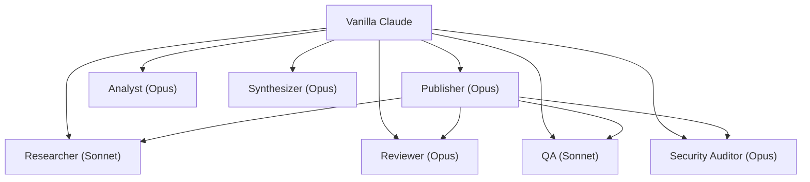

I wanted research-backed guidance for my Claude Code agents. I had
Claude read everything Anthropic has published on agent design, then
ran deep research reports from ChatGPT, Gemini, and Claude on the
same topic. Notes are in the wiki
([Anthropic guidance](/wiki/research/anthropic-guidance.html),
[deep research synthesis](/wiki/research/coding-agent-best-practices.html)).
Here's what I applied.

Some key findings:

- **Most multi-agent failures are specification problems**, not
  infrastructure. Bad task descriptions, ambiguous instructions,
  missing termination conditions. Berkeley's
  [MAST taxonomy](https://arxiv.org/abs/2503.13657) analyzed
  150+ tasks across 5 frameworks and found specification and
  system design issues were the dominant failure category.
- **Teach delegation.** Give subagents an objective, output
  format, tool/source guidance, and task boundaries. Without
  all four, agents duplicate work or leave gaps.
  ([Multi-Agent Research System](https://www.anthropic.com/engineering/multi-agent-research-system))
- **Evaluators need isolated context.** If the evaluator shares
  context with the producer, it becomes "another participant
  in collective delusion."
  ([Building Effective Agents](https://www.anthropic.com/research/building-effective-agents))
- **Start wide, then narrow.** Agents default to overly specific
  queries in unfamiliar territory. Begin with broad queries to
  map what exists before drilling in.
  (Gemini deep research,
  [wiki](/wiki/research/coding-agent-best-practices.html))
- **Action-oriented descriptions improve auto-delegation.**
  Trigger phrases like "MUST BE USED when..." in agent
  descriptions help Claude decide when to invoke subagents.
  (Claude deep research,
  [wiki](/wiki/research/coding-agent-best-practices.html))
- **Agents without browser tools ship half-working features.**
  Unit tests pass but the rendered page is broken. Playwright
  catches what tests miss.
  ([Effective Harnesses](https://www.anthropic.com/engineering/effective-harnesses-for-long-running-agents))
- **Route models by risk, not task complexity.** Opus for
  judgment calls that are hard to verify. Sonnet for mechanical
  work that's easy to check. A complex summarization is
  low-risk because you can read and discard it. A one-line
  security review is high-risk because getting it wrong has
  consequences.
  ([Building Effective Agents](https://www.anthropic.com/research/building-effective-agents),
  all three deep research reports)
- **Deny-by-default permissions.** Start with no tool access
  and progressively allowlist. The opposite of what most people
  do (give the agent everything, restrict when something goes
  wrong).
  ([Context Engineering](https://www.anthropic.com/engineering/effective-context-engineering-for-ai-agents),
  Claude deep research,
  [wiki](/wiki/research/coding-agent-best-practices.html))
- **The harness enforces termination, not the agent.** Don't
  rely on the agent to know when to stop. Set max iterations,
  token budgets, and repetition detection in the system that
  runs the agent.
  ([Effective Harnesses](https://www.anthropic.com/engineering/effective-harnesses-for-long-running-agents),
  Claude deep research,
  [wiki](/wiki/research/coding-agent-best-practices.html))
- **Write results to files, pass back references.** Subagents
  writing full output through the orchestrator bloats its
  context window. Subagents should write to files and return
  a summary and a path.
  ([Multi-Agent Research System](https://www.anthropic.com/engineering/multi-agent-research-system))
- **Research, plan, then implement.** Without explicit
  instructions, Claude jumps straight to coding. Say "read X,
  then make a plan, then implement." Three phases, stated
  explicitly. Claude won't reliably do them on its own.
  ([Claude Code Best Practices](https://code.claude.com/docs/en/best-practices))
- **One feature per prompt, commit after each piece.** Agents
  try to do everything and exhaust context mid-task. Commits
  are rollback points. If the agent breaks something on step
  3, you revert to step 2 instead of starting over.
  ([Effective Harnesses](https://www.anthropic.com/engineering/effective-harnesses-for-long-running-agents))
- **Agents use ~4x more tokens than chat. Multi-agent uses
  ~15x.** Don't pay that unless the task needs it. Multi-agent
  is an economic decision, not an architectural one.
  ([Multi-Agent Research System](https://www.anthropic.com/engineering/multi-agent-research-system))
- **Start simple, add layers only when measured outcomes
  improve.** The canonical agent loop is ~50 lines. Don't
  build the full stack on day one.
  ([Building Effective Agents](https://www.anthropic.com/research/building-effective-agents))

Security baseline: the
[OWASP Top 10 for LLM Applications](https://genai.owasp.org/llm-top-10/).
All three deep research reports recommended it. I use it as a
checklist for the Security Auditor agent.

# 2026-03-15's Agent Roster

The agents from the
[org-chart post](/agent-org-chart.html) were made off-the-cuff.
16 agents, too ambitious, didn't have the infrastructure to support
them. I deleted most and got down to 7. This time: I had Claude
load the deep research synthesis, I extracted the best practices
that applied, and I updated the agent definitions with specific,
traceable changes.

| Agent | Model | Role & Applied Research |
|-------|-------|------------------------|
| [Publisher](https://github.com/kylep/multi/blob/main/.claude/agents/publisher.md) | Opus | Content pipeline orchestration, writing. [Delegation specs](https://www.anthropic.com/engineering/multi-agent-research-system), trigger phrase. |
| [Analyst](https://github.com/kylep/multi/blob/main/.claude/agents/analyst.md) | Opus | Research ingestion, system improvements. Trigger phrase. |
| [Synthesizer](https://github.com/kylep/multi/blob/main/.claude/agents/synthesizer.md) | Opus | Compare/contrast Deep Research reports. No changes needed. |
| [Researcher](https://github.com/kylep/multi/blob/main/.claude/agents/researcher.md) | Sonnet | Sourced facts, research briefs. [Start wide, then narrow](/wiki/research/coding-agent-best-practices.html) search strategy, trigger phrase. |
| [Reviewer](https://github.com/kylep/multi/blob/main/.claude/agents/reviewer.md) | Opus | Style, substance, sourcing. [Context isolation](https://www.anthropic.com/research/building-effective-agents) from producer. |
| [QA](https://github.com/kylep/multi/blob/main/.claude/agents/qa.md) | Sonnet | Build, render, links via [Playwright](https://www.anthropic.com/engineering/effective-harnesses-for-long-running-agents). Trigger phrase. |
| [Security Auditor](https://github.com/kylep/multi/blob/main/.claude/agents/security-auditor.md) | Opus | [OWASP LLM Top 10](https://genai.owasp.org/llm-top-10/), confidential data. Added LLM05 check. |

Three report directly to me (Publisher, Analyst, Synthesizer).
Four are subagents under Publisher. Model routing follows the
research: Opus for judgment calls (review, security, editorial,
synthesis), Sonnet for mechanical work (research, QA).

## Calling the agents

Three ways to use them:

**Vanilla Claude auto-delegates.** Each agent definition has a
`description` field that Claude reads when deciding whether to
spawn a subagent. The trigger phrases ("MUST BE USED when
writing blog posts", "MUST BE USED when gathering facts") tell
Claude when to invoke each one. If I ask vanilla Claude to
write a blog post, it sees the Publisher's description and
delegates. It can also run multiple subagents in parallel
when the tasks are independent.

**CLAUDE.md tells Claude what's available.** The project's
`CLAUDE.md` includes a section listing all 7 agents with their
roles and invocation commands. This gives vanilla Claude the
full picture of what agents exist without having to discover
them from the file system.

**`claude --agent publisher` for the full pipeline.** This
starts Claude with the Publisher's system prompt as the main
thread. Publisher then orchestrates the entire content
pipeline: research, substance gate, write, review, QA,
security audit. It spawns each subagent natively using Claude
Code's Agent tool, not CLI calls. Independent stages (QA and
security audit) run in parallel. This is the heavy path for
writing a full post from scratch.

Claude Code enforces a single-level subagent hierarchy.
Publisher can spawn subagents, but those subagents can't
spawn their own. If Reviewer needs research, it doesn't call
Researcher. It reports back to Publisher, which decides
what to do next.

