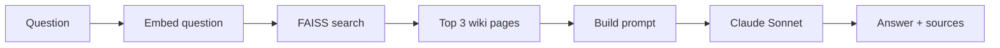

The [bot-wiki post](/bot-wiki.html) introduced a structured wiki
designed for machine consumption. The whole point was to build
something a RAG pipeline could actually use. This is that pipeline.

## The stack

The wiki has 21 markdown pages with structured frontmatter:
title, summary, keywords, scope. The RAG pipeline is a single
Python script that:

1. Embeds all 21 pages into vectors using OpenRouter's API
2. Stores them in a FAISS flat index (129 KB, committed to git)
3. At query time, embeds the question, finds the nearest pages,
   and feeds them to an LLM for a grounded answer

Dependencies: `faiss-cpu`, `openai` (for the OpenAI-compatible
API), and `pyyaml`. That's it.

## Why FAISS

[FAISS](https://github.com/facebookresearch/faiss) is Meta's
library for similarity search over dense vectors. It runs
in-process, no server needed. You give it vectors, it gives
you nearest neighbors. The index is a flat file you can
commit to git.

I picked it because this is 21 vectors. There's no need for
a database, a server, or a managed service. `pip install
faiss-cpu`, build an index, save it, done. The index is
129 KB. It loads in milliseconds.

If you're working at larger scale or want more features,
the main alternatives are:

- [Chroma](https://github.com/chroma-core/chroma): embedded
  vector database with a nice Python API. Good if you want
  metadata filtering or persistence without managing files
  yourself. Still runs locally.
- [Qdrant](https://github.com/qdrant/qdrant): vector search
  engine written in Rust. Runs as a server, supports
  filtering and payloads. Better fit when you have millions
  of vectors or need a proper API.
- [Pinecone](https://www.pinecone.io/): fully managed cloud
  vector database. Zero ops, but you're paying per query and
  your data lives on someone else's servers.

If you're already running PostgreSQL,
[pgvector](https://github.com/pgvector/pgvector) is worth
a look. It adds vector columns and similarity search to
your existing database. No new service to run, and your
vectors live next to your relational data.

For 21 pages committed to a git repo, FAISS is the obvious
choice. No dependencies beyond the pip package, no running
services, no accounts.

## Why whole-page chunks

The wiki pages are short, 18 to 65 lines each. Splitting them
by section would lose context without gaining anything. The
frontmatter was designed to enrich embeddings, so each chunk
looks like this:

```
Title: Claude Code
Summary: Anthropic's CLI-based AI coding assistant. Runs
  in terminal, edits files directly, supports MCP tool
  integrations and custom hooks.
Keywords: claude-code, anthropic, cli, ai-coding-assistant,
  mcp, hooks
Scope: Covers Claude Code setup, configuration, MCP
  integration, hooks, and usage patterns.

Claude Code is Anthropic's CLI tool for AI-assisted software
engineering. It operates directly in the terminal...
```

Prepending the summary, keywords, and scope to the body gives
the embedding model more signal about what the page covers.
21 chunks, 5,434 tokens total.

### Chunking in general

Most RAG guides recommend chunks of 256 to 512 tokens. That's
a reasonable default for long documents where you want to
retrieve a specific paragraph, not the whole thing. Smaller
chunks give more precise retrieval. Larger chunks give the
LLM more context per result.

The tradeoffs:

- **Too small** (under 100 tokens): chunks lose meaning on
  their own. "See above" or "as mentioned" with no referent.
  Retrieval finds fragments, not answers.
- **Too large** (over 1000 tokens): embeddings become diluted.
  A chunk about five topics matches all five weakly instead
  of one strongly. You also burn more of the LLM's context
  window per retrieved result.
- **Overlap** helps when chunks split mid-thought. A common
  pattern is 512-token chunks with 50-100 tokens of overlap.
  This adds redundancy but reduces the chance of cutting a
  relevant passage in half.

The wiki pages average about 260 tokens each, which lands
right in the sweet spot. They're also self-contained by
design, each page covers one topic with clear boundaries.
No reason to split them further.

If I were indexing longer documents (blog posts, docs, book
chapters), I'd split by section headers first, then by token
count within sections. Semantic boundaries beat arbitrary
ones.

## Building the index

```bash
python3 -m venv .venv
.venv/bin/pip install -r bin/requirements-rag.txt
.venv/bin/python bin/wiki-rag.py build
```

```
Embedding 21 wiki pages...
Indexed 21 pages, 1536 dimensions, 5434 tokens
Index: 129,069 bytes, metadata: 29,663 bytes
Saved to blog/markdown/wiki/.index
```

The embedding model is `text-embedding-3-small` via OpenRouter.
1536 dimensions per vector. The FAISS index uses `IndexFlatIP`
(inner product on normalized vectors = cosine similarity). No
approximate search needed at this scale.

The index and a `metadata.json` file (slug, title, summary,
full chunk text for each page) get saved to
`blog/markdown/wiki/.index/`. Both files are committed to git.
Any tool that wants to query the wiki can just read the index
directly without needing the embedding API.

The build is a manual step, not part of `npm run build`. Wiki
content doesn't change often, and there's no reason to pay for
embeddings on every deploy.

## Querying

A query hits two models. First, the question gets embedded
into a vector using the same embedding model that indexed
the wiki pages. FAISS compares that vector against the 21
stored vectors and returns the closest matches. Those
matches are wiki pages that are semantically similar to the
question, not keyword matches, but meaning matches.

Then the retrieved pages get passed to an LLM (Claude
Sonnet) as context, along with the original question. The
LLM reads the pages and writes an answer grounded in what
they actually say. Without the retrieval step, the LLM
would just guess from its training data. With it, the LLM
answers from your specific documents.

That's the "retrieval-augmented" part of RAG: find relevant
documents first, then generate an answer from them.



```bash
.venv/bin/python bin/wiki-rag.py query \
  "What MCP servers does this project use?"
```

```
Question: What MCP servers does this project use?

Top 3 matches:
  1. [0.644] MCP Integrations (wiki/mcp)
  2. [0.563] Linear MCP (wiki/mcp/linear)
  3. [0.524] GA4 MCP (wiki/mcp/ga4)

Answer:
Based on the provided context, this project uses three MCP
servers:

1. Playwright, for browser automation
2. Linear, for project management
3. GA4, for accessing website traffic data and reports

All MCP servers run as subprocesses communicating via JSON-RPC
over stdio, and are configured in ~/.claude.json or a
project-level .claude.json file.
```

The retrieval nailed the right pages. Here's a different query:

```bash
.venv/bin/python bin/wiki-rag.py query "How do I run security scans?"
```

```
Question: How do I run security scans?

Top 3 matches:
  1. [0.484] Security Toolkit (wiki/devops/security-toolkit)
  2. [0.439] DevOps & Security (wiki/devops)
  3. [0.343] OpenClaw Kubernetes Security (wiki/openclaw/kubernetes)
```

The answer included the actual docker commands from the security
toolkit wiki page, copy-paste ready. The third result
(Kubernetes security) is a reasonable stretch, the word
"security" overlaps, but the top two are exactly right.

## The script

The interesting parts are small. Embedding is a single API call
since all 21 pages fit in one batch:

```python
client = OpenAI(
    base_url="https://openrouter.ai/api/v1",
    api_key=os.environ["OPENROUTER_API_KEY"],
)
response = client.embeddings.create(
    model="openai/text-embedding-3-small",
    input=texts,
)
```

OpenRouter's embedding endpoint is OpenAI-compatible, so the
`openai` Python package works with just a base URL swap.

FAISS search returns similarity scores and indices:

```python
scores, indices = index.search(query_vec, k)
for score, idx in zip(scores[0], indices[0]):
    page = metadata[idx]
    # score is cosine similarity (0 to 1)
```

The retrieved pages get stuffed into a prompt with instructions
to only use the provided context and cite sources. The LLM
(Claude Sonnet via OpenRouter) generates the answer.

## Cost

Indexing 21 pages used 5,434 tokens at
`text-embedding-3-small` rates ($0.02/1M tokens). That's
$0.0001. Each query embeds a short question (maybe 20 tokens)
plus one chat completion. A query costs roughly $0.002 to
$0.01 depending on the response length.

Building the index and running test queries cost $0.03
total on OpenRouter. That covers the embedding API calls
and the chat completions for query-mode answers. The
development itself (writing the script, iterating on the
blog post) ran through Claude Code on an Anthropic Max
subscription, so that cost isn't on the OpenRouter bill.

The wiki is also a write target, not just a read one. I have
a journalist agent that runs on a K8s CronJob every morning,
searches for AI news, and commits a digest to the wiki automatically.
[Cron/event-triggered AI agents on K8s](/cron-event-triggered-ai-agents-k8s.html)
covers how that side works.

