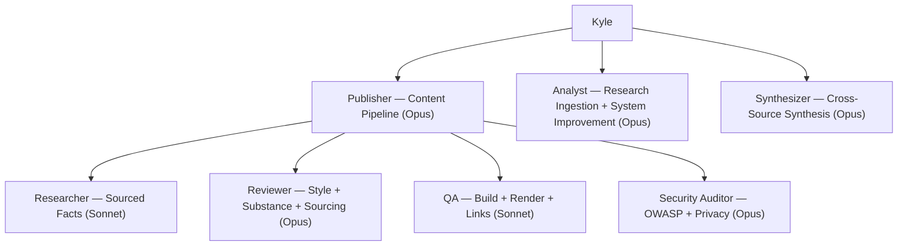

## Org Chart (Mermaid)



## Org Chart (YAML)

Structured for bot consumption. Use this when you need to look up
invocation commands or which agent owns a domain.

```yaml
agents:
  - name: publisher
    model: opus
    invoke: claude --agent publisher
    reports_to: kyle
    subagents: [researcher, reviewer, qa, security-auditor]
    domain: Content pipeline orchestration, blog post writing
    tools: [Bash, Read, Write, Edit, Glob, Grep, Agent]

  - name: researcher
    model: sonnet
    invoke: claude --agent researcher
    reports_to: publisher
    domain: Gather sourced facts, produce research briefs
    tools: [Read, Glob, Grep, WebFetch, WebSearch]
    read_only: true

  - name: reviewer
    model: opus
    invoke: claude --agent reviewer
    reports_to: publisher
    domain: Style, substance, frontmatter, and sourcing review
    tools: [Read, Glob, Grep]
    read_only: true

  - name: qa
    model: sonnet
    invoke: claude --agent qa
    reports_to: publisher
    domain: Build verification, render checks, link validation
    tools: [Bash, Read, Glob, Grep, Playwright MCP]
    read_only: true  # has Bash for builds but no Write/Edit

  - name: security-auditor
    model: opus
    invoke: claude --agent security-auditor
    reports_to: publisher
    domain: Confidential data, prompt injection, OWASP LLM Top 10
    tools: [Read, Glob, Grep]
    read_only: true

  - name: analyst
    model: opus
    invoke: claude --agent analyst
    reports_to: kyle
    domain: Research ingestion, claim validation, system improvement proposals
    tools: [Read, Glob, Grep, WebSearch, WebFetch]
    read_only: true

  - name: synthesizer
    model: opus
    invoke: claude --agent synthesizer
    reports_to: kyle
    domain: Cross-source comparison of Deep Research reports
    tools: [Read, Edit, Glob, Grep, Agent]
```
