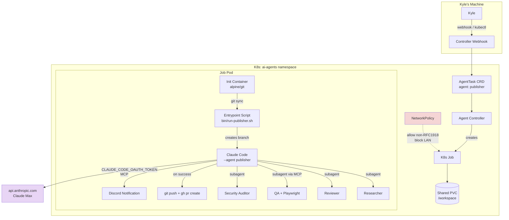

## Context

Link to PRD: [Autonomous Publisher Pipeline](../prds/autonomous-publisher.md)

The publisher pipeline (research, write, review, QA, security audit) has
only ever run interactively on Kyle's MacBook. Moving it to K8s requires
solving four problems the journalist agent never had to: Claude Max
OAuth auth (replacing OpenRouter), Playwright browser verification in a
container (the journalist has no QA step), branch lifecycle management
(the journalist commits to main), and MCP server configuration for
Playwright alongside the existing Discord and Google News servers.

The runtime image also needs a base image change: Playwright requires
glibc, and the current `node:22-alpine` base uses musl.

## Goals and Non-Goals

**Goals:**

- Authenticate autonomous publisher runs against the Claude Max
  subscription via `CLAUDE_CODE_OAUTH_TOKEN`
- Run the full publisher pipeline (research, write, review loop, QA
  with Playwright, security audit) without human intervention
- Self-verify output: blog build succeeds, post renders in a headless
  browser, passes adversarial review
- Isolate the agent: filesystem to workspace only, network egress
  restricted to non-RFC1918 addresses (OpenClaw pattern)
- Notify Kyle via Discord on completion (with auto-PR link) and on
  failure (with error context)

**Non-Goals:**

- No auto-merge or production deployment (Kyle reviews and merges)
- No auto-topic selection (Kyle triggers manually in v1)
- No multi-pipeline concurrency (existing write-serialization remains)
- No OpenRouter fallback -- commit fully to Max auth
- No database migration or new CRD fields beyond what exists
- No cloud K8s migration (stays on local Rancher Desktop)

## Proposed Design



### Component Details

#### 1. Runtime Image (`ai-agent-runtime:0.3`)

**Responsibility:** Provide Claude Code CLI, Playwright, Chromium, and
all MCP server dependencies in a single image.

**File path:** `infra/ai-agent-runtime/Dockerfile`

**Key change:** Base image switches from `node:22-alpine` to the
official Playwright image `mcr.microsoft.com/playwright:v1.58.2-noble`
which includes Chromium, system fonts, and glibc. Node.js 22 is
available in this image.

**Key interfaces:**
- Inherits Chromium + system deps from Playwright base
- Installs: Claude Code CLI, `@playwright/mcp`, Python 3, pip, MCP
  server deps, Git, `gh` CLI
- User: non-root `pwuser` (UID 1001, from Playwright base image)
- Entrypoint: `/bin/sh` (unchanged)
- Claude onboarding bypass: `~/.claude.json` with
  `{"hasCompletedOnboarding": true}` baked into the image

#### 2. Entrypoint Script (`bin/run-publisher.sh`)

**Responsibility:** Branch lifecycle, Claude Code invocation, git push,
PR creation, and Discord notification. This is the command the
controller runs instead of inline Claude Code invocation.

**File path:** `apps/blog/bin/run-publisher.sh`

**Key interfaces:**
- Input: `$1` = topic/prompt string
- Env vars consumed: `CLAUDE_CODE_OAUTH_TOKEN`, `DISCORD_WEBHOOK_URL`
  (or uses Discord MCP), `GITHUB_TOKEN` (for `gh pr create`)
- Creates branch `agent/publisher-$(date +%s)` from current HEAD
- Invokes `claude --mcp-config /tmp/mcp.json --agent publisher -p "$1" --output-format text`
- On success: `git push`, `gh pr create --base main`, posts PR link to
  Discord
- On failure: posts error context to Discord, exits non-zero
- Does NOT manage the dev server -- the QA subagent handles that
  internally via `bin/start-dev-bg.sh`

#### 3. Controller Changes

**Responsibility:** Extended `buildCommand()` to support publisher-
specific configuration: Playwright MCP server in the MCP config JSON,
OAuth token injection, and `gh` CLI auth.

**File path:** `infra/agent-controller/pkg/controller/controller.go`

**Key changes:**
- `buildCommand()` detects `agent == "publisher"` and uses the
  entrypoint script instead of inline command construction
- MCP config includes Playwright MCP server:
  `{"playwright": {"type": "stdio", "command": "npx", "args": ["-y", "@playwright/mcp@latest", "--headless", "--no-sandbox"]}}`
- Job pod spec adds `/dev/shm` emptyDir volume (required for Chromium)
- Job pod spec adds `--init` equivalent via `shareProcessNamespace`
  or a proper init process

#### 4. Secret Changes

**Responsibility:** Store Claude Max OAuth token and GitHub token
alongside existing secrets.

**File path:** `infra/agent-controller/helm/templates/secret.yaml`

**Key additions:**
- `CLAUDE_CODE_OAUTH_TOKEN` -- the 1-year token from `claude setup-token`
- `GITHUB_TOKEN` -- PAT for `gh pr create` (or use `gh auth login --with-token`)

**Auth model change:** For publisher runs, the controller must NOT
inject `ANTHROPIC_API_KEY`, `ANTHROPIC_AUTH_TOKEN`, or
`ANTHROPIC_BASE_URL` -- these conflict with `CLAUDE_CODE_OAUTH_TOKEN`.
The entrypoint script unsets them before invoking Claude Code.

#### 5. NetworkPolicy

**Responsibility:** Restrict agent pod network egress to non-RFC1918
addresses only (following the OpenClaw pattern).

**File path:** `infra/agent-controller/helm/templates/networkpolicy.yaml`

**Key interfaces:**
- Deny all ingress
- Allow DNS to kube-system
- Allow HTTPS (443) to `0.0.0.0/0` except `10.0.0.0/8`,
  `172.16.0.0/12`, `192.168.0.0/16`
- Applies to pods with label `agents.kyle.pericak.com/agent`

#### 6. AgentTask Sample (`publisher-manual.yaml`)

**Responsibility:** Declarative task definition for manual publisher
runs.

**File path:** `infra/agent-controller/config/samples/publisher-manual.yaml`

**Key fields:**
- `agent: publisher`
- `trigger: manual`
- `readOnly: false`
- `allowedTools`: full set including Bash, Read, Write, Edit, Glob,
  Grep, Agent, and all `mcp__playwright__*` tools

### Data Model

No new CRD fields required. The existing `AgentTaskSpec` covers all
needs:
- `agent: publisher`
- `prompt: "Write a blog post about <topic>"`
- `trigger: manual`
- `readOnly: false`

The entrypoint script handles branch naming and PR creation outside the
CRD model.

### API / Interface Contracts

**Webhook trigger:**
```json
POST :8080/webhook
Authorization: Bearer <token>
{
  "agent": "publisher",
  "prompt": "Write a blog post about autonomous AI agent pipelines in K8s",
  "runtime": "claude"
}
```

**Entrypoint script contract:**
```
Input:  $1 = prompt string (from AgentTask.spec.prompt)
Output: exit 0 = success (branch pushed, PR created, Discord notified)
        exit 1 = failure (Discord notified with error, branch preserved)
Env:    CLAUDE_CODE_OAUTH_TOKEN (required)
        GITHUB_TOKEN (required for gh pr create)
        MCP config at /tmp/mcp.json (written by controller)
```

**Discord notification format (success):**
```
Publisher completed: "Write a blog post about <topic>"
PR: https://github.com/kylep/multi/pull/XX
Branch: agent/publisher-1710636000
```

**Discord notification format (failure):**
```
Publisher FAILED: "Write a blog post about <topic>"
Stage: QA verification
Error: Blog build exited with code 1
Branch: agent/publisher-1710636000 (preserved for debugging)
```

## Alternatives Considered

### Decision: Base image for Playwright support

| Option | Pros | Cons | Verdict |
|--------|------|------|---------|
| `mcr.microsoft.com/playwright:v1.58.2-noble` | Chromium + deps pre-installed, officially supported, glibc | Larger image (~1.5GB), Ubuntu-based, breaks from Alpine convention | **Chosen** -- Playwright explicitly does not support Alpine (musl). This is the only supported path. |
| `node:22-slim` + manual Chromium install | Debian slim is smaller than Playwright image, more control | Fragile: must track Chromium deps manually, version mismatches | Rejected -- Playwright docs warn against this approach |
| Keep Alpine + Chromium from Alpine repos | Stays consistent with current image | Playwright does not support musl/Alpine. Browser builds require glibc. | Rejected -- technically not possible |

### Decision: Publisher orchestration model

| Option | Pros | Cons | Verdict |
|--------|------|------|---------|
| Agent-driven (claude `--agent publisher`) | Publisher agent definition already handles subagent delegation, no controller changes for pipeline logic, same behavior as interactive | Controller can't observe intermediate stages | **Chosen** -- the publisher agent already works interactively. Changing orchestration for K8s would create divergent behavior. |
| Controller-driven multi-step | Controller can track each stage, retry individual steps | Duplicates orchestration logic, Go code becomes coupled to pipeline stages | Rejected -- too much controller complexity |
| Entrypoint script orchestration | Shell script calls each subagent separately | Loses publisher agent's context between stages, breaks adversarial review loop | Rejected -- the review loop requires agent context |

### Decision: Auth approach for Claude Max

| Option | Pros | Cons | Verdict |
|--------|------|------|---------|
| `CLAUDE_CODE_OAUTH_TOKEN` via `claude setup-token` | 1-year token, works with Max subscription, community-proven | Not officially supported M2M path, Anthropic closed M2M request as NOT_PLANNED | **Chosen** -- only viable path for Max tokens. No fallback by design decision. |
| API key with OpenRouter passthrough | Proven, currently works for journalist | Costs money on OpenRouter, doesn't use Max allocation | Rejected -- defeats the purpose (PRD success metric: 100% Max billing) |
| Wait for official M2M auth | Would be the "right" way | Anthropic marked NOT_PLANNED. Could be months/years. | Rejected -- blocks project indefinitely |

### Decision: Network isolation approach

| Option | Pros | Cons | Verdict |
|--------|------|------|---------|
| Non-RFC1918 allowlist (OpenClaw pattern) | Simple, proven in this cluster, allows WebFetch research | Doesn't restrict specific domains | **Chosen** -- matches Kyle's preference, allows researcher subagent to fetch arbitrary public URLs |
| Domain-specific allowlist | Tightest control, explicit about what's allowed | WebFetch needs arbitrary domains, would require a proxy | Rejected -- too restrictive for research |
| Broad egress (no policy) | Simplest | No isolation at all | Rejected -- PRD requires sandboxing |

### Decision: Branch management

| Option | Pros | Cons | Verdict |
|--------|------|------|---------|
| Entrypoint script in repo (`bin/run-publisher.sh`) | Logic lives in repo (not Go or agent def), easy to iterate, handles git + PR + notification in one place | Extra file to maintain | **Chosen** -- Kyle's preference. Keeps controller simple, keeps agent definition unchanged. |
| Controller creates branch in Go | Centralized, works for any agent | Couples controller to git branching, Go code bloat | Rejected -- controller should stay generic |
| Agent creates branch | No new scripts | Agent definition would need git-specific instructions that diverge from interactive use | Rejected -- divergent behavior between interactive and autonomous |

### Decision: QA verification in container

| Option | Pros | Cons | Verdict |
|--------|------|------|---------|
| Playwright MCP in-container | Identical behavior to interactive mode, QA agent uses same tools | Adds ~400MB to image, needs /dev/shm config | **Chosen** -- Kyle's preference. Same agent code works in both environments. |
| Playwright CLI (npx playwright test) | No MCP server needed | QA agent would need a different code path for container mode | Rejected -- divergent behavior |
| Build-only verification (no browser) | Simplest, smallest image | Misses render bugs, doesn't satisfy PRD acceptance criterion for browser verification | Rejected -- PRD requires "renders correctly in a browser" |

## File Change List

| Action | File | Rationale |
|--------|------|-----------|
| MODIFY | `infra/ai-agent-runtime/Dockerfile` | Switch base to Playwright image, add `@playwright/mcp`, `gh` CLI, bake in `~/.claude.json` onboarding bypass |
| CREATE | `apps/blog/bin/run-publisher.sh` | Entrypoint script: branch creation, Claude invocation, git push, PR creation, Discord notification |
| MODIFY | `infra/agent-controller/pkg/controller/controller.go` | Add publisher-specific command building (entrypoint script invocation), Playwright MCP in config, /dev/shm volume |
| MODIFY | `infra/agent-controller/helm/templates/secret.yaml` | Add `CLAUDE_CODE_OAUTH_TOKEN` and `GITHUB_TOKEN` fields |
| MODIFY | `infra/agent-controller/helm/values.yaml` | Add new secret defaults, bump runtime image tag to 0.3 |
| CREATE | `infra/agent-controller/helm/templates/networkpolicy.yaml` | Non-RFC1918 egress policy for agent pods (OpenClaw pattern) |
| CREATE | `infra/agent-controller/config/samples/publisher-manual.yaml` | Sample AgentTask for manual publisher runs |
| MODIFY | `apps/blog/blog/markdown/wiki/devops/agent-controller.md` | Document publisher task, Max auth, credential rotation |
| MODIFY | `apps/blog/blog/markdown/wiki/custom-tools/docker-images/ai-agent-runtime.md` | Document new base image, Playwright, version bump |

## Task Breakdown

### TASK-001: Validate Claude Max OAuth token

- **Requirement:** PRD story "Use Claude Max tokens" -- confirm
  `setup-token` works and tokens authenticate correctly
- **Files:** None (manual validation task)
- **Dependencies:** None
- **Acceptance criteria:**
  - [x] Run `claude setup-token` on Kyle's MacBook, obtain token
  - [x] Set `CLAUDE_CODE_OAUTH_TOKEN` env var and run `claude -p "echo hello" --output-format text` -- confirms auth
  - [x] Verify the run bills against Max subscription (check claude.ai usage dashboard)
  - [x] Confirm `hasCompletedOnboarding: true` in `~/.claude.json` allows headless execution
  - [x] Document the exact `~/.claude.json` structure needed for the runtime image

### TASK-002: Rebuild runtime image with Playwright base

- **Requirement:** PRD story "Self-verifying output" -- runtime must
  support Chromium for QA verification
- **Files:** `infra/ai-agent-runtime/Dockerfile`
- **Dependencies:** TASK-001 (need `~/.claude.json` structure)
- **Acceptance criteria:**
  - [x] Base image is `mcr.microsoft.com/playwright:v1.58.2-noble` (latest stable at implementation time)
  - [x] Claude Code CLI installed and `claude --version` succeeds
  - [x] `npx @playwright/mcp@latest --help` succeeds
  - [x] Python 3, pip, MCP server deps (`mcp[cli]`, `httpx`) installed
  - [x] `gh` CLI installed
  - [x] `~/.claude.json` with `{"hasCompletedOnboarding": true}` exists at `/home/pwuser/.claude.json`
  - [x] Image runs as UID 1001 (non-root, `pwuser` from Playwright base)
  - [x] Image tagged as `kpericak/ai-agent-runtime:0.3`
  - [ ] Existing journalist agent still works with the new image (regression test)

### TASK-003: Create entrypoint script ✅

- **Requirement:** PRD stories "Trigger an autonomous publisher run" and
  "Self-verifying output" -- the script handles branch lifecycle, invocation, and notification
- **Files:** `apps/blog/bin/run-publisher.sh`
- **Dependencies:** TASK-001 (auth model confirmed)
- **Completion notes:** [task-003-entrypoint-script.md](task-003-entrypoint-script.md)
- **Acceptance criteria:**
  - [x] Script creates branch `agent/publisher-$(date +%s)` from current HEAD
  - [x] Script unsets `ANTHROPIC_API_KEY`, `ANTHROPIC_AUTH_TOKEN`, `ANTHROPIC_BASE_URL` before invoking Claude (prevents auth conflict)
  - [x] Script invokes `claude --mcp-config /tmp/mcp.json --agent publisher -p "$1" --output-format text`
  - [x] On success: runs `git push -u origin <branch>`, `gh pr create --base main --title "<topic>" --body "Autonomous publisher run"`
  - [x] On success: posts PR link to Discord via curl webhook
  - [x] On failure: posts error context to Discord, preserves branch, exits non-zero
  - [x] Script is executable (`chmod +x`)
  - [ ] Script works end-to-end in container (deferred to TASK-009)

### TASK-004: Add Playwright MCP to controller command building ✅

- **Requirement:** PRD story "Self-verifying output" -- QA subagent
  needs Playwright MCP tools available
- **Files:** `infra/agent-controller/pkg/controller/controller.go`
- **Dependencies:** TASK-002 (Playwright in image)
- **Completion notes:** [task-004-008-controller-helm.md](task-004-008-controller-helm.md)
- **Acceptance criteria:**
  - [x] `buildCommand()` detects `agent == "publisher"` and routes to entrypoint script
  - [x] MCP config JSON includes `playwright` server: `{"type": "stdio", "command": "npx", "args": ["-y", "@playwright/mcp@latest", "--headless"]}`
  - [x] MCP config still includes `discord` and `google-news` servers
  - [x] Non-publisher agents are unaffected (same command as before)
  - [x] Publisher command passes prompt as `$1` to entrypoint script

### TASK-005: Add /dev/shm volume and Chromium pod config ✅

- **Requirement:** PRD story "Self-verifying output" -- Chromium
  requires shared memory and specific pod security settings
- **Files:** `infra/agent-controller/pkg/controller/controller.go`
- **Dependencies:** TASK-004
- **Completion notes:** [task-004-008-controller-helm.md](task-004-008-controller-helm.md)
- **Acceptance criteria:**
  - [x] Job pod spec includes emptyDir volume for `/dev/shm` with `medium: Memory` and `sizeLimit: 1Gi`
  - [x] Volume is mounted at `/dev/shm` in the agent container
  - [x] Pod includes a proper init process (`shareProcessNamespace: true`) to prevent zombie Chromium processes
  - [x] Pod securityContext enforces filesystem isolation: agent container mounts only `/workspace` (PVC) and `/dev/shm` (emptyDir) -- no hostPath mounts, no access to host filesystem
  - [x] Agent runs as non-root (UID 1001 for publisher, 1000 for others) with `readOnlyRootFilesystem: false` but `allowPrivilegeEscalation: false` and `capabilities: drop: [ALL]`
  - [ ] Verify from inside the pod: agent cannot access `/etc/shadow`, cannot write outside `/workspace` and `/home`, cannot see host processes (TASK-009)
  - [ ] Chromium launches successfully in the pod (TASK-009)

### TASK-006: Add secrets for Max auth and GitHub token ✅

- **Requirement:** PRD story "Use Claude Max tokens" -- OAuth token must
  be injected into the pod
- **Files:** `infra/agent-controller/helm/templates/secret.yaml`, `infra/agent-controller/helm/values.yaml`
- **Dependencies:** TASK-001 (have the token)
- **Completion notes:** [task-004-008-controller-helm.md](task-004-008-controller-helm.md)
- **Acceptance criteria:**
  - [x] `secret.yaml` includes `CLAUDE_CODE_OAUTH_TOKEN` field with lookup-preserve pattern
  - [x] `secret.yaml` includes `GITHUB_TOKEN` field with lookup-preserve pattern
  - [x] `values.yaml` has empty defaults for new secrets
  - [x] `helm template` renders correctly with new fields
  - [x] Existing secrets (`OPENROUTER_API_KEY`, `DISCORD_BOT_TOKEN`, etc.) are preserved

### TASK-007: Create NetworkPolicy ✅

- **Requirement:** PRD story "Sandboxed execution" -- restrict network
  egress to non-RFC1918 addresses
- **Files:** `infra/agent-controller/helm/templates/networkpolicy.yaml`
- **Dependencies:** None
- **Completion notes:** [task-004-008-controller-helm.md](task-004-008-controller-helm.md)
- **Acceptance criteria:**
  - [x] Policy denies all ingress to agent pods
  - [x] Policy allows DNS to kube-system namespace
  - [x] Policy allows HTTP (80) + HTTPS (443) to `0.0.0.0/0` except `10.0.0.0/8`, `172.16.0.0/12`, `192.168.0.0/16`
  - [x] Policy selects pods with label `agents.kyle.pericak.com/agent` (Exists operator)
  - [ ] Verification: agent pod can reach `api.anthropic.com` but cannot reach `192.168.1.1` (TASK-009)
  - [ ] Existing journalist agent still works with the policy applied (TASK-009)

### TASK-008: Create publisher AgentTask sample ✅

- **Requirement:** PRD story "Trigger an autonomous publisher run"
- **Files:** `infra/agent-controller/config/samples/publisher-manual.yaml`
- **Dependencies:** None
- **Completion notes:** [task-004-008-controller-helm.md](task-004-008-controller-helm.md)
- **Acceptance criteria:**
  - [x] Valid AgentTask YAML with `agent: publisher`, `trigger: manual`
  - [x] No `allowedTools` needed -- entrypoint script manages Claude invocation
  - [ ] `kubectl apply -f` succeeds and controller recognizes the task (TASK-009)
  - [x] Task prompt is a placeholder that Kyle replaces per run

### TASK-009: Build, deploy, and end-to-end test

- **Requirement:** PRD success metric "Hands-off execution" -- full
  pipeline completes without human intervention
- **Files:** All modified files from TASK-002 through TASK-008
- **Dependencies:** TASK-002, TASK-003, TASK-004, TASK-005, TASK-006, TASK-007, TASK-008
- **Deployment runbook:** [task-009-deploy-runbook.md](task-009-deploy-runbook.md)
- **Acceptance criteria:**
  - [ ] Build and push `ai-agent-runtime:0.3`
  - [ ] Build and push `agent-controller:0.6`
  - [ ] `helm upgrade` deploys both new images
  - [ ] Trigger a publisher run via webhook with a test topic
  - [ ] Run completes end-to-end without human intervention
  - [ ] Blog post builds and renders (QA passes)
  - [ ] Adversarial review loop executed (verify Claude Code output logs show at least one reviewer subagent invocation)
  - [ ] Branch is pushed, PR is created
  - [ ] Discord notification received
  - [ ] Claude.ai usage dashboard shows the run billed against Max subscription
  - [ ] Journalist agent still works (regression test)
  - [ ] Network policy is active (verify with curl test from debug pod)

### TASK-010: Update wiki documentation

- **Requirement:** PRD acceptance criterion "documented procedure to
  regenerate credentials"
- **Files:** `apps/blog/blog/markdown/wiki/devops/agent-controller.md`, `apps/blog/blog/markdown/wiki/custom-tools/docker-images/ai-agent-runtime.md`
- **Dependencies:** TASK-009 (document what actually works)
- **Acceptance criteria:**
  - [ ] Agent controller wiki documents: publisher task, webhook trigger example, Max auth credential rotation procedure
  - [ ] Runtime image wiki documents: new base image, Playwright inclusion, version 0.3
  - [ ] Credential rotation procedure: step-by-step for regenerating `CLAUDE_CODE_OAUTH_TOKEN` via `claude setup-token` and patching the K8s secret

## Implementation Additions

Changes made during TASK-009 deployment that weren't in the original design.

- **Dropped google-news MCP from controller.** The journalist agent
  uses WebSearch/WebFetch instead of the custom google-news MCP server.
  Removes the `npm ci` setup step from the agent command, simplifying
  startup and eliminating a permission issue (node_modules owned by
  wrong UID).

- **UID unified to 1001 for all agents.** The design specified UID 1000
  for non-publisher agents and 1001 for publisher. Since all agents now
  use the Playwright-based runtime image (pwuser=1001), the controller
  chowns to 1001 for all agents.

- **Dropped git push, PR creation, and Discord webhook from
  run-publisher.sh.** The agent writes to a local branch on the PVC.
  Kyle reviews from the filesystem. GitHub App integration for
  push/PR will come later.

- **Discord #log channel for controller observability.** The controller
  posts to Discord #log on job start (with UUID, agent, prompt preview)
  and on job completion/failure. Uses the Discord bot API directly from
  Go, not MCP.

- **Switched `--output-format text` to `--output-format stream-json`.**
  Enables streaming structured output to pod logs for real-time
  monitoring via `kubectl logs -f`.

- **`--allowedTools` required for headless Claude Code.** Discovered
  that Claude Code in headless mode (`-p` flag) blocks all tool use
  unless `--allowedTools` is explicitly passed. The journalist CRD
  already had this; webhook-triggered tasks must include it too.

## Open Questions

- **`claude setup-token` scope regression (PRD OQ #1).** Issue #23703
  reported a scope regression. TASK-001 validates this before any
  implementation begins. If `setup-token` is broken, the entire project
  is blocked until Anthropic fixes it or a workaround is found.

- **OAuth refresh token race condition.** Issue #24317 reports race
  conditions with concurrent sessions. Since we only run one publisher
  at a time (write serialization), this should not apply. Monitor during
  TASK-009.

- **Playwright image version pinning.** The design specifies
  `v1.58.2-noble` but should track the latest stable Playwright release
  at implementation time. Pin to a specific version, don't use `latest`.

- **`gh` CLI auth in container.** The script needs `GITHUB_TOKEN` env
  var for `gh pr create`. Verify that `gh` reads this env var without
  requiring `gh auth login` first.

- **Discord notification mechanism.** The entrypoint script can either
  use a simple Discord webhook URL (curl POST) or invoke the Discord
  MCP server. The webhook is simpler and doesn't require MCP. Decision
  deferred to TASK-003 implementation.

## Risks

- **Auth instability (PRD risk #1).** `CLAUDE_CODE_OAUTH_TOKEN` is a
  community workaround. No fallback by design. Mitigation: TASK-001
  validates before investing in other tasks. If auth breaks post-deploy,
  publisher runs stop until Anthropic provides a fix or alternative.

- **Image size regression.** The Playwright base image is ~1.5GB vs
  ~200MB for Alpine. This affects pull times and disk usage. Mitigation:
  image is cached on the node after first pull. Acceptable tradeoff for
  browser verification capability.

- **Playwright base image breaks existing agents.** Switching from
  Alpine to Ubuntu could break Python/Node paths or MCP server deps.
  Mitigation: TASK-002 includes journalist regression test. TASK-009
  includes full regression.

- **Token expiry mid-run (PRD risk #4).** Publisher pipeline can take
  30+ minutes. If the 1-year token expires during a run, it fails
  partway. Mitigation: token lasts 1 year; risk is negligible unless
  credentials are not rotated. Document rotation procedure in TASK-010.

- **Promotion deadline (PRD risk #2).** March 28 deadline for doubled
  off-peak limits. Tasks are ordered for fastest path to a working
  prototype: TASK-001 (validation) gates everything, then TASK-002/003
  (image + script) can run in parallel, enabling a test run by ~day 5.
