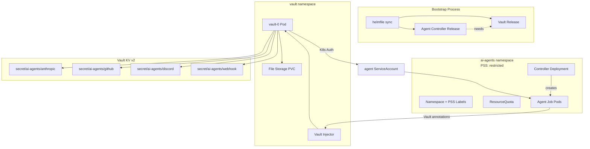

## Context

Link to PRD: [Hardened IaC Bootstrap](../prds/hardened-iac-bootstrap.html)

The AI agent infrastructure (controller, publisher pipeline, journalist
cron) runs on Rancher Desktop but was built incrementally with manual
commands. It stores 13+ secrets in plain K8s Secrets, has no PSS
enforcement, and no ResourceQuota. Meanwhile, the OpenClaw deployment
— which the agent stack is replacing — already uses Vault, PSS
restricted, and quotas. This design doc addresses how to bring the
agent stack to the same (or better) security posture while making the
entire setup reproducible from a single bootstrap process.

The technically interesting challenges are: (1) Vault Agent Injector
compatibility with PSS restricted (HashiCorp closed the feature request
as NOT_PLANNED), (2) secret delivery to short-lived Job pods vs.
long-running Deployments, and (3) orchestrating a dependency-ordered
bootstrap where Vault must be running and unsealed before any agent
pod can start.

## Goals and Non-Goals

**Goals:**
- Single-command bootstrap from bare K3s to fully operational agent stack
- All agent pod secrets delivered via Vault (zero plain-text K8s Secrets
  for agent workloads)
- PSS restricted enforcement on the `ai-agents` namespace
- ResourceQuota limiting resource consumption in `ai-agents`
- Portable IaC using standard K8s APIs (no K3s-specific resources)
- Consolidated directory structure under `infra/ai-agents/`

**Non-Goals:**
- Cloud K8s deployment or verification (local Rancher Desktop only)
- GitOps reconciliation (Argo CD, Flux)
- Automated Vault unsealing (manual unseal after reboot is acceptable)
- OpenClaw migration or maintenance (being replaced)
- Per-agent-type Vault policies (v1 uses one shared policy)
- IaC linting or CI validation
- Helm umbrella chart

## Proposed Design

### Architecture Overview



### Component Details

#### Helmfile (Bootstrap Orchestrator)

- **Responsibility:** Declare all Helm releases with dependency ordering
  and environment-specific values
- **File path:** `infra/ai-agents/helmfile.yaml`
- **Key interfaces:**
  - `helmfile sync` — full install from scratch
  - `helmfile apply` — idempotent apply (diff + sync)
  - Environment values override via `infra/ai-agents/environments/`

The helmfile declares two releases: `vault` (HashiCorp Helm chart) and
`agent-controller` (local chart). The agent-controller release uses
`needs: ["vault/vault"]` to ensure Vault is installed first. A
`postsync` hook on the vault release calls a script that waits for
Vault readiness but does **not** auto-init or auto-unseal — those
remain manual steps (init is one-time; unseal is post-reboot).

#### Vault Configuration

- **Responsibility:** Secret storage, K8s auth, audit logging, agent
  secret injection
- **File path:** `infra/ai-agents/vault/`
- **Key interfaces:**
  - K8s auth method bound to `agent-controller` ServiceAccount in
    `ai-agents` namespace
  - Vault policy `ai-agents-read` granting read on
    `secret/data/ai-agents/*`
  - Agent Injector annotations on controller-generated Job pods

Vault runs in its own `vault` namespace (reusing the existing Vault
installation from OpenClaw, reconfigured for the agent stack). The
Vault namespace gets PSS `baseline` with `warn: restricted` — the
Vault server and injector pods cannot fully satisfy PSS restricted
due to seccomp and capabilities requirements in the injector webhook.

#### Secret Structure (Vault KV v2)

Secrets are split by concern under `secret/ai-agents/`:

| Path | Keys |
|------|------|
| `secret/ai-agents/anthropic` | `oauth_token`, `disable_nonessential_traffic` |
| `secret/ai-agents/github` | `app_id`, `app_private_key`, `install_id` |
| `secret/ai-agents/discord` | `bot_token`, `guild_id`, `log_channel_id` |
| `secret/ai-agents/webhook` | `token` |
| `secret/ai-agents/openrouter` | `api_key` |

The controller Deployment and agent Job pods receive these via Vault
Agent Injector annotations. The injector writes secrets to an in-memory
tmpfs volume at `/vault/secrets/` — secrets never touch etcd.

#### Agent Controller Modifications

- **Responsibility:** Generate Job pods with Vault annotations and PSS-
  compliant security contexts
- **File path:** `infra/ai-agents/agent-controller/` (moved from
  `infra/ai-agents/agent-controller/`)
- **Key interfaces:**
  - Job pod specs include Vault Agent Injector annotations for secret
    injection
  - All pod specs include `seccompProfile: RuntimeDefault` at pod level
  - Init containers and main containers drop all capabilities
  - Job pods source env vars from `/vault/secrets/config` instead of
    K8s Secret `envFrom`

The controller Go code must be modified to:
1. Add Vault annotations to generated Job pod specs
2. Add pod-level `seccompProfile: RuntimeDefault`
3. Add `capabilities: {drop: ["ALL"]}` to all containers
4. Replace `envFrom` secret references with a shell source pattern
   (`. /vault/secrets/config`) in the entrypoint command

Note: JSON-patch annotations for injected containers are NOT needed.
Vault chart v0.29.1 injected containers satisfy PSS restricted by default
(confirmed in TASK-002 spike).

#### Namespace Manifest

- **Responsibility:** Define the `ai-agents` namespace with PSS labels
  and be the anchor for ResourceQuota
- **File path:** `infra/ai-agents/agent-controller/helm/templates/namespace.yaml`
- **Key interfaces:**
  - PSS labels: `enforce: restricted`, `warn: restricted`
  - Created by Helm chart (not `--create-namespace`)

#### ResourceQuota

- **Responsibility:** Bound total resource consumption in `ai-agents`
- **File path:** `infra/ai-agents/agent-controller/helm/templates/resourcequota.yaml`

Conservative limits matching the single-pipeline model:

| Resource | Limit |
|----------|-------|
| `requests.cpu` | 2 |
| `requests.memory` | 4Gi |
| `limits.cpu` | 4 |
| `limits.memory` | 8Gi |
| `pods` | 8 |

The controller Deployment (50m CPU / 64Mi) leaves ample room for
agent Jobs. Pod count of 8 allows for the controller + a few
concurrent Jobs with their Vault init/sidecar containers.

Note: completed Job pods continue to consume quota until deleted.
The existing `ttlSecondsAfterFinished: 3600` on agent Jobs handles
cleanup. This is sufficient for the single-pipeline model.

#### NetworkPolicy Updates

The existing `agent-egress` NetworkPolicy needs two changes:

1. **Add Vault egress:** Allow TCP 8200 to the `vault` namespace
   (agent pods need to reach Vault for secret injection)
2. **Add controller ingress:** Allow ingress from `kube-system` to
   the controller on port 8080 (defense-in-depth for webhook, even
   though `kubectl port-forward` bypasses NetworkPolicy)

#### Directory Consolidation

Move all agent infrastructure under `infra/ai-agents/`:

```
infra/ai-agents/
  helmfile.yaml
  environments/
    default.yaml          # StorageClass, resource limits, image tags
  vault/
    values.yaml           # Vault Helm chart values
    policy.hcl            # ai-agents-read Vault policy
    network-policy.yaml   # Vault namespace NetworkPolicy
  agent-controller/       # (moved from infra/ai-agents/agent-controller/)
    helm/
      templates/
        namespace.yaml    # NEW: PSS labels
        resourcequota.yaml # NEW
        networkpolicy.yaml # MODIFIED: Vault egress + controller ingress
        deployment.yaml   # MODIFIED: Vault annotations
        secret.yaml       # DELETED (replaced by Vault)
        ...
    pkg/
      controller/
        controller.go     # MODIFIED: Vault annotations on Jobs
    ...
  ai-agent-runtime/       # (moved from infra/ai-agents/ai-agent-runtime/)
    ...
  bin/
    bootstrap.sh          # Wraps helmfile sync + prints manual steps
    store-secrets.sh      # Interactive Vault secret storage
    unseal.sh             # Post-reboot Vault unseal + health check
```

### API / Interface Contracts

#### Vault Agent Injector Annotations (on Job pods)

```yaml
annotations:
  vault.hashicorp.com/agent-inject: "true"
  vault.hashicorp.com/role: "ai-agents"
  vault.hashicorp.com/agent-inject-secret-config: "secret/ai-agents/anthropic"
  vault.hashicorp.com/agent-inject-template-config: |
    {{- with secret "secret/ai-agents/anthropic" -}}
    export CLAUDE_CODE_OAUTH_TOKEN="{{ .Data.data.oauth_token }}"
    export CLAUDE_CODE_DISABLE_NONESSENTIAL_TRAFFIC="{{ .Data.data.disable_nonessential_traffic }}"
    {{- end }}
    {{- with secret "secret/ai-agents/github" -}}
    export GITHUB_APP_ID="{{ .Data.data.app_id }}"
    export GITHUB_APP_PRIVATE_KEY="{{ .Data.data.app_private_key }}"
    export GITHUB_INSTALL_ID="{{ .Data.data.install_id }}"
    {{- end }}
    {{- with secret "secret/ai-agents/discord" -}}
    export DISCORD_BOT_TOKEN="{{ .Data.data.bot_token }}"
    export DISCORD_GUILD_ID="{{ .Data.data.guild_id }}"
    export DISCORD_LOG_CHANNEL_ID="{{ .Data.data.log_channel_id }}"
    {{- end }}
    {{- with secret "secret/ai-agents/webhook" -}}
    export AI_WEBHOOK_TOKEN="{{ .Data.data.token }}"
    {{- end }}
    {{- with secret "secret/ai-agents/openrouter" -}}
    export OPENROUTER_API_KEY="{{ .Data.data.api_key }}"
    {{- end }}
  # No agent-json-patch or agent-init-json-patch needed.
  # Vault chart v0.29.1 injected containers already include:
  # - allowPrivilegeEscalation: false
  # - capabilities.drop: [ALL]
  # - runAsNonRoot: true
  # seccompProfile: RuntimeDefault is satisfied via pod-level inheritance.
  # (Confirmed by TASK-002 spike 2026-03-17)
```

#### Bootstrap Script Interface

```
Usage: bin/bootstrap.sh [--build-images]

Prereqs: kubectl, helm, helmfile, docker on PATH; cluster reachable
Secrets: Vault init is manual; secrets stored via bin/store-secrets.sh

Steps:
  1. helmfile sync (installs Vault + agent controller)
  2. Prints manual steps: vault init, unseal, store secrets
  3. Applies CRDs and sample AgentTask manifests
```

#### Post-Reboot Unseal Script Interface

```
Usage: bin/unseal.sh

Reads: ~/.vault-init (unseal key)
Steps:
  1. Unseals Vault
  2. Verifies Vault is ready
  3. Checks agent controller pod is Running
  4. Reports status
```

## Alternatives Considered

### Decision: Bootstrap orchestration tool

| Option | Pros | Cons | Verdict |
|--------|------|------|---------|
| Helmfile | Declarative YAML, dependency ordering via `needs`, portable across K8s distros, parallel install of independent releases | Adds one binary dependency (`helmfile`) | **Chosen** — best balance of declarative config and portability |
| Shell script | Zero dependencies beyond helm/kubectl, easiest to understand | Least declarative, dependency ordering is manual, harder to make idempotent | Rejected — too fragile for multi-release ordering |
| K3s HelmChart CRD | Zero-dependency on K3s, declarative | K3s-specific (violates portability requirement), no dependency ordering | Rejected — violates PRD portability constraint |
| Makefile | No extra binary, dependency ordering via prerequisites | Not declarative for Helm releases, awkward for values files | Rejected — poor fit for Helm-native workflows |

### Decision: Secret delivery mechanism

| Option | Pros | Cons | Verdict |
|--------|------|------|---------|
| Vault Agent Injector | Secrets on tmpfs (never in etcd), auto-renewal, existing pattern from OpenClaw; injected containers satisfy PSS restricted out-of-the-box in chart v0.29.1 (no JSON-patch needed) | Heavier (sidecar per pod) | **Chosen** — spike confirmed |
| Vault Secrets Operator | Lighter-weight, Helm values can satisfy PSS restricted | Syncs to K8s Secrets (stored in etcd), partially defeats purpose of Vault migration | Fallback if Injector fails spike |
| Vault CSI Provider | No etcd storage, lighter than Injector | No auto-renewal, socket permission issue (#296) blocks non-root, unresolved upstream | Rejected — too many open issues |

TASK-002 spike confirmed Agent Injector passes PSS restricted without
any JSON-patch annotations (Vault chart v0.29.1, 2026-03-17). Option A
is chosen. Fallback to Vault Secrets Operator is not needed.

### Decision: Vault storage backend

| Option | Pros | Cons | Verdict |
|--------|------|------|---------|
| File storage | Simple, proven, already in use for OpenClaw Vault | Single-node only, migration needed if going multi-node | **Chosen** — sufficient for single-node K3s, avoids unnecessary complexity |
| Raft integrated storage | Multi-node ready, no migration needed later | More complex setup, overkill for single-node | Rejected — YAGNI for v1 |

### Decision: Vault namespace PSS level

| Option | Pros | Cons | Verdict |
|--------|------|------|---------|
| PSS baseline + warn restricted | Vault server works without mlock; Injector webhook avoids seccomp violations | Not fully restricted | **Chosen** — Injector webhook cannot satisfy restricted without upstream changes |
| PSS restricted | Maximum security | Vault Injector webhook pod violates restricted (no seccomp, no capabilities drop in chart defaults); requires extensive overrides that may break functionality | Rejected — risk of breaking Vault webhook |
| No PSS | Simplest | Misses the security goal entirely | Rejected — contradicts PRD |

### Decision: Secret path structure

| Option | Pros | Cons | Verdict |
|--------|------|------|---------|
| Split by concern | Enables future per-agent-type policies, clear ownership | More Vault paths to manage, more complex injection template | **Chosen** — forward-compatible with fine-grained access control |
| Single path | Simpler policy, one injection template | All-or-nothing access, no granularity for future scoping | Rejected — doesn't set up for per-agent policies |

### Decision: Directory structure

| Option | Pros | Cons | Verdict |
|--------|------|------|---------|
| `infra/ai-agents/` (consolidated) | Single directory for all agent infra, clear ownership, one helmfile | Requires moving existing files | **Chosen** — clean separation, matches the "one system" mental model |
| `infra/ai-agents/agent-controller/` (keep existing) | No file moves needed | Vault config, runtime image, and controller scattered across directories | Rejected — fragmented ownership |

## File Change List

| Action | File | Rationale |
|--------|------|-----------|
| CREATE | `infra/ai-agents/helmfile.yaml` | Bootstrap orchestration with dependency ordering |
| CREATE | `infra/ai-agents/environments/default.yaml` | Environment-specific values (StorageClass, resource limits) |
| CREATE | `infra/ai-agents/vault/values.yaml` | Vault Helm chart values (based on existing openclaw config) |
| CREATE | `infra/ai-agents/vault/policy.hcl` | `ai-agents-read` Vault policy for agent secret access |
| CREATE | `infra/ai-agents/vault/network-policy.yaml` | Vault namespace NetworkPolicy allowing ai-agents ingress |
| CREATE | `infra/ai-agents/bin/bootstrap.sh` | Wrapper around helmfile sync + manual step instructions |
| CREATE | `infra/ai-agents/bin/store-secrets.sh` | Interactive Vault secret storage for agent secrets |
| CREATE | `infra/ai-agents/bin/unseal.sh` | Post-reboot Vault unseal + health verification |
| MOVE | `infra/ai-agents/agent-controller/` → `infra/ai-agents/agent-controller/` | Directory consolidation |
| MOVE | `infra/ai-agents/ai-agent-runtime/` → `infra/ai-agents/ai-agent-runtime/` | Directory consolidation |
| CREATE | `infra/ai-agents/agent-controller/helm/templates/namespace.yaml` | Namespace with PSS restricted labels |
| CREATE | `infra/ai-agents/agent-controller/helm/templates/resourcequota.yaml` | Conservative resource limits |
| MODIFY | `infra/ai-agents/agent-controller/helm/templates/networkpolicy.yaml` | Add Vault egress + controller ingress rules |
| MODIFY | `infra/ai-agents/agent-controller/helm/templates/deployment.yaml` | Add Vault annotations for controller pod secrets |
| DELETE | `infra/ai-agents/agent-controller/helm/templates/secret.yaml` | Replaced by Vault secret injection |
| MODIFY | `infra/ai-agents/agent-controller/helm/values.yaml` | Remove secrets block, add Vault config values |
| MODIFY | `infra/ai-agents/agent-controller/pkg/controller/controller.go` | Add Vault annotations + PSS security context to Job specs |
| MODIFY | `infra/ai-agents/agent-controller/helm/templates/deployment.yaml` | Add seccompProfile to controller pod |
| DELETE | `infra/ai-agents/agent-controller/bin/setup.sh` | Replaced by helmfile-based bootstrap |
| CREATE | `apps/blog/blog/markdown/wiki/devops/bootstrap.md` | Wiki guide: bootstrap steps, post-reboot, troubleshooting |

## Task Breakdown

### TASK-001: Directory consolidation and helmfile skeleton ✓ COMPLETE

- **Requirement:** PRD Story "Bootstrap from scratch" — single bootstrap process
- **Files:** `infra/ai-agents/helmfile.yaml`, `infra/ai-agents/environments/default.yaml`
- **Dependencies:** None
- **Acceptance criteria:**
  - [x] `infra/ai-agents/agent-controller/` moved to `infra/ai-agents/agent-controller/`
  - [x] `infra/ai-agents/ai-agent-runtime/` moved to `infra/ai-agents/ai-agent-runtime/`
  - [x] `helmfile.yaml` declares vault and agent-controller releases with `needs` dependency
  - [x] `environments/default.yaml` has configurable StorageClass (default `local-path`)
  - [x] `helmfile lint` passes with no errors
  - [x] Go module paths updated if needed after directory move
  - [x] No K3s-specific or Rancher Desktop-specific APIs in any manifest (standard K8s only)

### TASK-002: Vault secret delivery spike `[P]` ✓ COMPLETE

- **Requirement:** PRD Open Question #5 — select secret delivery mechanism
- **Files:** (spike — temporary test manifests, not committed)
- **Dependencies:** TASK-001
- **Acceptance criteria:**
  - [x] Agent Injector with `agent-json-patch` and `agent-init-json-patch` annotations tested against PSS restricted namespace — **JSON-patch not needed; base annotations pass**
  - [x] Verify injected init container and sidecar both satisfy: `seccompProfile: RuntimeDefault` (via pod-level inheritance), `capabilities.drop: [ALL]` ✓, `runAsNonRoot: true` ✓, `allowPrivilegeEscalation: false` ✓
  - [x] Agent Injector passes: documented in Implementation Additions (no JSON-patch required)
  - [x] `capabilities.drop: [ALL]` verified on injected containers — present by default in Vault chart v0.29.1
  - [x] Decision recorded in Implementation Additions section

### TASK-003: Namespace manifest with PSS labels ✓ COMPLETE

- **Requirement:** PRD Story "PSS-enforced namespace with resource quotas"
- **Files:** `infra/ai-agents/agent-controller/helm/templates/namespace.yaml`
- **Dependencies:** TASK-001
- **Acceptance criteria:**
  - [x] Namespace manifest has `pod-security.kubernetes.io/enforce: restricted` and `warn: restricted` labels
  - [x] Helm chart no longer relies on `--create-namespace`
  - [x] `helm upgrade --install` applies the namespace manifest correctly
  - [x] Existing pods in `ai-agents` namespace are audited for PSS restricted compliance

### TASK-004: ResourceQuota ✓ COMPLETE

- **Requirement:** PRD Story "PSS-enforced namespace with resource quotas"
- **Files:** `infra/ai-agents/agent-controller/helm/templates/resourcequota.yaml`
- **Dependencies:** TASK-003
- **Acceptance criteria:**
  - [x] ResourceQuota created with: `requests.cpu: 2`, `requests.memory: 4Gi`, `limits.cpu: 4`, `limits.memory: 8Gi`, `pods: 8`
  - [x] Controller Deployment has explicit resource requests and limits (already does: 50m/64Mi req, 200m/128Mi limit)
  - [x] Agent Job pods have explicit resource requests and limits that fit within quota
  - [x] A test Job can be created and completed without quota rejection

### TASK-005: Controller PSS compliance (seccomp + capabilities) ✓ COMPLETE

- **Requirement:** PRD Story "PSS-enforced namespace with resource quotas" — all pods schedule under restricted
- **Files:** `infra/ai-agents/agent-controller/pkg/controller/controller.go`, `infra/ai-agents/agent-controller/helm/templates/deployment.yaml`
- **Dependencies:** TASK-002 (spike confirmed — no JSON-patch needed), TASK-003
- **Acceptance criteria:**
  - [x] Controller Deployment pod spec has `securityContext.seccompProfile.type: RuntimeDefault` at pod level
  - [x] Controller Go code sets pod-level `seccompProfile: RuntimeDefault` on generated Job specs
  - [x] Controller Go code sets `capabilities: {drop: ["ALL"]}` on all containers in generated Job specs (init + main)
  - [x] All generated Job pods pass PSS restricted admission (no warnings in `kubectl get events`)

### TASK-006: Vault configuration for agent stack

- **Requirement:** PRD Story "Vault-managed secrets for agent workloads"
- **Files:** `infra/ai-agents/vault/values.yaml`, `infra/ai-agents/vault/policy.hcl`, `infra/ai-agents/vault/network-policy.yaml`
- **Dependencies:** TASK-001
- **Acceptance criteria:**
  - [x] Vault values file configures standalone mode, file storage on PVC with configurable StorageClass (from environment values), no TLS (internal only), no UI; GCP KMS auto-unseal configured (seal type `gcpckms`)
  - [x] Vault policy `ai-agents-read` grants read on `secret/data/ai-agents/*` and `secret/metadata/ai-agents/*`
  - [x] Vault NetworkPolicy allows ingress from `ai-agents` namespace on TCP 8200
  - [x] Vault namespace has PSS `baseline` enforce + `restricted` warn labels
  - [x] Vault audit logging enabled (stdout)

### TASK-007: Vault K8s auth and secret storage scripts

- **Requirement:** PRD Story "Vault-managed secrets for agent workloads" — K8s auth, scoped policy
- **Files:** `infra/ai-agents/bin/store-secrets.sh`, helmfile postsync hook script
- **Dependencies:** TASK-006
- **Acceptance criteria:**
  - [x] K8s auth method configured: role `ai-agents` bound to `agent-controller` ServiceAccount in `ai-agents` namespace
  - [x] `store-secrets.sh` interactively prompts for secrets split by concern (anthropic, github, discord, webhook, openrouter)
  - [x] `store-secrets.sh` uses `vault kv patch` (merge) with `put` fallback
  - [x] Secrets stored at correct paths: `secret/ai-agents/anthropic`, `secret/ai-agents/github`, etc.
  - [x] Agent pod can authenticate to Vault and read secrets (verified with test pod)

### TASK-008: Controller Vault integration (replace K8s Secrets)

- **Requirement:** PRD Story "Vault-managed secrets for agent workloads" — secrets from Vault at runtime
- **Files:** `infra/ai-agents/agent-controller/pkg/controller/controller.go`, `infra/ai-agents/agent-controller/helm/templates/deployment.yaml`
- **Dependencies:** TASK-002 (spike), TASK-005, TASK-007
- **Acceptance criteria:**
  - [x] Controller Deployment has Vault Agent Injector annotations for its own secrets
  - [x] Controller Go code adds Vault annotations to generated Job pod specs
  - [x] Job entrypoint sources env vars from `/vault/secrets/config` instead of K8s Secret `envFrom`
  - [x] Vault injection template renders all required env vars (anthropic, github, discord, webhook, openrouter)
  - [x] Agent Job completes successfully with secrets sourced from Vault

### TASK-009: Delete K8s Secret template and clean up Helm values `[P]`

- **Requirement:** PRD Success Metric "Zero plain-text K8s Secrets for agent workloads"
- **Files:** `infra/ai-agents/agent-controller/helm/templates/secret.yaml`, `infra/ai-agents/agent-controller/helm/values.yaml`
- **Dependencies:** TASK-008
- **Acceptance criteria:**
  - [x] `secret.yaml` template deleted from Helm chart
  - [x] `secrets` block removed from `values.yaml`
  - [x] `helm upgrade` does not create or update the `agent-secrets` K8s Secret
  - [x] Existing `agent-secrets` K8s Secret manually deleted from cluster
  - [x] No pod references `agent-secrets` via `envFrom` or `valueFrom`

### TASK-010: NetworkPolicy updates (Vault egress + controller ingress)

- **Requirement:** PRD Story "Sandboxed execution" (from autonomous-publisher PRD, carried forward)
- **Files:** `infra/ai-agents/agent-controller/helm/templates/networkpolicy.yaml`
- **Dependencies:** TASK-006
- **Acceptance criteria:**
  - [x] Agent pods can reach Vault on TCP 8200 (egress rule to vault namespace)
  - [x] Controller ingress allows from `kube-system` on port 8080
  - [x] Existing egress rules (DNS to kube-system, HTTP/HTTPS to public IPs) preserved
  - [x] Agent pods cannot reach other RFC1918 addresses (existing exclusion maintained)

### TASK-011: Bootstrap script and post-reboot unseal script

- **Requirement:** PRD Story "Bootstrap from scratch", PRD Story "Post-reboot recovery"
- **Files:** `infra/ai-agents/bin/bootstrap.sh`, `infra/ai-agents/bin/unseal.sh`
- **Dependencies:** TASK-001, TASK-006, TASK-007
- **Acceptance criteria:**
  - [x] `bootstrap.sh` checks prerequisites (kubectl, helm, helmfile, docker)
  - [x] `bootstrap.sh` runs `helmfile sync` and prints manual post-install steps (vault init, unseal, store-secrets)
  - [x] `bootstrap.sh` applies CRDs and sample AgentTask manifests (journalist cron, publisher manual)
  - [x] `bootstrap.sh` is idempotent (running twice produces no errors)
  - [x] `unseal.sh` N/A — GCP KMS auto-unseal replaces manual unseal
  - [x] `unseal.sh` N/A — GCP KMS auto-unseal replaces manual unseal
  - [x] Old `infra/ai-agents/agent-controller/bin/setup.sh` deleted

### TASK-012: Wiki guide

- **Requirement:** PRD Story "Bootstrap from scratch" — documented entry point; PRD Story "Post-reboot recovery" — troubleshooting
- **Files:** `apps/blog/blog/markdown/wiki/devops/bootstrap.md`
- **Dependencies:** TASK-011
- **Acceptance criteria:**
  - [x] Prerequisites section lists: kubectl, helm, helmfile, docker, cluster access
  - [x] Step-by-step bootstrap instructions match `bootstrap.sh` + manual Vault steps
  - [x] Post-reboot recovery section covers: unseal, verify, troubleshooting
  - [x] Troubleshooting section covers: Vault sealed, pods pending, webhook timeout, quota exhaustion
  - [x] A person with K8s experience can execute the bootstrap using only this guide

### TASK-013: Tear-down validation test

- **Requirement:** PRD Success Metric "Tear-down test passes"
- **Files:** (no new files — this is a manual verification task)
- **Dependencies:** All previous tasks
- **Acceptance criteria:**
  - [x] Reset Rancher Desktop to base K3s (factory reset)
  - [x] Run `bootstrap.sh`, complete manual Vault init/unseal/store-secrets
  - [x] Agent controller pod is Running (2/2)
  - [x] Trigger a journalist run — completes successfully (wrote 2026-03-18 news digest, posted to Discord)
  - [x] Trigger a publisher run — completes successfully (agent completed, pushed branch; PR creation skipped — no code changes from list-only prompt)
  - [x] `kubectl get secrets -n ai-agents` shows no `agent-secrets` object (only Helm release secrets)
  - [x] `kubectl get events -n ai-agents` shows no PSS violations (only quota events from concurrent startup)
  - [x] Cron schedule `0 12 * * *` (noon UTC) — GCP KMS auto-unseal means Vault is ready before cron fires; no manual re-triggering needed

## Implementation Additions

### TASK-002 Spike: Vault Agent Injector + PSS Restricted (2026-03-17)

**Result: Option A confirmed. JSON-patch annotations are NOT required.**

Vault Helm chart v0.29.1 injects containers that already satisfy all PSS
restricted requirements by default. Tested against a `vault-pss-spike`
namespace with `pod-security.kubernetes.io/enforce=restricted`.

**Observed security context on injected containers (vault-agent-init and vault-agent):**

```json
{
  "allowPrivilegeEscalation": false,
  "capabilities": { "drop": ["ALL"] },
  "readOnlyRootFilesystem": true,
  "runAsGroup": 1000,
  "runAsNonRoot": true,
  "runAsUser": 100
}
```

`seccompProfile: RuntimeDefault` is not set per-container on injected
containers, but PSS restricted allows inheritance from the pod-level
`securityContext.seccompProfile`. With `seccompProfile: RuntimeDefault`
set at the pod level (as shown in the openclaw statefulset), all injected
containers satisfy the requirement.

**Required annotation set (no JSON-patch needed):**

```yaml
vault.hashicorp.com/agent-inject: "true"
vault.hashicorp.com/role: "ai-agents"
vault.hashicorp.com/agent-inject-secret-<name>: "<vault-path>"
vault.hashicorp.com/agent-inject-template-<name>: |
  {{- with secret "<vault-path>" -}}
  export KEY="{{ .Data.data.value }}"
  {{- end }}
```

Pod spec must include pod-level `securityContext.seccompProfile.type: RuntimeDefault`
to satisfy the seccompProfile inheritance. This is already the pattern from openclaw.

**No evidence of `agent-json-patch` or `agent-init-json-patch` annotations being required.**
The design doc's proposed JSON-patch annotations (path `/securityContext/capabilities`)
are unnecessary for Vault chart v0.29.1 — remove them from TASK-008 implementation.

**Spike also confirmed:** Zero PSS events (no warnings), secret injection
working (`/vault/secrets/config` readable by application container).

### GCP KMS Auto-Unseal (2026-03-17)

Vault is configured to auto-unseal via GCP Cloud KMS instead of Shamir keys.
On restart, Vault calls GCP KMS to decrypt its master key — no manual unseal step required.

**Resources created:**
- KMS keyring: `vault-unseal` (region `us-east1`, project `kylepericak`)
- KMS key: `ai-agents` (symmetric, software protection)
- Service account: `vault-unseal-ai-agents@kylepericak.iam.gserviceaccount.com`
- Custom IAM role: `projects/kylepericak/roles/vaultUnsealKMS`
  — permissions: `cloudkms.cryptoKeys.get`, `cloudkms.cryptoKeyVersions.useToEncrypt`,
    `cloudkms.cryptoKeyVersions.useToDecrypt` (bound to the specific key only)

**Credentials file:** `infra/ai-agents/vault/gcp-credentials.json` (gitignored).
Loaded into a K8s Secret `gcp-credentials` in the `vault` namespace.
Vault mounts it at `/vault/userconfig/gcp-credentials/gcp-credentials.json`
via `GOOGLE_APPLICATION_CREDENTIALS`.

**To regenerate `gcp-credentials.json` on a new machine:**
```bash
gcloud iam service-accounts keys create \
  infra/ai-agents/vault/gcp-credentials.json \
  --iam-account=vault-unseal-ai-agents@kylepericak.iam.gserviceaccount.com \
  --project=kylepericak
kubectl create secret generic gcp-credentials \
  --from-file=gcp-credentials.json=infra/ai-agents/vault/gcp-credentials.json \
  --namespace=vault --dry-run=client -o yaml | kubectl apply -f -
```

**`~/.vault-init` format changed:** No longer stores an unseal key.
Only stores `VAULT_ROOT_TOKEN` and 5 `VAULT_RECOVERY_KEY_*` entries
(recovery keys protect against KMS key loss — need 3-of-5 to regenerate root token).

**Cost:** ~$0.06/month for the KMS key. First 20K operations/month free;
auto-unseal on restart uses ≪1K operations/month.

### TASK-005 Implementation: emptyDir for write agents (2026-03-17)

**Problem encountered:** Pod-level `runAsUser: 1001` combined with hostPath PVCs broke write
agents. K3s/containerd does NOT apply `fsGroup` ownership changes to hostPath volumes.
HostPath directories created by kubelet (`HostPathDirectoryOrCreate`) are `root:root 755`.
UID 1001 can't create subdirectories, so git clone failed.

**Fix 1 — Shared workspace chmod:** Applied `chmod 1777` to `/tmp/agent-workspace` and
`/tmp/agent-workspace/branches` on the Lima VM via `rdctl shell`. Required for the shared
`agent-workspace` PVC used by read-only agents. One-time infra step; add to bootstrap
runbook.

**Fix 2 — emptyDir for write agents:** Switched write agents (journalist, publisher, qa)
from per-branch hostPath PVCs to `emptyDir` volumes. EmptyDir is created fresh per pod
and is writable by UID 1001. Write agents push all work to GitHub before pod termination,
so ephemeral workspace is safe. Per-branch PV/PVC creation eliminated for write agents;
`cleanupBranchPVCs` still runs but finds no new branch PVCs to clean up.

**Fix 3 — Remove git config global:** The non-write agent gitSyncArgs previously ran
`git config --global --add safe.directory` to suppress git's "unsafe directory" warning.
Running as UID 1001 with HOME=/root, this failed (can't write to /root/.gitconfig). Since
the workspace (`/workspace/repo`) is owned by UID 1001, the safe.directory check doesn't
apply. Removed the git config step.

**Image tag 0.7** includes all three fixes. Controller Deployment pod spec also had
`seccompProfile` moved from container level to pod level.

## Open Questions

- **JSON Patch `add` vs `replace`:** ~~Resolved by TASK-002 spike.~~
  JSON-patch annotations are not needed. Vault chart v0.29.1 injected
  containers already satisfy PSS restricted. No `agent-json-patch` or
  `agent-init-json-patch` annotations are required.

- **Vault Injector + capabilities.drop:** ~~Resolved by TASK-002 spike.~~
  `capabilities.drop: [ALL]` **is** set by default on injected containers
  (vault-agent-init and vault-agent) in Vault chart v0.29.1. No JSON-patch
  needed to add it.

- **GitHub App private key in Vault:** The `GITHUB_APP_PRIVATE_KEY` is
  a multi-line PEM file. Vault KV v2 stores it as a string, but the
  injection template must preserve newlines. The `store-secrets.sh`
  script needs to handle file-based input (not interactive prompt) for
  this key. What blocks: TASK-007 implementation.

- **Controller's own secrets:** The controller Deployment currently reads
  `GITHUB_APP_PRIVATE_KEY` from the K8s Secret to sign JWTs for GitHub
  App auth. With Vault injection, the controller must read the PEM from
  a file (`/vault/secrets/github-key`) instead of an env var. This
  requires a code change in `controller.go` to support file-based key
  loading. What blocks: TASK-008 implementation.

## Risks

- ~~**Vault Agent Injector PSS failure.**~~ **Resolved.** TASK-002 spike
  (2026-03-17) confirmed Vault chart v0.29.1 injected containers satisfy
  all PSS restricted requirements by default. No JSON-patch workaround
  needed. Fallback to Vault Secrets Operator is not required.

- **Bootstrap order sensitivity.** Vault must be running and unsealed
  before agent pods can start. If helmfile installs the agent controller
  before Vault is ready (despite `needs`), pods will crash-loop.
  Mitigation: helmfile `needs` + postsync readiness check on Vault
  release + manual unseal step documented clearly.

- **Vault webhook timeout on K3s.** K3s runs the API server as a binary,
  not a pod, which can cause webhook timeouts if the Vault Injector
  mutating webhook isn't reachable during pod creation. Mitigation:
  bootstrap script waits for Vault Injector webhook to be ready before
  proceeding.

- **Completed Jobs consuming quota.** Agent Jobs with
  `ttlSecondsAfterFinished: 3600` hold quota for up to an hour after
  completion. With `pods: 8` quota and conservative CPU/memory limits,
  a burst of failed Jobs could temporarily exhaust quota. Mitigation:
  single-pipeline model limits concurrency; monitoring via Discord
  notifications.

- **Multi-line PEM in Vault template.** The GitHub App private key is
  a multi-line PEM that must survive Vault template rendering without
  newline corruption. If the Go template `{{ .Data.data.app_private_key }}`
  mangles newlines, the controller's JWT signing will fail silently.
  Mitigation: test PEM round-trip in TASK-007.

- **Directory move breaks CI/references.** Moving `infra/ai-agents/agent-controller/`
  may break Docker build paths, Go module paths, or references in
  `CLAUDE.md` and wiki pages. Mitigation: TASK-001 includes updating
  all references; `trivy` skip-dirs in CLAUDE.md may need updating.
