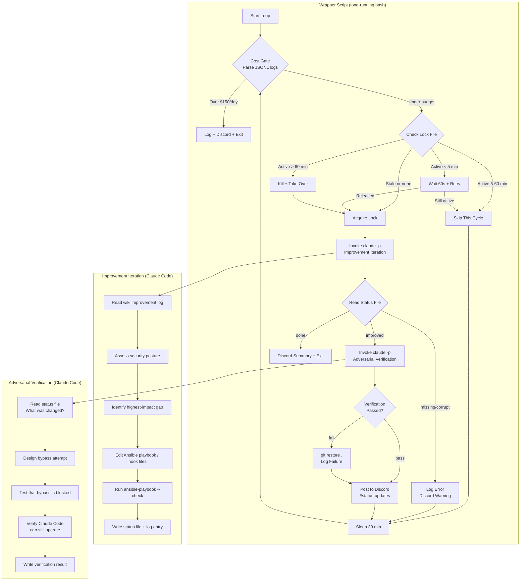

## Context

Link to PRD: [Autonomous Security Improvement Loop](../prds/security-improvement-loop.html)

The Mac workstation (`pai-m1`) runs Claude Code in bypass-permissions mode
with three safety hooks (`block-destructive.sh`, `protect-sensitive.sh`,
`audit-log.sh`) defined inline in the Ansible playbook. These hooks have
known detection gaps (e.g., `protect-sensitive.sh` doesn't block `cp`,
`mv`, or `vim` access to sensitive files), and no process exists to
discover new gaps or implement improvements autonomously.

The technically interesting challenges are: (1) making Claude Code improve
its own security controls without breaking its own autonomy, (2) using an
adversarial verification pattern where a separate Claude Code instance
tries to bypass each new security measure, and (3) a cost-gated wrapper
that parses JSONL session logs to enforce a daily spend cap before each
iteration.

## Goals and Non-Goals

**Goals:**
- Long-running bash wrapper that spawns Claude Code (`claude -p`) every
  30 minutes for iterative security improvement
- All changes persisted through the Ansible playbook (survives machine
  rebuild)
- Adversarial verification: separate Claude Code invocation tests each
  security measure before committing
- Cost gate: parse `~/.claude/projects/` JSONL logs in the wrapper to
  enforce $150/day spend cap before each iteration
- PID-based lock file for run coordination with stale lock detection
- Structured wiki improvement log at
  `wiki/design-docs/security-improvement-log.md`
- Discord #status-updates notifications via wrapper script
- Self-termination when no material improvements remain (status file
  signal)
- Extract inline hook scripts from playbook to standalone files (enables
  safer editing by the loop)

**Non-Goals:**
- Reducing Claude Code's autonomous capabilities (security without
  restricting autonomy)
- K8s infrastructure changes (covered by Hardened IaC Bootstrap)
- New scanning tools or MCP servers (uses existing tooling)
- Scheduled execution via launchd/cron (v1 is manually started)
- Permanent daemon or monitoring system (time-boxed effort)
- API token usage (must use Claude Code tokens via `claude` CLI)

## Proposed Design

### Architecture Overview



### Component Details

#### Wrapper Script

- **Responsibility:** Long-running loop orchestrating improvement
  iterations, cost gating, coordination, Discord notifications, and
  adversarial verification
- **File path:** `apps/agent-loops/macbook-security-loop/loop.sh`
- **Key interfaces:**
  - Reads `~/.claude/projects/` JSONL logs for cost calculation
  - Reads/writes lock file at `/tmp/sec-loop.lock`
  - Reads status file at `/tmp/sec-loop-status.json`
  - Posts to Discord via bot API (curl)
  - Sources `apps/blog/exports.sh` for secrets

The wrapper is a `while true` loop with `sleep 1800` between iterations.
It never invokes the Anthropic API directly — all AI work goes through
`claude -p` which bills to Claude Code tokens.

#### Cost Gate

- **Responsibility:** Calculate today's spend from JSONL session logs
  and abort if over $150
- **File path:** Inline in `loop.sh` (bash function)
- **Key interfaces:**
  - Reads all `*.jsonl` files under `~/.claude/projects/`
  - Uses the same LiteLLM pricing source as cc-usage MCP
  - Returns estimated daily spend as a dollar amount

The cost gate replicates a simplified version of the cc-usage MCP's
pricing logic in bash. It fetches the LiteLLM pricing JSON once per
loop invocation (cached to `/tmp/litellm-pricing.json` with 1-hour
TTL), then sums today's token costs across all session logs.

This is intentionally a rough estimate — the cc-usage MCP does precise
tiered pricing, but the wrapper only needs "over or under $150" accuracy.
A simpler approach: sum output tokens * worst-case model rate as an
upper-bound estimate.

#### Improvement Iteration Prompt

- **Responsibility:** Static prompt that tells Claude Code what to do
  each iteration
- **File path:** `apps/agent-loops/macbook-security-loop/prompt.md`
- **Key interfaces:**
  - Claude Code reads this as its `-p` prompt argument
  - Claude Code writes `/tmp/sec-loop-status.json` as output signal

The prompt instructs Claude Code to:
1. Read the wiki improvement log to understand past work
2. Read the Ansible playbook and hook scripts to assess current posture
3. Identify the highest-impact security gap
4. Implement the fix in the appropriate file (playbook or hook script)
5. Run `ansible-playbook --check` to validate syntax
6. Append an entry to the wiki improvement log
7. Write a status file indicating outcome (`improved` / `done`)

The prompt explicitly forbids:
- Changes that would break Claude Code's autonomy
- Editing files outside the Ansible-managed set (playbook, hook
  scripts, settings.json template) — no direct filesystem edits
- Installing new tools or creating new MCP servers

#### Adversarial Verification Prompt

- **Responsibility:** Separate Claude Code invocation that tests the
  security measure just implemented
- **File path:** `apps/agent-loops/macbook-security-loop/verify-prompt.md`
- **Key interfaces:**
  - Reads `/tmp/sec-loop-status.json` to understand what changed
  - Writes verification result to `/tmp/sec-loop-verify.json`

The adversarial verifier:
1. Reads the status file to learn what security measure was added
2. Designs a specific bypass attempt related to the measure
3. Executes the bypass attempt (expects it to be blocked)
4. Confirms Claude Code can still perform normal operations (read a
   file, run a command, edit a file)
5. Writes pass/fail result with details

This is a red-team pattern: the verifier acts as an attacker trying to
circumvent the new control. If the bypass succeeds, the change is
reverted.

#### Lock File Management

- **Responsibility:** Prevent concurrent loop instances from corrupting
  state
- **File path:** `/tmp/sec-loop.lock`
- **Key interfaces:**
  - Contains PID and start timestamp of the running wrapper
  - Created atomically via `noclobber` shell option
    (`(set -o noclobber; echo "$$:$(date +%s)" > "$lockfile")`)
  - `trap` on EXIT/INT/TERM/HUP removes the lock file
  - New invocations check if PID is alive via `kill -0`
  - PID reuse mitigation: lock file stores `PID:START_TIME`;
    validator compares stored start time against `ps -p $PID -o lstart=`

Stale lock detection: if the PID in the lock file is not running
(`kill -0 $PID` fails), the lock is stale. Clean it up and proceed.
If the PID is alive, the wrapper applies a deterministic
duration-based heuristic (note: the PRD suggests the Claude Code
instance decides, but making this a simple bash heuristic avoids
spawning an AI invocation just for coordination):
- Running < 5 min: wait 60s and retry (max once)
- Running 5-60 min: skip this cycle
- Running > 60 min: kill the stale process and take over

#### Wiki Improvement Log

- **Responsibility:** Structured record of all security improvements
  attempted and their outcomes
- **File path:**
  `apps/blog/blog/markdown/wiki/design-docs/security-improvement-log.md`
- **Key interfaces:**
  - Appended to by the improvement iteration (Claude Code)
  - Read by subsequent iterations to avoid repeating work

Each entry contains:
- Timestamp
- Finding (what security gap was identified)
- Change made (what file was modified, what was added)
- Verification method (what the adversarial verifier tested)
- Verification result (pass/fail)
- Commit hash

#### Discord Notifications

- **Responsibility:** Post iteration summaries to #status-updates
- **File path:** Inline in `loop.sh` (bash function)
- **Key interfaces:**
  - Uses Discord bot API via curl
  - Requires `DISCORD_BOT_TOKEN` and status-updates channel ID from
    `exports.sh`

Three notification types:
1. **Iteration complete:** What was found, what was changed, pass/fail
2. **Self-termination:** Total iterations, total improvements committed
3. **Cost-limit exit:** Why the loop stopped, current spend

#### Hook File Extraction

- **Responsibility:** Move inline hook scripts from playbook to
  standalone files for safer editing
- **File path:** `infra/mac-setup/hooks/block-destructive.sh`,
  `infra/mac-setup/hooks/protect-sensitive.sh`,
  `infra/mac-setup/hooks/audit-log.sh`
- **Key interfaces:**
  - Playbook changes from `content: |` to `src: hooks/<name>.sh`
  - Hook scripts become first-class files in the repo
  - The security loop edits these files instead of the playbook's
    inline content blocks

### Data Model

#### Status File (`/tmp/sec-loop-status.json`)

```json
{
  "action": "improved",
  "finding": "protect-sensitive.sh does not block cp/mv to sensitive files",
  "change": "Added cp, mv, rsync to blocked commands in protect-sensitive.sh",
  "file_changed": "infra/mac-setup/hooks/protect-sensitive.sh",
  "iteration": 3
}
```

Or for self-termination:

```json
{
  "action": "done",
  "reason": "No material security improvements remain. All known gaps addressed.",
  "total_iterations": 7,
  "total_improvements": 5
}
```

#### Verification Result (`/tmp/sec-loop-verify.json`)

```json
{
  "result": "pass",
  "bypass_attempted": "Tried to cp ~/.ssh/id_ed25519 to /tmp/stolen-key",
  "bypass_blocked": true,
  "autonomy_check": "Successfully read CLAUDE.md, ran echo test, edited temp file",
  "autonomy_intact": true
}
```

### API / Interface Contracts

#### Wrapper Script Interface

```
Usage: ./loop.sh [--dry-run]

Prerequisites:
  - claude CLI on PATH
  - source apps/blog/exports.sh (for DISCORD_BOT_TOKEN, channel IDs)

Env vars (from exports.sh):
  - DISCORD_BOT_TOKEN — Discord bot authentication
  - DISCORD_STATUS_CHANNEL_ID — #status-updates channel ID

Options:
  --dry-run  Run one iteration without committing or posting to Discord

Signals:
  SIGTERM/SIGINT — Clean shutdown, remove lock file, post Discord exit msg
```

#### Claude Code Invocation Pattern

```bash
# Improvement iteration
claude -p "$(cat prompt.md)" \
  --model sonnet \
  --output-format json \
  --max-turns 30 \
  --max-budget-usd 5.00 \
  --no-session-persistence \
  2>&1 | tee "/tmp/sec-loop-iter-${ITERATION}.log"

# Adversarial verification
claude -p "$(cat verify-prompt.md)" \
  --model sonnet \
  --output-format json \
  --max-turns 15 \
  --max-budget-usd 2.00 \
  --no-session-persistence \
  2>&1 | tee "/tmp/sec-loop-verify-${ITERATION}.log"
```

Key CLI flags:
- `--max-budget-usd` — per-invocation hard cap (defense-in-depth with
  the daily cost gate; prevents a single runaway iteration)
- `--no-session-persistence` — ephemeral invocations that don't
  accumulate session state on disk
- `--output-format json` — the `ResultMessage` includes
  `total_cost_usd` which the wrapper can accumulate for more accurate
  daily cost tracking than JSONL parsing alone

Note: piping stdin > ~7k characters to `claude -p` produces empty
output (known bug). The prompt files must stay under this limit, or
the wrapper should pass a file path in a short prompt instead.

## Alternatives Considered

### Decision: Wrapper language

| Option | Pros | Cons | Verdict |
|--------|------|------|---------|
| Bash script | Zero dependencies, runs anywhere macOS, matches existing playbook/hook pattern, tmux-friendly | Limited JSON parsing (needs jq), harder to maintain complex logic | **Chosen** — simplicity matches the task; jq handles JSON needs |
| Node.js with Claude Code SDK | Rich SDK, structured output, better error handling | Adds Node runtime dependency for wrapper, SDK uses API tokens not CC tokens | Rejected — SDK would bill to API tokens, not Claude Code tokens |
| Python script | Better JSON/string handling, rich standard library | Extra runtime dependency, doesn't match existing patterns | Rejected — adds complexity without meaningful benefit |

### Decision: Cost gate implementation

| Option | Pros | Cons | Verdict |
|--------|------|------|---------|
| Wrapper parses JSONL directly | No extra invocation cost, runs before Claude Code starts, fast | Reimplements cc-usage logic in bash (simplified) | **Chosen** — zero-cost check, prevents wasting tokens on over-budget iterations |
| Claude Code checks via MCP | Accurate pricing, uses existing cc-usage MCP | Costs tokens for every check, iteration starts before budget verified | Rejected — defeats purpose of cost control |
| External cost monitoring service | Most accurate, independent verification | Doesn't exist, would need to be built | Rejected — over-engineering for v1 |

### Decision: Verification approach

| Option | Pros | Cons | Verdict |
|--------|------|------|---------|
| Adversarial separate invocation | Independent verification, tests from attacker's perspective, catches cases where the change broke the model itself | Extra cost per iteration (~$0.50-1.00) | **Chosen** — strongest verification; cost is acceptable given 30-min intervals |
| Same-iteration self-check | No extra cost, immediate feedback | If the change broke Claude Code, it can't verify itself; fox guarding henhouse | Rejected — insufficient independence |
| Wrapper-only check (ansible --check) | Zero AI cost, fast | Can't test behavioral security (only syntax), no adversarial thinking | Rejected — too shallow for meaningful verification |

### Decision: Change target (hook files)

| Option | Pros | Cons | Verdict |
|--------|------|------|---------|
| Extract hooks to standalone files, playbook copies them | Safer editing (no YAML corruption risk), git diff is cleaner, standard pattern | Requires upfront refactor of playbook | **Chosen** — eliminates the highest-risk failure mode (YAML corruption breaking the entire playbook) |
| Edit playbook inline content blocks directly | No refactor needed, current pattern | YAML-sensitive, one bad indent breaks entire playbook | Rejected — too risky for autonomous editing |
| Loop only adds new hook scripts, never edits existing | Safest, additive-only | Can't fix existing gaps in current hooks | Rejected — too limiting; existing hooks have known gaps |

### Decision: Self-termination signal

| Option | Pros | Cons | Verdict |
|--------|------|------|---------|
| Status file (JSON) | Structured, extensible, carries context for Discord messages and verification | Extra file I/O | **Chosen** — provides rich context for the wrapper's decision-making |
| Exit code convention | Simple, no file I/O | Limited information (just a number), can't carry context | Rejected — wrapper needs to know what was changed for Discord and verification |
| Parse stdout for marker | No extra files | Fragile, depends on output format, `--output-format json` changes stdout structure | Rejected — too brittle |

### Decision: Prompt style

| Option | Pros | Cons | Verdict |
|--------|------|------|---------|
| Static template | Simple wrapper, model handles context discovery, no prompt construction logic | Model spends tokens re-reading the improvement log each iteration | **Chosen** — simplicity wins; reading the log is cheap relative to the improvement work |
| Dynamic with injected context | More efficient iterations, model starts with full context | Complex wrapper, brittle if log format changes, harder to debug | Rejected — premature optimization |

## File Change List

| Action | File | Rationale |
|--------|------|-----------|
| CREATE | `apps/agent-loops/macbook-security-loop/loop.sh` | Main wrapper script: loop, cost gate, lock file, Discord, orchestration |
| CREATE | `apps/agent-loops/macbook-security-loop/prompt.md` | Static prompt for improvement iterations |
| CREATE | `apps/agent-loops/macbook-security-loop/verify-prompt.md` | Static prompt for adversarial verification |
| CREATE | `infra/mac-setup/hooks/block-destructive.sh` | Extracted from playbook inline content |
| CREATE | `infra/mac-setup/hooks/protect-sensitive.sh` | Extracted from playbook inline content |
| CREATE | `infra/mac-setup/hooks/audit-log.sh` | Extracted from playbook inline content |
| MODIFY | `infra/mac-setup/playbook.yml` | Replace inline `content:` with `src:` for hook scripts; add DISCORD_STATUS_CHANNEL_ID to exports.sh.sample |
| CREATE | `apps/blog/blog/markdown/wiki/design-docs/security-improvement-log.md` | Wiki improvement log (initially empty table) |
| MODIFY | `apps/blog/blog/markdown/wiki/design-docs/index.md` | Add link to this design doc |
| MODIFY | `apps/blog/exports.sh.sample` | Add DISCORD_STATUS_CHANNEL_ID variable |

## Task Breakdown

Dependency-ordered tasks. `[P]` = parallelizable (can run concurrently
with other `[P]` tasks at the same dependency level).

### TASK-001: Extract hook scripts from playbook to standalone files

- **Requirement:** PRD Story "Iterative security hardening" — changes
  must go through the Ansible playbook; see Alternatives Considered
  "Decision: Change target" for rationale on extracting hooks
- **Files:** `infra/mac-setup/hooks/block-destructive.sh`,
  `infra/mac-setup/hooks/protect-sensitive.sh`,
  `infra/mac-setup/hooks/audit-log.sh`,
  `infra/mac-setup/playbook.yml`
- **Dependencies:** None
- **Acceptance criteria:**
  - [ ] Three hook scripts extracted to `infra/mac-setup/hooks/` as
        standalone executable files
  - [ ] Playbook uses `ansible.builtin.copy: src=` instead of
        `content: |` for all three hooks
  - [ ] `ansible-playbook --check playbook.yml` passes with no errors
  - [ ] Hook scripts are byte-identical to the previously inline
        versions (diff verification)
  - [ ] Hooks still fire correctly after extraction (test by running
        a blocked command in Claude Code)

### TASK-002: Create wrapper script skeleton with loop and lock file `[P]`

- **Requirement:** PRD Story "Run coordination" — concurrent invocation
  handling; PRD Story "Iterative security hardening" — 30-minute loop
- **Files:** `apps/agent-loops/macbook-security-loop/loop.sh`
- **Dependencies:** None
- **Acceptance criteria:**
  - [ ] Script creates PID lock file at `/tmp/sec-loop.lock` on start
  - [ ] `trap` cleans up lock file on EXIT, INT, and TERM
  - [ ] Stale lock detection: if PID in lock file is not running,
        clean up and proceed
  - [ ] Concurrent invocation: detects active PID, applies
        kill/wait/skip logic based on runtime duration
  - [ ] `--dry-run` flag runs one iteration and exits without
        committing or posting to Discord
  - [ ] Loop sleeps 1800 seconds between iterations
  - [ ] Script is executable and passes `shellcheck`

### TASK-003: Cost gate function `[P]`

- **Requirement:** PRD Story "Cost-controlled execution" — $150/day cap
- **Files:** `apps/agent-loops/macbook-security-loop/loop.sh`
- **Dependencies:** None
- **Acceptance criteria:**
  - [ ] Function scans `~/.claude/projects/` JSONL files for today's
        date entries
  - [ ] Calculates upper-bound cost estimate from output token counts
  - [ ] Returns 0 (under budget) or 1 (over budget) exit code
  - [ ] Logs current spend estimate when over budget
  - [ ] Cost check runs before each iteration in the loop
  - [ ] Gracefully handles missing, empty, or unparseable JSONL files
        (skips them with a warning, does not block execution)
  - [ ] Manually testable: can verify cost calculation against cc-usage
        MCP `get_total_spend(days=1)` output

### TASK-004: Discord notification function `[P]`

- **Requirement:** PRD Story "Discord status updates"
- **Files:** `apps/agent-loops/macbook-security-loop/loop.sh`,
  `apps/blog/exports.sh.sample`
- **Dependencies:** None
- **Acceptance criteria:**
  - [ ] Function posts messages to Discord #status-updates via bot API
        (curl to `https://discord.com/api/v10/channels/{id}/messages`)
  - [ ] `DISCORD_STATUS_CHANNEL_ID` added to `exports.sh.sample`
  - [ ] Three message types: iteration summary, self-termination
        summary, cost-limit exit
  - [ ] Messages are concise (under 500 characters)
  - [ ] Function is a no-op in `--dry-run` mode
  - [ ] Function logs a warning and continues (no-op) if
        `DISCORD_STATUS_CHANNEL_ID` or `DISCORD_BOT_TOKEN` is unset

### TASK-005: Improvement iteration prompt

- **Requirement:** PRD Story "Iterative security hardening" — all
  acceptance criteria
- **Files:** `apps/agent-loops/macbook-security-loop/prompt.md`
- **Dependencies:** TASK-001 (prompt references extracted hook files)
- **Acceptance criteria:**
  - [ ] Prompt instructs Claude Code to read the wiki improvement log
  - [ ] Prompt instructs Claude Code to assess current security posture
        (playbook, hooks, CLAUDE.md, settings.json)
  - [ ] Prompt instructs Claude Code to implement one improvement per
        iteration
  - [ ] Prompt requires `ansible-playbook --check` validation
  - [ ] Prompt requires writing `/tmp/sec-loop-status.json` with
        structured outcome
  - [ ] Prompt requires appending to wiki improvement log
  - [ ] Prompt forbids autonomy-reducing changes
  - [ ] Prompt restricts edits to Ansible-managed files only
        (playbook, hook scripts, settings.json template) — no
        editing deployed files directly on the filesystem
  - [ ] Prompt specifies self-termination condition (write
        `"action": "done"` when no material improvements remain)

### TASK-006: Adversarial verification prompt

- **Requirement:** PRD Story "Iterative security hardening" AC #4 —
  verify Claude Code can still operate; see Alternatives Considered
  "Decision: Verification approach" for adversarial rationale
- **Files:** `apps/agent-loops/macbook-security-loop/verify-prompt.md`
- **Dependencies:** TASK-005 (verification reads status file that
  improvement iteration writes)
- **Acceptance criteria:**
  - [ ] Prompt reads `/tmp/sec-loop-status.json` to understand the
        change
  - [ ] Prompt designs a bypass attempt specific to the security
        measure
  - [ ] Prompt verifies the bypass is blocked (expects failure)
  - [ ] Prompt runs autonomy smoke test (read file, run command,
        edit file)
  - [ ] Prompt writes `/tmp/sec-loop-verify.json` with structured
        result
  - [ ] Prompt scope is limited to 15 turns (lightweight check)

### TASK-007: Wire iteration + verification into wrapper loop

- **Requirement:** PRD Story "Iterative security hardening" — full
  loop integration
- **Files:** `apps/agent-loops/macbook-security-loop/loop.sh`
- **Dependencies:** TASK-002, TASK-003, TASK-004, TASK-005, TASK-006
- **Acceptance criteria:**
  - [ ] Each loop iteration: cost check -> invoke improvement ->
        read status -> invoke verification -> read result ->
        commit or revert -> Discord notification -> sleep
  - [ ] If improvement says `"action": "done"`, post final Discord
        summary and exit loop
  - [ ] If verification fails, revert uncommitted changes
        (`git restore .`) and log the failure
  - [ ] If cost gate fails, post Discord message and exit loop
  - [ ] Git commit after each successful improvement with descriptive
        message
  - [ ] If `claude -p` exits non-zero or status file is
        missing/corrupt, log the error, post Discord warning,
        and continue to next iteration (do not exit the loop)
  - [ ] Iteration counter incremented and passed to prompts
  - [ ] All temp files cleaned up on loop exit

### TASK-008: Wiki improvement log and design doc index update

- **Requirement:** PRD Story "Iterative security hardening" AC #3 —
  structured wiki log
- **Files:**
  `apps/blog/blog/markdown/wiki/design-docs/security-improvement-log.md`,
  `apps/blog/blog/markdown/wiki/design-docs/index.md`
- **Dependencies:** None
- **Acceptance criteria:**
  - [ ] Improvement log has wiki frontmatter (title, summary, related
        linking to the design doc and PRD)
  - [ ] Contains a markdown table header: Timestamp | Finding | Change |
        Verification | Result | Commit
  - [ ] Design docs index page includes link to this design doc and
        the improvement log
  - [ ] Log file is committed to git (initially empty table)

### TASK-009: End-to-end dry-run test

- **Requirement:** All PRD stories — integration verification
- **Files:** (no new files — verification task)
- **Dependencies:** TASK-007, TASK-008
- **Acceptance criteria:**
  - [ ] `./loop.sh --dry-run` completes one full iteration:
        cost check, improvement invocation, status file written,
        adversarial verification, verification result written
  - [ ] Wiki improvement log has one new entry
  - [ ] No Discord messages posted (dry-run mode)
  - [ ] No git commits made (dry-run mode)
  - [ ] Lock file created and cleaned up
  - [ ] `shellcheck loop.sh` passes with no warnings

## Implementation Additions

_Scope drifts during implementation. Document divergences here._

## Open Questions

- **Cost gate accuracy.** The wrapper's JSONL parsing is a simplified
  estimate. If the estimate is consistently off by more than 20% vs.
  the cc-usage MCP's calculation, consider calling Claude Code once
  just for a cost check (cheap Haiku invocation). What blocks: need
  to compare estimates during TASK-003 testing.

- **Status file race condition.** The improvement iteration writes the
  status file, then the wrapper reads it. If Claude Code crashes
  mid-write, the file may be corrupt. Mitigation: write to a temp
  file and atomic-rename. What blocks: TASK-005 prompt needs to
  include atomic write instructions.

- **Discord #status-updates channel ID.** Kyle created the channel.
  The channel ID needs to be added to `exports.sh` as
  `DISCORD_STATUS_CHANNEL_ID`. What blocks: Kyle provides the ID.

- **Hook extraction testing.** After extracting hooks to standalone
  files, need to verify the playbook's `src:` path resolution works
  correctly (relative to playbook location vs. absolute). What
  blocks: TASK-001 implementation.

## Risks

- **Ansible playbook corruption.** The loop edits the playbook and
  hook files. A bad edit could break the entire Mac restore process.
  Mitigation: `ansible-playbook --check` before every commit;
  adversarial verification tests the change; frequent commits mean
  `git revert` is always available.

- **Autonomy regression.** A security improvement (e.g., blocking a
  new command pattern in hooks) could break a workflow Claude Code
  needs. Mitigation: adversarial verification includes an autonomy
  smoke test (read, write, bash). The prompt explicitly forbids
  autonomy-reducing changes.

- **Cost overrun within single iteration.** The $150 check happens
  before each iteration, but a single iteration (improvement +
  verification) could cost $2-5. If spending is at $148 when the
  check passes, it could reach $153 by iteration end. Mitigation:
  Sonnet is cheap; $5 overshoot on a $150 budget is 3% — acceptable.

- **Diminishing returns.** The model may not recognize when
  improvements become trivial and continue making low-value changes.
  Mitigation: self-termination in the prompt; Kyle reviews the wiki
  log and Discord updates; can manually kill the loop.

- **JSONL log format changes.** Claude Code may change its session
  log format across updates, breaking the cost gate. Mitigation:
  the cost gate uses a conservative parser that skips unparseable
  lines; format changes degrade to "unknown cost" which triggers
  a warning but doesn't block execution.

- **Lock file stale state.** If the wrapper is killed with `kill -9`
  (skipping traps) or the machine loses power, the lock file
  persists. Mitigation: PID validation — check if the PID in the
  lock file is still running before treating it as locked.
