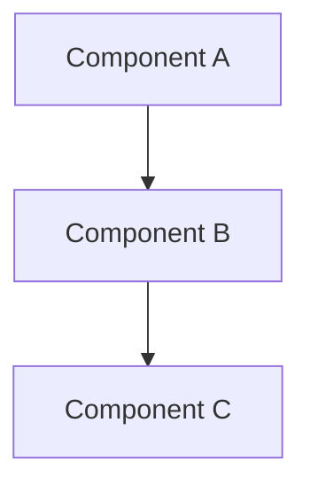

## Context

Link to PRD: [PRD title](../prds/<slug>.html)

One paragraph on the technical challenge this design addresses. Don't
restate the PRD — reference it. Focus on what makes this technically
interesting or risky.

## Goals and Non-Goals

Carried from the PRD, restated in technical terms. Add any technical
non-goals discovered during design.

**Goals:**
- Technical goal derived from PRD goal

**Non-Goals:**
- Technical non-goal (e.g., "No database migration in v1")

## Proposed Design

Architecture overview. Include a Mermaid diagram showing component
relationships and data flow.

### Component Details

Subsections as needed for each significant component. Include:
- Responsibility
- File path where it lives
- Key interfaces

### Data Model

Schema, storage, access patterns. Only if applicable.

### API / Interface Contracts

Inputs, outputs, error handling for key boundaries.

## Alternatives Considered

One subsection per significant decision.

### Decision: <what was decided>

| Option | Pros | Cons | Verdict |
|--------|------|------|---------|
| Option A | Pro | Con | **Chosen** — reason |
| Option B | Pro | Con | Rejected — reason |

## File Change List

Files to create, modify, or delete, each with a one-line rationale.

| Action | File | Rationale |
|--------|------|-----------|
| CREATE | `path/to/new-file.ts` | Reason |
| MODIFY | `path/to/existing.ts` | Reason |
| DELETE | `path/to/old-file.ts` | Reason |

## Task Breakdown

Dependency-ordered tasks. Each task is a single coherent change,
testable in isolation. Mark parallelizable tasks with `[P]`.

### TASK-001: <title>

- **Requirement:** PRD user story or acceptance criterion this addresses
- **Files:** `path/to/file1.ts`, `path/to/file2.ts`
- **Dependencies:** None
- **Acceptance criteria:**
  - [ ] Specific, testable condition
  - [ ] Specific, testable condition

### TASK-002: <title> `[P]`

- **Requirement:** PRD user story or acceptance criterion
- **Files:** `path/to/file3.ts`
- **Dependencies:** TASK-001
- **Acceptance criteria:**
  - [ ] Specific, testable condition

## Open Questions

Unresolved items. State what blocks on each.

- **Question:** What blocks resolution?

## Risks

Technical risks and wrong assumptions.

- **Risk:** Mitigation strategy or acceptance rationale.
