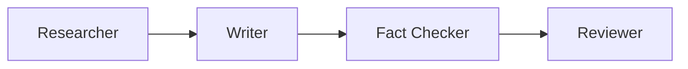

The content team is the blog post production pipeline. These agents
existed before the org chart — they're mapped in here for completeness.

## Pipeline

1. **Researcher** gathers sourced facts on a topic (read-only, web search)
2. **Writer** drafts a blog post from the research brief
3. **Fact Checker** verifies every claim against sources
4. **Reviewer** checks style, structure, and readiness for publication

## Agent Definitions

These are defined as OpenCode agents in `.opencode/agents/blog/`:

| Agent | Model | File |
|-------|-------|------|
| Researcher | gemini-2.5-flash | `.opencode/agents/blog/researcher.md` |
| Writer | big-pickle | `.opencode/agents/blog/writer.md` |
| Fact Checker | gemini-2.5-flash | `.opencode/agents/blog/fact-checker.md` |
| Reviewer | claude-sonnet-4-6 | `.opencode/agents/blog/reviewer.md` |

## Relationship to Org Chart

The content team reports to the mission directly, not to any C-suite
role. The CMO may direct what topics to write about, but the content
team's pipeline is independent.

## Invocation

These agents are invoked through OpenCode's agent picker, typically
chained by a human operator:

1. Run researcher with a topic
2. Hand the brief to the writer
3. Run fact-checker on the draft
4. Run reviewer for final polish
