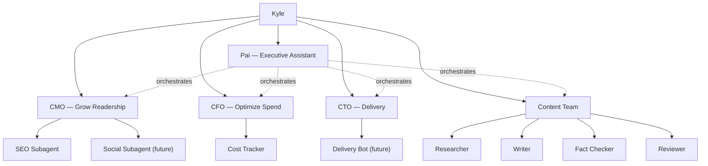

An AI agent organization with named roles, each backed by real tools
and invocable on demand via Claude Code or OpenCode.

## Mission

Help Kyle and the online community learn interesting and useful things.

## Org Chart



## Coordination

Agents coordinate through two shared systems and one orchestrator:

- **Bot-Wiki** — the knowledge layer. Agents read and write wiki pages
  for learnings, decisions, project plans, and aspirational ideas. This
  is how agents share context about how things work and where the
  project is headed.
- **Linear** — the task layer. Scoped work items meant to be picked up
  by an agent or Kyle. If it's actionable and bounded, it's a Linear
  issue. If it's context or direction, it's a wiki page.
- **Pai** — the orchestration layer. Decomposes multi-domain requests
  into agent calls, passes context between them, and synthesizes
  results. Optional. Each agent still works independently.

## Phases

**Phase 1 (current):** On-demand invocation. Each agent is a Claude Code
or OpenCode agent definition you run manually. Real tools, real data.

**Phase 2 (future):** Async and event-driven. Cron-triggered reports,
event-based analysis, automated pipelines. See
[Phase 2 Architecture](/wiki/projects/agent-team/phase-2.html).

## Blog Post Series

Each post ships something that works on its own and builds toward the
bigger agent team. No "here's my plan" posts. Every post produces a
real, working deliverable.

| # | Post | Deliverable | Status |
|---|------|-------------|--------|
| 1 | Building an AI Agent Org Chart | Working multi-agent setup: agent definitions, wiki pages, Mermaid org chart, `claude --agent` invocation | Draft |
| 2 | AI SEO Agent That Audits Your Blog | SEO subagent that connects to GA4, crawls the site, produces a real audit with fixes | Planned |
| 3 | What Does AI Actually Cost? Build a Spend Tracker | Cost-tracker subagent with real OpenRouter spend reports and anomaly detection | Planned |
| 4 | Automated Project Status from Linear + Git | CTO status report: what shipped, what's stuck, pulled from real Linear and git data | Planned |
| 5 | Multi-Model Content Pipeline | End-to-end researcher/writer/fact-checker/reviewer chain that produces an actual blog post | Planned |

## Roles

| Role | Goal | Page |
|------|------|------|
| Pai | Orchestrate multi-agent workflows | [Pai](/wiki/projects/agent-team/pai.html) |
| CMO | Grow readership via analytics and SEO | [CMO](/wiki/projects/agent-team/cmo.html) |
| CFO | Optimize AI token spend | [CFO](/wiki/projects/agent-team/cfo.html) |
| CTO | Track delivery, flag blockers | [CTO](/wiki/projects/agent-team/cto.html) |
| Content Team | Research, write, verify, review blog posts | [Content Team](/wiki/projects/agent-team/content-team.html) |

## Invocation

Claude Code:
```bash
claude --agent pai
claude --agent cmo
claude --agent cfo
claude --agent cto
```

OpenCode: use the agent picker to select from the `org/` group.

## Tools

Each agent connects to real MCP servers and tools. No mocks.

**Coordination:**
- **Bot-Wiki** — shared knowledge base for learnings, decisions, plans
- **Linear MCP** — scoped tasks and project tracking

**Data:**
- **GA4 Analytics MCP** — traffic data for CMO/SEO
- **OpenRouter MCP** — usage and pricing data for CFO
- **Playwright MCP** — browser verification (content team)
