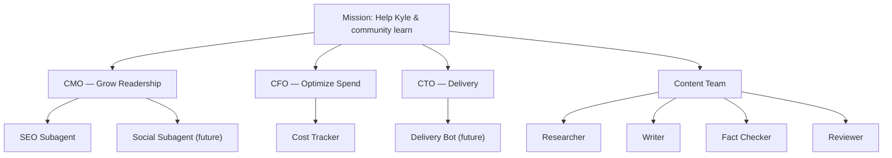

An AI agent organization with named roles, each backed by real tools
and invocable on demand via Claude Code or OpenCode.

## Mission

Help Kyle and the online community learn interesting and useful things.

## Org Chart



## Phases

**Phase 1 (current):** On-demand invocation. Each agent is a Claude Code
or OpenCode agent definition you run manually. Real tools, real data.

**Phase 2 (future):** Async and event-driven. Cron-triggered reports,
event-based analysis, automated pipelines. See
[Phase 2 Architecture](/wiki/projects/agent-team/phase-2.html).

## Roles

| Role | Goal | Page |
|------|------|------|
| CMO | Grow readership via analytics and SEO | [CMO](/wiki/projects/agent-team/cmo.html) |
| CFO | Optimize AI token spend | [CFO](/wiki/projects/agent-team/cfo.html) |
| CTO | Track delivery, flag blockers | [CTO](/wiki/projects/agent-team/cto.html) |
| Content Team | Research, write, verify, review blog posts | [Content Team](/wiki/projects/agent-team/content-team.html) |

## Invocation

Claude Code:
```bash
claude --agent cmo
claude --agent cfo
claude --agent cto
```

OpenCode: use the agent picker to select from the `org/` group.

## Tools

Each agent connects to real MCP servers and tools. No mocks.

- **GA4 Analytics MCP** — traffic data for CMO/SEO
- **OpenRouter MCP** — usage and pricing data for CFO
- **Linear MCP** — project tracking for CTO
- **Playwright MCP** — browser verification (content team)
