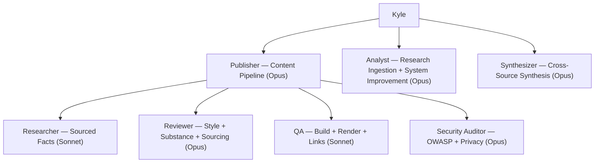

An AI agent team with 7 focused roles, each backed by real tools
and invocable on demand via Claude Code.

## Mission

Help Kyle and the online community learn interesting and useful things.

## Org Chart



See the dedicated [Org Chart](/wiki/projects/agent-team/org-chart.html)
page for a bot-friendly YAML version.

## Coordination

Agents coordinate through two existing systems:

- **Git** — shared state. Subagents write reports to files; the
  publisher reads those files. All artifacts live in the repo.
- **Claude Code memory** — cross-session context. Persistent notes
  about user preferences, project state, and feedback.

No shared wiki layer, no event log, no separate task tracker for
agents. Keep it simple.

## Roles

| Role | Model | Goal |
|------|-------|------|
| Publisher | Opus | Orchestrate content pipeline, write blog posts |
| Analyst | Opus | Ingest research, validate claims, propose system improvements |
| Synthesizer | Opus | Compare and contrast Deep Research reports |
| Researcher | Sonnet | Gather sourced facts, return research brief |
| Reviewer | Opus | Check style, substance, frontmatter, and sourcing |
| QA | Sonnet | Build, render, and link verification |
| Security Auditor | Opus | Confidential data, prompt injection, OWASP LLM checks |

## Invocation

```bash
claude --agent publisher
claude --agent analyst
claude --agent synthesizer
claude --agent researcher
claude --agent reviewer
claude --agent qa
claude --agent security-auditor
```

## Design principles

- **Start simple**: 7 agents, not 17. Add agents only when the
  workload clearly requires it.
- **Deny-by-default**: agents are read-only unless they need to write.
  Only Publisher (writes posts) and QA (runs builds) have write/execute
  tools.
- **Route by risk**: Opus for judgment (review, security, editorial),
  Sonnet for mechanical work (research, QA).
- **Artifacts not pass-through**: files as intermediate state between
  agents, not large context passed through prompts.

## History

See [History](/wiki/history.html) for the changelog of architectural
transitions, including the v1 → v2 migration rationale.
