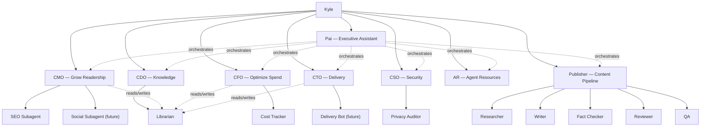

## Org Chart (Mermaid)



## Org Chart (YAML)

Structured for bot consumption. Use this when you need to look up
reporting lines, invocation commands, or which agent owns a domain.

```yaml
agents:
  - name: pai
    title: Executive Assistant
    invoke: bin/invoke-agent.sh pai
    reports_to: kyle
    orchestrates: [cmo, cfo, cto, cdo, cso, ar, publisher]
    domain: Multi-agent orchestration

  - name: cmo
    title: Chief Marketing Officer
    invoke: bin/invoke-agent.sh cmo
    reports_to: kyle
    subagents: [seo, social]
    domain: Traffic, SEO, content strategy

  - name: cfo
    title: Chief Financial Officer
    invoke: bin/invoke-agent.sh cfo
    reports_to: kyle
    subagents: [cost-tracker]
    domain: AI spend, model pricing

  - name: cto
    title: Chief Technology Officer
    invoke: bin/invoke-agent.sh cto
    reports_to: kyle
    subagents: [delivery-bot]
    domain: Project status, blockers, delivery

  - name: cdo
    title: Chief Data Officer
    invoke: bin/invoke-agent.sh cdo
    reports_to: kyle
    subagents: [librarian]
    domain: Wiki strategy, knowledge management

  - name: cso
    title: Chief Security Officer
    invoke: bin/invoke-agent.sh cso
    reports_to: kyle
    subagents: [privacy-auditor]
    domain: Security and privacy

  - name: ar
    title: Agent Resources
    invoke: bin/invoke-agent.sh ar
    reports_to: kyle
    domain: Agent onboarding, routing, role mediation

  - name: publisher
    title: Publisher
    invoke: bin/invoke-agent.sh publisher
    reports_to: kyle
    subagents: [researcher, writer, fact-checker, reviewer, qa]
    domain: Blog content pipeline

  # --- Subagents ---

  - name: seo
    title: SEO Subagent
    invoke: bin/invoke-agent.sh seo
    reports_to: cmo
    domain: Search optimization audits

  - name: social
    title: Social Subagent
    reports_to: cmo
    domain: Social media (future)
    status: planned

  - name: cost-tracker
    title: Cost Tracker
    invoke: bin/invoke-agent.sh cost-tracker
    reports_to: cfo
    domain: Spend reports

  - name: delivery-bot
    title: Delivery Bot
    reports_to: cto
    domain: Automated delivery tracking (future)
    status: planned

  - name: librarian
    title: Librarian
    invoke: bin/invoke-agent.sh librarian
    reports_to: cdo
    domain: Wiki read/write for any agent

  - name: privacy-auditor
    title: Privacy Auditor
    invoke: bin/invoke-agent.sh privacy-auditor
    reports_to: cso
    domain: Flag confidential data leaks

  - name: researcher
    title: Researcher
    invoke: bin/invoke-agent.sh researcher
    reports_to: publisher
    domain: Gather sourced facts, produce research briefs

  - name: writer
    title: Writer
    invoke: bin/invoke-agent.sh writer
    reports_to: publisher
    domain: Draft blog posts from research briefs

  - name: fact-checker
    title: Fact Checker
    invoke: bin/invoke-agent.sh fact-checker
    reports_to: publisher
    domain: Verify claims, flag errors

  - name: reviewer
    title: Reviewer
    invoke: bin/invoke-agent.sh reviewer
    reports_to: publisher
    domain: Check style and structure

  - name: qa
    title: QA
    invoke: bin/invoke-agent.sh qa
    reports_to: publisher
    domain: Technical production readiness (build, render, frontmatter, links)
```
