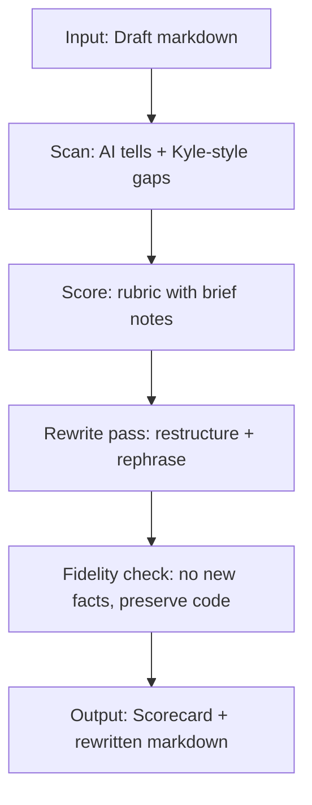

# Prompting Claude Opus 4.6 and Sonnet 4.6 for casual human prose

## Executive summary

A “casual human” voice is less about slang and more about *signals of lived authorship*: uneven rhythm, selective detail, occasional blunt opinions, and an absence of templated scaffolding (preambles, disclaimers, recap paragraphs). Linguistics research on AI-generated text repeatedly finds that “AI-ish” output clusters around formality/impersonality, predictable discourse structure, and repetitiveness—though results vary by genre, prompt, and model family.

For Anthropic’s Claude 4.6 generation, the most reliable levers are: (a) **persona selection via system prompt** (explicit role + voice constraints), (b) **canonical few-shot examples** (3–5 before/after pairs) rather than huge rule lists, and (c) **tight context organisation** using clear sectioning (XML-style tags) so the model can separate instructions from the editable draft.

In Anthropic’s own prompt guidance, putting longform data near the top and the query at the end can lift quality materially (they cite up to ~30% in tests for complex inputs), which maps well to “Reviewer agent” workflows where the draft is long and the transformation instructions are short.

The style target here is anchored in Kyle Pericak’s blog voice: short, declarative sentences; small paragraphs; blunt framing (“Two things in this post…”); explicit choice rationales (“I picked it because…”); occasional dry humour (“dead internet”); and strong aversion to AI prose (“AI wrote the first draft. It was bad.”).

Model-specific differences that matter for prompt design:
- **Opus 4.6**: positioned as “the most intelligent” for agents/coding; **1M context**; **128k max output**.  
- **Sonnet 4.6**: positioned as the “best combination of speed and intelligence”; **1M context**; **64k max output**; default model in Claude’s consumer apps.  
These differences primarily affect how big you can make your style guide + examples, and how aggressively you can ask for multi-pass rewriting in one call.

## Source base and methodological notes

This report prioritises primary sources from the Claude Developer Platform and Anthropic release materials for:
- model identity, context windows, output limits, and cutoffs  
- Messages API structure, including the absence of a `"system"` role and supported sampling parameters  
- prompting practices (XML tagging; examples; long-context ordering; Claude’s newer “more concise/natural” tendencies)  
- consistency and the deprecation of “prefilling” on 4.6 models  
- thinking modes differences (notably: Opus 4.6 prefers adaptive thinking; manual mode is deprecated)

AI “tell” taxonomy is grounded primarily in peer-reviewed or archival research surveys and detection papers (GLTR/DetectGPT/watermarking), plus recent linguistic meta-analyses of stance/metadiscourse differences.

Kyle-style analysis uses a small but representative sample of posts:
- pre-2025: 2019–2020 technical guides (Ansible/Node, Cloudflare HTTPS, Vim spell-check, GitHub Pages)  
- 2025+: posts explicitly acknowledging AI drafts and newer “AI tooling” posts (Mermaid + recent AI/agent posts)  

The user’s “Sonet” appears to be a misspelling of **Sonnet**; the official model IDs are `claude-opus-4-6` and `claude-sonnet-4-6`.

## The AI “tells” catalogue

AI “tells” are best treated as **a weighted bundle**, not a single smoking gun. Research surveying AI-text features finds common signals around formality/impersonality, lexical diversity differences, repetitive patterns, and genre-dependent discourse habits—while also noting that *prompt sensitivity* is under-addressed in much prior work, meaning the same model can look “more human” under different prompting.

### Practical taxonomy with examples and detection heuristics

| Tell class | What it looks like in prose (compressed examples) | Detection heuristics you can operationalise | Prompt / workflow countermeasure |
|---|---|---|---|
| Lexical: “corporate neutral” | “robust”, “leverage”, “seamless”, “delve”, “unlock value” | Count “MBA verbs”; compare against a site-specific stoplist | Replace with plain verbs; force concrete nouns |
| Lexical: low idiolect | Few personal favourites (no recurring quirks) | Track author-specific phrases across posts; flag absence | Inject house quirks (“That’s it.” / “No dashboard required.”) |
| Lexical: narrow synonyms | Repeated adjective stacks (“significant”, “notable”, “important”) | High bigram reuse; repeated evaluatives every paragraph | Ban “importance” signalling; prefer “because…” clauses |
| Syntax: smooth, clause-heavy | Long balanced sentences; few fragments | Sentence-length variance low; few 1–4 word fragments | Enforce “8–15 words typical; fragments ok” |
| Syntax: uniform paragraph size | Every paragraph ~3–4 sentences | Paragraph histogram too consistent | Allow 1-sentence paragraph punches |
| Punctuation: overly correct | Perfect commas; no rough edges; rare “…” or “?” | Punctuation entropy low; no purposeful “bad” rhythm | Permit rhetorical questions sparingly |
| Discourse markers overdose | “Additionally”, “Moreover”, “Furthermore” | Frequency of additive connectives | Prefer direct adjacency; cut connectors |
| Metadiscourse inflation | Explicit “this article discusses…” / “in this section…” | High rate of self-referential structure talk | Only keep structure talk when it’s *useful* |
| Topical: generic safe centre | No sharp opinion; no trade-offs; no “I didn’t do that.” | Stance flattening; hedges without commitment | Require explicit decision + rationale |
| Pragmatic: over-helpful | Answers questions unasked; tutorialises basics | Count “step-by-step” scaffolds not requested | Set “assume competent reader” |
| Pragmatic: faux empathy | “I understand how frustrating…” | Empathy templates near task content | Remove unless story context truly warrants |
| Hedging pattern (genre-dependent) | Either too many “may/might” or oddly few hedges but many attitude markers | Compare hedge/booster counts; watch stance imbalance | Force confident where evidence exists; otherwise hard “unknown/TODO” |
| Repetition: recap paras | “To summarise…” every section | Detect repeating “overall/in summary” | Ban conclusion sections by default |
| Coherence: too perfect | No side-tracks; no small inconsistencies | Very high topical smoothness; no local digressions | Allow one purposeful tangent if present in draft |
| Coherence: shallow causality | Lots of “X is important” without “because” | Ratio of justificatory clauses low | Require “because”/evidence lines |
| Over-clarity / over-formatting | Bullet lists everywhere; “key takeaways” | Too-regular outline + “takeaways” | Use lists only when scannability matters |
| Cultural references: generic + global | Vague “today’s world”; no local detail | Low named-entity specificity | Use *draft-provided* names only; don’t invent |
| Errors: suspiciously clean | No typos; no informal contractions balance | 0 typos + high polish | Add contractions; vary rhythm; keep technical correctness |
| Hallucinated specifics | Fake numbers, tools, dates, citations | Claim-density > source support | “No new facts”; allow “I don’t know/TODO” |
| Token-level artefacts (statistical) | Unusually “high-likelihood” token choices or watermark signatures | GLTR-style token rank distribution; DetectGPT curvature | If you can: run detectors; otherwise rely on stylistic rewrite pass |

The bolded patterns above align with published syntheses: surveys report increased formality/impersonality markers (e.g., more nouns/determiners/adpositions) and repetition signals, plus under-studied prompt sensitivity. Organisational studies also report AI text skewing more positive sentiment and narrower vocabulary in workplace contexts. Metadiscourse comparisons in academic genres find systematic differences in stance marker use (often overuse of “attitude” markers), highlighting that the exact “tell” can flip by genre.


## Prompting strategies that suppress tells

Claude 4.6 prompting guidance is converging on three ideas: **clear roles**, **structured context**, and **canonical examples**. The Claude docs explicitly recommend XML tags for separating instructions/context/examples, and recommend 3–5 examples for best results. They also advise that with long inputs (20k+ tokens), placing longform data near the top and queries at the end can improve quality significantly (they report up to ~30% in tests).

### System vs user structure for Claude

In the Messages API, the system prompt is a top-level `system` parameter; there is no “system role” inside `messages`. Practically:
- Put stable identity + style + guardrails in `system`.
- Put the editable draft and the task-specific instruction in the final user message, ideally with clear tags.

A key gotcha for older “format forcing”: Anthropic’s “Increase output consistency” guide states that **prefilling is deprecated and not supported on Opus 4.6 / Sonnet 4.6** (so don’t rely on partial assistant-prefill tricks as your main enforcement mechanism).

### Sampling and thinking parameters

**Sampling controls (Claude API):**
- `temperature` defaults to 1.0 and ranges 0.0–1.0; Anthropic recommends closer to 0 for analytical tasks and closer to 1 for creative/generative tasks.  
- `top_p` is available and Anthropic recommends altering either `temperature` or `top_p` but not both.  
- `stop_sequences` can be used to halt on strings you define.

**Thinking controls:** the API supports a `thinking` configuration with types including `enabled`, `disabled`, and `adaptive`. For Opus 4.6, Anthropic recommends **adaptive thinking** and notes that manual budget mode is deprecated and will be removed in a future release.  
*The docs refer to an “effort” parameter for adaptive thinking, but the exact field name and enum values are not pinned in the sources sampled here; treat that part as unspecified in your implementation until you confirm in the “Effort” docs page.*

### Which prompt formats tend to work best on Opus 4.6 vs Sonnet 4.6

Anthropic’s own context engineering guidance warns against stuffing laundry-list rule sets and instead recommends curating diverse, canonical examples (“pictures worth a thousand words”). Given that, the most robust formats for “casual human prose” are:

| Prompt format | Why it helps with “casual human” | Opus 4.6 fit | Sonnet 4.6 fit |
|---|---|---|---|
| Role + concise style contract | Pushes the model into a human author persona (not generic assistant) | Excellent; can handle nuance and longer constraints | Excellent; keep it tighter (less prose about rules) |
| Canonical before/after pairs (3–5) | Demonstrates the rhythm and “what to delete” | Strong; can absorb more examples and subtleties | Strong; examples matter more than abstract rules |
| XML/tagged prompt sections | Prevents instruction bleed into rewritten prose | Strong, especially on long drafts | Strong; reduces misinterpretation |
| Rubric + self-check rewrite loop | Forces the model to notice and remove “tells” | Very strong; Opus can do multi-pass in one call due to output headroom (128k max) | Good; but keep passes limited to avoid verbosity creep |
| Small banned-phrase list | Deletes the highest-signal “AI trope” strings | Useful, but brittle; keep tiny to avoid rule-overfitting | Useful, but keep tiny; prefer examples |
| Long “do/don’t” mega-lists | Can overspecify and create brittle output patterns | Avoid; use examples instead | Avoid; higher risk of falling into templated compliance |

A further practical wrinkle: Claude 4.6 models are described in Anthropic docs as more concise and natural than previous generations, meaning they may skip explicit summaries unless asked. That is actually helpful for “human blog voice” (no forced recap), but it means your Reviewer prompt should only request the minimal meta-output you really want (e.g., a short scorecard + the rewritten post).

## Style profile of Kyle Pericak’s blog

Kyle Pericak's blog has a consistent “working engineer” voice across eras, but the 2025+ posts make the meta-position on AI explicit: use AI for drafts/code generation, but rewrite prose to avoid the “dead internet” vibe.

### Pre-2025 posts

The 2019–2020 posts read like concise field notes: “here’s the problem; here’s the fix; here are the commands.” The opening paragraphs tend to be plain-spoken and mildly opinionated:
- “I googled around… [and] thought the solutions… looked way too complicated.”  
- “There’s no really good excuse to not support HTTPS on a website today.”  
Even when the post is mostly commands, there’s a grounding in personal environment constraints (“In my case…”, “I’m not sure…”) that signals authorship rather than generic tutorial boilerplate.

Structurally, these posts use clear headings (“The Problem”, “Commands”, “Initial Setup”), short paragraphs, and code blocks without extra narrative padding.

### 2025+ posts

From late 2025 onward, the voice has more explicit meta-commentary and sharper stance about AI prose. In the Mermaid post, Kyle directly states that AI drafted the post and that he rewrote the text because AI writing “makes my eyes glaze over” and he doesn’t want to contribute to a “dead internet.”

The newer posts also show a recurring pattern:
- **Blunt framing** (“Two things in this post.”)  
- **Comparative/decision logic** (“I picked it because… there’s no need for a database… done.”)  
- **Short, punchy assertions** (“This is that pipeline.”)  
- **Reader respect**: minimal hand-holding; assumes competence; focuses on the delta and the why.

Most importantly for your Reviewer agent spec, Kyle literally embeds a style rule-set for his own writer subagent, including: no em-dashes, 8–15 word sentences typical, fragments allowed, short paragraphs, “no AI writing tells”, and no conclusion sections.  
That’s effectively your ground-truth style contract.

### Extracted “Kyle voice” features to encode

These are directly inferable from the sampled posts:

- **Tone**: calm, blunt, occasionally dry-funny; willing to call things “bad” or “obvious”.  
- **Vocabulary**: plain verbs, concrete nouns; avoids ornate adjectives; uses “that’s it / done” energy.  
- **Sentence rhythm**: mostly short sentences; occasional fragments for emphasis; avoids long chains.  
- **Anecdotes**: short “why I did it this way” justifications rather than extended storytelling.  
- **Headings**: task/decision oriented (“Why X”, “How it works”, “The stack”).  
- **Meta-commentary**: present, but only when it adds signal (AI writing aside; autonomy/safety notes).  

## Reviewer-agent system prompt pack

A strong Reviewer agent prompt needs two simultaneous constraints:
1. **Style transformation** (remove AI tells; match Kyle cadence).
2. **Factual fidelity** (don’t hallucinate new claims while rewriting).

Anthropic’s “Reduce hallucinations” guidance maps cleanly here: explicitly allow “I don’t know” (or TODO markers), and ground claims in what’s actually present in the input text rather than inventing.

### Mermaid flow for the Reviewer agent



### Example before/after pairs

**Pair: templated intro → Kyle framing**
- Before: “In this blog post, we will explore how to implement a retrieval-augmented generation pipeline and discuss best practices.”  
- After: “This is a small RAG pipeline over 21 wiki pages. It’s one Python script and a FAISS index. That’s it.”  

**Pair: connector-heavy prose → direct adjacency**
- Before: “Additionally, it’s important to note that the model may sometimes produce inconsistent results.”  
- After: “It’s not foolproof. It catches the obvious cases and raises the bar.”  

**Pair: conclusion section → cut**
- Before: “In conclusion, we’ve covered the key concepts. Hopefully this helps you get started.”  
- After: Delete the conclusion; end on the last useful command/output or a single punchy closing line (“done”). This aligns with the explicit “no conclusion sections” rule in Kyle’s embedded style guide.  

### Short evaluation checklist

Use this as the quick “did we nail it” gate after each rewrite:
- Does the post *start* with a blunt framing sentence (not a mission statement)?  
- Any “Moreover/Furthermore/In conclusion/It’s important to note”? If yes, delete/replace.  
- Paragraphs mostly 1–5 sentences; no walls of text.  
- Sentence length varies; some fragments OK; no em-dashes.  
- Every decision has a concrete “why” (cost, scale, friction, time).  
- No new factual claims introduced; code blocks preserved.  
- Tone is willing to be blunt (“I didn’t do that.”) without being performative.  
- No “AI assistant” self-reference. (Kyle explicitly dislikes AI prose markers.)  

### Ready-to-use Reviewer agent prompt

Below are three system prompts:
- a **shared base** (works on both models),
- an **Opus 4.6 tuned** variant (more multi-pass),
- a **Sonnet 4.6 tuned** variant (tighter and less meta).

#### Base system prompt

```text
You are a Reviewer agent. Your job is to evaluate and rewrite Markdown blog posts so they read like Kyle Pericak’s blog voice: casual working-engineer, blunt, high-signal, not “AI-ish”.

INPUT (from user message)
- <draft> ... </draft> contains the Markdown post to rewrite.
- Optional: <notes> ... </notes> may contain intent, audience, and constraints.

OUTPUT (always exactly two parts, in this order)
1) SCORECARD (max 12 lines): a compact rubric with 1–5 scores + one-line notes.
2) REWRITE: the rewritten Markdown only. No extra commentary.

HARD STYLE RULES (do not break)
- No em-dashes. Use commas or periods.
- Sentences: 8–15 words typical. Fragments are fine for emphasis.
- Paragraphs: 1–5 sentences. No walls of text.
- Headings should be practical (“Why X”, “How it works”, “The stack”, “Cost”, “Wiring it up”).
- Prefer blunt framing over mission statements: “Two things in this post…” / “This is X.” / “I’m doing Y because…”.
- Use contractions naturally (I’ve, I’m, it’s, that’s).
- Delete filler connectives: “Additionally”, “Moreover”, “Furthermore”, “In conclusion”, “It’s important to note”, “Delve”.
- No recap/conclusion section unless the draft explicitly needs it for a reason.
- No “as an AI”, no policy/procedure disclaimers, no self-congratulation.

FACTUAL FIDELITY RULES (must hold)
- Do NOT add new facts, numbers, tool names, prices, dates, benchmarks, or claims that aren’t already in <draft> or <notes>.
- Preserve all code blocks exactly unless there is an obvious typo already present in the draft AND the correction is clearly implied by surrounding text. If unsure, leave it.
- If the draft is missing an important detail, insert: “TODO: <what’s missing>”.
- Keep links intact; do not invent citations.

RUBRIC (1–5 each)
- Human voice plausibility (reads like one engineer wrote it)
- Cadence & paragraphing (short, varied, scannable)
- Signal density (no fluff; reasons are explicit)
- AI-tell absence (no templates, no “bloggy” filler)
- Fidelity (no new facts; code preserved)

TRANSFORMATION METHOD
- First scan and list the top 5 AI tells you see (privately).
- Rewrite by removing templates, tightening sentences, and making the “why” explicit.
- Do a final pass to: remove banned phrases, remove em-dashes, and ensure no new facts were added.

MINI BEFORE/AFTER EXAMPLES (match this direction)
- “In this post we will explore X…” -> “Two things: X and Y. Here’s what I changed.”
- “Additionally, it’s important to note…” -> delete or rewrite as a direct sentence.
- “In conclusion…” -> delete; end on the last useful command/output or a blunt closing line.
```

#### Opus 4.6 tuned system prompt

```text
Use the Base system prompt rules, plus:

- Do a two-pass rewrite: (1) restructure + rewrite, (2) cold reread and tighten.
- Be more aggressive about deleting redundant explanation and “teaching tone”.
- If the draft contains multiple ideas, split into clearer sections and rename headings for clarity.
- Keep the SCORECARD extremely short (5 lines max), then output the rewritten Markdown.
```

#### Sonnet 4.6 tuned system prompt

```text
Use the Base system prompt rules, plus:

- One-pass rewrite only (avoid extra meta).
- Prefer minimal edits that achieve the voice: tighten, cut filler, add blunt framing, fix headings.
- Do not expand the post. If you add text, it must be either (a) clearer “why” using existing facts, or (b) a TODO marker.
- Keep the SCORECARD to exactly 5 rubric lines (no extra notes).
```

