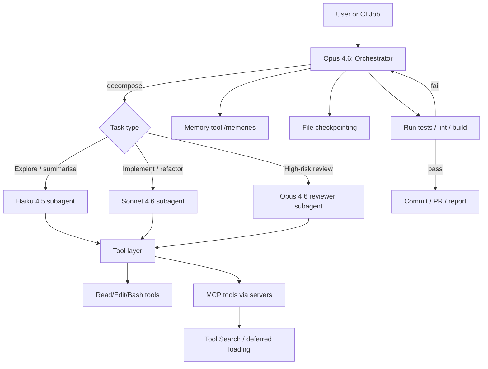
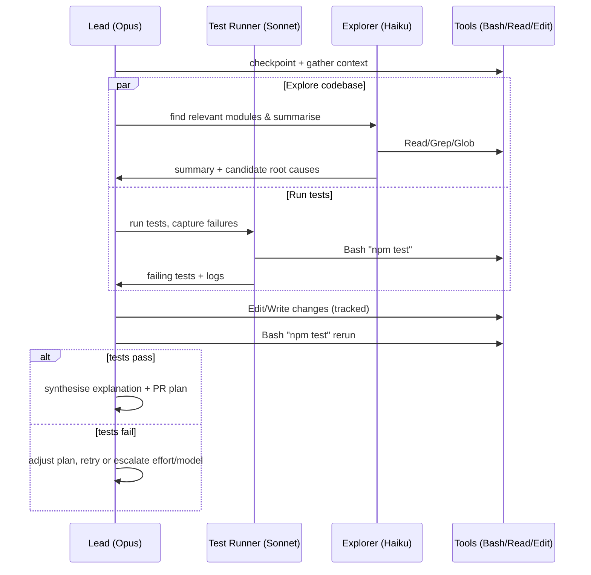

# Executive summary

Modern coding agents work best as *agentic workflows* rather than monolithic
prompts: a bounded loop that (a) plans, (b) uses tools to gather evidence,
(c) edits code, (d) runs verification, and (e) retries or escalates until a
stop condition is met. This basic loop is explicitly supported by Claude's
Agent SDK (the same loop used by Claude Code), including budgets
(`max_turns`, `max_budget_usd`), parallel tool execution rules, and
automatic compaction for long sessions.

For Claude model selection, the current best practice for cost-capability
trade-offs is a *routing architecture* that uses **Opus 4.6** for high-stakes
reasoning and final synthesis, **Sonnet 4.6** for most implementation work,
and **Haiku 4.5** for cheap, low-latency "inner-loop" tasks (searching,
triage, summarisation, lint-like review). Claude's own docs explicitly
position Opus as best for complex tasks and agents; Sonnet as the best
speed-intelligence balance; and Haiku as the fastest model, with lower
per-token prices.

For structuring multi-step work, *subagents* are the most consistently
effective primitive because they isolate context and keep intermediate tool
noise out of the main thread; Claude Code and the Agent SDK both support
subagents and model/tool scoping (including explicit routing like
`model="haiku"|"sonnet"|"opus"`). They are usually preferable to "parallel
bash scripts that call multiple agents", unless you need process-level
isolation, heterogeneous runtimes, or independent failure domains.

State and knowledge should be treated as *tiers*: short-term working context
(prompt + current files), durable workflow state (checkpoints/sessions), and
long-term knowledge (memory stores / RAG). Claude provides first-party
primitives for all three: sessions and file checkpointing for workflow
continuity, a client-side **Memory tool** for persistent cross-session
storage, and server-side **compaction** plus **context editing** and
**prompt caching** for long-running conversations and cost control.

The "standards stack" for 2024-2026 agent systems is converging around:

- **MCP** (Model Context Protocol) for tool/data connectivity (JSON-RPC 2.0;
  host/client/server roles)
- **A2A** (Agent2Agent) for agent-to-agent interoperability (agent discovery
  + messaging + long-running tasks)
- **OpenTelemetry GenAI semantic conventions** for vendor-neutral
  tracing/metrics of model and agent operations
- Repo-level instruction files as a governance layer (Claude's `CLAUDE.md`;
  Codex-style `AGENTS.md`)


# Defining coding agents and choosing between Opus, Sonnet, and Haiku

## What a "coding agent" is in current practice

In 2022-2026 research and production systems, a coding agent is typically a
*controller around an LLM* that alternates between reasoning and acting
(tool use), rather than a single prompt completion. The ReAct paradigm
formalised this interleaving of reasoning traces and actions to reduce
hallucination and improve task trajectories.

Coding-agent-specific research further emphasises that *interface design*
(the "agent-computer interface") materially changes performance: SWE-agent
shows that shaping file navigation/editing/testing actions improves
autonomous software-engineering outcomes.

## Recommended Claude model roles

Current Claude model guidance and pricing support a three-tier routing
approach:

- **Opus 4.6**: lead planner + final arbiter for complex reasoning/high-risk
  edits; extended/adaptive thinking; up to 128K output tokens; $5/MTok input
  and $25/MTok output (standard).
- **Sonnet 4.6**: default implementation model for most code changes; fast;
  extended + adaptive thinking; $3/MTok input and $15/MTok output.
- **Haiku 4.5**: fast "worker" for search/summarise/classify/review and
  other cheap steps; extended thinking supported but no adaptive thinking;
  $1/MTok input and $5/MTok output.

A concrete best practice is to route based on *risk and irreversibility*:

- Haiku: reversible, low-risk steps (codebase exploration, summarisation,
  log triage, change detection). Claude Code's built-in Explore subagent is
  explicitly Haiku and read-only to keep exploration out of main context.
- Sonnet: routine code edits + test-running loops.
- Opus: architectural decisions, multi-module refactors,
  security-sensitive diffs, final review and commit message synthesis.


# Subagents versus parallel bash scripts for multi-agent work

## Practical comparison

Claude provides multiple ways to "parallelise": subagents (single session),
agent teams (multiple sessions), and plain scripting/CLI orchestration.
Subagents are explicitly designed to preserve the main context and constrain
tool access, and Claude Code recommends agent teams only when parallel
workers must communicate with each other.

### Comparison table: subagents vs parallel scripts vs Claude Code agent teams

| Dimension | Subagents (within one session) | Parallel scripts (bash launching separate agents) | Agent teams (multi-session, coordinated) |
|---|---|---|---|
| Context isolation | Strong: each subagent has its own context; only final result returns | Strong: separate processes/sessions | Strong: each teammate has own context |
| Communication | Typically back to caller only | Whatever you build (files, pipes, queues) | Direct teammate-to-teammate messaging + shared task list |
| Tool/permission scoping | First-class (per subagent tools/permissions/model) | OS-level isolation; app-level scoping is DIY | Per session + platform controls; more moving parts |
| Coordination overhead | Low | Medium-high (merging, ordering, conflicts) | High (but built in); "significantly more tokens" |
| When it wins | Focused delegation where only the result matters; reduce context bloat | Heterogeneous runtimes; strict isolation; CI fan-out | Collaborative exploration/review requiring discussion |
| Key limitations | Subagents can't spawn subagents; requires clear descriptions | Harder to maintain deterministic state; error handling is DIY | Experimental; disabled by default; known limitations |

Claude Code's own comparison highlights the core trade-off: subagents are
lower token cost and report only to the main agent; agent teams enable
direct inter-agent communication but cost more tokens and add overhead.

## Recommendation pattern

Use **subagents by default**, and only "graduate" to parallel scripts or
agent teams when one of these is true:

- You need *process-level isolation* (untrusted repos; risky tools;
  differing dependency stacks) -> parallel scripts/containers.
- You need *independent concurrency with minimal coupling* across many
  tasks (e.g., scanning 200 repos nightly) -> parallel scripts plus a
  workflow engine.
- You need *collaborative reasoning* (debate, competing hypotheses,
  cross-layer coordination) -> agent teams.


# Orchestration standards, frameworks, and reliability patterns

## The emerging standards stack

- **MCP** is an open protocol for integrating LLM applications with
  tools/data; it specifies host/client/server roles and uses JSON-RPC 2.0.
- Claude's **MCP connector** lets you call remote MCP servers directly from
  the Messages API (beta header required), supporting tool calls over
  HTTP/SSE transports, with OAuth bearer token support.
- **A2A** aims to standardise agent discovery and communication, and is
  documented both by major vendors and the Linux Foundation ecosystem.
- **OpenTelemetry GenAI semantic conventions** provide standard span and
  attribute conventions for GenAI inference and agent operations, enabling
  vendor-neutral observability pipelines.

## Orchestration frameworks and where they fit

A robust "coding agent" stack usually needs **two layers**: 1) *Agent
runtime* (tool loop, permissions, subagents, sessions) 2) *Workflow runtime*
(durable retries, scheduling, idempotency, fan-out/fan-in, backpressure)

### Comparison table: orchestration frameworks and runtimes

| Category | Example | Strengths for coding agents | Gaps / cautions |
|---|---|---|---|
| Claude-native agent runtime | Claude Agent SDK | Built-in agent loop, tool execution, permissions and hooks; subagents; sessions; automatic compaction; checkpointing; cost tracking; designed for code-edit + bash workflows | Still needs external job orchestration for large fleets/scheduling; sandboxing and credential isolation are your responsibility |
| Graph-based agent orchestration | LangGraph | Checkpointed persistence and durable execution; pause/resume; human-in-loop; "threads" and state snapshots useful for debugging/time-travel | Requires you to define nodes/state carefully; idempotency and determinism matter for "durable execution" claims |
| Multi-agent conversation framework | AutoGen | Research-backed multi-agent conversation patterns; async/event-driven scaling emphasised by v0.4 redesign | More DIY around security hardening and deterministic workflow semantics |
| Enterprise agent framework | Microsoft Agent Framework | Focus on open standards (MCP, OpenAPI), durability, approvals, security, OpenTelemetry-out-of-box; explicit "Workflow" abstraction with checkpoint/pause/resume | Tightly aligned to Azure ecosystem for many deployments |
| Vendor agent SDK | OpenAI Agents SDK | Tool use, handoffs to specialised agents, streaming, tracing support; pairs with repo instruction conventions (`AGENTS.md`) | Different primitives than Claude; keep provider abstraction boundaries clean |
| Durable workflow engine | Temporal | Standardised retries/timeouts and durable execution concept; fits long-running background "agent jobs" | You still pick an agent runtime; handle side effects carefully via activities/tasks |
| Data/work scheduler | Airflow / Prefect | Retries, caching, concurrency semantics; good for scheduled agent runs and batch evaluation pipelines | Not specialised for interactive tool loops; you still implement agent-level state |

## Messaging and control-flow patterns that consistently work

Research and production frameworks converge on a handful of patterns:

- **Plan-and-execute / orchestrator-worker**: a lead agent decomposes tasks
  and dispatches to workers; aligns with multi-agent patterns described in
  AutoGen materials and Claude agent teams.
- **ReAct loop**: interleave reasoning and tool use to reduce hallucinations
  and improve exception handling.
- **Reflect-and-retry**: use explicit feedback signals or reflections to
  improve next attempts (Reflexion).
- **Search over reasoning paths** (Tree of Thoughts): useful for high-stakes
  design decisions, but expensive; best reserved for Opus-gated "decision
  points".

## Retries and error handling for Claude API and SDK loops

A production-grade Claude-based coding agent should distinguish:

- **Provider transient errors**: `529 overloaded_error`, `500 api_error` ->
  retry with exponential backoff + jitter; keep idempotent tool semantics.
- **Rate limits**: `429 rate_limit_error` + `retry-after` header; inspect
  `anthropic-ratelimit-*` headers for remaining quota and reset time.
- **Agent loop budget exhaustion**: the Agent SDK returns explicit result
  subtypes (`error_max_turns`, `error_max_budget_usd`) so you can
  resume/hand off.
- **Structured output repair loops**: Agent SDK can stop with
  `error_max_structured_output_retries` when schema validation fails too
  many times; treat this as a prompt/schema bug or a routing signal (switch
  to Opus, simplify schema).


# State, knowledge, and context management

## State tiers and recommended primitives

A robust coding agent separates these layers:

- **Workflow state**: "what have we done in this run?"
- Agent SDK **sessions** persist conversation state across turns (and can be
  resumed/forked), and **file checkpointing** supports rewinding file
  changes made via `Write/Edit/NotebookEdit`.
- Key limitation: checkpointing does *not* capture file edits done via
  shell commands (`Bash`), so high-integrity workflows should prefer SDK
  edit tools for tracked changes.

- **Short-term working memory**: "what's in the current context window?"
- Manage via subagents, tool-search, compaction/context-editing, and
  selective tool outputs.

- **Long-term memory / knowledge**: "what should persist across runs?"
- Claude's **Memory tool** is explicitly designed to store/retrieve
  information across conversations via a client-side `/memories` directory,
  enabling just-in-time retrieval. Restrict operations to `/memories` for
  security.
- For broader organisational knowledge, use RAG and/or curated instruction
  files (`CLAUDE.md`, `AGENTS.md`) as stable anchors.

## RAG, grounding, and consistency

Research from 2023-2025 consistently indicates that "more context" is not
automatically better: long-context LLMs can degrade when fed too many
retrieved passages, and retrieval should be *selective and relevance-aware*.

Practical best practices:

- **Selective retrieval and critique**: Self-RAG shows gains from retrieving
  on-demand and reflecting/criticising retrieved passages, rather than
  always stuffing k passages.
- **Tiered memory**: MemGPT formalises a useful engineering metaphor: treat
  context as fast memory and external stores as slow memory, swapping in/out
  via "interrupts" and retrieval policies.
- **Reflection summaries as durable artefacts**: Generative Agents
  demonstrates storing experiences, synthesising reflections, and retrieving
  them dynamically. While not coding-specific, the memory/reflection pattern
  transfers well to "project memory" and "decision logs".

For output consistency and safe tool use, prefer *mechanisms over
prompting*: **Structured outputs** (JSON schema output) + **strict tool
use** (`strict: true`) are designed to guarantee valid JSON responses and
validated tool parameters, with grammar compilation cached for 24 hours.

## Claude-native context management toolbox

Claude provides several complementary levers:

- **Prompt caching**: caches prompt prefixes (tools/system/messages up to
  cache breakpoints). It stores KV cache + cryptographic hashes, not raw
  text, and supports automatic caching and explicit breakpoints (up to 4).
  5-minute TTL is default; 1-hour TTL is available at additional cost.
- **Cache-aware rate limits**: for most models, `cache_read_input_tokens`
  don't count toward ITPM, improving effective throughput with high cache
  hit rates.
- **Compaction**: server-side summarisation that emits a `compaction` block
  and drops earlier history; supported on Opus 4.6 and Sonnet 4.6 (beta
  header required).
- **Context editing**: selective clearing strategies (tool result clearing
  and thinking block clearing) to keep context focused; context editing is
  beta and not eligible for ZDR.
- **1M token context**: supported (beta) for Opus 4.6 and Sonnet 4.6 (and
  some Sonnet variants), requires a beta header and eligibility (usage
  tier 4/custom). Requests >200K tokens switch to premium pricing (2x
  input, 1.5x output) and dedicated rate limits.
- **Tool Search Tool + Programmatic Tool Calling**: reduces tool-definition
  overhead and keeps intermediate tool results out of the main context by
  moving orchestration/data processing into a code execution environment;
  Anthropic reports large context savings and accuracy improvements for
  large tool libraries.

### Comparison table: state and knowledge management approaches

| Approach | Best for | Strengths | Failure modes / trade-offs |
|---|---|---|---|
| Subagents | Keeping main context clean | Fresh context per subtask; only final summary returns; supports model/tool scoping | Requires good descriptions; subagents don't inherit parent history; can't recursively spawn |
| Sessions + file checkpointing | Long-running code-edit loops | Resume/fork; rewind tracked file edits to prior states | Bash edits aren't tracked; rewind doesn't rewind conversation |
| Memory tool | Persistent cross-session project memory | Client-side control; just-in-time retrieval; works with ZDR arrangements | You must implement storage + enforce `/memories` confinement |
| Prompt caching | Reducing repeated prefix cost/latency | Large cost savings when prompts share stable prefixes | Needs careful breakpoint placement; concurrency caveat (cache entry becomes available after first response begins) |
| Compaction / context editing | Very long sessions | Automatic summarisation/clearing to stay within context | Summaries can omit details; beta constraints, ZDR eligibility differs |
| RAG + vector store | Org knowledge, doc grounding | Freshness, traceability, targeted context | Retrieval noise can hurt; long-context + RAG can degrade if you stuff too much |


# Testing, observability, and debugging practices

## Evaluation-first development

Claude's testing guidance is aligned with standard evaluation-driven
engineering: define *specific, measurable, achievable, relevant* success
criteria, then build evaluations around them.

Claude Console includes an Evaluation tool for prompt testing with
variable-driven test sets (including CSV import and generated test cases).

## Deterministic validation hooks for coding agents

For coding agents, the most reliable "truth signals" remain: Compiler/
typecheck output - Unit/integration test results - Lint/format checks -
Static/dynamic security scans - Build output / package constraints

Operationally, Claude's Agent SDK loop makes these checks cheap to integrate
because `Bash` and file tools are first-class, and you can cap spend with
`max_budget_usd` and turns with `max_turns`.

## Guardrails against hallucinations and prompt leakage

Claude's guardrail docs emphasise:

- Make the system auditable with quotes/citations and verification checks
- Allow explicit "I don't know" responses
- Restrict models to provided documents when grounding matters

For prompt leakage, Claude recommends starting with monitoring and
post-processing (screening outputs), and warns that "leak-proofing" prompts
can degrade performance due to complexity.

## Observability stack and standardisation

Adopt OpenTelemetry for traces/metrics/logs end-to-end, using GenAI
semantic conventions for spans.

Claude also supports organisation-level analytics via the Claude Code
Analytics Admin API, including tool acceptance rates, model-level costs, and
productivity metrics; it explicitly positions this as bridging basic
dashboards and more complex OpenTelemetry integrations.

### Comparison table: observability and debugging tooling

| Tooling area | Recommended baseline | Why it matters for agents |
|---|---|---|
| Distributed tracing | OpenTelemetry GenAI conventions | Standard fields across vendors/frameworks; correlates tool calls, model calls, retries |
| Agent-run introspection | Claude Agent SDK message stream + result subtypes | Distinguish provider errors vs budget exhaustion vs schema failures |
| Change control | File checkpointing + git patch review gates | Enables safe exploration and rollback paths |
| Prompt/output reliability | Structured outputs + strict tool use | Turns "parsing" into compile-time grammar constraints; cached grammars reduce repeat latency |
| Organisational rollouts | Claude Code Analytics API + usage/cost API | Track adoption, cost, model mix, tool acceptance to tune policies |


# Deployment, scaling, and cost-efficiency

## Secure-by-default deployment shape

Claude's hosting guidance for the Agent SDK recommends **container-based
sandboxing** to isolate processes, control resources and network access, and
support ephemeral filesystems. It also provides baseline resource guidance
(e.g., ~1 GiB RAM, ~5 GiB disk, 1 CPU per instance as a starting point)
and notes SDK runtime requirements for Python/Node.

Claude's secure deployment guidance strongly recommends a **proxy pattern**
that injects credentials outside the agent's security boundary so the agent
never sees secrets; the proxy can also enforce allowlists and log requests
for auditing.

## Scalability patterns

For scaling beyond a handful of agents, treat agent runs as *jobs* and adopt
queue-based backpressure:

- **Interactive**: long-lived agent instances with streaming UI; stricter
  permission modes and human approvals.
- **Batch/offline**: schedule runs via workflow engines (Temporal/Prefect/
  Airflow), store outputs + traces, and gate merges via CI.

Claude's Messages **Batch API** offers 50% pricing for asynchronous
workloads, supports Messages features (vision/tool use/multi-turn/betas),
and notes practical constraints (processing demand, potential expiry after
24 hours, and possible spend-limit overshoot).

## Cost levers that matter most in practice

From highest leverage to lower:

- **Prompt caching**: cache-hit reads priced at a fraction of base input,
  with explicit multipliers documented; supports multiple breakpoints and
  has concurrency caveats.
- **Batch processing**: 50% discount for non-latency-sensitive workloads.
- **Model routing**: Haiku for cheap steps, Sonnet for default edits, Opus
  only where needed.
- **Tool Search Tool / deferred tool loading**: avoid 10K-100K tokens of
  tool schema overhead in MCP-heavy setups; Anthropic reports large savings
  and accuracy gains.
- **Programmatic Tool Calling**: keep intermediate tool results out of model
  context and reduce round-trips; Anthropic reports token reductions on
  complex workflows.
- **Token counting**: preflight token usage and route accordingly (especially
  before expensive long-context calls).


# Governance, safety, and access control

## Access control and permissions as first-class design constraints

Claude Agent SDK permission evaluation is explicit and ordered: hooks first,
then deny rules, then allow rules, then a `canUseTool` callback; deny rules
override even bypass modes.

Operational best practice: Default to deny-by-default in production agents,
progressively allowlist tools and even sub-commands (e.g., `Bash(npm:*)`) as
confidence grows. Implement approvals for high-impact actions (writes,
network calls, credentialed operations), and use hooks to enforce policy.

## Threat model alignment and best-practice references

Use well-recognised security frameworks to structure governance:

- **OWASP Top 10 for LLM Applications** (prompt injection, insecure output
  handling, model DoS, supply chain, etc.) as an application security
  checklist.
- **NIST AI RMF** for organisational risk management structure and controls.
- Claude-specific research on **prompt injection defences** for browsing
  agents, and Anthropic's framework for safe agents.

## Standards and governance drift control

The 2025-2026 ecosystem is explicitly pushing open, neutral standards bodies
for agent infrastructure (e.g., AAIF under the Linux Foundation, with
contributions including MCP and AGENTS.md). This trend matters for
governance because it reduces vendor lock-in and encourages consistent
policy surfaces across tools.


# Recommended architectures, example flows, and implementation roadmap

## Recommended architecture for a production coding agent with Claude models

A practical "default" architecture that scales from laptop to Kubernetes:

- **Controller (Opus)**: owns task plan, risk policy, final synthesis, and
  escalation decisions.
- **Workers (Sonnet/Haiku subagents)**: do exploration, edits, tests,
  reviews, and summarisation in isolated contexts.
- **Durable state**: sessions + checkpointing for safe rollback; memory
  tool + RAG for cross-run context.
- **Tool layer**: local tools (read/edit/bash), MCP servers for external
  systems; tool search to keep schemas small.
- **Governance**: permission rules + hooks + secret-injection proxy; audit
  logging via OpenTelemetry.

## Mermaid orchestration flow



## Mermaid timeline for a typical "fix failing tests" run



## Example code: Claude Agent SDK with Opus lead and Sonnet/Haiku subagents

```python
import asyncio
from claude_agent_sdk import query, ClaudeAgentOptions, AgentDefinition

async def main():
    opts = ClaudeAgentOptions(
            # Allow subagent invocation and core dev tools
            allowed_tools=["Read", "Edit", "Write", "Bash", "Grep", "Glob",
            "Agent"],
            # Route work by subagent description + explicit model overrides
            agents={
                "explorer": AgentDefinition(
                    description="Read-only codebase exploration and
summarisation.",
                    prompt="Explore the repo to find the relevant files and
summarise findings.",
                    tools=["Read", "Grep", "Glob"],
                    model="haiku",
                ),
                "implementer": AgentDefinition(
                    description="Implements code changes and refactors safely;
runs tests as needed.",
                    prompt="Implement requested changes. Prefer small diffs. Run
tests after edits.",
                    tools=["Read", "Edit", "Write", "Bash", "Grep"],
                    model="sonnet",
                ),
                "security-reviewer": AgentDefinition(
                    description="High-rigor security review; use for auth/crypto/
secrets risks.",
                    prompt="Review for security vulnerabilities. Be strict; cite
exact code lines.",
                    tools=["Read", "Grep", "Glob"],
                    model="opus",
                ),
            },
            # Production defaults
            max_turns=20,
            max_budget_usd=5.00,
    )

    async for msg in query(
        prompt="Fix failing tests in auth.ts. Use explorer then implementer;
run tests.",
        options=opts,
    ):
        if hasattr(msg, "result"):
            print(msg.result)

asyncio.run(main())
```

This pattern is directly supported by the Agent SDK's subagent model routing
(`'sonnet'|'opus'|'haiku'|'inherit'`) and its requirement that the Agent
tool is allowed for subagent invocation, with context isolation as the main
value.

## Example code: Messages API with parallel tool use controls

```python
import anthropic

client = anthropic.Anthropic()

resp = client.messages.create(
    model="claude-sonnet-4-6",
    max_tokens=4000,
    tool_choice={"type": "auto", "disable_parallel_tool_use": False},
    tools=[
        {"name": "get_repo_files", "description": "List files",
"input_schema": {"type": "object", "properties": {}}},
        {"name": "run_tests", "description": "Run tests", "input_schema":
{"type": "object", "properties": {}}},
    ],
    messages=[{"role": "user", "content": "List relevant files and run the
unit tests."}],
)
```

Claude docs explicitly describe parallel tool use, and how to disable it
via `disable_parallel_tool_use`.

## Prioritised checklist of best practices

High priority:

- Use **subagents** to isolate context (separate "explore", "implement",
  "review"), and route models: Haiku for exploration, Sonnet for
  implementation, Opus for high-stakes review/synthesis.
- Enforce **least privilege** with allow/deny rules + hooks; treat deny
  rules as non-bypassable.
- Implement automatic **rollback** with file checkpointing; avoid untracked
  Bash edits for critical modifications.
- Standardise outputs through **structured outputs** + **strict tool use**
  where machine consumption matters.
- Build evaluation sets and measure success; use Claude's evaluation tooling
  for prompt iteration.

Medium priority:

- Use **prompt caching** (and careful breakpoints) for stable prefixes;
  monitor cache hit rates and exploit cache-aware rate limits.
- Use **Batch API** for non-latency-sensitive workloads (nightly scans,
  large-scale refactors/evals).
- Adopt MCP + tool search for large tool catalogues; avoid shipping
  50K-100K tokens of tool schemas every turn.

Lower priority (but valuable at scale):

- Introduce a durable workflow engine (Temporal/PREFECT/Airflow) when you
  need scheduling, strong retries, and fleet-scale backpressure.
- Standardise observability via OpenTelemetry GenAI conventions; integrate
  org monitoring with analytics APIs.

## Short implementation roadmap

Week 1-2: Adopt `CLAUDE.md` (project instructions) and define three
subagents: explorer (Haiku read-only), implementer (Sonnet), reviewer
(Opus). Add budgets (`max_turns`, `max_budget_usd`) and checkpointing to
make failures cheap and reversible.

Week 3-4: Add structured outputs for agent "plans" and "change manifests";
enforce strict tool schemas for high-value tools. Add prompt caching + token
counting preflights; establish a cost dashboard and alert thresholds.

Month 2: Add Memory tool for cross-run project continuity (decision logs,
build commands, recurring pitfalls). Integrate MCP servers for your SDLC
systems; enable tool search/deferred loading if schemas get large.

Month 3: Harden isolation: container sandboxing with credential-injection
proxy; formalise policy hooks; implement OpenTelemetry traces. If running
large fleets: migrate job orchestration to a durable workflow engine and
schedule batch runs via Batch API for cost efficiency.


# References

1. How the agent loop works - Claude API Docs
   https://platform.claude.com/docs/en/agent-sdk/agent-loop
2. Models overview - Claude API Docs
   https://platform.claude.com/docs/en/about-claude/models/overview
3. Create custom subagents - Claude Code Docs
   https://code.claude.com/docs/en/sub-agents
4. Memory tool - Claude API Docs
   https://platform.claude.com/docs/en/agents-and-tools/tool-use/memory-tool
5. Specification - Model Context Protocol
   https://modelcontextprotocol.io/specification/2025-11-25
6. Announcing the Agent2Agent Protocol (A2A)
   https://developers.googleblog.com/en/a2a-a-new-era-of-agent-interoperability/
7. Semantic conventions for generative client AI spans
   https://opentelemetry.io/docs/specs/semconv/gen-ai/gen-ai-spans/
8. Claude Code overview - Claude Code Docs
   https://code.claude.com/docs/en/overview
9. ReAct: Synergizing Reasoning and Acting in Language Models
   https://arxiv.org/abs/2210.03629
10. SWE-agent - Computer Science > Software Engineering
    https://arxiv.org/abs/2405.15793
11. Models overview - Claude API Docs
    https://platform.claude.com/docs/en/about-claude/models/overview
12. Create custom subagents - Claude Code Docs
    https://code.claude.com/docs/en/sub-agents
13. Pricing - Claude API Docs
    https://platform.claude.com/docs/en/about-claude/pricing
14. Effective context engineering for AI agents - Anthropic
    https://www.anthropic.com/engineering/effective-context-engineering-for-ai-agents
15. Orchestrate teams of Claude Code sessions - Claude Code Docs
    https://code.claude.com/docs/en/agent-teams
16. Orchestrating Subagents & Claude Skills - Reddit
    https://www.reddit.com/r/vibecoding/comments/1pg1y75/orchestrating_subagents_claude_skills_much_better/
17. Specification - Model Context Protocol
    https://modelcontextprotocol.io/specification/2025-11-25
18. MCP connector - Claude API Docs
    https://platform.claude.com/docs/en/agents-and-tools/mcp-connector
19. How the agent loop works - Claude API Docs
    https://platform.claude.com/docs/en/agent-sdk/agent-loop
20. Hosting the Agent SDK - Claude API Docs
    https://platform.claude.com/docs/en/agent-sdk/hosting
21. Persistence - Docs by LangChain
    https://docs.langchain.com/oss/python/langgraph/persistence
22. Durable execution - Docs by LangChain
    https://docs.langchain.com/oss/python/langgraph/durable-execution
23. AutoGen: Enabling Next-Gen LLM Applications via Multi-Agent Conversation - Microsoft Research
    https://www.microsoft.com/en-us/research/publication/autogen-enabling-next-gen-llm-applications-via-multi-agent-conversation-framework/
24. Introducing Microsoft Agent Framework - Microsoft Foundry Blog
    https://devblogs.microsoft.com/foundry/introducing-microsoft-agent-framework-the-open-source-engine-for-agentic-ai-apps/
25. Agents SDK - OpenAI API
    https://developers.openai.com/api/docs/guides/agents-sdk/
26. Retry logic in Workflows: Best practices for failure handling
    https://temporal.io/blog/failure-handling-in-practice
27. Tasks - Airflow 3.1.8 Documentation
    https://airflow.apache.org/docs/apache-airflow/stable/core-concepts/tasks.html
28. microsoft.com
    https://www.microsoft.com/en-us/research/wp-content/uploads/2025/01/WEF-2025_Leave_Behind_AutoGen.pdf
29. ReAct: Synergizing Reasoning and Acting in Language Models
    https://arxiv.org/abs/2210.03629
30. Reflexion: Language Agents with Verbal Reinforcement Learning
    https://arxiv.org/abs/2303.11366
31. Tree of Thoughts: Deliberate Problem Solving with Large Language Models
    https://arxiv.org/abs/2305.10601
32. Errors - Claude API Docs
    https://platform.claude.com/docs/en/api/errors
33. Errors - Claude API Docs
    https://platform.claude.com/docs/en/api/errors
34. How the agent loop works - Claude API Docs
    https://platform.claude.com/docs/en/agent-sdk/agent-loop
35. How the agent loop works - Claude API Docs
    https://platform.claude.com/docs/en/agent-sdk/agent-loop
36. Work with sessions - Claude API Docs
    https://platform.claude.com/docs/en/agent-sdk/sessions
37. Rewind file changes with checkpointing - Claude API Docs
    https://platform.claude.com/docs/en/agent-sdk/file-checkpointing
38. Effective context engineering for AI agents - Anthropic
    https://www.anthropic.com/engineering/effective-context-engineering-for-ai-agents
39. Memory tool - Claude API Docs
    https://platform.claude.com/docs/en/agents-and-tools/tool-use/memory-tool
40. Claude Code overview - Claude Code Docs
    https://code.claude.com/docs/en/overview
41. LONG-CONTEXT LLMS MEET RAG
    https://proceedings.iclr.cc/paper_files/paper/2025/file/5df5b1f121c915d8bdd00db6aac20827-Paper-Conference.pdf
42. Self-RAG: Learning to Retrieve, Generate, and Critique through Self-Reflection
    https://arxiv.org/abs/2310.11511
43. MemGPT: Towards LLMs as Operating Systems
    https://arxiv.org/abs/2310.08560
44. Generative Agents: Interactive Simulacra of Human Behavior
    https://arxiv.org/abs/2304.03442
45. Structured outputs - Claude API Docs
    https://platform.claude.com/docs/en/build-with-claude/structured-outputs
46. Prompt caching - Claude API Docs
    https://platform.claude.com/docs/en/build-with-claude/prompt-caching
47. Rate limits - Claude API Docs
    https://platform.claude.com/docs/en/api/rate-limits
48. Compaction - Claude API Docs
    https://platform.claude.com/docs/en/build-with-claude/compaction
49. Context editing - Claude API Docs
    https://platform.claude.com/docs/en/build-with-claude/context-editing
50. Context windows - Claude API Docs
    https://platform.claude.com/docs/en/build-with-claude/context-windows
51. Introducing advanced tool use on the Claude Developer Platform - Anthropic
    https://www.anthropic.com/engineering/advanced-tool-use
52. Subagents in the SDK - Claude API Docs
    https://platform.claude.com/docs/en/agent-sdk/subagents
53. Rewind file changes with checkpointing - Claude API Docs
    https://platform.claude.com/docs/en/agent-sdk/file-checkpointing
54. Prompt caching - Claude API Docs
    https://platform.claude.com/docs/en/build-with-claude/prompt-caching
55. Compaction - Claude API Docs
    https://platform.claude.com/docs/en/build-with-claude/compaction
56. Define success criteria and build evaluations - Claude API Docs
    https://platform.claude.com/docs/en/test-and-evaluate/develop-tests
57. Using the Evaluation Tool - Claude API Docs
    https://platform.claude.com/docs/en/test-and-evaluate/eval-tool
58. Reduce hallucinations - Claude API Docs
    https://platform.claude.com/docs/en/test-and-evaluate/strengthen-guardrails/reduce-hallucinations
59. Reduce prompt leak - Claude API Docs
    https://platform.claude.com/docs/en/test-and-evaluate/strengthen-guardrails/reduce-prompt-leak
60. Claude Code Analytics API - Claude API Docs
    https://platform.claude.com/docs/en/build-with-claude/claude-code-analytics-api
61. Claude Code Analytics API - Claude API Docs
    https://platform.claude.com/docs/en/build-with-claude/claude-code-analytics-api
62. Hosting the Agent SDK - Claude API Docs
    https://platform.claude.com/docs/en/agent-sdk/hosting
63. Securely deploying AI agents - Claude API Docs
    https://platform.claude.com/docs/en/agent-sdk/secure-deployment
64. Batch processing - Claude API Docs
    https://platform.claude.com/docs/en/build-with-claude/batch-processing
65. Prompt caching - Claude API Docs
    https://platform.claude.com/docs/en/build-with-claude/prompt-caching
66. Batch processing - Claude API Docs
    https://platform.claude.com/docs/en/build-with-claude/batch-processing
67. Introducing advanced tool use on the Claude Developer Platform - Anthropic
    https://www.anthropic.com/engineering/advanced-tool-use
68. Introducing advanced tool use on the Claude Developer Platform - Anthropic
    https://www.anthropic.com/engineering/advanced-tool-use
69. Token counting - Claude API Docs
    https://platform.claude.com/docs/en/build-with-claude/token-counting
70. Configure permissions - Claude API Docs
    https://platform.claude.com/docs/en/agent-sdk/permissions
71. Claude Code overview - Claude Code Docs
    https://code.claude.com/docs/en/overview
72. OWASP Top 10 for Large Language Model Applications
    https://owasp.org/www-project-top-10-for-large-language-model-applications/
73. Artificial Intelligence Risk Management Framework (AI RMF 1.0)
    https://nvlpubs.nist.gov/nistpubs/ai/nist.ai.100-1.pdf
74. Mitigating the risk of prompt injections in browser use
    https://anthropic.com/research/prompt-injection-defenses
75. OpenAI co-founds the Agentic AI Foundation under the Linux Foundation
    https://openai.com/index/agentic-foundation/
76. Subagents in the SDK - Claude API Docs
    https://platform.claude.com/docs/en/agent-sdk/subagents
77. Rewind file changes with checkpointing - Claude API Docs
    https://platform.claude.com/docs/en/agent-sdk/file-checkpointing
78. Connect to external tools with MCP - Claude API Docs
    https://platform.claude.com/docs/en/agent-sdk/mcp
79. Configure permissions - Claude API Docs
    https://platform.claude.com/docs/en/agent-sdk/permissions
80. How the agent loop works - Claude API Docs
    https://platform.claude.com/docs/en/agent-sdk/agent-loop
81. Subagents in the SDK - Claude API Docs
    https://platform.claude.com/docs/en/agent-sdk/subagents
82. How to implement tool use - Claude API Docs
    https://platform.claude.com/docs/en/agents-and-tools/tool-use/implement-tool-use
83. Define success criteria and build evaluations - Claude API Docs
    https://platform.claude.com/docs/en/test-and-evaluate/develop-tests
84. Prompt caching - Claude API Docs
    https://platform.claude.com/docs/en/build-with-claude/prompt-caching
85. Introducing advanced tool use on the Claude Developer Platform - Anthropic
    https://www.anthropic.com/engineering/advanced-tool-use
86. Retry logic in Workflows: Best practices for failure handling
    https://temporal.io/blog/failure-handling-in-practice
87. Semantic conventions for generative client AI spans
    https://opentelemetry.io/docs/specs/semconv/gen-ai/gen-ai-spans/
88. Claude Code overview - Claude Code Docs
    https://code.claude.com/docs/en/overview
89. How the agent loop works - Claude API Docs
    https://platform.claude.com/docs/en/agent-sdk/agent-loop
90. Prompt caching - Claude API Docs
    https://platform.claude.com/docs/en/build-with-claude/prompt-caching
91. Connect to external tools with MCP - Claude API Docs
    https://platform.claude.com/docs/en/agent-sdk/mcp
92. Hosting the Agent SDK - Claude API Docs
    https://platform.claude.com/docs/en/agent-sdk/hosting
93. Batch processing - Claude API Docs
    https://platform.claude.com/docs/en/build-with-claude/batch-processing
94. Structured outputs - Claude API Docs
    https://platform.claude.com/docs/en/build-with-claude/structured-outputs
95. Rate limits - Claude API Docs
    https://platform.claude.com/docs/en/api/rate-limits
96. Define success criteria and build evaluations - Claude API Docs
    https://platform.claude.com/docs/en/test-and-evaluate/develop-tests
97. Subagents in the SDK - Claude API Docs
    https://platform.claude.com/docs/en/agent-sdk/subagents
98. Introducing advanced tool use on the Claude Developer Platform - Anthropic
    https://www.anthropic.com/engineering/advanced-tool-use
99. OWASP Top 10 for Large Language Model Applications
    https://owasp.org/www-project-top-10-for-large-language-model-applications/
100. Rate limits - Claude API Docs
     https://platform.claude.com/docs/en/api/rate-limits
101. ReAct: Synergizing Reasoning and Acting in Language Models
     https://arxiv.org/abs/2210.03629
