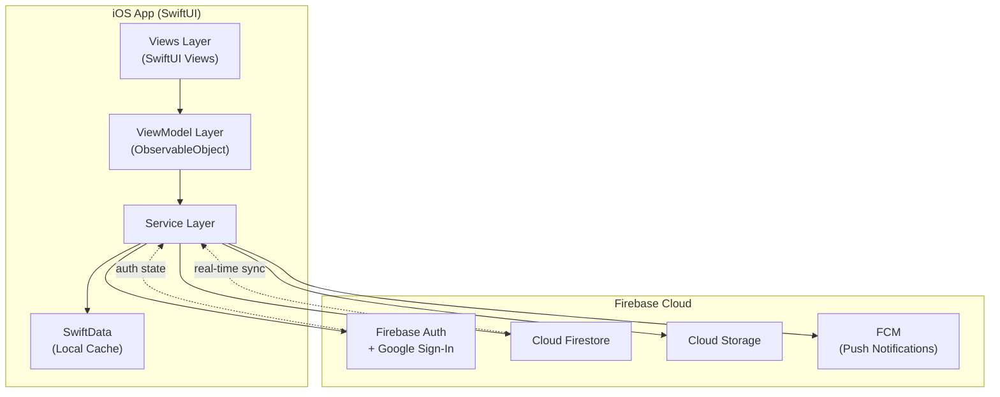
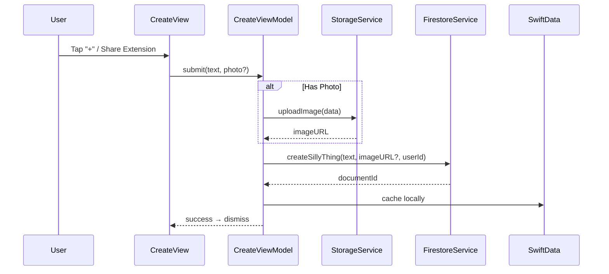
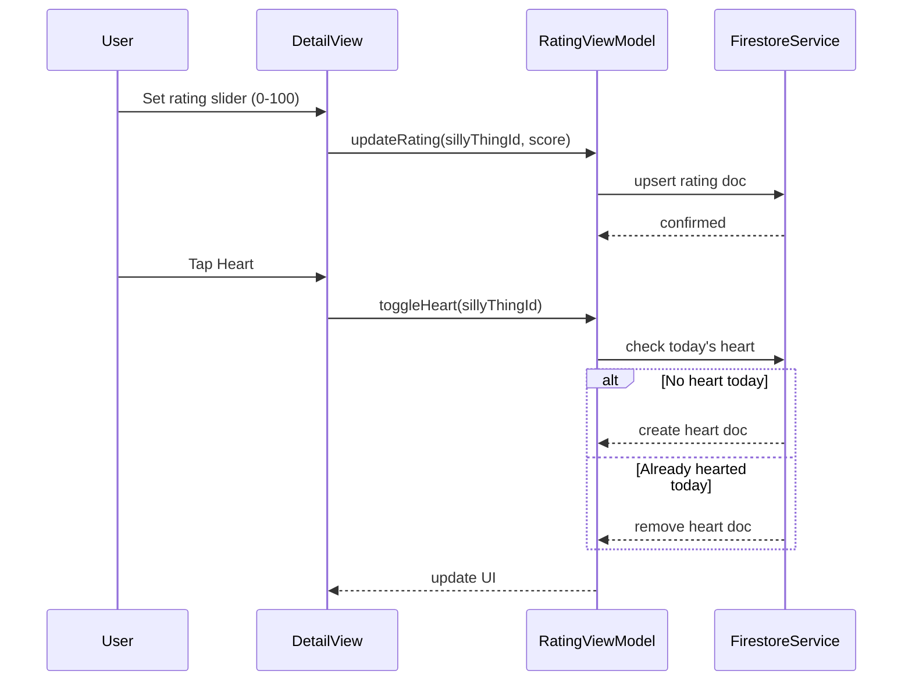
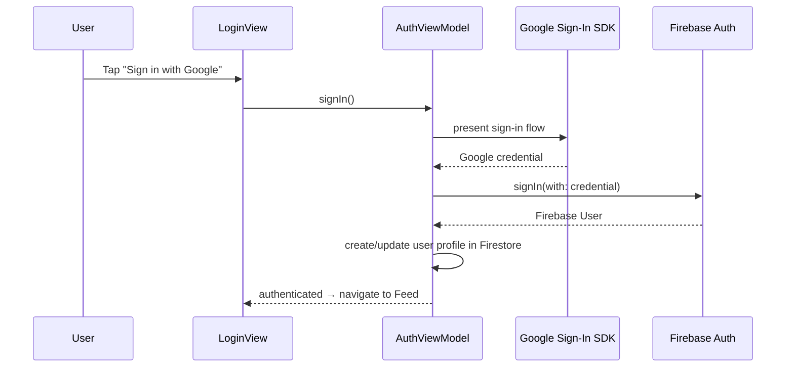
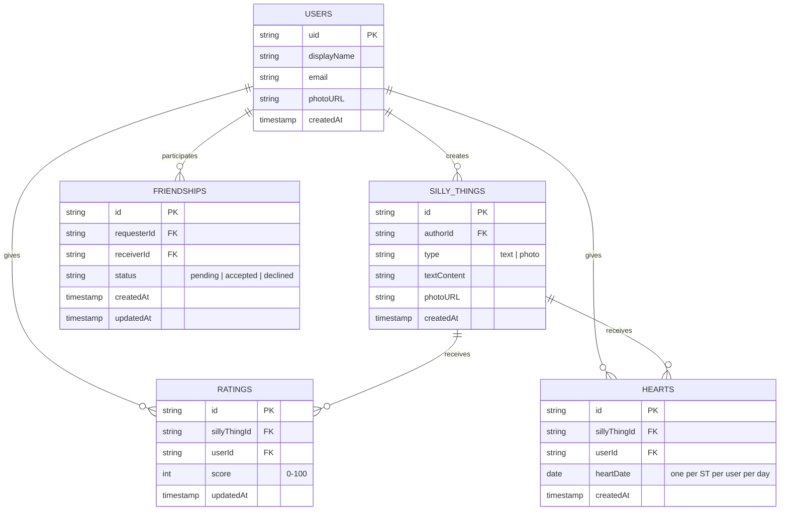
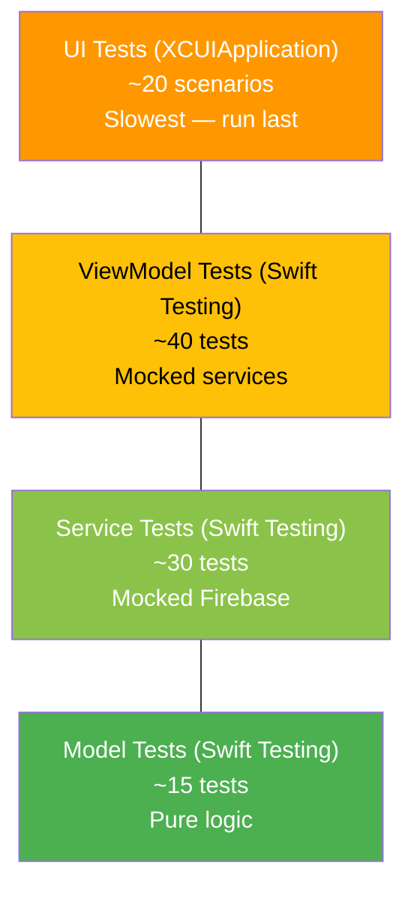
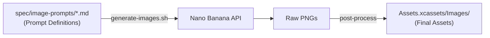

# Silly App — Architecture

> This document is the authoritative reference for all design and technology choices.
> It is consumed by the Claude coding agent during iterative build-verify loops.

---

## 1. Technology Stack

| Layer | Choice | Rationale |
|---|---|---|
| Language | **Swift 5.0+** | Native iOS, first-class SwiftUI/SwiftData support |
| UI Framework | **SwiftUI** | Declarative, modern, already in use |
| Local Persistence | **SwiftData** | Already wired; schema migrations built-in |
| Cloud Backend | **Firebase** (Auth, Firestore, Cloud Storage, FCM) | Zero-server approach; scales to hobby-tier free |
| Auth Provider | **Google Sign-In SDK + Firebase Auth** | Spec requires Google OAuth |
| Image Storage | **Firebase Cloud Storage** | Paired with Firestore references |
| Push Notifications | **Firebase Cloud Messaging (FCM)** | "Silly Thing of the Day" daily reminder |
| Package Manager | **Swift Package Manager (SPM)** | Xcode-native, no CocoaPods overhead |
| Image Generation | **Nano Banana** | All app artwork generated via prompt pipeline |
| Testing - Unit | **Swift Testing** (`@Test`, `#expect`) | Already scaffolded; modern replacement for XCTest |
| Testing - UI | **XCTest / XCUIApplication** | Already scaffolded; industry standard |
| Testing - Spec | **Gherkin (`.feature` files)** | Human-readable acceptance criteria |
| CI | **xcodebuild CLI** | Matches existing `CLAUDE.md` build commands |

---

## 2. High-Level Architecture



---

## 3. Data Flow — Creating a Silly Thing



---

## 4. Data Flow — Rating & Hearts



---

## 5. Data Flow — Authentication



---

## 6. Firestore Data Model



---

## 7. Project Directory Structure

```
sillyapp/
├── sillyapp.xcodeproj/                # Xcode project
├── sillyapp/                          # Main app target
│   ├── App/
│   │   ├── sillyappApp.swift          # @main entry, ModelContainer, Firebase init
│   │   └── AppState.swift             # Global app state (auth, navigation)
│   ├── Models/
│   │   ├── SillyThing.swift           # @Model — local SwiftData entity
│   │   ├── User.swift                 # @Model — cached user profile
│   │   ├── Friendship.swift           # @Model — friendship record
│   │   ├── Rating.swift               # @Model — rating record
│   │   └── Heart.swift                # @Model — heart record
│   ├── Views/
│   │   ├── RootView.swift             # Auth-gated router
│   │   ├── Auth/
│   │   │   ├── LoginView.swift
│   │   │   └── ProfileView.swift
│   │   ├── Feed/
│   │   │   ├── FeedView.swift
│   │   │   ├── SillyThingCard.swift
│   │   │   ├── SillyThingDetailView.swift
│   │   │   └── SillyThingOfTheDayView.swift
│   │   ├── Create/
│   │   │   ├── CreateSillyThingView.swift
│   │   │   ├── CameraView.swift
│   │   │   └── TextEntryView.swift
│   │   ├── Friends/
│   │   │   ├── FriendsListView.swift
│   │   │   ├── InviteView.swift
│   │   │   └── InviteResponseView.swift
│   │   ├── Rating/
│   │   │   ├── RatingView.swift
│   │   │   └── HeartHistoryView.swift
│   │   └── Leaderboard/
│   │       └── LeaderboardView.swift
│   ├── ViewModels/
│   │   ├── AuthViewModel.swift
│   │   ├── FeedViewModel.swift
│   │   ├── CreateViewModel.swift
│   │   ├── FriendsViewModel.swift
│   │   ├── RatingViewModel.swift
│   │   └── LeaderboardViewModel.swift
│   ├── Services/
│   │   ├── AuthService.swift          # Google Sign-In + Firebase Auth
│   │   ├── FirestoreService.swift     # All Firestore reads/writes
│   │   ├── StorageService.swift       # Cloud Storage uploads/downloads
│   │   └── NotificationService.swift  # FCM registration & handling
│   ├── Extensions/
│   │   ├── Date+SillyDay.swift        # "This day in history" helper
│   │   └── View+Toast.swift           # Toast/snackbar modifier
│   ├── Utilities/
│   │   └── Constants.swift            # Collection names, keys
│   └── Assets.xcassets/
│       ├── AppIcon.appiconset/
│       ├── AccentColor.colorset/
│       ├── Images/                    # All Nano Banana generated assets
│       └── Colors/                    # Named color sets
├── ShareExtension/                    # iOS Share Extension target
│   ├── ShareViewController.swift
│   └── Info.plist
├── sillyappTests/                     # Unit tests (Swift Testing)
│   ├── Models/
│   ├── ViewModels/
│   └── Services/
├── sillyappUITests/                   # UI tests (XCTest)
│   ├── AuthUITests.swift
│   ├── FeedUITests.swift
│   ├── CreateUITests.swift
│   ├── FriendsUITests.swift
│   ├── RatingUITests.swift
│   ├── LeaderboardUITests.swift
│   └── DeleteUITests.swift
├── scripts/
│   └── preflight-check.sh            # Build pre-checks (env vars, tools, config)
├── spec/                              # This specification directory
├── CLAUDE.md                          # Agent build/test instructions
└── README.md
```

---

## 8. Test Stack & Execution

### Test Pyramid



### Execution Commands

```bash
# Boot simulator (once)
xcrun simctl boot 'iPhone 17 Pro'

# Unit tests only (fast feedback)
xcodebuild -project sillyapp.xcodeproj \
  -scheme sillyapp \
  -destination 'platform=iOS Simulator,name=iPhone 17 Pro' \
  -only-testing:sillyappTests \
  -quiet test

# UI tests only
xcodebuild -project sillyapp.xcodeproj \
  -scheme sillyapp \
  -destination 'platform=iOS Simulator,name=iPhone 17 Pro' \
  -only-testing:sillyappUITests \
  -quiet test

# All tests
xcodebuild -project sillyapp.xcodeproj \
  -scheme sillyapp \
  -destination 'platform=iOS Simulator,name=iPhone 17 Pro' \
  -quiet test

# Shutdown when done
xcrun simctl shutdown all
```

### Test Conventions

- **Unit tests** use `@Test` and `#expect` (Swift Testing framework).
- **UI tests** use `XCTest` / `XCUIApplication`.
- Service dependencies are injected via protocols for mockability.
- Each ViewModel test file creates mock service conformances inline.
- UI tests use accessibility identifiers set on every interactive view.

---

## 9. Agent Instructions — Iterative Build-Verify Loop

> These instructions are for the Claude coding agent executing the implementation.

### Phase 0: Environment Setup
1. **Run the preflight check** — this is the first thing you do:
   ```bash
   ./scripts/preflight-check.sh
   ```
   The script verifies all required env vars (`NANO_BANANA_API_KEY`, `FIREBASE_PROJECT_ID`),
   config files (`GoogleService-Info.plist`), CLI tools (`xcodebuild`, `jq`, etc.), and simulator
   availability. **Do not proceed until it exits 0.** If it fails, report the failures to the user
   and stop — they need to fix their environment first.
2. Verify Xcode CLI tools: `xcode-select -p`
3. Boot simulator: `xcrun simctl boot 'iPhone 17 Pro'`
4. Confirm clean build: `xcodebuild -project sillyapp.xcodeproj -scheme sillyapp -destination 'platform=iOS Simulator,name=iPhone 17 Pro' -quiet build`
5. Add SPM dependencies (see §1 Technology Stack)

### Phase 1: Models & Services (Foundation)
1. Define all SwiftData `@Model` classes per §6 Data Model.
2. Define service protocols (`AuthServiceProtocol`, `FirestoreServiceProtocol`, etc.).
3. Implement concrete service classes with Firebase SDK calls.
4. **Verify**: Write and run model + service unit tests.
5. **Gate**: All unit tests pass before proceeding.

### Phase 2: ViewModels (Business Logic)
1. Implement each ViewModel with injected service protocols.
2. **Verify**: Write and run ViewModel unit tests with mock services.
3. **Gate**: All unit tests pass before proceeding.

### Phase 3: Views (UI)
1. Build views feature-by-feature in this order:
   a. Auth (Login/Logout) — unblocks all other features
   b. Create Silly Thing (Text) — simplest content creation
   c. Feed (chronological list) — view created content
   d. Create Silly Thing (Photo + Camera)
   e. Rating & Hearts
   f. Friends (Invite, Accept/Decline, Remove)
   g. Feed filtering (by friend, Silly Thing of the Day)
   h. Leaderboard
   i. Delete flows
   j. Share Extension
2. After each feature view:
   - Build: `xcodebuild ... -quiet build`
   - Run unit tests: `xcodebuild ... -only-testing:sillyappTests -quiet test`
   - Write and run UI test for the feature
   - **Gate**: Build succeeds + all tests pass before next feature.

### Phase 4: Polish & Assets
1. Integrate Nano Banana generated images from `Assets.xcassets/Images/`.
2. Add accessibility identifiers to all interactive elements.
3. Add empty-state views with illustrations.
4. Final full test run.

### Build-Verify Protocol (every iteration)

```
┌─────────────┐
│  Edit Code   │
└──────┬──────┘
       ▼
┌─────────────┐     ┌──────────────┐
│    Build     │────▶│ Fix Errors   │──┐
└──────┬──────┘ fail └──────────────┘  │
       │ pass                          │
       ▼                               │
┌─────────────┐     ┌──────────────┐   │
│  Run Tests   │────▶│ Fix Failures │───┘
└──────┬──────┘ fail └──────────────┘
       │ pass
       ▼
┌─────────────┐
│   Commit     │
└─────────────┘
```

**Key rules for the agent:**
- Never skip the build step. A red build blocks everything.
- Run the *minimal* test scope after each change (e.g., `-only-testing:sillyappTests/Models`).
- After fixing a test failure, re-run only the previously-failing test first, then the full suite.
- Commit after every green build+test cycle with a descriptive message.
- If a build error persists after 3 attempts, stop and report the error with full diagnostics.
- Read compiler/test output carefully — Swift error messages are precise.

---

## 10. Image Generation Strategy — Nano Banana

All visual assets (icons, illustrations, backgrounds) are generated using **Nano Banana** prompts.

### Pipeline



### Process
1. Each image prompt is defined in `spec/image-prompts/` as a standalone markdown file.
2. The generation script (`generate-images.sh`, defined by `spec/image-prompts/README.md`) reads each prompt file and calls Nano Banana.
3. Output PNGs are saved to a staging directory.
4. Post-processing resizes to required asset catalog dimensions (1x, 2x, 3x).
5. Final images are placed into `sillyapp/Assets.xcassets/Images/`.

### Required Images
See `spec/image-prompts/` for the complete set of prompts. Summary:

| Asset | Sizes Needed | Usage |
|---|---|---|
| App Icon | 1024×1024 | App icon (Xcode generates variants) |
| Launch Background | 1284×2778 (3x) | Splash screen |
| Empty Feed | 600×600 | Empty state illustration |
| Empty Friends | 600×600 | Empty state illustration |
| STOTD Banner | 800×300 | Silly Thing of the Day card |
| Trophy Gold | 200×200 | Leaderboard 1st place |
| Trophy Silver | 200×200 | Leaderboard 2nd place |
| Trophy Bronze | 200×200 | Leaderboard 3rd place |
| Heart | 200×200 | Heart button sprite |
| Default Avatar | 400×400 | Profile placeholder |
| Invite Illustration | 600×600 | Friend invite screen |
| Background Pattern | 400×400 (tileable) | Subtle app background |
| Tab - Feed | 60×60 | Tab bar icon |
| Tab - Create | 60×60 | Tab bar icon |
| Tab - Leaderboard | 60×60 | Tab bar icon |
| Tab - Friends | 60×60 | Tab bar icon |
| Tab - Profile | 60×60 | Tab bar icon |

---

## 11. Build Tools & Environment Variables

### SPM Dependencies

Add via Xcode → File → Add Package Dependencies:

| Package | URL | Version |
|---|---|---|
| Firebase iOS SDK | `https://github.com/firebase/firebase-ios-sdk` | `~> 11.0` |
| Google Sign-In iOS | `https://github.com/google/GoogleSignIn-iOS` | `~> 8.0` |

### Required Environment Variables / Config Files

| Variable / File | Purpose | Where Set |
|---|---|---|
| `GoogleService-Info.plist` | Firebase project config | Download from Firebase Console → add to Xcode target |
| `REVERSED_CLIENT_ID` | Google Sign-In URL scheme | From `GoogleService-Info.plist` → add as URL Type in Info.plist |
| `FIREBASE_PROJECT_ID` | Used by generation scripts | Shell env or `.env` file |
| `NANO_BANANA_API_KEY` | Nano Banana image generation | Shell env — **never commit** |
| `NANO_BANANA_ENDPOINT` | Nano Banana API base URL | Shell env or `.env` file |

### Preflight Check

Before building, run the preflight script to verify your environment is ready:

```bash
./scripts/preflight-check.sh
```

This checks all env vars, config files, CLI tools, and simulator availability.
It exits 0 on success, 1 on failure with a detailed report of what's missing.

### Build Commands

```bash
# Clean build
xcodebuild -project sillyapp.xcodeproj \
  -scheme sillyapp \
  -destination 'platform=iOS Simulator,name=iPhone 17 Pro' \
  -quiet clean build

# Archive for distribution
xcodebuild -project sillyapp.xcodeproj \
  -scheme sillyapp \
  -archivePath build/sillyapp.xcarchive \
  archive

# Run on simulator
xcrun simctl boot 'iPhone 17 Pro'
xcodebuild -project sillyapp.xcodeproj \
  -scheme sillyapp \
  -destination 'platform=iOS Simulator,name=iPhone 17 Pro' \
  -quiet build
xcrun simctl install 'iPhone 17 Pro' build/Build/Products/Debug-iphonesimulator/sillyapp.app
xcrun simctl launch 'iPhone 17 Pro' com.sillyapp.sillyapp
```

### Firebase Setup Checklist

1. Create Firebase project at [console.firebase.google.com](https://console.firebase.google.com)
2. Add iOS app with bundle ID matching Xcode project
3. Download `GoogleService-Info.plist` → add to Xcode project (all targets)
4. Enable Authentication → Google provider
5. Create Firestore database (start in test mode, add security rules later)
6. Create Cloud Storage bucket
7. Enable Cloud Messaging
8. Add `REVERSED_CLIENT_ID` from plist as a URL Type in Xcode

### Firestore Security Rules (starter)

```javascript
rules_version = '2';
service cloud.firestore {
  match /databases/{database}/documents {
    // Users can read/write their own profile
    match /users/{userId} {
      allow read: if request.auth != null;
      allow write: if request.auth.uid == userId;
    }
    // Silly Things: authed users can read friends' content
    match /sillyThings/{docId} {
      allow read: if request.auth != null;
      allow create: if request.auth.uid == resource.data.authorId;
      allow delete: if request.auth.uid == resource.data.authorId;
    }
    // Ratings: authed users can manage their own
    match /ratings/{docId} {
      allow read: if request.auth != null;
      allow write: if request.auth.uid == request.resource.data.userId;
    }
    // Hearts: authed users can manage their own
    match /hearts/{docId} {
      allow read: if request.auth != null;
      allow write: if request.auth.uid == request.resource.data.userId;
    }
    // Friendships: participants can read/write
    match /friendships/{docId} {
      allow read: if request.auth != null;
      allow write: if request.auth.uid == request.resource.data.requesterId
                   || request.auth.uid == request.resource.data.receiverId;
    }
  }
}
```
